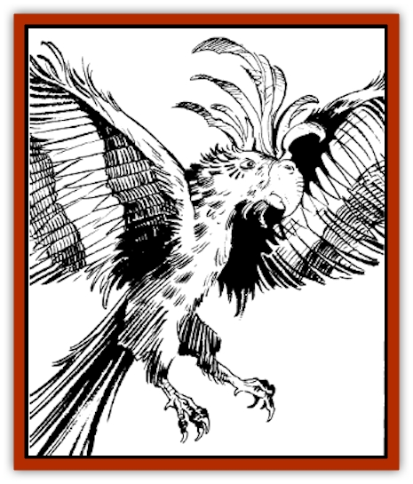
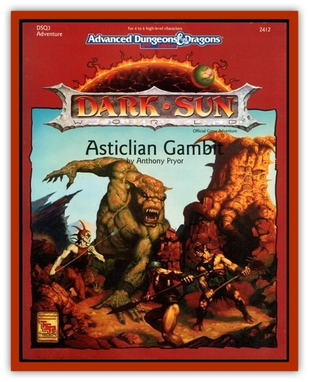

# Sitak

| Statistic | **Sitak** |
| --- | --- |
| **Activity Cycle:** | Usually night |
| **Alignment:** | Neutral |
| **Armor Class:** | 8 |
| **Climate/Terrain:** | Athasian forest |
| **Damage/Attack:** | 1 hp |
| **Diet:** | Omnivore (insects, fruit) |
| **Frequency:** | Very rare |
| **Hit Dice:** | 1-3 hp |
| **Intelligence:** | Animal (1) (see below) |
| **Magic Resistance:** | Nil |
| **Morale:** | Unreliable (2-4) (see below) |
| **Movement:** | 2, Fl 18 (C) |
| **No. Appearing:** | 1-12 |
| **No. of Attacks:** | 2 |
| **Organization:** | Flock |
| **Size:** | T (1') |
| **Special Attacks:** | Nil |
| **Special Defenses:** | Nil |
| **THAC0:** | 20 |
| **Treasure:** | Nil |
| **XP Value:** | 15 |

The sitak is a forest [[Bird|bird]] of Athas. Its bears a close relation to the parrot and cockatoo (both of which also exist on Athas), evident in its sharp, curved beak, wicked talons, and bright feathers, as well as its gift for mimicry. However, the sitak imitates sounds telepathically, not audibly.

Sitak coloring varies across the spectrum. Many are bright green or red with yellow throats, but light blue, gray, white, and black varieties are almost as common. Feathers grow in a spiky crest atop the head, and observers may mistake a white sitak for a cockatoo until it begins chattering psionically.

The sitak has the psionic abilities of contact and mindlink (20), though in a unique and limited form. It pays no PSP cost for using its abilities - but they work line-of-sight only, and the sitak has poor vision beyond 30'. Any resistance by the target automatically breaks contact, and the bird cannot contact life forms lower than birds. Also, the sitak's mindlink does not cross language barriers, because it is simply mimicking sounds it does not understand. (However, see below.)

**Combat:** Sitaks frighten easily and seldom attack unless cornered. The sitak strikes first with its talons, then its beak, doing 1 hp damage with each successful attack. It instinctively strikes for an opponent's eyes. If the sitak succeeds in a strike with a natural attack roll of 20, it has hit the victim's eyes (if they are unprotected), blinding the victim for 2d10 rounds.

A pet sitak defending its owner, or a parent defending its nest, has a morale score of 12 (Steady).

**Habitat/Society:** Sitaks can make good pets. If confined in isolation, they go mad, but otherwise they are loyal (if rather demanding) companions. Wild sitaks have animal intelligence, but careful training from hatching can increase this to Semi- (2-4) in a pet. The pet always learns the word for "food" quickly and may understand up to 20 other simple words such as "no", "danger", animal names, and the like.

Trained sitaks can relay mindlink communication between two people telepathically. This silent dialogue works like the mindlink ability, except that it cannot cross language barriers. Also, the bird cannot handle more than two voices at a time, and it quickly tires - especially when hungry or quarrelsome, as it usually is.

**Ecology:** Sitaks are thought to mate for life, though information is scarce. The female lays one egg a year, in a huge nest of branches far larger than one would think necessary. A communal sitak nest may house several pairs in different "rooms", which can be large enough to harbor a [[Halfling_Athas|halfling]] or [[Dwarf_Athas|dwarf]].

Few predators attack sitaks, for their flesh tastes foul and stringy, but they are prone to both disease and parasites. "Sitak fever" can be passed to humans and demihumans who fail a Constitution check. It resembles severe influenza, and it can recur in one-week episodes indefinitely whenever the victim enters a forest or jungle habitat. A *cure disease* spell removes the sitak fever permanently.

Sitaks live throughout the Forest Ridge and (in much smaller numbers) in the Crescent Forest between Gulg and Nibenay. For some tribes of halflings, sitaks represent bad luck; explorers with pet sitaks suffer a -6 penalty to reaction rolls by halflings. Other tribes regard sitaks as harmless, but few take them for pets and none for food.

The hunters of Nibenay prize sitak feathers, and they have hunted the bird almost to extinction in the Crescent Forest. Nibeni merchants pay 1-3 ceramic pieces per crest feather. In contrast, Gulg's hunters value sitaks as pets, and they regard killing a sitak as an omen of bad luck.

---
## Discovery & Documentation

**Source Publication:** DSQ3 Asticlian Gambit (1992)
**Campaign Setting:** Dark Sun
**Author(s):** Anthony Pryor
