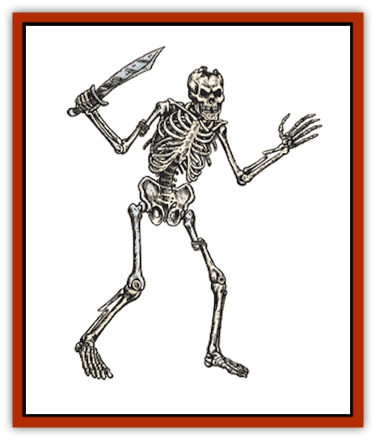

# Skeleton

| Statistic | **Animal** | **Monster** | **Skeleton** |
| --- | --- | --- | --- |
| **Activity Cycle:** | Any | Any | Any |
| **Alignment:** | Neutral | Neutral | Neutral |
| **Armor Class:** | 8 | 6 | 7 |
| **Climate/Terrain:** | Any | Any | Any |
| **Damage/Attack:** | 1-4 | Special | 1-6 (weapon) |
| **Diet:** | Nil | Nil | Nil |
| **Frequency:** | Very rare | Very rare | Rare |
| **Hit Dice:** | 1-1 | 6 | 1 |
| **Intelligence:** | Non- (0) | Non- (0) | Non- (0) |
| **Magic Resistance:** | See below | See below | See below |
| **Morale:** | Special | Special | Special |
| **Movement:** | 6 | 12 | 12 |
| **No. Appearing:** | 2-20 (2d10) | 1-6 | 3-30 (3d10) |
| **No. of Attacks:** | 1 | 1 | 1 |
| **Organization:** | Band | Band | Band |
| **Size:** | S-M (3-5') | L-H (7-15') | M (6' tall) |
| **Special Attacks:** | Nil | Nil | Nil |
| **Special Defenses:** | See below | See below | See below |
| **THAC0:** | 20 | 15 | 19 |
| **Treasure:** | See below | Nil | Nil |
| **XP Value:** | 65 | 650 | 65 |

All skeletons are magically animated undead monsters, created as guardians or warriors by powerful evil wizards and priests.

Skeletons appear to have no ligaments or musculature which would allow movement. Instead, the bones are magically joined together during the casting of an *animate dead* spell. Skeletons have no eyes or internal organs.

Skeletons can be made from the bones of humans and demihumans, animals of human size or smaller, or giant humanoids like [[Bugbear|bugbears]] and giants.

**Combat:** Man-sized humanoid skeletons always fight with weapons, usually a rusty sword or spear. Because of their magical nature, they do not fight as well as living beings and inflict only 1-6 points of damage when they hit. Animal skeletons almost always bite for 1-4 points of damage, unless they would obviously inflict less (i.e., skeletal [[Rat|rats]] should inflict only 1-2 points, etc.). Monster skeletons, always constructed from humanoid creatures, use giant-sized weapons which inflict the same damage as their living counterparts but without any Strength bonuses.

Skeletons are immune to all *sleep*, *charm*, and *hold* spells. Because they are assembled from bones, cold-based attacks also do skeletons no harm. The fact that they are mostly empty means that edged or piercing weapons (like swords, daggers, and spears) inflict only half damage when employed against skeletons. Blunt weapons, with larger heads designed to break and crush bones, cause normal damage against skeletons. Fire also does normal damage against skeletons. Holy water inflicts 2-8 points of damage per vial striking the skeleton.

Skeletons are immune to *fear* spells and need never check morale, usually being magically commanded to fight to the death. When a skeleton dies, it falls to pieces with loud clunks and rattles.

**Habitat/Society:** Skeletons have no social life or interesting habits. They can be found anywhere there is a wizard or priest powerful enough to make them. Note that some neutral priests of deities of the dead or dying often raise whole armies of animated followers in times of trouble. Good clerics can make skeletons only if the dead being has granted permission (either before or after death) and if the cleric's deity has given express permission to do so. Otherwise, violating the eternal rest of any being or animal is something most good deities disapprove of highly.

Skeletons have almost no minds whatsoever, and can obey only the simplest one- or two-phrase orders from their creators. Skeletons fight in unorganized masses and tend to botch complex orders disastrously. It is not unheard of to find more than one type of skeleton (monsters with animals, animals with humans) working together to protect their master's dungeon or tower.

**Ecology:** Unless the skeleton's remains are destroyed or scattered far apart, the skeleton can be created anew with the application of another *animate dead* spell. Rumors of high-level *animate dead* spells which create skeletons capable of reforming themselves to continue fighting after being destroyed have not been reliably comfirmed.

---
## Discovery & Documentation

**Source Publication:** MC1 Volume I (w/binder #1) (1991)
**Campaign Setting:** Advanced Dungeons & Dragons 2nd Edition
**Author(s):** Jay Batista, Scott Bennie, Grant Boucher, William W. Connors, Steve Gilbert, Heike Kubasch, James Lowder, David Edward Martin, Bruce Nesmith, Jean Rabe, Rick Swan, John J. Terra, Gary L. Thomas

### Other Creatures Found in This Source Book
   * [[Bat|Bat]]
   * [[Bear|Bear]]
   * [[Behir|Behir]]
   * [[Boar|Boar]]
   * [[Bookworm|Bookworm]]
   * [[Brownie|Brownie]]
   * [[Bugbear|Bugbear]]
   * [[Carrion_Crawler|Carrion Crawler]]
   * [[Cat_Great|Cat, Great]]
   * [[Catoblepas|Catoblepas]]
   * [[Dragon_General_Information|Dragon, General Information]]
   * [[Dragonfish|Dragonfish]]
   * [[Elemental_Air_Kin_Aerial_Servant|Elemental, Air Kin, Aerial Servant]]
   * [[Elemental_Earth_Kin_Sandling|Elemental, Earth Kin, Sandling]]
   * [[Elephant|Elephant]]
   * [[Gnoll|Gnoll]]
   * [[Hobgoblin|Hobgoblin]]
   * [[Homunculus|Homunculus]]
   * [[Hornet_Giant|Hornet, Giant]]
   * [[Horse|Horse]]
   * [[Hyena|Hyena]]
   * [[Jackal|Jackal]]
   * [[Jackalwere|Jackalwere]]
   * [[Korred|Korred]]
   * [[Lich|Lich]]
   * [[Lizard|Lizard]]
   * [[Lizard_Man|Lizard Man]]
   * [[Lycanthrope_General_Information|Lycanthrope, General Information]]
   * [[Lycanthrope_Seawolf|Lycanthrope, Seawolf]]
   * [[Lycanthrope_Werebear|Lycanthrope, Werebear]]
   * [[Lycanthrope_Weretiger|Lycanthrope, Weretiger]]
   * [[Lycanthrope_Werewolf|Lycanthrope, Werewolf]]
   * [[Manticore|Manticore]]
   * [[Medusa|Medusa]]
   * [[Mind_Flayer|Mind Flayer]]
   * [[Minotaur|Minotaur]]
   * [[Mudman|Mudman]]
   * [[Mummy|Mummy]]
   * [[Nixie|Nixie]]
   * [[Nymph|Nymph]]
   * [[Ogre|Ogre]]
   * [[Ooze_Slime_Jelly_I|Ooze/Slime/Jelly I]]
   * [[Ooze_Slime_Jelly_II|Ooze/Slime/Jelly II]]
   * [[Orc|Orc]]
   * [[Owl|Owl]]
   * [[Owlbear_I|Owlbear I]]
   * [[Pegasus|Pegasus]]
   * [[Piercer|Piercer]]
   * [[Pudding_Deadly|Pudding, Deadly]]
   * [[Rakshasa|Rakshasa]]
   * [[Rat|Rat]]
   * [[Ray|Ray]]
   * [[Remorhaz|Remorhaz]]
   * [[Satyr|Satyr]]
   * [[Scorpion|Scorpion]]
   * [[Selkie|Selkie]]
   * [[Shadow|Shadow]]
   * [[Skunk|Skunk]]
   * [[Snake|Snake]]
   * [[Spectre|Spectre]]
   * [[Spider|Spider]]
   * [[Sprite|Sprite]]
   * [[Toad_Giant|Toad, Giant]]
   * [[Treant|Treant]]
   * [[Troll|Troll]]
   * [[Umber_Hulk|Umber Hulk]]
   * [[Unicorn|Unicorn]]
   * [[Vampire|Vampire]]
   * [[Wight|Wight]]
   * [[Will_O'Wisp|Will O'Wisp]]
   * [[Wolf|Wolf]]
   * [[Wolfwere|Wolfwere]]
   * [[Wraith|Wraith]]
   * [[Wyvern|Wyvern]]
   * [[Yeti|Yeti]]
   * [[Yuan-ti|Yuan-ti]]
   * [[Zombie|Zombie]]
