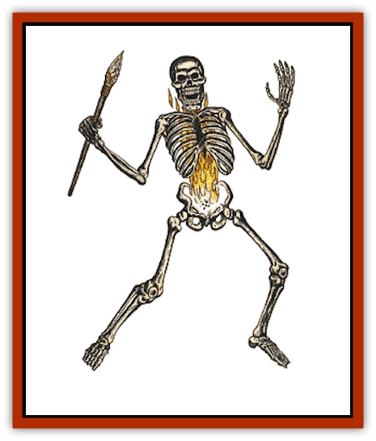

# Skeleton - Giant

| Statistic | **Skeleton, Giant** |
| --- | --- |
| **Activity Cycle:** | Any |
| **Alignment:** | Neutral |
| **Armor Class:** | 4 |
| **Climate/Terrain:** | Any |
| **Damage/Attack:** | 1d12 |
| **Diet:** | None |
| **Frequency:** | Rare |
| **Hit Dice:** | 4+4 |
| **Intelligence:** | Non- (0) |
| **Magic Resistance:** | Nil |
| **Morale:** | Fearless (20) |
| **Movement:** | 12 |
| **No. Appearing:** | 2-8 (2d4) |
| **No. of Attacks:** | 1 |
| **Organization:** | Solitary |
| **Size:** | L (12' tall) |
| **Special Attacks:** | Nil |
| **Special Defenses:** | See below |
| **THAC0:** | 15 |
| **Treasure:** | Nil |
| **XP Value:** | 975 |

Giant skeletons are similar to the more common undead [[Skeleton|skeleton]], but they have been created with a combination of spells and are, thus, far more deadly than their lesser counterparts.

Giant skeletons stand roughly 12 feet tall and look to be made from the bones of giants. In actuality, they are simply human skeletons that have been magically enlarged. They are normally armed with long spears or scythes that end in keen bone blades. Rare individuals will be found carrying shields (and thus have an Armor Class of 3), but these are far from common. A small, magical fire burns in the chest of each giant skeleton, a by-product of the magics that are used to make them. These flames begin just above the pelvis and reach upward to lick at the collar bones. Mysteriously, no burning or scorching occurs where the flames touch the bone.

Giant skeletons do not communicate in any way. They can obey simple, verbal commands given to them by their creator, but will ignore all others. In order for a command to be understood by these animated skeletons, it must contain no more than three distinct concepts. For example, "stay in this room, make sure that nobody comes in, and don't allow the prince to leave," would be the type of command these creatures could obey.

**Combat:** In melee combat, giant skeletons most frequently attack with bone-bladed scythes or spears. Each blow that lands inflicts 1d12 points of damage.

Once per hour (6 turns), a skeleton may reach into its chest and draw forth a sphere of fire from the flames that burn within its rib cage. This flaming sphere can be hurled as if it were a *fireball* that delivers 8d6 points of damage. Because these creatures are immune to harm from both magical and normal fires, they will freely use this attack in close quarters.

Giant skeletons are immune to *sleep*, *charm*, *hold*, or similar mind-affecting spells. Cold-based spells inflict half damage to them, lightning inflicts full damage, while fire (as has already been mentioned) cannot harm them. They suffer half damage from edged or piercing weapons and but 1 point of damage per die from all manner of arrows, quarrels, or missiles. Blunt melee weapons inflict full damage on them.

Being undead, giant skeletons can be turned by priests and paladins. They are more difficult to turn than mundane skeletons, however, being treated as if they were mummies. Holy water that is splashed upon them inflicts 2d4 points of damage per vial.

**Habitat/Society:** The first giant skeletons to appear in Ravenloft were created by the undead priestess Radaga in her lair within the domain of Kartakass. Others have since mastered the spells and techniques required to create these monsters; thus, giant skeletons are gradually beginning to appear in other realms where the dead and undead lurk.

Giant skeletons are employed as guards and sentinels by those with the power to create them. It is said that the Dark Powers can see everything that transpires before the eyes of these foul automatons, but there is no proof supporting this rumor.

**Ecology:** Like lesser animated skeletons, these undead things have no true claim to any place in nature. They are created from the bones of those who have died and are abominations in the eyes of all who belief in the sanctity of life and goodness.

The process by which giant skeletons are created is dark and evil. Attempts to manufacture them outside of Ravenloft have failed, so it is clear that they are in some way linked to the Dark Powers themselves. In order to create a giant skeleton, a spell caster must have the intact skeleton of a normal human or demihuman. On a night when the land is draped in fog, they must cast an *animate dead*, *produce fire*, *enlarge*, and a *resist fire* spell over the bones. When the last spell is cast, the bones lengthen and thicken and the creatures rises up. The the creator must make a Ravenloft Powers check for his part in this evil undertaking.

---
## Discovery & Documentation

**Source Publication:** MC10 Ravenloft Appendix I (1989)
**Campaign Setting:** Planescape
**Author(s):** William W. Connors

### Other Creatures Found in This Source Book
   * [[Bastellus|Bastellus]]
   * [[Bat_Ravenloft|Bat (Ravenloft)]]
   * [[Bowlyn|Bowlyn]]
   * [[Broken_One|Broken One]]
   * [[Bussengeist|Bussengeist]]
   * [[Darkling|Darkling]]
   * [[Doom_Guard|Doom Guard]]
   * [[Doppelganger_Plant|Doppelganger Plant]]
   * [[Elemental_Ravenloft|Elemental (Ravenloft)]]
   * [[Ermordenung|Ermordenung]]
   * [[Ghoul_Lord|Ghoul Lord]]
   * [[Goblyn|Goblyn]]
   * [[Golem_III|Golem III]]
   * [[Golem_IV|Golem IV]]
   * [[Golem_Ravenloft|Golem (Ravenloft)]]
   * [[Grim_Reaper|Grim Reaper]]
   * [[Human_Abber_Nomad|Human, Abber Nomad]]
   * [[Human_Ravenloft|Human (Ravenloft)]]
   * [[Imp_Assassin|Imp, Assassin]]
   * [[Impersonator|Impersonator]]
   * [[Lycanthrope_Werebat|Lycanthrope, Werebat]]
   * [[Lycanthrope_Wereraven|Lycanthrope, Wereraven]]
   * [[Mist_Horror|Mist Horror]]
   * [[Mummy_Greater|Mummy, Greater]]
   * [[Quevari|Quevari]]
   * [[Quickwood|Quickwood]]
   * [[Ravenkin|Ravenkin]]
   * [[Reaver|Reaver]]
   * [[Scarecrow_Ravenloft|Scarecrow (Ravenloft)]]
   * [[Shadow_Fiend|Shadow Fiend]]
   * [[Strahd's_Skeletal_Steed|Strahd's Skeletal Steed]]
   * [[Treant_Evil|Treant, Evil]]
   * [[Treant_Undead|Treant, Undead]]
   * [[Valpurgeist|Valpurgeist]]
   * [[Vampire_Dwarf|Vampire, Dwarf]]
   * [[Vampire_Elf|Vampire, Elf]]
   * [[Vampire_Gnome|Vampire, Gnome]]
   * [[Vampire_Halfling|Vampire, Halfling]]
   * [[Vampire_General_Information|Vampire, General Information]]
   * [[Vampire_Kender|Vampire, Kender]]
   * [[Vampyre|Vampyre]]
   * [[Widow_Red|Widow, Red]]
   * [[Wolfwere_Greater|Wolfwere, Greater]]
   * [[Zombie_Lord|Zombie Lord]]
