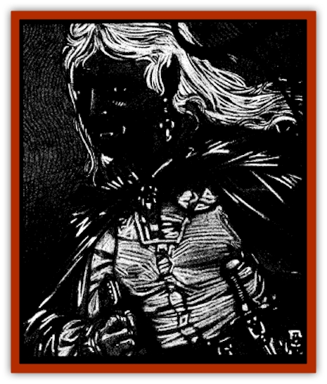

# Skeleton - Insectoid

| Statistic | **Giant Ant** | **Giant Tick** | **Stag Beetle** |
| --- | --- | --- | --- |
| **Activity Cycle:** | Any | Any | Any |
| **Alignment:** | Neutral | Neutral | Neutral |
| **Armor Class:** | 6 | 4 | 3 |
| **Climate/Terrain:** | Ravenloft | Ravenloft | Ravenloft |
| **Damage/Attack:** | 1d6 | 1d6 | 4d4/1d10 (&times;2) or 2d10 |
| **Diet:** | None | None | None |
| **Frequency:** | Rare | Rare | Rare |
| **Hit Dice:** | 2 | 4 | 7 |
| **Intelligence:** | Non- (0) | Non- (0) | Non- (0) |
| **Magic Resistance:** | Nil | Nil | Nil |
| **Morale:** | Fearless (19-20) | Fearless (19-20) | Fearless (19-20) |
| **Movement:** | 18 | 3 | 6 |
| **No. Appearing:** | 2d6 | 1 | 1 |
| **No. of Attacks:** | 1 | 1 | 3 |
| **Organization:** | Band | Solitary | Solitary |
| **Size:** | M (3' long) | M (6' long) | L (10' long) |
| **Special Attacks:** | Nil | See below | Charge |
| **Special Defenses:** | See below | See below | See below |
| **THAC0:** | 19 | 17 | 13 |
| **Treasure:** | Nil | Nil | Nil |
| **XP Value:** | 120 | 650 | 1,400 |

These nightmarish automatons are the animated exoskeletons of dead insects. Evil priests and wizards, bent on manipulating nature for their own nefarious purposes, create these chitinous monstrosities with *animate dead* spells in a process almost identical to that used in the creation of normal [[Skeleton|skeletons]].

Insectoid skeletons are, from a distance, easy to mistake for their still-living brethren. However, upon closer examination it quickly becomes obvious that these creatures are no longer living. As a rule, their eyes and bellies are missing, and their exoskeletons are often chipped or cracked in several places. Most insectoid skeletons make harsh clicking and grinding sounds when they move.

Insectoid skeletons cannot speak or comprehend spoken languages. Simple orders from their master, however, are instantly understood and obeyed.

**Combat:** Most insectoid skeletons retain the physical attacks they had while living. The exception to this is that they do not retain any venom or poison they might have had in life, although a stinger could still do piercing damage.

There are many different types of insectoid skeletons. All such skeletons are immune to the effects of *sleep*, *charm*, *hold*, and *fear* spells, as well as all cold-based attacks. Edged and piercing weapons do only half damage to them, since they no longer have vital organs to pierce or blood to spill.

**Habitat/Society:** These undead insects have no true habitat or society. They are only capable of understanding the simplest of orders and are thus normally employed as guards, advance warriors, or as tireless excavators, pack animals, and the like.

**Ecology:** Insectoid skeletons are created with the use of a special version of the *animate dead* spell. It is believed that this spell was created by a drew necromancer, but the truth of that supposition is unknown.

**Giant Ant**

  Skeletal [[Ant|giant ants]] are always animated in groups. Such groups of undead ants most commonly attack by swarming their victims, with no fewer than three ants attacking a single creature. In combat these monsters attack with their mandibles, doing 1-6 points of damage per attack.

**Giant Tick**

  The carapace of a [[Insect_Giant|giant tick]] skeleton is unique among the undead exoskeletons in that it is still capable of storing fluid within its chitinous form. Such creatures attack their victim with their mandibles, digging into the unfortunate's flesh and draining his blood at a rate of 1d6 hit points per round.

Once a tick has successfully hit, it can automatically drain blood from its victim, doing an additional 1d6 points of damage each round. Unlike living ticks, the skeletal tick can drain more than its own hit points worth of blood. Indeed, as the vital fluid merely pours out of the creature and onto the ground once it has filled the carapace, there is no limit to the "appetite" of this foul thing. Fortunately, this creature does not transmit the diseases its living counterparts do.

For every 10 points of blood within its carapace, a skeletal tick may spit a stream of blood up to 10 yards. If the tick hits its target the target must make a saving throw vs. paralysis or be blinded for 2-8 (2d4) rounds.

**Stag Beetle**

  The undead [[Beetle_Giant|stag beetle]] attacks with its pair of 8-foot-long horns and its hideous mandibles, doing 1d10, 1d10 and 4d4 points of damage respectively. If the monster can get up a running charge of at least 25 feet it does an additional 2d10 points of damage as it tramples its opponent.

---
## Discovery & Documentation

**Source Publication:** Ravenloft Appendix III (1991)
**Campaign Setting:** Ravenloft
**Author(s):** Kirk Botulla

### Other Creatures Found in This Source Book
   * [[Akikage|Akikage]]
   * [[Animator_Common|Animator, Common]]
   * [[Animator_Greater|Animator, Greater]]
   * [[Animator_Minor|Animator, Minor]]
   * [[Animator_General_Information|Animator, General Information]]
   * [[Bakhna_Rakhna|Bakhna Rakhna]]
   * [[Baobhan_Sith|Baobhan Sith]]
   * [[Beetle_Scarab|Beetle, Scarab]]
   * [[Boneless|Boneless]]
   * [[Boowray|Boowray]]
   * [[Bruja|Bruja]]
   * [[Carrionette|Carrionette]]
   * [[Carrion_Stalker|Carrion Stalker]]
   * [[Cat_Midnight|Cat, Midnight]]
   * [[Cat_Skeletal|Cat, Skeletal]]
   * [[Cloaker_Resplendent|Cloaker, Resplendent]]
   * [[Cloaker_Shadow|Cloaker, Shadow]]
   * [[Cloaker_Undead|Cloaker, Undead]]
   * [[Corpse_Candle|Corpse Candle]]
   * [[Death's_Head_Tree|Death's Head Tree]]
   * [[Doppelganger_Ravenloft|Doppelganger (Ravenloft)]]
   * [[Familiar_Pseudo-|Familiar, Pseudo-]]
   * [[Familiar_Undead|Familiar, Undead]]
   * [[Feathered_Serpent|Feathered Serpent]]
   * [[Fenhound|Fenhound]]
   * [[Figurine_Ceramic|Figurine, Ceramic]]
   * [[Figurine_Crystal|Figurine, Crystal]]
   * [[Figurine_Ivory|Figurine, Ivory]]
   * [[Figurine_Obsidian|Figurine, Obsidian]]
   * [[Figurine_Porcelain|Figurine, Porcelain]]
   * [[Figurine_General_Information|Figurine, General Information]]
   * [[Fleas_of_Madness|Fleas of Madness]]
   * [[Furies|Furies]]
   * [[Geist|Geist]]
   * [[Ghost_Animal|Ghost, Animal]]
   * [[Golem_Flesh_Ravenloft|Golem, Flesh (Ravenloft)]]
   * [[Golem_Mist_Ravenloft|Golem, Mist (Ravenloft)]]
   * [[Golem_Wax_Ravenloft|Golem, Wax (Ravenloft)]]
   * [[Gremishka|Gremishka]]
   * [[Hag_Spectral|Hag, Spectral]]
   * [[Head_Hunter|Head Hunter]]
   * [[Hearth_Fiend|Hearth Fiend]]
   * [[Hebi-No-Onna|Hebi-No-Onna]]
   * [[Hound_Phantom|Hound, Phantom]]
   * [[Hound_Skeletal|Hound, Skeletal]]
   * [[Imp_Wishing|Imp, Wishing]]
   * [[Ivy_Crawling|Ivy, Crawling]]
   * [[Jack_Frost|Jack Frost]]
   * [[Jolly_Roger|Jolly Roger]]
   * [[Kizoku|Kizoku]]
   * [[Lashweed|Lashweed]]
   * [[Leech_Magical|Leech, Magical]]
   * [[Leech_Psionic|Leech, Psionic]]
   * [[Lich_Defiler|Lich, Defiler]]
   * [[Lich_Drow|Lich, Drow]]
   * [[Lich_Elemental|Lich, Elemental]]
   * [[Lich_Psionic|Lich, Psionic]]
   * [[Living_Tattoo|Living Tattoo]]
   * [[Lycanthrope_Loup-garou|Lycanthrope, Loup-garou]]
   * [[Lycanthrope_Werejackal|Lycanthrope, Werejackal]]
   * [[Lycanthrope_Werejaguar_Ravenloft|Lycanthrope, Werejaguar (Ravenloft)]]
   * [[Lycanthrope_Wereleopard|Lycanthrope, Wereleopard]]
   * [[Lycanthrope_Wereray|Lycanthrope, Wereray]]
   * [[Mist_Ferryman|Mist Ferryman]]
   * [[Moor_Man|Moor Man]]
   * [[Obedient|Obedient]]
   * [[Odem|Odem]]
   * [[Paka|Paka]]
   * [[Plant_Blood_Rose|Plant, Blood Rose]]
   * [[Plant_Fearweed|Plant, Fearweed]]
   * [[Radiant_Spirit|Radiant Spirit]]
   * [[Recluse|Recluse]]
   * [[Remnant_Aquatic|Remnant, Aquatic]]
   * [[Rushlight|Rushlight]]
   * [[Sea_Spawn_Master|Sea Spawn, Master]]
   * [[Sea_Spawn_Minion|Sea Spawn, Minion]]
   * [[Shadow_Asp|Shadow Asp]]
   * [[Shattered_Brethren|Shattered Brethren]]
   * [[Skeleton_Archer|Skeleton, Archer]]
   * [[Skin_Thief|Skin Thief]]
   * [[Spirit_Psionic|Spirit, Psionic]]
   * [[Strahd_Skeleton|Strahd Skeleton]]
   * [[Strahd_Zombie|Strahd Zombie]]
   * [[Unicorn_Shadow|Unicorn, Shadow]]
   * [[Vampire_Drow|Vampire, Drow]]
   * [[Vampire_Nosferatu|Vampire, Nosferatu]]
   * [[Vampire_Oriental|Vampire, Oriental]]
   * [[Virus_General_Information|Virus, General Information]]
   * [[Virus_I|Virus I]]
   * [[Virus_II|Virus II]]
   * [[Virus_III|Virus III]]
   * [[Vorlog|Vorlog]]
   * [[Will_O'Dawn|Will O'Dawn]]
   * [[Will_O'Deep|Will O'Deep]]
   * [[Will_O'Mist|Will O'Mist]]
   * [[Will_O'Sea|Will O'Sea]]
   * [[Zombie_Cannibal|Zombie, Cannibal]]
   * [[Zombie_Desert|Zombie, Desert]]
   * [[Zombie_Wolf|Zombie Wolf]]
   * [[Zombie_Fog|Zombie Fog]]
