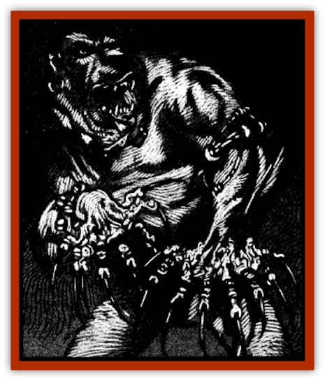

# Skin Thief

| Statistic | **Skin Thief** |
| --- | --- |
| **Activity Cycle:** | Night |
| **Alignment:** | Chaotic evil |
| **Armor Class:** | 7 (10) |
| **Climate/Terrain:** | Ravenloft |
| **Damage/Attack:** | 1-6/1-6/1-4 |
| **Diet:** | Carnivore |
| **Frequency:** | Rare |
| **Hit Dice:** | 2+2 |
| **Intelligence:** | Low (5-7) |
| **Magic Resistance:** | Nil |
| **Morale:** | Steady (11-12) |
| **Movement:** | 12 |
| **No. Appearing:** | 3-12 (3d4) |
| **No. of Attacks:** | 3 |
| **Organization:** | Clan |
| **Size:** | M (5' tall) |
| **Special Attacks:** | Nil |
| **Special Defenses:** | Disguise |
| **THAC0:** | 19 |
| **Treasure:** | Q (I) |
| **XP Value:** | 120 |

Skin thieves are bizarre beast men who scuttle through the wastelands of Ravenloft in small clans searching for unsuspecting victims to rob. As their name implies, skin thieves kill their victims in order to steal their skins. Once in possession of their hideous trophies, the skin thieves don these hides and assume the outward appearance of their victims.

In their natural form skin thieves appear as shuffling humanoids with [[Bear|bear]]like faces and dark, heavily furred bodies. Their arms are unusually long and their hands are gnarled, eight-fingered appendages that end in wickedly pointed nails ranging from 8-16 inches in length. Skin thieves adorn themselves with various items of clothing and jewelry taken from their past victims. They are particularly fond of rings, bracers, and any other items that draw attention to their long nails.

Skin thieves have no language of their own. Instead, they communicate in an unusual dialect assembled from fragments of dozens of other languages.

**Combat:** Although not exceptionally intelligent, skin thieves possess a great deal of low cunning, almost always attacking at night and attempting to isolate their intended victims.

If in their natural forms, these creatures often separate into several small groups, one of which makes distracting noises while the other groups attack from the flanks. If one or more of the skin thieves is currently wearing a skin, the disguised creatures will attempt to use this advantage to isolate a victim.

Once the skin thieves attack, they do so with abandon. They lash out with their long claws (doing 1d6 points of damage each) and bite with their rows of sharp teeth (inflicting 1d4 points of damage).

The transfiguring skin worn by a skin thief is fairly delicate. Every time it is struck in combat the skin must save (as thin wood) vs. crushing blow. If it fails the saving throw, the skin rips apart and exposes the creature's true nature. Once ripped, the skin is destroyed and can no longer be used as a disguise.

When attacking, the creatures make an eerie, moist, snuffling sound. Skin thieves always try to attack only victims they believe are weaker than themselves. Skin thieves usually run from a fair fight, preferring to be predator rather than prey.

**Habitat/Society:** Skin thieves are nomadic creatures who travel the uninhabited sections of Ravenloft. often hovering near the outskirts of civilization. They are particularly fond of trade routes or areas of sparse habitation. Such areas often give them the opportunity to attack small groups of humans, their favorite source of food, disguises, and adornment (rings, bracers, etc).

Clans of skin thieves consist of two to three families. Such clans are led by whichever skin thief can best intimidate the other members of the clan. Such "chiefs" rarely stay in power for more than a few months, and the leadership of a skin thief clan is almost always in flux.

Skin thieves have no true homes. Instead, the creatures build small lean-tos or shelter in caves for up to a month at a time before moving on.

Skin thieves are also fond of killing the members of small caravans or farmsteads and then living in these quarters for a period of time. In such cases, the skin thieves will don the skins of their victims and perform a twisted parody of human activity, even to the extent of interacting with other humans in an attempt to lure more unsuspecting victims. However, the true nature of the monsters inevitably becomes obvious in their behavior and crude speech patterns.

**Ecology:** Skin thieves are vicious and petty creatures that prey on those weaker than themselves. It is uncertain where such fiends originated, but most scholars believe them to be humans whose ancestors turned to cannibalism and whose progeny bore the mark of their bestiality.

Skin thieves steal almost all of their belongings, making little if anything for themselves. The only items of any appreciable value they will have is the jewelry they covet.

---
## Discovery & Documentation

**Source Publication:** Ravenloft Appendix III (1991)
**Campaign Setting:** Ravenloft
**Author(s):** Kirk Botulla

### Other Creatures Found in This Source Book
   * [[Akikage|Akikage]]
   * [[Animator_Common|Animator, Common]]
   * [[Animator_Greater|Animator, Greater]]
   * [[Animator_Minor|Animator, Minor]]
   * [[Animator_General_Information|Animator, General Information]]
   * [[Bakhna_Rakhna|Bakhna Rakhna]]
   * [[Baobhan_Sith|Baobhan Sith]]
   * [[Beetle_Scarab|Beetle, Scarab]]
   * [[Boneless|Boneless]]
   * [[Boowray|Boowray]]
   * [[Bruja|Bruja]]
   * [[Carrionette|Carrionette]]
   * [[Carrion_Stalker|Carrion Stalker]]
   * [[Cat_Midnight|Cat, Midnight]]
   * [[Cat_Skeletal|Cat, Skeletal]]
   * [[Cloaker_Resplendent|Cloaker, Resplendent]]
   * [[Cloaker_Shadow|Cloaker, Shadow]]
   * [[Cloaker_Undead|Cloaker, Undead]]
   * [[Corpse_Candle|Corpse Candle]]
   * [[Death's_Head_Tree|Death's Head Tree]]
   * [[Doppelganger_Ravenloft|Doppelganger (Ravenloft)]]
   * [[Familiar_Pseudo-|Familiar, Pseudo-]]
   * [[Familiar_Undead|Familiar, Undead]]
   * [[Feathered_Serpent|Feathered Serpent]]
   * [[Fenhound|Fenhound]]
   * [[Figurine_Ceramic|Figurine, Ceramic]]
   * [[Figurine_Crystal|Figurine, Crystal]]
   * [[Figurine_Ivory|Figurine, Ivory]]
   * [[Figurine_Obsidian|Figurine, Obsidian]]
   * [[Figurine_Porcelain|Figurine, Porcelain]]
   * [[Figurine_General_Information|Figurine, General Information]]
   * [[Fleas_of_Madness|Fleas of Madness]]
   * [[Furies|Furies]]
   * [[Geist|Geist]]
   * [[Ghost_Animal|Ghost, Animal]]
   * [[Golem_Flesh_Ravenloft|Golem, Flesh (Ravenloft)]]
   * [[Golem_Mist_Ravenloft|Golem, Mist (Ravenloft)]]
   * [[Golem_Wax_Ravenloft|Golem, Wax (Ravenloft)]]
   * [[Gremishka|Gremishka]]
   * [[Hag_Spectral|Hag, Spectral]]
   * [[Head_Hunter|Head Hunter]]
   * [[Hearth_Fiend|Hearth Fiend]]
   * [[Hebi-No-Onna|Hebi-No-Onna]]
   * [[Hound_Phantom|Hound, Phantom]]
   * [[Hound_Skeletal|Hound, Skeletal]]
   * [[Imp_Wishing|Imp, Wishing]]
   * [[Ivy_Crawling|Ivy, Crawling]]
   * [[Jack_Frost|Jack Frost]]
   * [[Jolly_Roger|Jolly Roger]]
   * [[Kizoku|Kizoku]]
   * [[Lashweed|Lashweed]]
   * [[Leech_Magical|Leech, Magical]]
   * [[Leech_Psionic|Leech, Psionic]]
   * [[Lich_Defiler|Lich, Defiler]]
   * [[Lich_Drow|Lich, Drow]]
   * [[Lich_Elemental|Lich, Elemental]]
   * [[Lich_Psionic|Lich, Psionic]]
   * [[Living_Tattoo|Living Tattoo]]
   * [[Lycanthrope_Loup-garou|Lycanthrope, Loup-garou]]
   * [[Lycanthrope_Werejackal|Lycanthrope, Werejackal]]
   * [[Lycanthrope_Werejaguar_Ravenloft|Lycanthrope, Werejaguar (Ravenloft)]]
   * [[Lycanthrope_Wereleopard|Lycanthrope, Wereleopard]]
   * [[Lycanthrope_Wereray|Lycanthrope, Wereray]]
   * [[Mist_Ferryman|Mist Ferryman]]
   * [[Moor_Man|Moor Man]]
   * [[Obedient|Obedient]]
   * [[Odem|Odem]]
   * [[Paka|Paka]]
   * [[Plant_Blood_Rose|Plant, Blood Rose]]
   * [[Plant_Fearweed|Plant, Fearweed]]
   * [[Radiant_Spirit|Radiant Spirit]]
   * [[Recluse|Recluse]]
   * [[Remnant_Aquatic|Remnant, Aquatic]]
   * [[Rushlight|Rushlight]]
   * [[Sea_Spawn_Master|Sea Spawn, Master]]
   * [[Sea_Spawn_Minion|Sea Spawn, Minion]]
   * [[Shadow_Asp|Shadow Asp]]
   * [[Shattered_Brethren|Shattered Brethren]]
   * [[Skeleton_Archer|Skeleton, Archer]]
   * [[Skeleton_Insectoid|Skeleton, Insectoid]]
   * [[Spirit_Psionic|Spirit, Psionic]]
   * [[Strahd_Skeleton|Strahd Skeleton]]
   * [[Strahd_Zombie|Strahd Zombie]]
   * [[Unicorn_Shadow|Unicorn, Shadow]]
   * [[Vampire_Drow|Vampire, Drow]]
   * [[Vampire_Nosferatu|Vampire, Nosferatu]]
   * [[Vampire_Oriental|Vampire, Oriental]]
   * [[Virus_General_Information|Virus, General Information]]
   * [[Virus_I|Virus I]]
   * [[Virus_II|Virus II]]
   * [[Virus_III|Virus III]]
   * [[Vorlog|Vorlog]]
   * [[Will_O'Dawn|Will O'Dawn]]
   * [[Will_O'Deep|Will O'Deep]]
   * [[Will_O'Mist|Will O'Mist]]
   * [[Will_O'Sea|Will O'Sea]]
   * [[Zombie_Cannibal|Zombie, Cannibal]]
   * [[Zombie_Desert|Zombie, Desert]]
   * [[Zombie_Wolf|Zombie Wolf]]
   * [[Zombie_Fog|Zombie Fog]]
