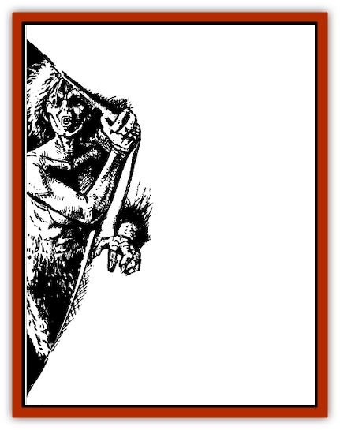

# Skotos

| Statistic | **Skotos** |
| --- | --- |
| **Activity Cycle:** | Night or darkness |
| **Alignment:** | Any evil |
| **Armor Class:** | 4 |
| **Climate/Terrain:** | Any; usually subterranean |
| **Damage/Attack:** | 1-10 |
| **Diet:** | Living beings |
| **Frequency:** | Very rare |
| **Hit Dice:** | 5 |
| **Intelligence:** | Average (8-10) |
| **Magic Resistance:** | Special |
| **Morale:** | Fearless (20) |
| **Movement:** | 12 |
| **No. Appearing:** | 3-30 in wilderness; 1-10 in dungeons |
| **No. of Attacks:** | 1 |
| **Organization:** | Roving bands |
| **Size:** | M (5-6' tall) |
| **Special Attacks:** | Nil |
| **Special Defenses:** | Hit points increase |
| **THAC0:** | 15 |
| **Treasure:** | E |
| **XP Value:** | 420 |

Skotos are spirits that have broken free of the netherworld and now roam the world of the living as undead. They form hunting packs to better swarm over their prey. Skotos look like pale, shadowy versions of normal beings. They can be of any intelligent race and any evil alignment, for only evil creatures would voluntarily leave the afterlife to prey upon the living.

**Combat:** A skotos is drawn by fresh blood, which it consumes. As it absorbs the blood, it grows stronger (it absorbs blood even from the wounds it inflicts in combat against living creatures). The skotos gains a number of hit points equal to the damage it inflicts in combat; thus, a skotos that hits for 8 hp damage gains 8 hp, up to its maximum hit-point total (40). Note that the hit points are not permanently lost by the victim, who still heals normally.
In a normal encounter, skotos as a group have a 75% chance to hide in shadows successfully and thus surprise their prey. Skotos encountered during or immediately after a bloody conflict will be so frenzied by the sight of blood that they will make no attempt at concealment, immediately attacking any living creature in sight. Intelligent prey is, however, preferred.

As with many types of undead, skotos are not affected by *sleep*, *charm*, *hold*, or cold-based spells, nor by poison or paralyzation. Holy water causes 2-8 hp damage to them per vial, and a *raise dead* or *resurrection* spell will destroy a skotos. Any skotos reduced to zero hit points or less is forced back into the netherworld. A cleric's chance to turn a skotos is the same as for a ghast. Normal weapons will harm a skotos.

**Habitat/Society:** Skotos usually roam in bands composed of similar races and alignments, though different beings may band together in their common goal of feeding upon the living. Though they have escaped the netherworld, skotos generally inhabit places that remind them of it. Subterranean caverns and tunnels are preferred, although skotos bands will sometimes roam wilderness wastelands at night. While skotos are not harmed by sunlight, they dislike it intensely and will flee sunlight if at all possible.

---
## Discovery & Documentation

**Source Publication:** Dragon162 (1990)
**Campaign Setting:** Dragon Magazine
**Author(s):** Spike Y. Jones, Thomas Baxa

### Other Creatures Found in This Source Book
   * [[Ankou|Ankou]]
