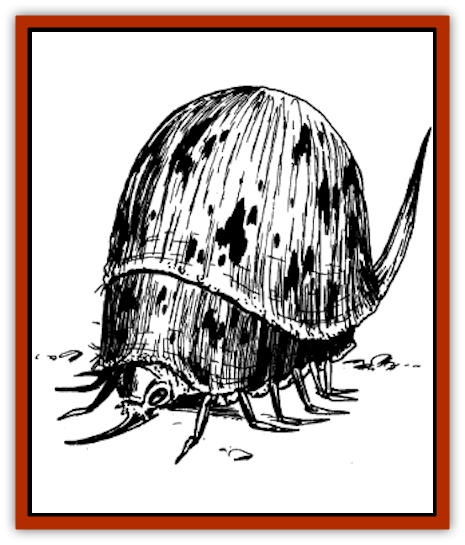

# Skrit

| Statistic | **Skrit** |
| --- | --- |
| **Activity Cycle:** | Night |
| **Alignment:** | Neutral |
| **Armor Class:** | 3 |
| **Climate/Terrain:** | Desert |
| **Damage/Attack:** | 1d3/1d3/1d6 |
| **Diet:** | Carnivore |
| **Frequency:** | Rare |
| **Hit Dice:** | 6 |
| **Intelligence:** | Animal (1) |
| **Magic Resistance:** | Nil |
| **Morale:** | Average (10) |
| **Movement:** | 15 |
| **No. Appearing:** | 1 |
| **No. of Attacks:** | 3 |
| **Organization:** | Solitary |
| **Size:** | L (7') |
| **Special Attacks:** | Surprise, jellification |
| **Special Defenses:** | Nil |
| **THAC0:** | 15 |
| **Treasure:** | Nil |
| **XP Value:** | 2,000 |

Skrits are carnivorous [[Beetle|beetles]] that live in the cool deserts of Taladas. They are hulking creatures, approximately five to six feet in height.

Similar in appearance to a flea, the skrit's body is protected by a rough, domed carapace. A host of short spiny legs protrude out from under this shell. The head is small and can be retracted under this shell, which tapers back to a narrow, inflexible tail. The overall color of the shell is mottled black and brown, similar to the surrounding terrain.

**Combat:** The skrit is a fierce predator, quick for its size. Too large to effectively stalk prey, it relies on natural camouflage. It settles among outcroppings of rock and waits unmoving for something to pass close by. While the skrit can be spotted by those who look for it, its camouflage works well enough to conceal it from casual observation at distances beyond 15 feet. Closer than this and the true nature of the "rock" is obvious to intelligent creatures who happen to look that way. Those attacked by a skrit have a -1 penalty applied to their surprise roll if the creature was not spotted.

In combat, the skrit picks out a single target (normally the smallest or weakest looking of the player characters) and attacks it almost to the exclusion of all others. It attacks with its two feeble forelegs and its needle-like mouth. This mouth has retractable barbs, so that once a hit is scored the probe stays in place. Each turn thereafter, the skrit pumps a powerful enzyme into the victim's bloodstream. At the same time, the creature attempts to drag its victim to a safe place where it can eat its prey.

The enzyme has two effects. First it paralyzes the victim. The victim must roll a saving throw vs. poison each round the skrit is attached. A -1 penalty is applied to the saving throw for each round after the first. The paralysis lasts for 3d6 hours or until the enzyme is neutralized. Second, the enzyme also destroys cell tissue, slowly dissolving the body to a soupy gelatinous mass. This is what the skrit will later eat. This effect takes several hours. Victims are paralyzed by the time this occurs. The victim loses 10 hit points per hour from the cell tissue destruction. The enzyme can be halted with a neutralize poison spell. Damage from the bite and claws can be healed normally or through spells. Damage caused by the enzyme can only be healed normally or through *regeneration*.

**Habitat/Society:** Skrits are solitary hunters with a limited range. They do nor make lairs, but inhabit patches of rough ground where their camouflage is most effective. Within this territory, skrits change hunting locations from day to day, depending on the amount of success.

Skrits have both male and female members, distinguished only by the length of their tails. During the mating season in early spring, the female sends signals to the males by clattering its tail against the rocks. The males gather and combat for the right co be her mate. This is a particularly dangerous time to be among the rocks, for the males will attack anything that moves (+1 bonus to attack and damage rolls).

**Ecology:** The skrit is an essential part of the desert ecological chain. Not only is it an important predator, but after death its body plays a role in the life of the desert dwellers. The huge carapace becomes home for many creatures; most of these are benign or at least of no great threat to adventurers. Sometimes, however, the shells are taken over by huge colonies of [[Ant|ants]]. The domed shell becomes the home to a ferocious swarm, quite dangerous to disturb.

The shell can also be fashioned into an excellent armor by those skilled in handling the peculiar material. Skilled craftsmen use the carapace to fashion breastplates and other solid pieces of armor. A suit fashioned from this material has an AC 4.

---
## Discovery & Documentation

**Source Publication:** Time of the Dragon (1989)
**Campaign Setting:** Dragonlance
**Author(s):** David Cook

### Other Creatures Found in This Source Book
   * [[Disir|Disir]]
   * [[Draconian_Proto-_Traag|Draconian, Proto-, Traag]]
   * [[Dragon_Krynn_Othlorx_General_Information|Dragon (Krynn), Othlorx, General Information]]
   * [[Fire_Minion|Fire Minion]]
   * [[Gurik_Cha'ahl|Gurik Cha'ahl]]
   * [[Horax|Horax]]
   * [[Saqualaminoi|Saqualaminoi]]
   * [[Yaggol|Yaggol]]
