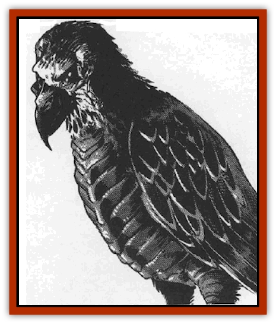

# Skullbird

| Statistic | **Skullbird** |
| --- | --- |
| **Activity Cycle:** | Any |
| **Alignment:** | Neutral evil |
| **Armor Class:** | 2 |
| **Climate/Terrain:** | Any |
| **Damage/Attack:** | 1d8/1d8/3d4 |
| **Diet:** | Carnivore |
| **Frequency:** | Uncommon |
| **Hit Dice:** | 6+6 |
| **Intelligence:** | Semi- (2) |
| **Magic Resistance:** | Nil |
| **Morale:** | Unsteady (7) |
| **Movement:** | 6, Fl 9 (C) |
| **No. Appearing:** | 2-5 |
| **No. of Attacks:** | 3 |
| **Organization:** | Flock |
| **Size:** | L (16' wingspan) |
| **Special Attacks:** | Grab prey |
| **Special Defenses:** | Slippery |
| **THAC0:** | 14 |
| **Treasure:** | R |
| **XP Value:** | 1,400 |

Skullbirds are large carrion [[Bird|birds]] of wildspace. A bad reputation follows these birds. Sailors consider the sight of a skullbird a sign that someone aboard ship will die soon.

The birds are named for their gruesome heads, which appear to be bird skulls covered with a layer of shiny black skin stretched tight. Their glittering dark eyes are hidden deep in the recessed sockets, and their beaks are jet black and needle-sharp. Skullbirds are covered with oily black feathers and exude an oily, charnel odor. Their talons are like razors.

Skullbirds have no language, but have two distinct calls: an irritating, high-pitched screech when they find live food, and an ominous, bass croaking when they find carrion.

**Combat:** Though the birds prefer to eat carrion, since it puts up no fight, they unhesitatingly attack live prey if they have not had a decent meal in several days (50% chance).

Skullbirds attack with their two sets of sharp talons, each doing 1d8 damage. If the prey is still moving, they try to finish it off with a swift stroke of their razor-like beaks, inflicting 3d4 damage.

Whenever a skullbird attacks a victim who weighs less than 200 pounds, it tries to snatch up its prize and fly away to its foul nest. To do so, the skullbird must hit the victim with both claws in the same melee round. The talons have an effective Strength of 17. The victim is allowed a Strength check to escape; failure means the bird swoops up with the victim at top speed. If the prey struggles for more than one round, the skullbird drops the victim, in hopes that the falling damage will finish it off.

Skullbirds secrete an oily substance that keeps them comfortable while flying in space. The oil is slippery; any attempt to grapple with the bird takes a -4 penalty. This oil is also responsible for the creature's low AC, since weapons seem to slip off the bird.

The oil, however, is highly flammable, giving the skullbirds a -4 penalty when saving vs. fire-based attacks, and +2 hp per die of fire damage. Waving torches or other open flames around a skullbird for one round forces a morale check.

**Habitat/Society:** Skullbirds nest in floating wrecks of spelljamming vessels, or in the decomposing bodies of huge, dead, wildspace creatures. They travel in flocks and have no leaders. Skullbirds are not territorial.

Once every three months, a female skullbird lays 1d4 eggs. Ugly, almost skeletal chicks hatch from the eggs and begin croaking instantly, demanding to be fed. The sound is reminiscent of a group of bullfrogs. There is a 25% chance of finding skullbird eggs in a nest. They are not edible.

The oily feathers of the skullbird also trap air most efficiently, giving the birds a full day's supply of air. They do require air to survive in wildspace.

The skullbird is a bird of ill omen. Sailors shun them, and shun anyone foolish enough to wear anything made from part one of the birds. If a ship encounters skullbirds outside their lair, the encounter begins with the birds flying out of nowhere and trying to perch on the ship's masts. This is considered the worst possible omen, a sign that the ship will soon be destroyed. Fast-moving characters get one round to try to drive the birds away from the masts; if they succeeds the birds may attack instead (50% chance).

Average or Green crews who see the skullbirds roosting on their ships undergo an immediate morale check at -1 penalty. Failure indicates that the sailors immediately panic, some scampering below decks, others jumping off the ship. They remain panicked until the birds are driven off. More experienced crews need not check morale, but they make morale checks in later battles at the same penalty.

**Ecology:** The only positive ecological contribution skullbirds make is their pursuit of their favorite food, [[Feesu|feesu]].

---
## Discovery & Documentation

**Source Publication:** MC9 Spelljammer Appendix II (1991)
**Campaign Setting:** Planescape
**Author(s):** Scott Davis, Newton Ewell, John Terra

### Other Creatures Found in This Source Book
   * [[Alchemy_Plant|Alchemy Plant]]
   * [[Allura|Allura]]
   * [[Aperusa|Aperusa]]
   * [[Autognome|Autognome]]
   * [[Bionoid|Bionoid]]
   * [[Bloodsac|Bloodsac]]
   * [[Buzzjewel|Buzzjewel]]
   * [[Constellate|Constellate]]
   * [[Contemplator|Contemplator]]
   * [[Dohwar|Dohwar]]
   * [[Dragon_Moon|Dragon, Moon]]
   * [[Dragon_Stellar|Dragon, Stellar]]
   * [[Dragon_Sun|Dragon, Sun]]
   * [[Dreamslayer|Dreamslayer]]
   * [[Dweomerborn|Dweomerborn]]
   * [[Fal|Fal]]
   * [[Feesu|Feesu]]
   * [[Fire_Bat|Fire Bat]]
   * [[Firebird|Firebird]]
   * [[Firelich|Firelich]]
   * [[Flowfiend|Flowfiend]]
   * [[Gadabout|Gadabout]]
   * [[Gammaroid|Gammaroid]]
   * [[Gonn|Gonn]]
   * [[Gossamer|Gossamer]]
   * [[Grav|Grav]]
   * [[Great_Dreamer|Great Dreamer]]
   * [[Greatswan|Greatswan]]
   * [[Grell_Colonial|Grell, Colonial]]
   * [[Gullion|Gullion]]
   * [[Insectare|Insectare]]
   * [[Lhee|Lhee]]
   * [[Mercurial_Slime|Mercurial Slime]]
   * [[Meteorspawn|Meteorspawn]]
   * [[Monitor|Monitor]]
   * [[Owl_Space|Owl, Space]]
   * [[Pristatic|Pristatic]]
   * [[Scro|Scro]]
   * [[Selkie_Star|Selkie, Star]]
   * [[Silatic|Silatic]]
   * [[Sleek|Sleek]]
   * [[Sluk|Sluk]]
   * [[Space_Swine|Space Swine]]
   * [[Sphinx_Astro-|Sphinx, Astro-]]
   * [[Spirit_Warrior|Spirit Warrior]]
   * [[Starfly_Plant|Starfly Plant]]
   * [[Stargazer|Stargazer]]
   * [[Undead_Stellar|Undead, Stellar]]
   * [[Witchlight_Marauder|Witchlight Marauder]]
   * [[Xixchil|Xixchil]]
   * [[Yitsan|Yitsan]]
   * [[Zurchin|Zurchin]]
