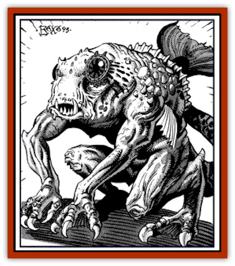

# Skum

| Statistic | **Skum** |
| --- | --- |
| **Activity Cycle:** | Night |
| **Alignment:** | Lawful evil |
| **Armor Class:** | 7 |
| **Climate/Terrain:** | Tropical, temperate subterranean |
| **Damage/Attack:** | 2d8/1d6 (&times;2)/1d8 (&times;2) |
| **Diet:** | Omnivore |
| **Frequency:** | Very rare |
| **Hit Dice:** | 2+2 |
| **Intelligence:** | Animal to average (1-10) |
| **Magic Resistance:** | See below |
| **Morale:** | Steady (11-12) |
| **Movement:** | 6, Sw 15 |
| **No. Appearing:** | 2d4 |
| **No. of Attacks:** | 5 |
| **Organization:** | Brood |
| **Size:** | M (4-6' tall) |
| **Special Attacks:** | Nil |
| **Special Defenses:** | Nil |
| **THAC0:** | 17 |
| **Treasure:** | Nil |
| **XP Value:** | 175 |

Skum are a race bred by the [[Aboleth|aboleth]] from humanoid genetic stock to serve as beasts of burden. Skum do not resemble their ancestors. They have an aboleth-like tail and four extremely strong limbs, each ending in a webbed paw which has two fingers and an opposable thumb. Each digit ends in a retractable claw. A skum's body is covered with a clear, slimy, hairless, gray-green membrane. While they have no external ears, they are not deaf. In the water, they can hear twice as well as a human can in air. A skum's eyes are much like an aboleth's - an eerie shade of purple-red - but are more spherical. Having been bred to function in the dark, skum have 60-foot infravision.

**Combat:** Skum are pure fighting machines and can attack three opponents at a time, though they usually choose to attack a single enemy. Skum males have an effective Strength of 18 and females have 18/50 Strength. Water is their natural element, and when in water they can attack with their bite and all four limbs. On land their bodies are clumsy, so they suffer a -2 penalty on attack rolls and can use only their bite and arms in melee. While in the presence of an aboleth, skum fight until they are victorious, slain, or ordered off by the aboleth. Skum can be trained to use weapons, but only awkwardly; skum fighting with a weapon suffer a -2 penalty to their attack rolls.

In water a female skum can carry as much as a heavy war [[Horse|horse]] if the load is strapped to her back; males can carry as much as a medium war horse. On land, a skum can carry as much weight as a human with the same strength.

**Habitat/Society:** Skum are the result of at least a millennium of careful breeding. They no longer resemble humanity in body or mind. The aboleth removed what they regard as unnecessary parts: vocal cords, lungs, external ears, hair, etc. The aboleth then added what features they thought would be necessary for their servants, such as the tail for swimming and claws and teeth for fighting. Most skum have low Intelligence (5-7), but some have been bred to be even less bright.

Skum tend to be as coldly logical as their limited intelligence allows, and they have almost no emotions. They communicate with their aboleth masters and with each other through a limited form of telepathy (range 30 yards) that allows them to understand simple commands. Skum telepathy does not allow communication with races other than skum or aboleth. Their minds are susceptible to mental domination. They get no saving throw vs. the aboleth's enslavement power and they save vs. all other enchantment/charm spells at -4.

**Ecology:** Skum breathe through the skin, but their outer membranes must be moist to do so. A skum out of water can breathe normally for half an hour before drying out and suffering 3d4 points of damage each turn.

A skum female lays one egg at a time after a gestation period of about six months. The egg must incubate on land for four to six weeks, so the female usually buries it in sand. If possible, the parents remain nearby to guard the egg. Once hatched, the baby skum is nursed like a human infant and reaches maturity in three years. Only about 25% of the eggs laid mature into adults. Skum can live to be about 30 years of age, but most die in combat much sooner than that.

Skum have no natural enemies, but most land dwellers despise them. A skum captured by [[Elf_Drow|drow]] or [[Dwarf_Duergar|duergar]] is in for a long and painful death. [[Gnome|Svirfneblin]] usually take pity on skum captives. [[Kuo-Toa|Kuo-toa]] don't hate skim, but no skum servant has ever been observed in a kuo-toa city.

Skum will eat anything they can catch, and the aboleths are not above letting them scavenge.

Although the aboleth cannot transform captive humanoids into scum, they can change them so that their offspring will.

---
## Discovery & Documentation

**Source Publication:** Monstrous Compendium, 1994 Annual, Volume 1 (1995)
**Campaign Setting:** Advanced Dungeons & Dragons 2nd Edition
**Author(s):** David Wise

### Other Creatures Found in This Source Book
   * [[Abyss_Ant|Abyss Ant]]
   * [[Achaierai|Achaierai]]
   * [[Afanc|Afanc]]
   * [[Al-Jahar|Al-Jahar]]
   * [[Baelnorn|Baelnorn]]
   * [[Baneguard|Baneguard]]
   * [[Banelar|Banelar]]
   * [[Bird_Talking|Bird, Talking]]
   * [[Blazing_Bones|Blazing Bones]]
   * [[Campestri|Campestri]]
   * [[Caniquine|Caniquine]]
   * [[Cat_Winged|Cat, Winged]]
   * [[Crypt_Servant|Crypt Servant]]
   * [[Death's_Head_Tree|Death's Head Tree]]
   * [[Dog_Saluqi|Dog, Saluqi]]
   * [[Dragon_Electrum|Dragon, Electrum]]
   * [[Dragon_Fang|Dragon, Fang]]
   * [[Dragon_Linnorm_Corpse_Tearer|Dragon, Linnorm, Corpse Tearer]]
   * [[Dragon_Linnorm_Dread|Dragon, Linnorm, Dread]]
   * [[Dragon_Linnorm_Flame|Dragon, Linnorm, Flame]]
   * [[Dragon_Linnorm_Forest|Dragon, Linnorm, Forest]]
   * [[Dragon_Linnorm_Frost|Dragon, Linnorm, Frost]]
   * [[Dragon_Linnorm_Gray|Dragon, Linnorm, Gray]]
   * [[Dragon_Linnorm_Land|Dragon, Linnorm, Land]]
   * [[Dragon_Linnorm_Midgard|Dragon, Linnorm, Midgard]]
   * [[Dragon_Linnorm_Rain|Dragon, Linnorm, Rain]]
   * [[Dragon_Linnorm_Sea|Dragon, Linnorm, Sea]]
   * [[Dragon_Neutral_Jacinth|Dragon, Neutral, Jacinth]]
   * [[Dragon_Neutral_Jade|Dragon, Neutral, Jade]]
   * [[Dragon_Neutral_Pearl|Dragon, Neutral, Pearl]]
   * [[Dread|Dread]]
   * [[Dragon-kin|Dragon-kin]]
   * [[Elemental_Earth_Kin_Chrysmal|Elemental, Earth Kin, Chrysmal]]
   * [[Elemental_Earth_Kin_Earth_Weird|Elemental, Earth Kin, Earth Weird]]
   * [[Elemental_Fire_Kin_Azer|Elemental, Fire Kin, Azer]]
   * [[Elemental_Sandman|Elemental, Sandman]]
   * [[Elemental_Wind_Walker|Elemental, Wind Walker]]
   * [[Elemental_Vermin|Elemental Vermin]]
   * [[Feystag|Feystag]]
   * [[Flame_Skull|Flame Skull]]
   * [[Foulwing|Foulwing]]
   * [[Gambado|Gambado]]
   * [[Garbug|Garbug]]
   * [[Genie_Tasked_Administrator|Genie, Tasked, Administrator]]
   * [[Genie_Tasked_Deceiver|Genie, Tasked, Deceiver]]
   * [[Genie_Tasked_Harim_Servant|Genie, Tasked, Harim Servant]]
   * [[Genie_Tasked_Messenger|Genie, Tasked, Messenger]]
   * [[Genie_Tasked_Miner|Genie, Tasked, Miner]]
   * [[Genie_Tasked_Oathbinder|Genie, Tasked, Oathbinder]]
   * [[Gibbering_Mouther|Gibbering Mouther]]
   * [[Gnasher|Gnasher]]
   * [[Gnasher_Winged|Gnasher, Winged]]
   * [[Golem_Brain|Golem, Brain]]
   * [[Golem_Hammer|Golem, Hammer]]
   * [[Golem_Metagolem|Golem, Metagolem]]
   * [[Golem_Spiderstone|Golem, Spiderstone]]
   * [[Gorynych|Gorynych]]
   * [[Greelox|Greelox]]
   * [[Helmed_Horror|Helmed Horror]]
   * [[Jarbo|Jarbo]]
   * [[Laraken|Laraken]]
   * [[Lich_Psionic|Lich, Psionic]]
   * [[Living_Steel|Living Steel]]
   * [[Lock_Lurker|Lock Lurker]]
   * [[Loxo|Loxo]]
   * [[Lycanthrope_Loup_de_Noir|Lycanthrope, Loup de Noir]]
   * [[Lycanthrope_Werebadger|Lycanthrope, Werebadger]]
   * [[Lycanthrope_Werejaguar|Lycanthrope, Werejaguar]]
   * [[Lythlyx|Lythlyx]]
   * [[Magebane|Magebane]]
   * [[Marrashi|Marrashi]]
   * [[Metalmaster|Metalmaster]]
   * [[Mimic_House_Hunter|Mimic, House Hunter]]
   * [[Naga_Bone|Naga, Bone]]
   * [[Nautilus_Giant|Nautilus, Giant]]
   * [[Nightshade_Toril|Nightshade (Toril)]]
   * [[Nishruu|Nishruu]]
   * [[Noran|Noran]]
   * [[Opinicus|Opinicus]]
   * [[Ormyrr|Ormyrr]]
   * [[Parasite|Parasite]]
   * [[Pasari-Niml|Pasari-Niml]]
   * [[Plant_Vampire_Moss|Plant, Vampire Moss]]
   * [[Pteraman|Pteraman]]
   * [[Rautym|Rautym]]
   * [[Shadeling|Shadeling]]
   * [[Snake_Giant_Cobra|Snake, Giant Cobra]]
   * [[Snake_Stone|Snake, Stone]]
   * [[Spectral_Wizard|Spectral Wizard]]
   * [[Spell_Weaver|Spell Weaver]]
   * [[Spider_Brain|Spider, Brain]]
   * [[Suwyze|Suwyze]]
   * [[Tatalla|Tatalla]]
   * [[Tick_Heart|Tick, Heart]]
   * [[Tree_Dark|Tree, Dark]]
   * [[Tree_Singing|Tree, Singing]]
   * [[Tressym|Tressym]]
   * [[Troll_Snow|Troll, Snow]]
   * [[Tuyewera|Tuyewera]]
   * [[Ulitharid|Ulitharid]]
   * [[Undead_Dwarf|Undead Dwarf]]
   * [[Undead_Lake_Monster|Undead Lake Monster]]
   * [[Whipsting|Whipsting]]
   * [[Windghost|Windghost]]
   * [[Wolf_Dread|Wolf, Dread]]
   * [[Wolf_Stone|Wolf, Stone]]
   * [[Wolf_Vampiric|Wolf, Vampiric]]
   * [[Wraith_Shimmering|Wraith, Shimmering]]
   * [[Xantravar|Xantravar]]
   * [[Xaver|Xaver]]
