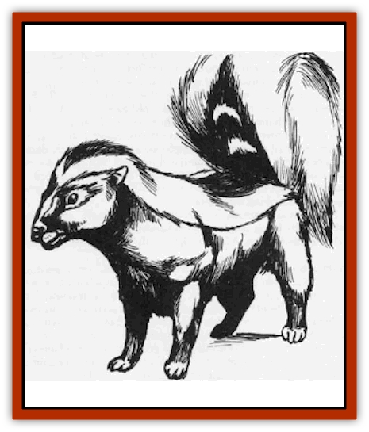

# Skunk

| Statistic | **Giant** | **Normal** |
| --- | --- | --- |
| **Activity Cycle:** | Any | Any |
| **Alignment:** | Neutral | Neutral |
| **Armor Class:** | 7 | 8 |
| **Climate/Terrain:** | Temperate or subtropical forests | Temperate or subtropical forests |
| **Damage/Attack:** | 1-6 | 1 |
| **Diet:** | Omnivore | Omnivore |
| **Frequency:** | Uncommon | Common |
| **Hit Dice:** | 5 | 1-2 hp |
| **Intelligence:** | Animal (1) | Animal (1) |
| **Magic Resistance:** | Nil | Nil |
| **Morale:** | Average (9) | Unsteady (5) |
| **Movement:** | 9 | 12 |
| **No. Appearing:** | 1 or 1-4 | 1 or 1-6 |
| **No. of Attacks:** | 1 | 1 |
| **Organization:** | Solitary or family | Solitary or family |
| **Size:** | M (6' long) | T (2' long) |
| **Special Attacks:** | Squirt musk | Squirt musk |
| **Special Defenses:** | Squirt musk | Squirt musk |
| **THAC0:** | 15 | 20 |
| **Treasure:** | Nil | Nil |
| **XP Value:** | 270 | 35 |

Skunks are forest-dwelling omnivores found in most temperate and subtropical regions. They are easily recognized by the long white stripe running from their faces, down their black-furred backs, to the tips of their tails.

**Combat:** Skunks react to any serious threat by backing toward the opponent. If the other creature does not quickly get beyond range, the skunk discharges a vile cloud of stinking musk at it.

The cloud of a normal skunk is 10'x10'x10'. Any creature unfortunate enough to be caught in a skunk's cloud must first save versus poison or be nauseated (lose 50% of Strength and Dexterity) for 1-4 rounds and retreat and retch. Anyone who makes the first saving throw, but chooses to remain within the cloud, must make an additional save versus poison each round he stays. After the results of the first saving throw have been determined, a second save versus poison must be made to determine whether or not the vile musk has gotten into the victim's eyes, thereby blinding the unfortunate creature for 1-4 rounds.

The stench of the musk seems almost impossible to get rid of. All normal cloth materials must save versus acid or rot and become useless. All other items (i.e., flesh, leather, metal, etc.) must be washed and aired repeatedly for several days to remove the horrid stench. Washing the items in vinegar will remove the smell in only a few washings, while certain spells and magical items can accomplish the task quite nicely. A potion of *sweet water* poured carefully over the items to be cleaned will neutralize the musk in the garments of 2-5 people (depending on the quantity of gear and the care used in applying the fluid). Despite washing, any cloth that fails its saving throw - including magical items - will rot and become useless.

If cornered, skunks can bite, but usually loose their combination offense/defense musk cloud immediately. If two or more skunks are encountered, the DM should make careful note of where their clouds go. While skunks are immune to the nausea effects of other skunks, they can still be blinded by the acid musk just like any other living creature.

**Habitat/Society:** Skunks are wandering scavengers and have no social structure. They prefer to eat the leftovers of larger predators and always dwell deep in the forest.

**Ecology:** As mentioned above, skunks will eat almost anything, usually the remains of other kills. Their musk is secreted from a small posterior sac which is heavily muscled to permit the expulsion of the fluid. The fluid forms a heavy mist which lingers in an area for up to a week or more, depending on the prevailing winds and area filled. If the skunk is surprised and killed quickly, there is a 50% chance that the musk will be recoverable. A giant skunk killed in this way can be a prize worth close to 200 gp to a sage or alchemist, as the musk is a valued alchemical component (for *stinking cloud* scroll ink, smoke bombs, etc.)

A skunk pelt is relatively worthless as a luxury fur. Skunk meat is bitter and must be heavily seasoned to be palatable.

Skunks can be raised in captivity and make wonderful pets and combination low-cost garbage disposals/house guards.

**Giant Skunks**

  Giant skunks are simply huge versions of the normal variety. Their musk clouds tend to be larger and more noxious than those of their cousins. The cloud is 20 feet wide by 20 feet high by 60 feet long and all saving throws against the musk of a giant skunk are at a penalty of -4.

---
## Discovery & Documentation

**Source Publication:** MC1 Volume I (w/binder #1) (1991)
**Campaign Setting:** Advanced Dungeons & Dragons 2nd Edition
**Author(s):** Jay Batista, Scott Bennie, Grant Boucher, William W. Connors, Steve Gilbert, Heike Kubasch, James Lowder, David Edward Martin, Bruce Nesmith, Jean Rabe, Rick Swan, John J. Terra, Gary L. Thomas

### Other Creatures Found in This Source Book
   * [[Bat|Bat]]
   * [[Bear|Bear]]
   * [[Behir|Behir]]
   * [[Boar|Boar]]
   * [[Bookworm|Bookworm]]
   * [[Brownie|Brownie]]
   * [[Bugbear|Bugbear]]
   * [[Carrion_Crawler|Carrion Crawler]]
   * [[Cat_Great|Cat, Great]]
   * [[Catoblepas|Catoblepas]]
   * [[Dragon_General_Information|Dragon, General Information]]
   * [[Dragonfish|Dragonfish]]
   * [[Elemental_Air_Kin_Aerial_Servant|Elemental, Air Kin, Aerial Servant]]
   * [[Elemental_Earth_Kin_Sandling|Elemental, Earth Kin, Sandling]]
   * [[Elephant|Elephant]]
   * [[Gnoll|Gnoll]]
   * [[Hobgoblin|Hobgoblin]]
   * [[Homunculus|Homunculus]]
   * [[Hornet_Giant|Hornet, Giant]]
   * [[Horse|Horse]]
   * [[Hyena|Hyena]]
   * [[Jackal|Jackal]]
   * [[Jackalwere|Jackalwere]]
   * [[Korred|Korred]]
   * [[Lich|Lich]]
   * [[Lizard|Lizard]]
   * [[Lizard_Man|Lizard Man]]
   * [[Lycanthrope_General_Information|Lycanthrope, General Information]]
   * [[Lycanthrope_Seawolf|Lycanthrope, Seawolf]]
   * [[Lycanthrope_Werebear|Lycanthrope, Werebear]]
   * [[Lycanthrope_Weretiger|Lycanthrope, Weretiger]]
   * [[Lycanthrope_Werewolf|Lycanthrope, Werewolf]]
   * [[Manticore|Manticore]]
   * [[Medusa|Medusa]]
   * [[Mind_Flayer|Mind Flayer]]
   * [[Minotaur|Minotaur]]
   * [[Mudman|Mudman]]
   * [[Mummy|Mummy]]
   * [[Nixie|Nixie]]
   * [[Nymph|Nymph]]
   * [[Ogre|Ogre]]
   * [[Ooze_Slime_Jelly_I|Ooze/Slime/Jelly I]]
   * [[Ooze_Slime_Jelly_II|Ooze/Slime/Jelly II]]
   * [[Orc|Orc]]
   * [[Owl|Owl]]
   * [[Owlbear_I|Owlbear I]]
   * [[Pegasus|Pegasus]]
   * [[Piercer|Piercer]]
   * [[Pudding_Deadly|Pudding, Deadly]]
   * [[Rakshasa|Rakshasa]]
   * [[Rat|Rat]]
   * [[Ray|Ray]]
   * [[Remorhaz|Remorhaz]]
   * [[Satyr|Satyr]]
   * [[Scorpion|Scorpion]]
   * [[Selkie|Selkie]]
   * [[Shadow|Shadow]]
   * [[Skeleton|Skeleton]]
   * [[Snake|Snake]]
   * [[Spectre|Spectre]]
   * [[Spider|Spider]]
   * [[Sprite|Sprite]]
   * [[Toad_Giant|Toad, Giant]]
   * [[Treant|Treant]]
   * [[Troll|Troll]]
   * [[Umber_Hulk|Umber Hulk]]
   * [[Unicorn|Unicorn]]
   * [[Vampire|Vampire]]
   * [[Wight|Wight]]
   * [[Will_O'Wisp|Will O'Wisp]]
   * [[Wolf|Wolf]]
   * [[Wolfwere|Wolfwere]]
   * [[Wraith|Wraith]]
   * [[Wyvern|Wyvern]]
   * [[Yeti|Yeti]]
   * [[Yuan-ti|Yuan-ti]]
   * [[Zombie|Zombie]]
