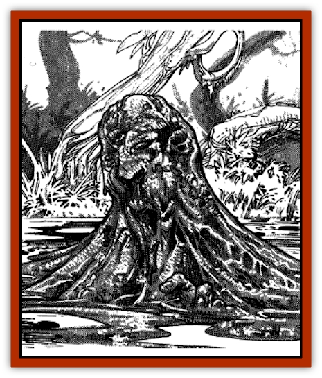

# Skuz

| Statistic | **Skuz** |
| --- | --- |
| **Activity Cycle:** | Any |
| **Alignment:** | Chaotic evil |
| **Armor Class:** | 0 |
| **Climate/Terrain:** | Ponds, lakes |
| **Damage/Attack:** | 2-12/2-12 |
| **Diet:** | None |
| **Frequency:** | Very rare |
| **Hit Dice:** | 11 |
| **Intelligence:** | Exceptional (16) |
| **Magic Resistance:** | 25% |
| **Morale:** | Fearless (19-20) |
| **Movement:** | 1, Sw 15 |
| **No. Appearing:** | 1-6 |
| **No. of Attacks:** | 2 |
| **Organization:** | Solitary |
| **Size:** | M (4-7' long) |
| **Special Attacks:** | Energy drain, spells |
| **Special Defenses:** | +2 or better weapon to hit |
| **THAC0:** | 9 |
| **Treasure:** | F |
| **XP Value:** | 15,000 |

One of the most powerful and feared forms of undead, skuz haunt still bodies of water and destroy all those foolish enough to fall into their grasp.

Skuz have a strong tie to the Negative Material Plane. They hate all life and attempt to drag any creatures within reach into their watery grave.

A skuz appears as a slimy coating on the water, similar to the algae growths on still ponds and lakes. A skuz is able to manipulate its slimy body, allowing it to take on humanoid and other forms, and making it easier to attract prey. Unlike many of the powerful undead, skuz operate in daylight as well as darkness.

**Combat:** Skuz attack by forming pseudo-arms from their slimy mass. In addition to causing physical damage, each touch of a skuz drains one life level from its victim. When a humanoid victim is weakened, the skuz pulls it beneath the water to drown it. When dead, the victim becomes a skuz. Humanoids who are killed by a skuz, but not drowned, do not become one of the undead.

Skuzs can use spell-like abilities at will, twice per day. These include *gaze reflection*, *suggestion*, *watery double*, *animate dead*, and *transmute dust to water*.

Skuzs can be hit only by +2 or better weapons. They are immune to all fire-based attacks and spells, and because of their maleable body they take half damage from magical edged weapons. *Lower water* causes 2d10 points of damage to a skuz, and *raise dead* instantly kills it. While skuzs can be turned as a "special" undead, they do not leave their pond or lake.

Skuz often lure victims to them by taking on the form of humans, usually children, and acting as if they are drowning. Skuz prefer not to attack until their prey is in the water, where the undead have the advantage.

Occasionally skuz work together to attract prey, using their spell-like abilities in concert, or appearing as a group of drowning people. In this instance each skuz attacks more viciously, wanting to be the one who brought the most victims to their doom.

**Habitat/Society:** Skuz occupy ponds, small lakes, and stagnant bodies of water, usually in temperate and tropical climes near human civilizations. Skuz avoid northern locations, where long, harsh winters freeze the water, restricting their movement. And they are rarely found in desolate areas where few humanoids could be found.

Although skuz are primarily solitary, one that has been successful in drowning humanoid victims has several skuz with it in the same body of water. However, if a pond or lake becomes too crowded with the undead, some opt to leave, crawling to another body of water where they have less competition when feeding.

Skuz are equally active during the day and evening. They have no need to sleep and they require no food, although the energy drained from victims invigorates them.

The body of water occupied by skuz is frequently devoid of all fish and plant life, as the undead do not want even simple creatures and organisms to live in their presence. Animals who come to the water to drink are quickly dispatched by the skuz. Their bodies are left to rot on the edge of the water and to act as a lure for larger creatures who would feast upon the remains.

Skuz take trophies from their humanoid victims such as armor, jewelry, coins, and other items that they pull to the bottom of their pond or lake. Usually the most respected skuz among a group of them is the one with the largest horde. This skuz often directs the actions of the others.

**Ecology:** The skuz, like many undead, serve no useful purpose in nature, killing without reason and destroying fish populations. Because of its attachment to the Negative Material Plane, it is not a normal part of the Realms.

Creatures close to nature shun bodies of water containing skuz. However, some creatures such as [[Swanmay|swanmays]] and [[Centaur|centaurs]] band together to hunt the undead or to approach bands of adventurers, asking them to kill the skuz.

The slime of a dead skuz can be used as components in waterbased spells, usually doubling the durations of those spells because of the skuz's magical and powerful nature.

---
## Discovery & Documentation

**Source Publication:** MC11 Forgotten Realms Appendix II (1991)
**Campaign Setting:** Advanced Dungeons & Dragons 2nd Edition
**Author(s):** Tim Beach, Tim Brown, William W. Connors, Dale Donovan, Ed Greenwood, Jeff Grubb, Bruce Heard, Slade Henson, Rob King, Colin McComb, Roger E. Moore, Bruce Nesmith, Jon Pickens, Jean Rabe, Dori Watry, Skip Williams

### Other Creatures Found in This Source Book
   * [[Alaghi|Alaghi]]
   * [[Alguduir|Alguduir]]
   * [[Beguiler|Beguiler]]
   * [[Bird_Toril|Bird (Toril)]]
   * [[Cantobele|Cantobele]]
   * [[Carapace|Carapace]]
   * [[Cat_Toril|Cat (Toril)]]
   * [[Chitine|Chitine]]
   * [[Cildabrin|Cildabrin]]
   * [[Dimensional_Warper|Dimensional Warper]]
   * [[Dragon_Deep|Dragon, Deep]]
   * [[Fachan_Toril|Fachan (Toril)]]
   * [[Fael|Fael]]
   * [[Feyr|Feyr]]
   * [[Firetail|Firetail]]
   * [[Frost|Frost]]
   * [[Gaund|Gaund]]
   * [[Gloomwing|Gloomwing]]
   * [[Golden_Ammonite|Golden Ammonite]]
   * [[Golem_Lightning|Golem, Lightning]]
   * [[Hamadryad|Hamadryad]]
   * [[Harrier|Harrier]]
   * [[Harrla|Harrla]]
   * [[Haun|Haun]]
   * [[Haundar|Haundar]]
   * [[Hendar|Hendar]]
   * [[Inquisitor|Inquisitor]]
   * [[Lhiannan_Shee|Lhiannan Shee]]
   * [[Loxo|Loxo]]
   * [[Manni|Manni]]
   * [[Manscorpion|Manscorpion]]
   * [[Mara|Mara]]
   * [[Morin|Morin]]
   * [[Naga_Dark|Naga, Dark]]
   * [[Orpsu|Orpsu]]
   * [[Plant_Carnivorous_Black_Willow|Plant, Carnivorous, Black Willow]]
   * [[Plant_Carnivorous_Toril|Plant, Carnivorous (Toril)]]
   * [[Plant_Dangerous_I|Plant, Dangerous I]]
   * [[Ring-Worm|Ring-Worm]]
   * [[Rohch|Rohch]]
   * [[Sand_Cat|Sand Cat]]
   * [[Saurial|Saurial]]
   * [[Sha'az|Sha'az]]
   * [[Silver_Dog|Silver Dog]]
   * [[Simpathetic|Simpathetic]]
   * [[Spider_Monkey|Spider, Monkey]]
   * [[Tren|Tren]]
