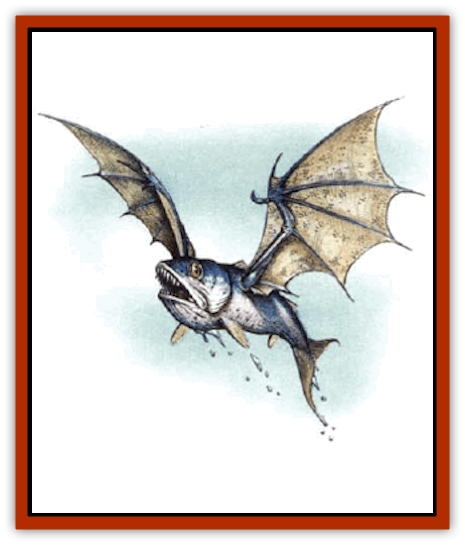

# Skyfish

| Statistic | **Skyfish** |
| --- | --- |
| **Activity Cycle:** | Day |
| **Alignment:** | Neutral |
| **Armor Class:** | 5 |
| **Climate/Terrain:** | The Last Sea |
| **Damage/Attack:** | 1-4 |
| **Diet:** | Carnivore |
| **Frequency:** | Common |
| **Hit Dice:** | 1+1 |
| **Intelligence:** | Semi- (2) |
| **Magic Resistance:** | Nil |
| **Morale:** | Steady (12) |
| **Movement:** | 3, Fl 30 (B), Sw 24 |
| **No. Appearing:** | 1-6 |
| **No. of Attacks:** | 1 |
| **Organization:** | Flock |
| **Size:** | M (5-6' wingspan) |
| **Special Attacks:** | Nil |
| **Special Defenses:** | Nil |
| **THAC0:** | 19 |
| **Treasure:** | Nil |
| **XP Value:** | 65 |

A skyfish is a special kind of amphibious creature that has the ability to survive both far below and high above the waves of Marnita. These creatures look like silvery sea bass with large batlike wings covered with scales instead of feathers. Their mouths end not in a beak but a ferocious set of teeth suitable for picking up and rending the smaller fish off of which they typically live.

The arches of the wings of a skyfish end in tiny claws which the animal can use to grip things while not using its wings for flying. When in the water, it folds these wings in close to itself so that it can swim with little resistance. To fly, a skyfish simply leaps out of the water and into the air and spreads its wings wide.

**Combat:** Skyfish rarely hunt in packs, preferring to take after their prey on their own. They like to circle high above the waves until they spot a smaller fish swimming near the surface. Then they dart in and carry the creature into the air, holding it in their mouth until it dies in the open air. Then they take the creature back into the water where they can finish their meal.

Skyfish will only bother people if the people are already bothering them. This happens occasionally when a fisher manages to catch one of these creatures on a line baited for other game. If the fisher can manage to reel the skyfish in, he is in for a tasty treat. Skyfish are considered to be one of the finest delicacies in Saragar. But to land his catch, the fisher is in for something of a battle.

**Habitat/Society:** Skyfish mate for life. They lay large, birdlike eggs, which they keep protected in underwater nests until hatched. While there are eggs or young to be protected, one of the parents stays with the precious things while the other hunts for food for the family. Skyfish usually hunt alone, but they have been known to band into flocks to take down large prey.

**Ecology:** The skyfish seems to have the best of both worlds. Since the creatures can breathe both air and water equally well, they can escape predators that are based solely in either element. For this reason, the skyfish population is always high. Were it not for the fact that the people of the Last Sea hunt these creatures for their tasty flesh, they might have literally overrun the entire valley. As it is, a canny fisher rarely has to wait long to find a skyfish in one of his nets.

---
## Discovery & Documentation

**Source Publication:** Monstrous Compendium, 1997 Annual, Volume 4 (1995)
**Campaign Setting:** Advanced Dungeons & Dragons 2nd Edition
**Author(s):** Jon Pickens

### Other Creatures Found in This Source Book
   * [[Anemone_Giant_Sea|Anemone, Giant Sea]]
   * [[Asperii|Asperii]]
   * [[Bainligor|Bainligor]]
   * [[Beast_of_Chaos|Beast of Chaos]]
   * [[Blindheim|Blindheim]]
   * [[Bloodsipper_Far_Realm|Bloodsipper (Far Realm)]]
   * [[Bulette_Gohlbrorn|Bulette, Gohlbrorn]]
   * [[Child_of_the_Sea|Child of the Sea]]
   * [[Clockwork_Horror|Clockwork Horror]]
   * [[Clockwork_Swordsman|Clockwork Swordsman]]
   * [[Coral|Coral]]
   * [[Darklore|Darklore]]
   * [[Dharculus|Dharculus]]
   * [[Dolphin_Athas|Dolphin (Athas)]]
   * [[Dragon_Neutral_Moonstone|Dragon, Neutral, Moonstone]]
   * [[Dragon_Prismatic|Dragon, Prismatic]]
   * [[Dream_Stalker|Dream Stalker]]
   * [[Dragon-kin_Albino_Wyrm|Dragon-kin, Albino Wyrm]]
   * [[Echyan|Echyan]]
   * [[Firestar|Firestar]]
   * [[Firetail|Firetail]]
   * [[Fish_Ascallion|Fish, Ascallion]]
   * [[Fish_Deep_Ocean|Fish, Deep Ocean]]
   * [[Fish_Tropical|Fish, Tropical]]
   * [[Fish_Vurgens|Fish, Vurgens]]
   * [[Fogwarden|Fogwarden]]
   * [[Fraal|Fraal]]
   * [[Giant_Crag|Giant, Crag]]
   * [[Gibberling_Brood|Gibberling, Brood]]
   * [[Glutton_Sea|Glutton, Sea]]
   * [[Golden_Ammonite|Golden Ammonite]]
   * [[Golem_Brass_Minotaur|Golem, Brass Minotaur]]
   * [[Golem_Gemstone|Golem, Gemstone]]
   * [[Golem_Maggot|Golem, Maggot]]
   * [[Groundling|Groundling]]
   * [[Hermit_Sea|Hermit, Sea]]
   * [[Hound_of_Law|Hound of Law]]
   * [[Human_Amazon|Human, Amazon]]
   * [[Human_Pygmy|Human, Pygmy]]
   * [[Inquisitor|Inquisitor]]
   * [[Kercpa|Kercpa]]
   * [[Kreel|Kreel]]
   * [[Lycanthrope_Lythari|Lycanthrope, Lythari]]
   * [[Mercurial|Mercurial]]
   * [[Mold_Chromatic|Mold, Chromatic]]
   * [[Mummy_Bog|Mummy, Bog]]
   * [[Neh-thalggu|Neh-thalggu]]
   * [[Nymph_Grain|Nymph, Grain]]
   * [[Nymph_Unseelie|Nymph, Unseelie]]
   * [[Octopus_Octo-Jelly|Octopus, Octo-Jelly]]
   * [[Puddingfish|Puddingfish]]
   * [[Sea_Demon|Sea Demon]]
   * [[Shade|Shade]]
   * [[Shadowrath|Shadowrath]]
   * [[Shark_Athas|Shark (Athas)]]
   * [[Siren_Ravenloft|Siren (Ravenloft)]]
   * [[Skeleton_Variant|Skeleton, Variant]]
   * [[Spectral_Scion|Spectral Scion]]
   * [[Spyder_Fiend|Spyder Fiend]]
   * [[Squid_Squark|Squid, Squark]]
   * [[Tanar'ri_Lesser_Uridezu|Tanar'ri, Lesser, Uridezu]]
   * [[Troll_Mutate|Troll Mutate]]
   * [[Vaati|Vaati]]
   * [[Vampire_Cerebral|Vampire, Cerebral]]
   * [[Varkha|Varkha]]
   * [[Wizshade|Wizshade]]
   * [[Worm_Lukhorn|Worm, Lukhorn]]
   * [[Wyste|Wyste]]
   * [[Yugoloth_Lesser_Gacholoth|Yugoloth, Lesser, Gacholoth]]
   * [[Zombie_Mud|Zombie, Mud]]
