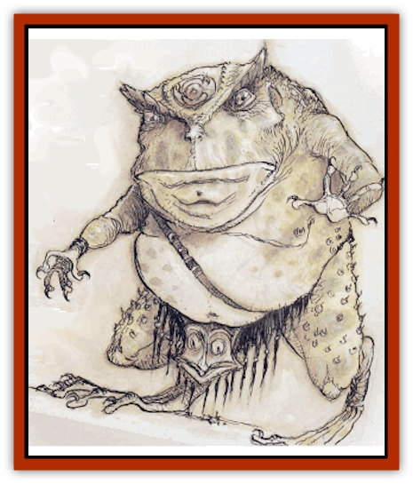
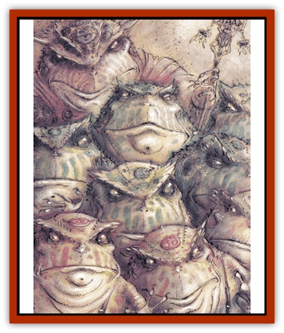

# Slaad

| Statistic | **Blue** | **Death** | **Gray** | **Green** | **Red** |
| --- | --- | --- | --- | --- | --- |
| **Activity Cycle:** | Any | Any | Any | Any | Any |
| **Alignment:** | Chaotic neutral | Chaotic neutral | Chaotic neutral | Chaotic neutral | Chaotic neutral |
| **Armor Class:** | 2 | -4 | -2 | 0 | 4 |
| **Climate/Terrain:** | Limbo | Limbo | Limbo | Limbo | Limbo |
| **Damage/Attack:** | 2d6 (&times;4)/2d8 | 3d6 (&times;2)/2d10 or sword +6 (Strength bonus) (&times;2) | 2d4+2 (&times;2)/2d8 or sword | 1d6+2 (&times;2)/2d8 | 1d4 (&times;2)/2d8 |
| **Diet:** | Carnivore | Carnivore | Carnivore | Carnivore | Carnivore |
| **Frequency:** | Rare | Very rare | Very rare | Very rare | Uncommon |
| **Hit Dice:** | 8+4 | 15+7 | 10+6 | 9+5 | 7+3 |
| **Intelligence:** | Low (5-7) | Genius (17-18) | High (13-14) | Average (8-10) | Low (5-7) |
| **Magic Resistance:** | 40% | 70% | 60% | 50% | 30% |
| **Morale:** | Steady (11-12) | Fanatic (17-18) | Champion (15-16) | Elite (13-14) | Average (8-10) |
| **Movement:** | 6 | 12 | 12 | 9 | 6 |
| **No. Appearing:** | 2-12 | 1-2 | 1-4 | 1-6 | 3-18 |
| **No. of Attacks:** | 5 | 3 or 2 | 3 or 1 | 3 | 3 |
| **Organization:** | Group | Group | Group | Group | Group |
| **Size:** | L (10' tall) | M (6' tall) | M (6' tall) | L (7'+ tall) | L (8' tall) |
| **Special Attacks:** | Disease | See below | Magical weapons | See below | Stun, egg-pellet |
| **Special Defenses:** | See below | +2 or better weapon to hit | See below | +1 or better weapon to hit | See below |
| **THAC0:** | 13 | 5 | 11 | 11 | 13 |
| **Treasure:** | K,Q | Z | R&times;2 | R | K,Q |
| **XP Value:** | 9,000 | 22,000 | 15,000 | 11,000 | 2,000 |

The slaadi are bipedal [[Frog|frog]]-like beings who dwell on the Outer Plane of Limbo. They scavenge battlefields of the Blood War, feeding on the dead and using the wounded as instruments in their reproductive cycle. Slaadi seek to change the established order on all planes to bring themselves power, but they lack the will to mobilize armies or become involved in the intrigues of other fiends. Therefore the powerful varieties of slaad pursue their own agendas, using less powerful types as their thugs and agents.

Slaad heads are huge and their claws extremely sharp. A symbol of power is embedded in the forehead. Nonmagical tattoos on a slaad's forehead signify past achievements (kills, conquests, duels) and current status. The more powerful slaadi have *polymorph self* abilities and can appear as humans or demihumans (see helow).

Slaadi speak their own language. Limited telepathy allows them to understand and converse with all things.

**Habitat/Society:** Slaadi observe an informal and pragmatic hierarchy, not because they respect regulation, but rather because strong rulers destroy disobedient underlings.

**Ecology:** Although the slaadi inhabit the Outer Planes and travel the Lower Planes, they do not ususally fight in the Blood War between [[Baatezu_General_Information|baatezu]] and [[Tanar'ri_General_Information|tanar'ri]]. (Some gray slaadi have traded intelligence to both sides in return for powerful magical items.) However, slaadi scavenge the battlefields of the fallen, feeding on carrion and removing wounded victims to their nightmarish temporary prison camps. After using the victims to gestate a new generation, the slaadi who organized the camp separate and move on, following rumors of new battles.

## Red Slaad

Red slaadi are vicious combatants that quickly attack other creatures. Ruthless in numbers, they surround, torment, and slaughter smaller groups. Red slaadi wear loincloths and have few forehead tattoos, denoting low status.

Both red and blue slaadi are surly brutes that despise one another, yet their complex reproductive cycle intertwines them as mutual progenitors.

**Combat:** Red slaadi attack with two claws (1d4 damage each) and bite (2d8 damage). They choose predictable, uninspired tactics, and are not terribly intelligent.

Once per day, red slaadi can stun by emitting a loud croak that affects all opponents within 20� (save vs. petrification or stunned for two rounds).

Red slaadi regenerate 2 hp per round. They can attempt to *gate* in 1-2 additional red slaadi twice per day with a 40% chance of success.

**Ecology:** Red slaadi have a gland under each claw that, when it hits an opponent, may (25% chance) imperceptibly inject an egg-pellet into the opponent's body. The slaad can also inject the pellet at will into an unconscious opponent. The egg-pellet slowly moves through the unwitting victim's body until it reaches the chest cavity. There the pellet gestates for three months, forming a baby blue slaad that, once formed, eats its way out of the victim's body, killing it. The victim falls extremely ill 24 hours before the baby slaad eats its way out.

The blue slaad, feeding on carrion, grows to self-sufficiency in a few years.

An egg-pellet can be detected by *detect evil*. Egg or baby slaad can be destroyed by *remove curse* or similar magic. To prevent this, the slaadi confine victims in temporary prison camps erected near the battlefield.

## Blue Slaad

Blue slaadi are ruthless warriors that specialize in mass combat. Two long, sharp bone rakes protrude from the back of each hand. They are more lithe and limber than red slaadi and have more elongated snouts. They share the reds vicious temper and bullying manner, and they too wear loincloths.

**Combat:** The blue slaad fighting style allows them two attacks with each of the razor-sharp bone rakes on each hand (2d6 damage per rake). Thus they have four rake attacks per round, as well as a bite (2d8 damage and 10% chance of infecting the opponent with a rotting disease (like a [[Mummy|mummy]]).

Blue slaadi have the following spell-like abilities, usable one at a time, one per round, at will: *hold person* (one person only), *passwall* and *telekinesis*. Twice a day they can attempt to *gate* in either 1-2 blue slaadi or 1 green slaad, with a 40% chance of success on each attempt.

**Ecology:** Blue slaadi can infect wounded and unconscious opponents with a disease similar to [[Lycanthrope_General_Information|lycanthropy]]. This infection transforms a humanoid victim, over three months' time, into a red slaad; non-humanoid victims die. The disease is undetectable in the first month except by *detect evil* or other magic, but its effects become obvious thereafter. *Cure disease* and other powerful healing magic cures and reverses the infection. To prevent this, slaadi maintain victims as prisoners in temporary camps, along with those infected by red slaadi egg-pellets.

The rivalry between blue and red slaadi is no less real for their interrelationship. Driven by instinctual urges, each type unwillingly spawns the rival color, but after the spawning, each slaad takes no more interest in its creation. Instead they nurture the rival variety's victims to successful "birth" of a new offspring.

## Green Slaad

Whether as a host for a reds egg-pellet or as a blue's disease victim, a powerful human or demihuman host (such as a high-level adventurer) sometimes spawns a baby green slaad instead of a red or blue. This is an auspicious occasion, and both red and blue slaadi nurture the young green carefully. At maturity (10-12 years), green slaadi have somewhat higher foreheads than reds or blues, typically with several tattoos. In their century-long careers they acquire many forehead tattoos.

Green slaadi are defensive about weaknesses and self-aggrandizing in triumph. Tremendous braggarts, they sometimes pause even during combat to gloat over opponents.

**Combat:** Green slaadi attack with two claws (1d6+2 damage) and bite (2d8 damage). They prefer to use their innate powers or gate in other slaadi for combat, but they fight viciously if pressed. A green slaad can polymorph at will into a duplicate of the human or demihuman host that spawned it.

Green slaadi as a group have demonstrated the following spell-like powers, usable one at a time, one per round, at will: *darkness, 15' radius*, *delayed blast fireball* (once per day), *detect invisibility*, *detect magic*, *ESP*, *fear*, *locate object*, *produce flame*, and *telekinesis*. No individual green slaad has shown all of these powers.

Twice a day, with a 50% chance of success, they can attempt to *gate* in 1-6 red slaadi, 1-4 blue slaadi, 1-2 green slaadi, or 1 gray slaad. Green slaadi are harmed only by +1 or better weapons.

## Gray Slaad

A green slaad that lives to advanced age (a century or so) sometimes withdraws into wilderness isolation. Most are never seen again, but after a year or more some slaadi return to their fellows as gray slaadi. Uninterested in lesser slaadi, grays become fascinated by power and magic, apparently seeking the near-immortality of the most powerful slaadi, the death slaadi (see below).

**Combat:** Gray slaadi attack with two claws (2d4+2 damage each) and bite (2d8 damage). They can shapechange into the form of the original host, in which they often wield a magical weapon (DM's choice). Gray slaadi are hit only by +1 or better weapons.

Gray slaadi as a group have demonstrated the following spell-like powers, usable one at a time, one per round, at will: *advanced illusion*, *darkness, 15' radius*, *fear*, *flame strike*, *infravision*, *invisibility*, *know alignment*, *lightning bolt*, *power word blind* (once per day), *symbol* (*pain*, once per day), and *wind walk*. No individual gray slaad has demonstrated all these powers. Twice a day gray slaadi can attempt to *gate* in 1-4 more grays with a 60% chance of success. Some can *enchant an item* given sufficient time and materials.

## Death Slaad

The greatest of their kind, these few powerful slaadi have achieved near-immortal longevity through evil ceremonies. Most of the half-dozen known death slaadi work to propagate their race, marshalling mobs of red and blue slaadi to invade small villages on the Lower Planes. They imprison the population as hosts and incubate a new generation of slaadi.

Death slaadi can communicate with all creatures through telepathy.

**Combat:** The death slaad attacks with two claws (3d6 damage and Constitution check or stunned for 1-6 rounds) and bite (2d10 damage). Like green and gray slaadi, a death slaad can shapechange into a duplicate of its original host, usually a powerful human. In this form it attacks twice per round, has at least 12 Charisma, and retains its great Strength (18/01, +3 damage adjustment). Only +2 or better weapons can harm a death slaad.

Collectively, death slaad have been observed to use the following spell-like powrrs, useable one at a time, one per round, at will: *advanced illusion*, *astral spell*, *cloudkill*, *darkness, 15' radius*, *detect magic*, *detect invisibility*, *ESP*, *fear*, *fireball* (once per day), *flame strike*, *invisibility*, *locate object*, *phantasmal killer* (once per day), *symbol* (any, once per day), *unholy word*, and *wind walk*. No individual death slaad has demonstrated all these powers.

Once per turn a death slaad can *gate* in 1-8 of any type of slaad except other death slaadi. This *gate* always succeeds. They can *enchant an item* if given time and equipment.

---
## Discovery & Documentation

**Source Publication:** Monstrous Manual (1995)
**Campaign Setting:** Advanced Dungeons & Dragons 2nd Edition
**Author(s):** Tim Beach

### Other Creatures Found in This Source Book
   * [[Aarakocra|Aarakocra]]
   * [[Aboleth|Aboleth]]
   * [[Ankheg|Ankheg]]
   * [[Arcane|Arcane]]
   * [[Argos|Argos]]
   * [[Aurumvorax|Aurumvorax]]
   * [[Baatezu_Lesser_Abishai|Baatezu, Lesser, Abishai]]
   * [[Baatezu_General_Information|Baatezu, General Information]]
   * [[Baatezu_Greater_Pit_Fiend|Baatezu, Greater, Pit Fiend]]
   * [[Banshee|Banshee]]
   * [[Basilisk|Basilisk]]
   * [[Bat|Bat]]
   * [[Bear|Bear]]
   * [[Beetle_Giant|Beetle, Giant]]
   * [[Behir|Behir]]
   * [[Beholder_and_Beholder-kin_I|Beholder and Beholder-kin I]]
   * [[Beholder_and_Beholder-kin_II|Beholder and Beholder-kin II]]
   * [[Bird|Bird]]
   * [[Brain_Mole|Brain Mole]]
   * [[Broken_One|Broken One]]
   * [[Brownie|Brownie]]
   * [[Bugbear|Bugbear]]
   * [[Bulette|Bulette]]
   * [[Bullywug|Bullywug]]
   * [[Carrion_Crawler|Carrion Crawler]]
   * [[Cat_Great|Cat, Great]]
   * [[Catoblepas|Catoblepas]]
   * [[Cat_Small|Cat, Small]]
   * [[Cave_Fisher|Cave Fisher]]
   * [[Centaur|Centaur]]
   * [[Centipede|Centipede]]
   * [[Chimera|Chimera]]
   * [[Cloaker|Cloaker]]
   * [[Cockatrice|Cockatrice]]
   * [[Couatl|Couatl]]
   * [[Crabman|Crabman]]
   * [[Crawling_Claw|Crawling Claw]]
   * [[Crocodile|Crocodile]]
   * [[Crustacean_Giant|Crustacean, Giant]]
   * [[Crypt_Thing|Crypt Thing]]
   * [[Death_Knight|Death Knight]]
   * [[Deepspawn|Deepspawn]]
   * [[Dinosaur_I|Dinosaur I]]
   * [[Displacer_Beast|Displacer Beast]]
   * [[Dog|Dog]]
   * [[Dog_Moon|Dog, Moon]]
   * [[Dolphin|Dolphin]]
   * [[Doppelganger|Doppelganger]]
   * [[Dracolich|Dracolich]]
   * [[Dragon_Brown|Dragon, Brown]]
   * [[Dragon_Chromatic_Black|Dragon, Chromatic, Black]]
   * [[Dragon_Chromatic_Blue|Dragon, Chromatic, Blue]]
   * [[Dragon_Chromatic_Green|Dragon, Chromatic, Green]]
   * [[Dragon_Cloud|Dragon, Cloud]]
   * [[Dragon_Chromatic_Red|Dragon, Chromatic, Red]]
   * [[Dragon_Chromatic_White|Dragon, Chromatic, White]]
   * [[Dragon_Deep|Dragon, Deep]]
   * [[Dragon_Gem_Amethyst|Dragon, Gem, Amethyst]]
   * [[Dragon_Gem_Crystal|Dragon, Gem, Crystal]]
   * [[Dragon_Gem_Emerald|Dragon, Gem, Emerald]]
   * [[Dragon_Gem_Sapphire|Dragon, Gem, Sapphire]]
   * [[Dragon_Gem_Topaz|Dragon, Gem, Topaz]]
   * [[Dragon_Metallic_Brass|Dragon, Metallic, Brass]]
   * [[Dragon_Metallic_Bronze|Dragon, Metallic, Bronze]]
   * [[Dragon_Metallic_Copper|Dragon, Metallic, Copper]]
   * [[Dragon_Mercury|Dragon, Mercury]]
   * [[Dragon_Metallic_Gold|Dragon, Metallic, Gold]]
   * [[Dragon_Mist|Dragon, Mist]]
   * [[Dragon_Metallic_Silver|Dragon, Metallic, Silver]]
   * [[Dragon_General_Information|Dragon, General Information]]
   * [[Dragon_Shadow|Dragon, Shadow]]
   * [[Dragon_Steel|Dragon, Steel]]
   * [[Dragon_Yellow|Dragon, Yellow]]
   * [[Dragonne|Dragonne]]
   * [[Dragon_Turtle|Dragon Turtle]]
   * [[Dragonet_Faerie_Dragon|Dragonet, Faerie Dragon]]
   * [[Dragonet_Fire_Drake|Dragonet, Fire Drake]]
   * [[Dragonet_Pseudodragon|Dragonet, Pseudodragon]]
   * [[Dryad|Dryad]]
   * [[Dwarf_Derro|Dwarf, Derro]]
   * [[Dwarf|Dwarf]]
   * [[Elemental_Athas_General_Information|Elemental (Athas), General Information]]
   * [[Elemental_Air_Kin|Elemental, Air Kin]]
   * [[Elemental_Earth_Kin|Elemental, Earth Kin]]
   * [[Elemental_Fire_Kin|Elemental, Fire Kin]]
   * [[Elemental_Water_Kin|Elemental, Water Kin]]
   * [[Elemental_of_Chaos_Air_Earth|Elemental of Chaos, Air/Earth]]
   * [[Elemental_of_Chaos_Fire_Water|Elemental of Chaos, Fire/Water]]
   * [[Elemental_Composite|Elemental, Composite]]
   * [[Elemental_Air_Earth|Elemental, Air/Earth]]
   * [[Elemental_Fire_Water|Elemental, Fire/Water]]
   * [[Elemental_General_Information|Elemental, General Information]]
   * [[Elephant|Elephant]]
   * [[Elf|Elf]]
   * [[Elf_Aquatic|Elf, Aquatic]]
   * [[Elf_Drow|Elf, Drow]]
   * [[Ettercap|Ettercap]]
   * [[Eyewing|Eyewing]]
   * [[Feyr|Feyr]]
   * [[Fish|Fish]]
   * [[Frog|Frog]]
   * [[Fungus|Fungus]]
   * [[Galeb_Duhr|Galeb Duhr]]
   * [[Gargantua|Gargantua]]
   * [[Gargoyle_I|Gargoyle I]]
   * [[Genie|Genie]]
   * [[Ghost|Ghost]]
   * [[Ghoul|Ghoul]]
   * [[Giant_Cloud|Giant, Cloud]]
   * [[Giant_Cyclops|Giant, Cyclops]]
   * [[Giant_Desert|Giant, Desert]]
   * [[Giant_Ettin|Giant, Ettin]]
   * [[Giant_Firbolg|Giant, Firbolg]]
   * [[Giant_Fire|Giant, Fire]]
   * [[Giant_Fog|Giant, Fog]]
   * [[Giant_Fomorian|Giant, Fomorian]]
   * [[Giant_Frost|Giant, Frost]]
   * [[Giant_Hill|Giant, Hill]]
   * [[Giant_Jungle|Giant, Jungle]]
   * [[Giant_Mountain|Giant, Mountain]]
   * [[Giant_Reef|Giant, Reef]]
   * [[Giant_Stone|Giant, Stone]]
   * [[Giant_Storm|Giant, Storm]]
   * [[Giant_Verbeeg|Giant, Verbeeg]]
   * [[Giant_Wood|Giant, Wood]]
   * [[Gibberling|Gibberling]]
   * [[Giff|Giff]]
   * [[Gith|Gith]]
   * [[Gith_Pirate_of|Gith, Pirate of]]
   * [[Githyanki|Githyanki]]
   * [[Githzerai|Githzerai]]
   * [[Gloomwing|Gloomwing]]
   * [[Gnoll|Gnoll]]
   * [[Gnome|Gnome]]
   * [[Gnome_Spriggan|Gnome, Spriggan]]
   * [[Goblin|Goblin]]
   * [[Golem_General_Information|Golem, General Information]]
   * [[Golem_I_Greater_Golem|Golem I (Greater Golem)]]
   * [[Golem_II_Lesser_Golem|Golem II (Lesser Golem)]]
   * [[Golem_III|Golem III]]
   * [[Golem_IV|Golem IV]]
   * [[Golem_V|Golem V]]
   * [[Golem_VI_Stone_Variants|Golem VI (Stone Variants)]]
   * [[Gorgon|Gorgon]]
   * [[Grell_Colonial|Grell, Colonial]]
   * [[Gremlin_Jermlaine|Gremlin, Jermlaine]]
   * [[Gremlin|Gremlin]]
   * [[Griffon|Griffon]]
   * [[Grimlock|Grimlock]]
   * [[Grippli|Grippli]]
   * [[Hag|Hag]]
   * [[Halfling|Halfling]]
   * [[Harpy|Harpy]]
   * [[Hatori|Hatori]]
   * [[Haunt|Haunt]]
   * [[Hell_Hound|Hell Hound]]
   * [[Heucuva|Heucuva]]
   * [[Hippocampus|Hippocampus]]
   * [[Hippogriff|Hippogriff]]
   * [[Hobgoblin|Hobgoblin]]
   * [[Homunculus|Homunculus]]
   * [[Hook_Horror|Hook Horror]]
   * [[Horse|Horse]]
   * [[Human|Human]]
   * [[Hydra|Hydra]]
   * [[Imp|Imp]]
   * [[Insect_Giant|Insect, Giant]]
   * [[Insect_Swarm|Insect Swarm]]
   * [[Intellect_Devourer|Intellect Devourer]]
   * [[Invisible_Stalker|Invisible Stalker]]
   * [[Ixitxachitl|Ixitxachitl]]
   * [[Jackalwere|Jackalwere]]
   * [[Kenku|Kenku]]
   * [[Ki-rin|Ki-rin]]
   * [[Kirre|Kirre]]
   * [[Kobold|Kobold]]
   * [[Kuo-Toa|Kuo-Toa]]
   * [[Lamia|Lamia]]
   * [[Lammasu|Lammasu]]
   * [[Leech|Leech]]
   * [[Leprechaun|Leprechaun]]
   * [[Leucrotta|Leucrotta]]
   * [[Lich|Lich]]
   * [[Living_Wall|Living Wall]]
   * [[Lizard|Lizard]]
   * [[Lizard_Man|Lizard Man]]
   * [[Locathah|Locathah]]
   * [[Lurker|Lurker]]
   * [[Lycanthrope_General_Information|Lycanthrope, General Information]]
   * [[Lycanthrope_Seawolf|Lycanthrope, Seawolf]]
   * [[Lycanthrope_Werebear|Lycanthrope, Werebear]]
   * [[Lycanthrope_Wereboar|Lycanthrope, Wereboar]]
   * [[Lycanthrope_Werebat|Lycanthrope, Werebat]]
   * [[Lycanthrope_Werefox|Lycanthrope, Werefox]]
   * [[Lycanthrope_Wererat|Lycanthrope, Wererat]]
   * [[Lycanthrope_Wereraven|Lycanthrope, Wereraven]]
   * [[Lycanthrope_Weretiger|Lycanthrope, Weretiger]]
   * [[Lycanthrope_Werewolf|Lycanthrope, Werewolf]]
   * [[Mammal|Mammal]]
   * [[Mammal_Giant|Mammal, Giant]]
   * [[Mammal_Herd_I|Mammal, Herd I]]
   * [[Mammal_Small|Mammal, Small]]
   * [[Manscorpion|Manscorpion]]
   * [[Manticore|Manticore]]
   * [[Medusa_Maedar|Medusa, Maedar]]
   * [[Medusa|Medusa]]
   * [[Mephit_General_Information|Mephit, General Information]]
   * [[Merman|Merman]]
   * [[Mimic|Mimic]]
   * [[Mind_Flayer|Mind Flayer]]
   * [[Minotaur|Minotaur]]
   * [[Mist_Crimson_Death|Mist, Crimson Death]]
   * [[Mist_Vampiric|Mist, Vampiric]]
   * [[Mold_I|Mold I]]
   * [[Moldman|Moldman]]
   * [[Mongrelman|Mongrelman]]
   * [[Morkoth|Morkoth]]
   * [[Muckdweller|Muckdweller]]
   * [[Mudman|Mudman]]
   * [[Mummy_Greater|Mummy, Greater]]
   * [[Mummy|Mummy]]
   * [[Myconid|Myconid]]
   * [[Naga|Naga]]
   * [[Naga_Dark|Naga, Dark]]
   * [[Neogi|Neogi]]
   * [[Nightmare|Nightmare]]
   * [[Nymph|Nymph]]
   * [[Octopus_Giant|Octopus, Giant]]
   * [[Ogre|Ogre]]
   * [[Ogre_Half-|Ogre, Half-]]
   * [[Ooze_Slime_Jelly_I|Ooze/Slime/Jelly I]]
   * [[Ooze_Slime_Jelly_II|Ooze/Slime/Jelly II]]
   * [[Ooze_Slime_Jelly_Slithering_Tracker|Ooze/Slime/Jelly, Slithering Tracker]]
   * [[Orc|Orc]]
   * [[Otyugh|Otyugh]]
   * [[Owlbear_I|Owlbear I]]
   * [[Pegasus|Pegasus]]
   * [[Peryton|Peryton]]
   * [[Phantom|Phantom]]
   * [[Phoenix|Phoenix]]
   * [[Piercer|Piercer]]
   * [[Plant_Dangerous_I|Plant, Dangerous I]]
   * [[Plant_Intelligent|Plant, Intelligent]]
   * [[Poltergeist|Poltergeist]]
   * [[Pudding_Deadly|Pudding, Deadly]]
   * [[Quaggoth|Quaggoth]]
   * [[Rakshasa|Rakshasa]]
   * [[Rat|Rat]]
   * [[Rat_Osquip|Rat, Osquip]]
   * [[Remorhaz|Remorhaz]]
   * [[Revenant|Revenant]]
   * [[Roc|Roc]]
   * [[Roper|Roper]]
   * [[Rust_Monster|Rust Monster]]
   * [[Sahuagin|Sahuagin]]
   * [[Satyr|Satyr]]
   * [[Scorpion|Scorpion]]
   * [[Sea_Lion|Sea Lion]]
   * [[Selkie|Selkie]]
   * [[Shadow|Shadow]]
   * [[Shedu|Shedu]]
   * [[Sirine|Sirine]]
   * [[Skeleton|Skeleton]]
   * [[Skeleton_Giant|Skeleton, Giant]]
   * [[Skeleton_Warrior|Skeleton, Warrior]]
   * [[Slug_Giant|Slug, Giant]]
   * [[Snake|Snake]]
   * [[Snake_Winged|Snake, Winged]]
   * [[Spectre|Spectre]]
   * [[Sphinx|Sphinx]]
   * [[Spider|Spider]]
   * [[Sprite|Sprite]]
   * [[Squid_Giant|Squid, Giant]]
   * [[Stirge|Stirge]]
   * [[Su-Monster|Su-Monster]]
   * [[Swanmay|Swanmay]]
   * [[Tabaxi|Tabaxi]]
   * [[Tako|Tako]]
   * [[Tanar'ri_True_Balor|Tanar'ri, True, Balor]]
   * [[Tanar'ri_True_Marilith|Tanar'ri, True, Marilith]]
   * [[Tarrasque|Tarrasque]]
   * [[Tasloi|Tasloi]]
   * [[Thought_Eater|Thought Eater]]
   * [[Thri-kreen|Thri-kreen]]
   * [[Titan|Titan]]
   * [[Toad_Giant|Toad, Giant]]
   * [[Treant|Treant]]
   * [[Triton|Triton]]
   * [[Troglodyte|Troglodyte]]
   * [[Troll|Troll]]
   * [[Umber_Hulk|Umber Hulk]]
   * [[Unicorn|Unicorn]]
   * [[Urchin|Urchin]]
   * [[Vampire|Vampire]]
   * [[Wemic|Wemic]]
   * [[Whale|Whale]]
   * [[Wight|Wight]]
   * [[Will_O'Wisp|Will O'Wisp]]
   * [[Wolf|Wolf]]
   * [[Wolfwere|Wolfwere]]
   * [[Worm|Worm]]
   * [[Wraith|Wraith]]
   * [[Wyvern|Wyvern]]
   * [[Xorn|Xorn]]
   * [[Yeti|Yeti]]
   * [[Yuan-ti_Histachii|Yuan-ti, Histachii]]
   * [[Yuan-ti|Yuan-ti]]
   * [[Yugoloth_Guardian|Yugoloth, Guardian]]
   * [[Zaratan|Zaratan]]
   * [[Zombie|Zombie]]
