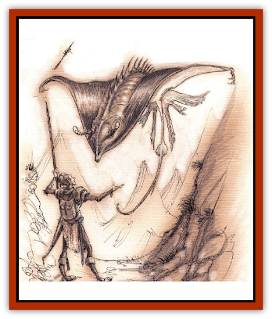

# Slasrath

| Statistic | **Slasrath** |
| --- | --- |
| **Activity Cycle:** | Any |
| **Alignment:** | Neutral |
| **Armor Class:** | 3 |
| **Climate/Terrain:** | Gehenna |
| **Damage/Attack:** | 1d6/2d4 or 3d6 |
| **Diet:** | Carnivore |
| **Frequency:** | Rare |
| **Hit Dice:** | 5-8 |
| **Intelligence:** | Animal (1) |
| **Magic Resistance:** | Nil |
| **Morale:** | Steady (11-12) |
| **Movement:** | 3, Fl 18 (B) |
| **No. Appearing:** | 1 |
| **No. of Attacks:** | 2 or 1 |
| **Organization:** | Solitary |
| **Size:** | L (10-20' wingspan) |
| **Special Attacks:** | Wing slash, poisonous stinger |
| **Special Defenses:** | Nil |
| **THAC0:** | 5-6 HD: 15 / 7-8 HD: 13 |
| **Treasure:** | Nil |
| **XP Value:** | 5 HD: 1,400 / 6 HD: 2,000 / 7 HD: 3,000 / 8 HD: 4,000 |

"The gaze of an [[Yugoloth_Greater_Ultroloth|ultroloth]] is not one you want to meet twice. As the creature turned his head toward me, I lowered my eyes. I heard his voice in my head, like always, and I cringed.

"His words penetrated my brain. �What have you made for me?' It felt like a razor cuttig soft flesh.

"�As you required, eminent one, I have fashioned a creature upon which our troops can ride. A flying beast.'

"�A most worthy labor.' I was sure that my brain would begin to bleed from my ears. �What manner of beast?'

"�I call it a slasrath, master, and it glides through the air like the [[Ray|manty ray]] - the one we saw in the memories of that prime's brain that you flayed but last year. It can carry even a [[Yugoloth_Greater_Nycaloth|nycaloth]] without slowing its pace, for it plies the air using sorcery.' I tried to come up with more to say, so that his cutting thoughts wouldn't slice into my brain again.

"�Excellent. Produce a thousand of them and send them to the mustering grounds at Heartscraoed Tower.'

"�It shall be done, my wise and all-powerful lord,' I said, and then paused, knowing that I would have to tell him the whole truth. Perhaps his pleasure at my success would temper his wrath. �Ther is one other thing, august overlord�'

"�What?' Nailes driven through my eyes and into my mind would have felt better.

"�A few of my slasrath� well they� escaped. M'lord.' His gaze told me I would not be leaving his chambers alive, or at least intact."

- Jehanu the Flayed, ex-yugoloth slave

Slasraths were simply horrible, slimy [[Worm|worms]] native to Gehenna until an enslaved sorcerer got hold of them and transformed them into the flying horrors that they are today. Long and wide, the saucerlike things are extremely flat. Razortipped wings flutter to keep them aloft, becoming rigid when the creature plunges in to attack its foes with slicing, slashing dives. They were meant to be subservient creatures under the [[Yugoloth_General_Information|yugoloths]], which many still are, but a number of the beasts roam freely throughout Gehenna, adding to the danger and terror so frequently found in that hideous realm.

Most slasraths are black, but gray and green varieties are not uncommon. A small but dangerous mouth is located an the creature's underside, and a long, whiplike tail flutters behind it, wielding a nasty barb.

**Combat:** The slasrath moves in the air gracefully with a great deal of maneuverability (on the ground, it slinks along in the manner of a worm, very slowly). When it attacks its prey, it begins by swooping down from above, using the razorsharp edges on its wings. This attack inflicts 3d6 points of damage. If two or even three man-sized (or smaller) targets are within 5 feet of each other, they can all be attacked by this wing slash assault. The attack must be resolved separately for each target, with different attack and damage rolls.

Further, the slasrath's wings are so sharp and powerful that they can slice throgh armor and shields. If a target wears armor or uses a shield to protect itself and the slasrath's attack roll indicates that the creature's attack would have hit the target without the protective device, a saving throw for the item should be made versus hard blow. If failed, the item is destroyed and the attack upon the target is resolved without the armor's protection (thus, it hits the target).

After the wing slash attack, the slasrath hovers above its chosen prey and continues the fight by biting with its mouth (filled with hundreds of needlelike teeth, causing 1d6 points of damage per bite) and striking with its barbed tail for 2d4 points of damage. The stinger at the end of this appendage carries a virulent poison. If the victim fails a saving throw versus poison, the venom causes extreme disorientation and confusion. On the round after injection, the victim faces a penalty of -1 on attack and damage rolls, ability checks, and saving throws. The next round, the penalty increases to -2. and to -3 on the third round. This escalating debilitation continues for six rounds, after which the victim dies. *Slow poison* and *neutralize poison* are effective as usual.

Yugoloths sometimes ride slasraths into battle, either as a wave of flying cavalry or with a single slasrath carrying a leader above its troops. In these situations, a slasrath can be assumed to be completely under the control of its rider, tamed by magic and discipline. With the thin body of the slasrath, it appears that the yugoloth is riding an oddly shaped flying carpet. Often, a special harness enables the rider to stay atop the mount and guide it. A slasrath can still make its normal attacks, even the wing slash, while carrying a rider. It can also hover with a steady grace, enabling a rider to cast spells or perform other delicate actions.

**Habitat/Society:** Slasraths are creatures altered by magic to become something they were never meant to be. THough their bodies are huge and powerful, their brains are still the dim minds of worms. They seek little else besides meaty prey.

The only exception to this seems to be when a xugoloth masters one of the beasts to become a mount. Magical charms as well as outright domination are frequently used to control the slasraths, although conditioning through pain and discipline always reinforces the magic. Yugoloth masters use metal whips and spiky spurs to maintain their authority. While not in use, slasraths are kept in pens resembling huge black domes. They are fed prisoners, wounded members of their own species, and lesser yugoloths that havve displeased their masters.

On their own, slasraths scout the furnaces of Gehenna in search of food. They land only to rest briefly on the superheated rock of the plane. Slasraths keep no permanent lairs. Though they have no special resistance to elemental attacks, they are not harmed by the conditions of their native plane.

**Ecology:** Slasraths begin their lives (hatched from a large egg) with 5 HD and a 10-foot wingspan. At 6 HD, they are 15 feet across, at 7 HD they are 18 feet in width, and at 8 HD they usually have a wingspan of over 20 feet. Yugoloths do not use them as mounts until the slasraths measure at least 15 feet in width.

Wild slasraths feed on everything they can find, including [[Linqua|linquas]], [[Barghest|barghest]], [[Nightmare|nightmares]], and even yugoloths.

---
## Discovery & Documentation

**Source Publication:** Planes of Conflict (1995)
**Campaign Setting:** Planescape
**Author(s):** Colin Mccomb, Dale Donovan

### Other Creatures Found in This Source Book
   * [[Aeserpent|Aeserpent]]
   * [[Asuras|Asuras]]
   * [[Buraq|Buraq]]
   * [[Delphon|Delphon]]
   * [[Diakk|Diakk]]
   * [[Ethyk|Ethyk]]
   * [[Gautiere|Gautiere]]
   * [[Linqua|Linqua]]
   * [[Ni'iath|Ni'iath]]
   * [[Phiuhl|Phiuhl]]
   * [[Quesar|Quesar]]
   * [[Warden_Beast|Warden Beast]]
   * [[Yugoloth_Greater_Baernaloth|Yugoloth, Greater, Baernaloth]]
