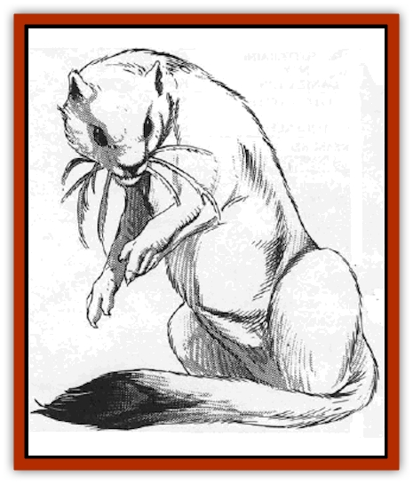

# Sleek

| Statistic | **Sleek** |
| --- | --- |
| **Activity Cycle:** | Night |
| **Alignment:** | Chaotic neutral |
| **Armor Class:** | 3 |
| **Climate/Terrain:** | Temperate |
| **Damage/Attack:** | 1d4/1d4/2d6 |
| **Diet:** | Omnivore |
| **Frequency:** | Uncommon |
| **Hit Dice:** | 2+1 |
| **Intelligence:** | Low (5-7) |
| **Magic Resistance:** | Nil |
| **Morale:** | Steady (12) |
| **Movement:** | 36 |
| **No. Appearing:** | 1-10 |
| **No. of Attacks:** | 3 |
| **Organization:** | Solitary/tribal |
| **Size:** | T (1-3') |
| **Special Attacks:** | Sever vein on 19-20 |
| **Special Defenses:** | Nil |
| **THAC0:** | 19 |
| **Treasure:** | Nil |
| **XP Value:** | 65 |

Sleeks are ermine-like mammals with bright, black eyes. Antennae on their muzzles aid them in gauging both the size and distance of their prey. Though independent, they occasionally seek human and demihuman companionship.

**Combat:** The sleek's speed and silent motion make it all but invisible (sunrise on 1-5 on 1d6). In combat against man-sized or larger adversaries, the sleek uses its antennae to sense vital areas in an opponent, then attacks with its claws and razor sharp teeth. The sleek's claws do 1d4 points of damage. Man-sized or larger targets suffer 2d6 points of damage.

A roll of 20 indicates that the sleek has opened a major blood vessel, causing a halfling-sized or larger victim to lose 1d6 hp per minute through bleeding. First aid, such as a tourniquet or direct pressure, stops this hp loss, as does healing magic. Smaller targets must save vs. death. Failure means the victim dies immediately, its spinal cord severed.

Their fast metabolism, coupled with an extremely powerful and efficient digestive tract, renders sleeks immune to poison. This also lets them consume poisonous or exotic flesh - even [[Golem_II_Lesser_Golem|flesh golems]] are not safe!

Sleeks sometimes act in concert against large prey. This ability to cooperate, combined with their berserker-like battle frenzy (+4 to hit), makes them formidable enemies to shipboard "pests".

**Habitat/Society:** Sleeks inhabit cargo holds and small ship passageways. If coaxed with food they can be domesticated (30% chance).

Their large, bright eyes, silvery-white fur, and sensitive antennae mark them as onetime cave dwellers, but their adaptations pose no handicap to them in the light. Sleeks mate for life, producing litters of 1d4 young once a year. A family of sleeks may occupy a "territory", but conflict between sleek territories is rare.

In lean times sleeks also exact "tribute" from ship crews. lnstead of helping themselves to foodstuffs, they play tricks, steal clothes and precious items, and generally make nuisances of themselves until the crew formally offers food. Simply leaving food for them is not good enough; the "insulted" sleeks demand a show of submission. For instance, the captain must roll on his or her back in full view of the sleeks. Only then is the sleeks' honor satisfied. This behavior earns them the name "pirate-masters".

**Ecology:** Sleeks live about 20 years. Young stay with their parents for two years, whereupon they leave to establish territories of their own. Those individuals who adopt humans remain with them for life as staunch allies.

---
## Discovery & Documentation

**Source Publication:** MC9 Spelljammer Appendix II (1991)
**Campaign Setting:** Planescape
**Author(s):** Scott Davis, Newton Ewell, John Terra

### Other Creatures Found in This Source Book
   * [[Alchemy_Plant|Alchemy Plant]]
   * [[Allura|Allura]]
   * [[Aperusa|Aperusa]]
   * [[Autognome|Autognome]]
   * [[Bionoid|Bionoid]]
   * [[Bloodsac|Bloodsac]]
   * [[Buzzjewel|Buzzjewel]]
   * [[Constellate|Constellate]]
   * [[Contemplator|Contemplator]]
   * [[Dohwar|Dohwar]]
   * [[Dragon_Moon|Dragon, Moon]]
   * [[Dragon_Stellar|Dragon, Stellar]]
   * [[Dragon_Sun|Dragon, Sun]]
   * [[Dreamslayer|Dreamslayer]]
   * [[Dweomerborn|Dweomerborn]]
   * [[Fal|Fal]]
   * [[Feesu|Feesu]]
   * [[Fire_Bat|Fire Bat]]
   * [[Firebird|Firebird]]
   * [[Firelich|Firelich]]
   * [[Flowfiend|Flowfiend]]
   * [[Gadabout|Gadabout]]
   * [[Gammaroid|Gammaroid]]
   * [[Gonn|Gonn]]
   * [[Gossamer|Gossamer]]
   * [[Grav|Grav]]
   * [[Great_Dreamer|Great Dreamer]]
   * [[Greatswan|Greatswan]]
   * [[Grell_Colonial|Grell, Colonial]]
   * [[Gullion|Gullion]]
   * [[Insectare|Insectare]]
   * [[Lhee|Lhee]]
   * [[Mercurial_Slime|Mercurial Slime]]
   * [[Meteorspawn|Meteorspawn]]
   * [[Monitor|Monitor]]
   * [[Owl_Space|Owl, Space]]
   * [[Pristatic|Pristatic]]
   * [[Scro|Scro]]
   * [[Selkie_Star|Selkie, Star]]
   * [[Silatic|Silatic]]
   * [[Skullbird|Skullbird]]
   * [[Sluk|Sluk]]
   * [[Space_Swine|Space Swine]]
   * [[Sphinx_Astro-|Sphinx, Astro-]]
   * [[Spirit_Warrior|Spirit Warrior]]
   * [[Starfly_Plant|Starfly Plant]]
   * [[Stargazer|Stargazer]]
   * [[Undead_Stellar|Undead, Stellar]]
   * [[Witchlight_Marauder|Witchlight Marauder]]
   * [[Xixchil|Xixchil]]
   * [[Yitsan|Yitsan]]
   * [[Zurchin|Zurchin]]
