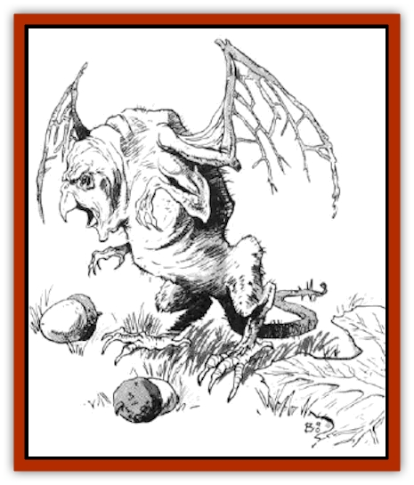

# Slinker

| Statistic | **Slinker** |
| --- | --- |
| **Activity Cycle:** | Any |
| **Alignment:** | Neutral |
| **Armor Class:** | 7 |
| **Climate/Terrain:** | Any |
| **Damage/Attack:** | 1 |
| **Diet:** | Omnivore |
| **Frequency:** | Common |
| **Hit Dice:** | ½ |
| **Intelligence:** | Animal (1) |
| **Magic Resistance:** | Nil |
| **Morale:** | Unreliable (2-4) |
| **Movement:** | 15 |
| **No. Appearing:** | 1-20 |
| **No. of Attacks:** | 1 |
| **Organization:** | Pack |
| **Size:** | T (8&rdquo; long) |
| **Special Attacks:** | Nil |
| **Special Defenses:** | Nil |
| **THAC0:** | 20 |
| **Treasure:** | Nil |
| **XP Value:** | 7 |

Slinkers are small, vaguely [[Bird|bird]]-like creatures. They stand approximately eight inches high on two hind legs. Their forelegs are short and usually held close to the body when the slinkers move, but these are also used to hold bits of food and handle small items. The slinkers' heads form out of the fronts of their bodies without the nicety of any appreciable necks. They have two closely set eyes on either side of their small beaks.

Their bodies are sparely covered with thin, stiff hair that ranges from light red to brown to gray to jet black. Some slinkers also appear to be white with red, brown, and black spots. Some naturalists believe these were once domesticated slinkers that have returned to a wild state, though what purpose they served domestically is unknown. A short, hairless tail (approximately three inches long) trails behind each slinker.

**Combat:** Slinkers are nearly helpless in any sort of fight with a human-sized creature. Thus they almost always flee upon catching sight of a human or demihuman. They do not attack large creatures unless there is nowhere to run.

If backed into a corner and forced to fight, slinkers charge as one and try to swarm over their antagonizer. Individually, slinker bites are painful but not very dangerous. When attacking as a group, however, they can cause serious injuries to rash characters. When slinkers attack, every slinker in the pack attacks the same target and keeps attacking that target until either it or the slinkers are dead.

If a group of PCs corners a pack of slinkers and the slinkers fight, they charge the closest character, clambering over him and burrowing under clothing and armor. The character being attacked must roll a successful Dexterity check to avoid being knocked down by the rush. Furthermore, if the number of attacking slinkers is higher than the character's Dexterity score, add the difference as a penalty to the Dexterity check die roll. (If, for example, 18 slinkers rush a character with Dexterity 12, the character must add 6 to his Dexterity check die roll.) Once this initial check is made, regardless of its outcome, the character doesn't have to roll another Dexterity check again unless another pack of slinkers attacks him. If the character is knocked down, usual attack modifiers for a prone target apply (+4 bonus for the slinkers' attack rolls).

**Habitat/Society:** Slinkers live in packs of up to 800 individuals. Presumably, the strongest or meanest slinker holds sway over the others, though what sort of authority it exercises is open to debate. These packs are rarely seen assembled in one place. In most cases, no more than 20 slinkers are ever encountered at once.

Slinkers are primarily scavengers, and so they prefer to live in areas where food and refuse is plentiful and there are lots of places to hide. They are quite common in cities, especially in the slums and warehouse districts of asteroid citadels (like those usually found around dockyards).

**Ecology:** In most respects, slinkers compete with [[Rat|rats]] and other vermin for their ecological niche. The most significant differences between them are that slinkers do not typically carry disease, and slinkers have unusually fast metabolisms, high respiratory rates, and short reproductive cycles.

If slinkers get aboard a spelljamming vessel, they begin reproducing themselves at an alarming rate. Every week, the slinker population aboard ship increases by 10 percent. This can become a serious problem if the slinkers are not controlled, because they eat a lot of food and breathe a lot of air. In one day, five slinkers eat as much food and breathe as much air as a human crew member. As their population increases, so does the rate at which they consume the ship's food supply and foul its air.

To use slinkers to their maximum effect, DMs are recommended to use Method 2 for keeping track of air quality aboard the PCs' vessel (as described on page 12 of the *Concordance of Arcane Space* [TSR 1049]). This is particularly effective if players are allowed to keep track of their own air and food supply while the DM keeps his own, secret record that accounts for the slinkers' presence.

---
## Discovery & Documentation

**Source Publication:** MC7 Spelljammer Appendix I (1990)
**Campaign Setting:** Advanced Dungeons & Dragons 2nd Edition
**Author(s):** various

### Other Creatures Found in This Source Book
   * [[Aartuk|Aartuk]]
   * [[Albari|Albari]]
   * [[Ancient_Mariner|Ancient Mariner]]
   * [[Argos|Argos]]
   * [[Beholder_Abomination_Astereater|Beholder (Abomination), Astereater]]
   * [[Blazozoid|Blazozoid]]
   * [[Chattur|Chattur]]
   * [[Chevall|Chevall]]
   * [[Clockwork_Horror|Clockwork Horror]]
   * [[Colossus|Colossus]]
   * [[Delphinid|Delphinid]]
   * [[Dizantar|Dizantar]]
   * [[Dog|Dog]]
   * [[Dog_Bog_Hound|Dog, Bog Hound]]
   * [[Esthetic|Esthetic]]
   * [[Focoid|Focoid]]
   * [[Fractine|Fractine]]
   * [[Giant_Spacesea|Giant, Spacesea]]
   * [[Golem_Furnace|Golem, Furnace]]
   * [[Golem_Radiant|Golem, Radiant]]
   * [[Gravislayer|Gravislayer]]
   * [[Grommam|Grommam]]
   * [[Hadozee|Hadozee]]
   * [[Hamster_Giant_Space|Hamster, Giant Space]]
   * [[Jammer_Leech|Jammer Leech]]
   * [[Lakshu|Lakshu]]
   * [[Lumineaux|Lumineaux]]
   * [[Lutum|Lutum]]
   * [[Mimic_Space|Mimic, Space]]
   * [[Misi|Misi]]
   * [[Moon_Rogue|Moon, Rogue]]
   * [[Mortiss|Mortiss]]
   * [[Murderoid|Murderoid]]
   * [[Nay-Churr|Nay-Churr]]
   * [[Phlog-Crawler|Phlog-Crawler]]
   * [[Plasman|Plasman]]
   * [[Plasmoid_DeGleash|Plasmoid, DeGleash]]
   * [[Plasmoid_DelNoric|Plasmoid, DelNoric]]
   * [[Plasmoid_General_Information|Plasmoid, General Information]]
   * [[Plasmoid_Ontalak|Plasmoid, Ontalak]]
   * [[Puffer|Puffer]]
   * [[Q'nidar|Q'nidar]]
   * [[Rastipede|Rastipede]]
   * [[Reigar|Reigar]]
   * [[Rock_Hopper|Rock Hopper]]
   * [[Spider_Asteroid|Spider, Asteroid]]
   * [[Spiritjam|Spiritjam]]
   * [[Survivor|Survivor]]
   * [[Syllix|Syllix]]
   * [[Symbiont_Power|Symbiont, Power]]
   * [[Vine_Infinity|Vine, Infinity]]
   * [[Wiggle|Wiggle]]
   * [[Wizshade|Wizshade]]
   * [[Wryback|Wryback]]
   * [[Zard|Zard]]
   * [[Zodar|Zodar]]
