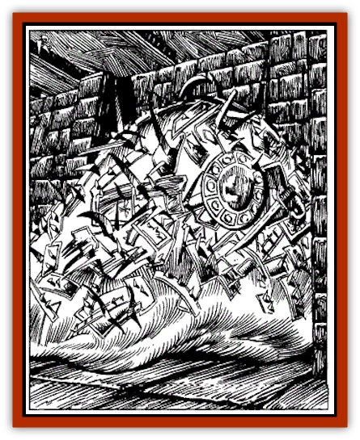

# Slithering Hoard

| Statistic | **Slithering Hoard** |
| --- | --- |
| **Activity Cycle:** | Any |
| **Alignment:** | Neutral evil |
| **Armor Class:** | 4 |
| **Climate/Terrain:** | Any |
| **Damage/Attack:** | 2d8/2d8 |
| **Diet:** | Omnivorous scavenger |
| **Frequency:** | Very rare |
| **Hit Dice:** | 5 |
| **Intelligence:** | Low (5-7) |
| **Magic Resistance:** | Nil |
| **Morale:** | Steady (11) |
| **Movement:** | 9, Sw 6 (flaps like <a href="ixitxach.html">ixitxachitl</a>, <a href="ray.html">ray</a>) |
| **No. Appearing:** | 1 |
| **No. of Attacks:** | 2 |
| **Organization:** | Solitary |
| **Size:** | L (20' diameter sphere) |
| **Special Attacks:** | Suffocation |
| **Special Defenses:** | Immune to electrical, paralyzation, and fear, hold, polymorph, and sleep-based attacks |
| **THAC0:** | 17 |
| **Treasure:** | B,S,Z |
| **XP Value:** | 1,400 |

Slithering hoards are modified cousins of the [[Ooze_Slime_Jelly_II|gelatinous cube]] that appear as amorphous blobs about twenty feet in diameter with bits of metal (often treasure) coating them. They exude a gluey substance that they use to adhere coins, gems, small weapons, and pieces of armor as an outer layer. This outer coating of detritus functions both as a set of teeth and also as a protective coating of armor. The slithering hoard flows toward its victims and wraps itself around them, grinding them with their metallic "teeth", while at the same time suffocating them.

**Combat:** The slithering hoard has the general consistency of a squishy gel, and it attacks by warping its generally spherical shape into one or two pseudopods that lash out and envelop its prey. Each of these attacks inflict 2d8 points of damage, and a victim so attacked must roll a successful saving throw vs. paralyzation or become enveloped within the slithering hoard's mass. The creature can either make two attacks against a single victim (forcing two separate saving throws) or one each against two different opponents. Victims trapped inside the slithering hoard automatically suffer 1d6 points of digestive damage and are in danger of suffocating.

Electricity, *fear*, *hold*, paralyzation, polymorph, and sleep-based attacks have no effect on slithering hoards, but fire and blows from weapons have normal effects. If a slithering hoard fails its saving throw against a cold-based attack, it is slowed to 50% its normal movement and only inflicts 1d4 points of damage per attack.

**Habitat/Society:** What little intelligence the slithering hoard possesses guides it to find loose treasure that it can use as its teeth and armor. Beyond that, it has a voracious appetite for organic material. It displays a crude bit of cunning, almost instinctual, in its hunting habits. It has learned to adapt to its surroundings and take advantage of its natural camouflage to lure prey to it. In dungeons, it can compress itself into a pile shape, using its protective treasure coating to appear as a large pile of coins, gems, potions, etc. Underwater, it is even harder to spot, and it can bury itself among silt or other debris and appear as loose treasure undulating in the current. If a slithering hoard spends sufficient time underwater, it learns to move with a crude swimming motion, extruding fins of a sort from its mass to propel itself.

**Ecology:** The slithering hoard was created by the Red Wizards of Thay, who adapted gelatinous cubes for the unique and insidious task of paying retribution to their enemies. The hoard was hidden in weak ceramic jars and then secreted among tributes and ransoms sent to various states and rich persons, where, once it was deposited among a true treasure hoard, would dissolve its container and adapt the treasure around it, becoming a nasty surprise for the recipients.

---
## Discovery & Documentation

**Source Publication:** The Wyrmskull Throne (1994)
**Campaign Setting:** Forgotten Realms
**Author(s):** Steven E. Schend, thomas M. Reid

### Other Creatures Found in This Source Book
   * [[Feeblestar|Feeblestar]]
   * [[Quelzarn|Quelzarn]]
   * [[Shalarin|Shalarin]]
