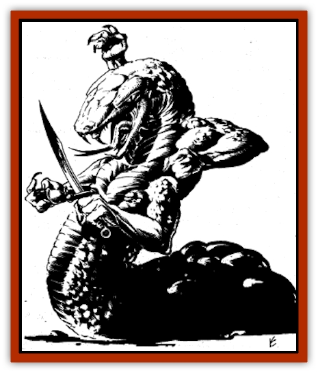

# Slithermorph

| Statistic | **Slithermorph** |
| --- | --- |
| **Activity Cycle:** | Any |
| **Alignment:** | Neutral evil |
| **Armor Class:** | 6 |
| **Climate/Terrain:** | Any land or water |
| **Damage/Attack:** | 1-6 constriction + special (3-12 &times;4 + special) |
| **Diet:** | Carnivorous, scavenger |
| **Frequency:** | Rare |
| **Hit Dice:** | 7+7 |
| **Intelligence:** | Low (5-7) |
| **Magic Resistance:** | Nil |
| **Morale:** | Elite (14) |
| **Movement:** | 9, Sw 12 (12, Sw 9) |
| **No. Appearing:** | 1 |
| **No. of Attacks:** | 2 (5) |
| **Organization:** | Solitary |
| **Size:** | L (amorphous, generally 10' in length; or 12' long serpentine body) |
| **Special Attacks:** | Acid discharge |
| **Special Defenses:** | Shapechange |
| **THAC0:** | 13 |
| **Treasure:** | J,K,L,M,Q (any glass, gemstone, or metal items) |
| **XP Value:** | 3,000 |

A slithermorph is an amphibious predator and carrion-eater. Most of the time, it resembles a [[Pudding_Deadly|black pudding]], creeping about in a glistening black, amorphous form. At will, it can shapechange to and from another form: a serpentine, four-armed monster resembling a [[Yuan-ti|yuan-ti]]. Statistics for this "fighting form" appear in parentheses above.

**Combat:** Both forms of the slithermorph have 90' infravision and immunities to acid, fire, cold, and poison attacks. Lightning and magic affect slithermorphs in either form. In "pudding" form, a slithermorph can ooze through cracks an inch or more wide and travel along walls and ceilings at normal movement rate, often dropping onto intended prey from above. It envelops victims, constricting for 1d6 damage per round.

It can also discharge acid at will four times a day from chosen body areas, usually the surface wrapped around prey. An acid discharge does 3d4 hit points of damage (half damage if a save vs. petrification succeeds), and forces item saving throws. Underwater, an acid discharge does 2d4 damage. Discharges can be made in either form. Slithermorph acid eats away a one-inch thickness of wood in a round, and readily dissolves metal. Chain mail dissolves in two rounds. Plate mail, shields, helms, and other solid metal items dissolve in four rounds. Weapon enchantments (sword +1, etc.) allow magical metal to resist dissolution for one round per plus: thus, a shield +4 lasts for 8 rounds.

All metal items are allowed a save to avoid all dissolution effects: from a base of 13, they receive a bonus of +1 per "plus" of enchantment, and +1 if the metal has pure adamantite, mithril, silver, or alloys of these metals (electrum and others at the DM's option).

When threatened, a slithermorph often changes form. This limited *shapechange* takes one round, during which the slithermorph can't launch any attacks. A slithermorph can change form back and forth as often as desired. Either form is at home both on land and underwater. During one form-shift per day, 25% of its accumulated damage is healed. Slithermorphs also regenerate damage at the rate of 3 hit points per day.

In serpentine form, a Slithermorph appears as a thick-bodied, scaled [[Snake|snake]]. Four muscular arms protrude near its head. They claw for 3-12 points of damage each, can grapple and hold their targets immobile, and can dig through an eight-inch thickness of wood, loose earth, and the like in one round. Stone and metal resist slithermorph talons. Slithermorphs can employ clubs and other crude weapons: in a slithermorph's hands, they are +1 on attack rolls and +3 on damage, reflecting its 18/49 average strength.

**Habitat/Society:** Slithermorphs usually rest on high rock ledges, on dark, stalactite-studded cavern ceilings, in thickets, or underwater in weed beds. They inhabit many subterranean rivers including the Sargauth, from which they roam much of the lower levels of Undermountain and the adjacent Realms Below. Slithermorphs are solitary hunters who usually avoid their own kind.

When slithermorphs of different sexes meet, mating occurs. They only fight other slithermorphs when two females and a single male meet. The two females fight until one is dead or forced to flee. A female gives birth to a single live, half-strength child six months after mating. It will grow to full size and powers in two to five months.

**Ecology:** Left to their own devices, slithermorphs roam far afield to find their own hunting territory, apart from the hunting range of another slithermorph. They carefully tend available food, domesticating animals, clearing away predators and harmful litter, and planting preferred plant-food sources for their chosen "food-herds". The herds can be clams, [[Fish|fishes]], crayfish, [[Worm|worms]], [[Spider|spiders]], or any combination of such creatures.

---
## Discovery & Documentation

**Source Publication:** Ruins of Undermountain I (1994)
**Campaign Setting:** Forgotten Realms
**Author(s):** Ed Greenwood

### Other Creatures Found in This Source Book
   * [[Automaton_Scaladar|Automaton, Scaladar]]
   * [[Beholder-kin_Death_Kiss|Beholder-kin, Death Kiss]]
   * [[Beholder_Elder_Orb|Beholder, Elder Orb]]
   * [[Darktentacles|Darktentacles]]
   * [[Ibrandlin|Ibrandlin]]
   * [[Sharn|Sharn]]
   * [[Snake_Flying|Snake, Flying]]
   * [[Steel_Shadow|Steel Shadow]]
   * [[Watchghost|Watchghost]]
