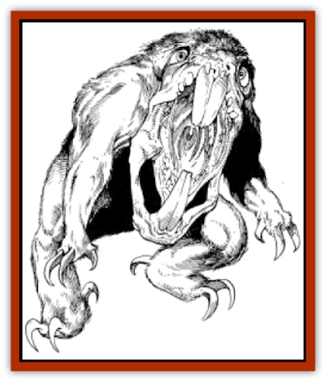

# Sloth - Athas

| Statistic | **Sloth (Athas)** |
| --- | --- |
| **Activity Cycle:** | Night |
| **Alignment:** | Neutral |
| **Armor Class:** | 5 |
| **Climate/Terrain:** | Forest Ridge |
| **Damage/Attack:** | 2-8/2-8/2-20 |
| **Diet:** | Carnivore |
| **Frequency:** | Uncommon |
| **Hit Dice:** | 11 |
| **Intelligence:** | Animal (1) |
| **Magic Resistance:** | Nil |
| **Morale:** | Average (8-10) |
| **Movement:** | 24 |
| **No. Appearing:** | 1-4 |
| **No. of Attacks:** | 3 |
| **Organization:** | Family |
| **Size:** | L (8' long) |
| **Special Attacks:** | Surprise |
| **Special Defenses:** | Resistant to poison |
| **THAC0:** | 9 |
| **Treasure:** | Nil |
| **XP Value:** | 2,000 |

The Athasian sloth is fast, cunning, and very bloodthirsty. A family of sloths can eat a whole [[Halfling_Athas|halfling]] village in one night and is usually not afraid to try.

The Athasian sloth is a large creature with brown fur. It usually has light tan and brown, or light grey and green spots making it easy for the sloth to blend in with the foliage of the Forest Ridge.

Athasian sloths make no sounds that anyone else can hear. Despite this, they seem to communicate very well with each other, making well-coordinated attacks.

**Combat:** The Athasian sloth lurks anywhere in the Forest Ridge, but it it seldom ventures outside it. When in the forest, the sloth forces a -3 penalty on their opponents' surprise rolls, due to its excellent natural camouflage.

A large sloth attacks with two sets of curved talons and a vicious bite. The claws are as long as daggers, and, when backed by the sloth's considerable strength, inflict 2d4 damage each. Its teeth are also long and curved and do 2d10 damage on a successful bite. If the bite hits with a score of 18 or better, the sloth has sunk its teeth into its prey and hangs on, doing an additional 1d10 of damage per round. When it has sunk its teeth into its prey, the claws receive an attack roll bonus of +4. An Athasian sloth will only release its prey when it is seriously damaged (hit points reduced by 50% or better), or when its prey dies.

The sloths travel in family groups and usually fight very well together. Even the young are trained to aid in an attack. If two sloths are found, they are a mated pair. If 3 or more are found, one or two of them are young, having 5 HD, a THAC0 of 15, doing 1d6 points of damage with each claw, and 1d4 with their bite. The young usually act as decoys, swinging down from a branch to swipe with one claw and then retreating higher up into the trees. While their opponents are concentrating on the young ones, the parents move in from behind for the kill.

If a solitary sloth is found, it usually only attacks if the party is small (one or two creatures of dwarf size or larger, or no more than a half-dozen halflings). Its tactics do not change; it still likes to concentrate on one foe until that foe is dead or unconscious, then move onto the next one.

The Athasian sloth has very thick fur, giving it a good natural armor class. In addition, it has a high constitution, giving it a certain resistance to poisons. The sloth gets a +4 to saves versus natural poisons and a +2 versus all other poisons.

**Habitat/Society:** The sloth is a territorial animal and defends its territory fiercely. A small forest may only have one or two families of Athasian sloths. Athasian sloths never attack one another, and if the parents are killed, the young sloths are likely to be adopted by the first adult sloths they can find. Athasian sloths prefer trees as lairs and as their method of travel. They have very good judgement when it comes to selecting branches that support their considerable weight. They are very fast both in the trees and on the ground. They can leap up to 30' from one branch to another. They also retract their claws to allow them to move just as fast on the ground as they do in the trees.

A sloth is constantly on the move, settling down only when the female gives birth. One or two young are born, and they mature quickly. The male generally hunts for the family for the first few months, until the young are old enough to look out for themselves. By the time they reach the age of six months, the young are old enough to go out and help catch halflings.

**Ecology:** The Athasian sloth has one natural enemy - halflings. Coincidentally, it also has one favorite food - again, halflings. A halfling is 90% likely to be attacked in preference to anyone else in a group of adventurers. In fact, by the time a sloth reaches adulthood it has almost certainly killed and eaten many of the little folk. For this reason, among others, the sloth is hunted down by halflings whenever there is one reported in the area.

Halfling tribes also hunt sloths. A single sloth can also provide a whole family with warm cloaks. The curved talons are mounted on hilts and make effective daggers. A halfling who single-handedly kills an Athasian sloth is hailed as a hero by his tribe. Even being part of a group that has slain a sloth is a sure way to honor among the little folk of the Forest Ridge.

---
## Discovery & Documentation

**Source Publication:** MC12 Dark Sun Appendix I - Terrors of the Desert (1991)
**Campaign Setting:** Dark Sun
**Author(s):** Tom Prusa, Louis J. Prosperi, Walter M. Baas

### Other Creatures Found in This Source Book
   * [[Animal_Herd_Athas|Animal, Herd (Athas)]]
   * [[Animal_Household_Athas|Animal, Household (Athas)]]
   * [[Antloid_Desert|Antloid, Desert]]
   * [[Banshee_Dwarf|Banshee, Dwarf]]
   * [[Beetle_Agony|Beetle, Agony]]
   * [[Bog_Wader|Bog Wader]]
   * [[Brambleweed|Brambleweed]]
   * [[B'rohg|B'rohg]]
   * [[Burnflower|Burnflower]]
   * [[Cat_Psionic|Cat, Psionic]]
   * [[Cha'thrang|Cha'thrang]]
   * [[Cistern_Fiend|Cistern Fiend]]
   * [[Clam_Giant|Clam, Giant]]
   * [[Cloud_Ray|Cloud Ray]]
   * [[Drake_Athas_Air|Drake (Athas), Air]]
   * [[Drake_Athas_Earth|Drake (Athas), Earth]]
   * [[Drake_Athas_Fire|Drake (Athas), Fire]]
   * [[Drake_Athas_Water|Drake (Athas), Water]]
   * [[Dune_Runner|Dune Runner]]
   * [[Dune_Trapper|Dune Trapper]]
   * [[Elemental_Athas_Greater_Air|Elemental (Athas), Greater, Air]]
   * [[Elemental_Athas_Greater_Earth|Elemental (Athas), Greater, Earth]]
   * [[Elemental_Athas_Greater_Fire|Elemental (Athas), Greater, Fire]]
   * [[Elemental_Athas_Greater_Water|Elemental (Athas), Greater, Water]]
   * [[Elemental_Athas_Lesser_Air_Earth|Elemental (Athas), Lesser, Air/Earth]]
   * [[Elemental_Athas_Lesser_Fire_Water|Elemental (Athas), Lesser, Fire/Water]]
   * [[Elemental_Athas_General_Information|Elemental (Athas), General Information]]
   * [[Erdland|Erdland]]
   * [[Esperweed|Esperweed]]
   * [[Flailer|Flailer]]
   * [[Floater|Floater]]
   * [[Giant_Athas|Giant (Athas)]]
   * [[Golem_Athas_I|Golem (Athas) I]]
   * [[Golem_Athas_II|Golem (Athas) II]]
   * [[Golem_Athas_III|Golem (Athas) III]]
   * [[Golem_Athas_General_Information|Golem (Athas), General Information]]
   * [[Halfling_Renegade|Halfling, Renegade]]
   * [[Hej-kin|Hej-kin]]
   * [[Id_Fiend|Id Fiend]]
   * [[Insect_Swarm_Athas|Insect Swarm (Athas)]]
   * [[Kank_Wild|Kank, Wild]]
   * [[Kirre|Kirre]]
   * [[Megapede|Megapede]]
   * [[Mul_Wild|Mul, Wild]]
   * [[Nightmare_Beast|Nightmare Beast]]
   * [[Plant_Carnivorous_Athas|Plant, Carnivorous (Athas)]]
   * [[Pterran|Pterran]]
   * [[Pterrax|Pterrax]]
   * [[Pulp_Bee|Pulp Bee]]
   * [[Pyreen|Pyreen]]
   * [[Rasclinn|Rasclinn]]
   * [[Razorwing|Razorwing]]
   * [[Roc_Athas|Roc (Athas)]]
   * [[Sand_Bride|Sand Bride]]
   * [[Sand_Cactus|Sand Cactus]]
   * [[Sand_Vortex|Sand Vortex]]
   * [[Scrab|Scrab]]
   * [[Silt_Horror|Silt Horror]]
   * [[Silt_Runner|Silt Runner]]
   * [[Sink_Worm|Sink Worm]]
   * [[So-ut|So-ut]]
   * [[Spider_Cactus|Spider Cactus]]
   * [[Spider_Crystal|Spider, Crystal]]
   * [[Spirit_of_the_Land|Spirit of the Land]]
   * [[T'Chowb|T'Chowb]]
   * [[Thrax|Thrax]]
   * [[Tohr-kreen_I|Tohr-kreen I]]
   * [[Villichi|Villichi]]
   * [[Zhackal|Zhackal]]
   * [[Zombie_Plant|Zombie Plant]]
