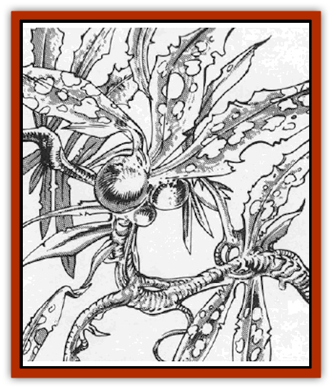

# Sluk

| Statistic | **Sluk** |
| --- | --- |
| **Activity Cycle:** | Any |
| **Alignment:** | Neutral |
| **Armor Class:** | 8 |
| **Climate/Terrain:** | Wildspace and phlogiston |
| **Damage/Attack:** | Special |
| **Diet:** | Wood, magic |
| **Frequency:** | Common |
| **Hit Dice:** | 5 |
| **Intelligence:** | Non- (0) |
| **Magic Resistance:** | Nil |
| **Morale:** | Nil |
| **Movement:** | 3 |
| **No. Appearing:** | 1 |
| **No. of Attacks:** | 1 |
| **Organization:** | Bed |
| **Size:** | G (50'+ diameter patches) |
| **Special Attacks:** | Special |
| **Special Defenses:** | Special |
| **THAC0:** | 16 |
| **Treasure:** | Nil |
| **XP Value:** | 420 |

Sluk is wildspace seaweed, with the same ship-miring ability as sargasso seaweed in planetary seas. An unintelligent parasite, it feeds on magical energy.

Sluk is a dark blue weed with small silver nodules in its leaves. It drifts in 50' long, stringy clumps called "beds", waiting for ships to run into it. Its coloration acts as near-perfect camouflage in wildspace (only 5% chance that lookouts see it). In the phlogiston, the plant is easy to spot.

**Combat:** If a spellcaster or anyone carrying three or more magical items falls into a sluk bed, the seaweed wraps itself around the victim. If it scores a hit, the sluk contracts with Strength 18 as it leeches magical energy, inflicting 1d6 damage per round. Draining effects on magical items are described below.

Sluk can mire spelljamming vessels. Each 50 square feet of sluk bed can stop five tons of vessel; the bed's area is 2d10x50 square feet.

If the vessel is moving at spelljamming speeds when it runs into a sluk bed big enough to stop it, the ship immediately decelerates to tactical speed, requiring all aboard to make a Dexterity check or lose their balance and fall. A vessel travelling at tactical speed through a sluk bed gradually slows to a halt, losing � of its original speed and maneuverability each round until it stops.

Once a vessel stops in a sluk bed, the only way to get moving again is to chop away the strands. This takes 1d6+3 rounds.

Sluk is completely immune to magic, except for cold-based spells. Magical cold instantly causes the plant to shrivel up and flake off. Other spells merely nourish the sluk. If a total of 10 spell levels are cast at the sluk, it reproduces as detailed below.

**Habitat/Society:** Sluk is attracted to sources of magic and moves towards them much as a groundling sunflower turns to face the sun.

**Ecology:** Sluk reproduces by adhering to a trapped spelljamming hull and bleeding its magical energy. The hull must be wood; metal hulls are immune to the bleeding, though they are still trapped.) Subtract the trapped vessel's SR from 10; the result is the number of rounds (minimum 1) the sluk must hold the ship motionless to reproduce. Thus, a vessel with SR 4 lets the plant reproduce in six rounds. Sluk can only bleed motionless ships.

In reproducing, the sluk doubles the size of its patch, possibly miring the ship even deeper in the bed. At DM's option, the crew must spend 1d6 extra rounds cutting away strands.

*Drain effects:* The sluk temporarily reduces a trapped spelljammer's SR by 1 per round (minimum 1). Ignore this temporary reduction when figuring how long the sluk takes to reproduce; a1ways use the ship's original SR instead. The ship regains 1 SR per hour once it escapes from the sluk. Once a ship is reduced to SR 1, it no longer feeds the sluk enough energy to permit reproduction. At DM's discretion, spelljamming helms may lose their power permanently after months in the sluk.

Magical items lose one charge per round; permanent magical items lose their magic after one hour in the sluk, but recover their power within 1d10 turns if removed before then. Relics and artifads are not affected.

[[Feesu|Feesu]] and [[Skullbird|skullbirds]] enjoy an occasional nibble of sluk, but not enough to make a difference.

---
## Discovery & Documentation

**Source Publication:** MC9 Spelljammer Appendix II (1991)
**Campaign Setting:** Planescape
**Author(s):** Scott Davis, Newton Ewell, John Terra

### Other Creatures Found in This Source Book
   * [[Alchemy_Plant|Alchemy Plant]]
   * [[Allura|Allura]]
   * [[Aperusa|Aperusa]]
   * [[Autognome|Autognome]]
   * [[Bionoid|Bionoid]]
   * [[Bloodsac|Bloodsac]]
   * [[Buzzjewel|Buzzjewel]]
   * [[Constellate|Constellate]]
   * [[Contemplator|Contemplator]]
   * [[Dohwar|Dohwar]]
   * [[Dragon_Moon|Dragon, Moon]]
   * [[Dragon_Stellar|Dragon, Stellar]]
   * [[Dragon_Sun|Dragon, Sun]]
   * [[Dreamslayer|Dreamslayer]]
   * [[Dweomerborn|Dweomerborn]]
   * [[Fal|Fal]]
   * [[Feesu|Feesu]]
   * [[Fire_Bat|Fire Bat]]
   * [[Firebird|Firebird]]
   * [[Firelich|Firelich]]
   * [[Flowfiend|Flowfiend]]
   * [[Gadabout|Gadabout]]
   * [[Gammaroid|Gammaroid]]
   * [[Gonn|Gonn]]
   * [[Gossamer|Gossamer]]
   * [[Grav|Grav]]
   * [[Great_Dreamer|Great Dreamer]]
   * [[Greatswan|Greatswan]]
   * [[Grell_Colonial|Grell, Colonial]]
   * [[Gullion|Gullion]]
   * [[Insectare|Insectare]]
   * [[Lhee|Lhee]]
   * [[Mercurial_Slime|Mercurial Slime]]
   * [[Meteorspawn|Meteorspawn]]
   * [[Monitor|Monitor]]
   * [[Owl_Space|Owl, Space]]
   * [[Pristatic|Pristatic]]
   * [[Scro|Scro]]
   * [[Selkie_Star|Selkie, Star]]
   * [[Silatic|Silatic]]
   * [[Skullbird|Skullbird]]
   * [[Sleek|Sleek]]
   * [[Space_Swine|Space Swine]]
   * [[Sphinx_Astro-|Sphinx, Astro-]]
   * [[Spirit_Warrior|Spirit Warrior]]
   * [[Starfly_Plant|Starfly Plant]]
   * [[Stargazer|Stargazer]]
   * [[Undead_Stellar|Undead, Stellar]]
   * [[Witchlight_Marauder|Witchlight Marauder]]
   * [[Xixchil|Xixchil]]
   * [[Yitsan|Yitsan]]
   * [[Zurchin|Zurchin]]
