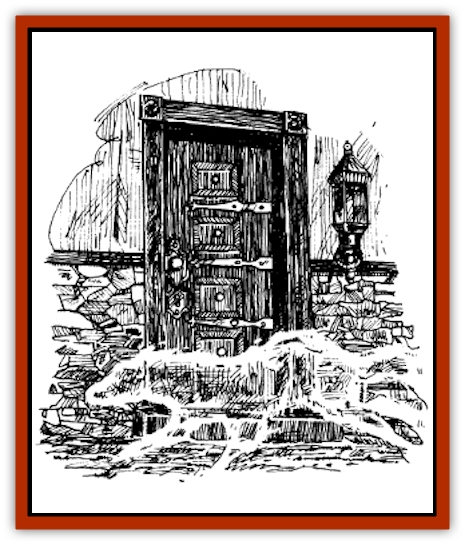

# Smog - Deadly

| Statistic | **Smog, Deadly** |
| --- | --- |
| **Activity Cycle:** | Any |
| **Alignment:** | Neutral |
| **Armor Class:** | 0 |
| **Climate/Terrain:** | Any |
| **Damage/Attack:** | 1d6 |
| **Diet:** | Special |
| **Frequency:** | Very rare |
| **Hit Dice:** | 10+ |
| **Intelligence:** | Animal (1) |
| **Magic Resistance:** | Nil |
| **Morale:** | Champion (16) |
| **Movement:** | 10 |
| **No. Appearing:** | 1 |
| **No. of Attacks:** | Special |
| **Organization:** | Solitary |
| **Size:** | L (100 sq ft) |
| **Special Attacks:** | Nil |
| **Special Defenses:** | See below |
| **THAC0:** | 10 |
| **Treasure:** | Nil |
| **XP Value:** | 2,000 |

Deadly smog is described as noncorporeal clouds of slightly musky-smelling fog covering an area equivalent to one hundred square feet, or a ten by ten foot area. One creature consists of a central hub of fog, with up to fifty tentacles that can extend as far as fifteen feet when feeding. When in its static form, it appears just as any normal low lying cloud. It is misty colored, usually off-white. Even after feeding, the creature's color does not change.

**Combat:** When engaged in combat, the deadly smog contorts itself into a spastic mass of tentacles that reaches out to all warm blooded creatures within a fifteen foot radius. Any creature struck suffers 1d6 points of damage from these tentacles. Even if more than one tentacle successfully strikes a victim, the victim only receives 1d6 points of total damage. The deadly smog moves at a rate of 10 to keep in range of as much prey as possible.

For every six points of damage that it steals from its prey, it heals one point of damage taken itself. If the creature is already at its maximum hit point total, any additional points raise that maximum permanently. Then, for every eight hit points it absorbs over its original maximum, the creature gains one hit die, though the THAC0 remains the same.

This creature is immune to all non-magical weapons. Magical weapons do only their bonuses as damage. Strength bonuses do not apply; a fighter with 18/00 strength and a *bastard sword +3* inflicts only 3 points of damage to the deadly smog, not the usual 10 to 17 points.

The deadly smog does have a few weaknesses, though. If a spell caster were to cast water elemental spells on this creature, they would affect it as though it were a natural weather phenomenon. For example, if one were to cast a *cone of cold* at it, it would freeze. It then would be susceptible to splintering and shattering, and the pieces could be spread out. All weapons do normal damage in this situation and others like it.

**Habitat/Society:** These creatures originate from the Negative Material Plane. They do not gate into the Prime Material Plane by choice. Their arrival is always forced, either by accidental or purposeful summoning. These creatures are solitary while within the Prime Material Plane. How their progeny come into being is unknown, and probably should remain that way. On the negative material plane, they are of uncommon frequency. Luckily, on the Prime Material plane, they are very rare.

---
## Discovery & Documentation

**Source Publication:** LNR1 Wonders of Lankhmar (1992)
**Campaign Setting:** Lankhmar
**Author(s):** Dale "Slade" Henson

### Other Creatures Found in This Source Book
   * [[Monolisk|Monolisk]]
   * [[Stalking_Death|Stalking Death]]
   * [[Wolvern|Wolvern]]
