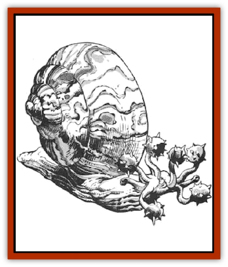

# Snail

| Statistic | **Flail** | **Sea** |
| --- | --- | --- |
| **Activity Cycle:** | Night | Night |
| **Alignment:** | Neutral | Neutral |
| **Armor Class:** | 4 (see below) | 6 (see below) |
| **Climate/Terrain:** | Any/Subterranean | Any/Large bodies of salt water |
| **Damage/Attack:** | 1-8 | 2-16 |
| **Diet:** | Herbivore | Herbivore |
| **Frequency:** | Very rare | Very rare |
| **Hit Dice:** | 4-6 | 12 |
| **Intelligence:** | Low (5-7) | Animal (1) |
| **Magic Resistance:** | See below | Nil |
| **Morale:** | Elite (13-14) | Elite (13-14) |
| **Movement:** | 3 | 3 |
| **No. Appearing:** | 1 | 1 |
| **No. of Attacks:** | 1 per tentacle | 1 |
| **Organization:** | Solitary | Solitary |
| **Size:** | L (8' tall) |  (15' tall, 20' long) |
| **Special Attacks:** | Nil | Nil |
| **Special Defenses:** | See below | Paralysis (see below) |
| **THAC0:** | 4 HD: 17 / 5-6 HD: 15 | 9 |
| **Treasure:** | Nil | Nil |
| **XP Value:** | 975 | 10,000 |

Flail snails are silicon-based gastropods distantly related to ordinary garden snails. Their shells average eight feet high at the crown and are masses of neon blues, reds, greens, and yellows. Flail snails get their name from the four to six club-like tentacles that grow from their heads. Each tentacle ends in a ten-pound mass of hardened flesh covered with knobs. Short sensor tentacles grow from either side of the head. These sensors detect motion up to 20 feet away. Their flesh is rubbery and gray-blue in color.

**Combat:** A hit by a single tentacle causes 1d8 points of damage and can smash a one-inch-thick piece of wood. A four-tentacled snail makes four attacks as a 4 Hit Die creature, a three-tentacled snail makes three attacks as a 3 Hit Die creature, and so on. These attacks may be against one or two opponents. Both opponents must be in front of or to the side of the snail.

Flail snail tentacles have 1 Hit Die apiece. Treat each tentacle as a separate creature. When a tentacle is reduced to 0 hit points it is useless. Flail snails attack until all of their tentacles are dead. Once this happens the monster withdraws into its shell and dies 1d3 turns later. During these turns the snail utters pitiful cries that are 50% likely per turn to attract a wandering monster.

The body has hit points equal to the combined total of all the tentacles, but it is nearly impossible to attack because it is protected by the creature's shell. The effective Armor Class of the body is -8.

Flail snails are protected against magic by their colorful shell. Whenever the snail is attacked by magic, the effects are variable - 40% chance of the spell malfunctioning, 30% chance of it functioning normally, 20% chance of it failing to work at all, and a 10% chance that the spell is reflected back at the spellcaster. A spell that malfunctions has its effect altered slightly (DM discretion). The altered spell then affects the creature nearest the snail (saving throw if applicable).

Flail snails are immune to fire and poison, but they shun bright light.

**Habitat/Society:** Flail snails live peaceful lives crawling up and down dungeon and cavern corridors. Normally quiet, flail snails aggressively defend themselves, chasing attackers until they withdraw from the snail's 20-foot, sensing range.

**Ecology:** Flail snails live off lichen and algae growing on dungeon floors. Glands in their mouth secrete a substance that loosens the plants. The mouth then scrapes up the loosened plants.

Females give live birth to 1d3 young. The young remain with the mother for two years, until their tentacle knobs reach a weight of five pounds. Flail snails mature at age four and live up to 20 years. These peaceful beasts are frequently hunted for their shells. A single shell weighs 250 to 300 pounds and retains its magical powers for 1d6 months after the occupant's death. A skilled armorer can try to fashion 1-2 +2 shields from a single shell. These shields affect spells as did the original shell until their magic fades (1d6 months). After the magic fades, the shields become nonmagical +2 shields. In addition, freshly ground snail shell is needed to create a *robe of scintillating colors*. One robe may be made from a single shell. Shells sell for 5,000 gold pieces on the open market.

**Sea Snail**

  These behemoths of the deep measure up to 20 feet in length. Sea snails are a variety of giant conch. Their skins are rubbery (AC 6), but their shells are incredibly thick (AC -4).

Sea snails live in all seas and oceans. Their shells vary in color from bright red to flat white with a pink interior.

Giant snails are sometimes tamed by [[Triton|tritons]].

If attacked, sea snails withdraw into their shell and release a vicious neurotoxin into the surrounding water. This poison affects all creatures within 20 feet, paralyzing them for 1d6 hours unless they roll successful saving throws vs. poison with a -3 penalty. If the attack continues, the sea snail will wail. The round following the wail, 1d10 *charmed* tritons arrive. Each round thereafter 1d10 more tritons arrive until a total of 50 are on the scene. These tritons fight to the death in defense of the sea snail.

The value of the snail's shell depends on the shell quality. The base price is 4,000 gp, doubled for an unblemished shell.

---
## Discovery & Documentation

**Source Publication:** MC5 Greyhawk Appendix (1989)
**Campaign Setting:** Advanced Dungeons & Dragons 2nd Edition
**Author(s):** Grant Boucher, William W. Connors, Steve Gilbert, Bruce Nesmith, Chris Mortika, Skip Williams

### Other Creatures Found in This Source Book
   * [[Aspis|Aspis]]
   * [[Beastman|Beastman]]
   * [[Bonesnapper|Bonesnapper]]
   * [[Booka|Booka]]
   * [[Brownie_Buckawn|Brownie, Buckawn]]
   * [[Brownie_Quickling|Brownie, Quickling]]
   * [[Crystalmist|Crystalmist]]
   * [[Dragon_Cloud|Dragon, Cloud]]
   * [[Dragon_Oerth_Greyhawk|Dragon (Oerth), Greyhawk]]
   * [[Dragonfly_Giant|Dragonfly, Giant]]
   * [[Dragonnel|Dragonnel]]
   * [[Elf_Grugach|Elf, Grugach]]
   * [[Elf_Valley|Elf, Valley]]
   * [[Golem_Necrophidius|Golem, Necrophidius]]
   * [[Grell_Wild|Grell, Wild]]
   * [[Grung|Grung]]
   * [[Hobgoblin_Norker|Hobgoblin, Norker]]
   * [[Hook_Horror|Hook Horror]]
   * [[Horgar|Horgar]]
   * [[Hound_Yeth|Hound, Yeth]]
   * [[Iguana_Giant|Iguana, Giant]]
   * [[Ingundi|Ingundi]]
   * [[Kech|Kech]]
   * [[Kyuss_Son_of|Kyuss, Son of]]
   * [[Mite|Mite]]
   * [[Needleman|Needleman]]
   * [[Plant_Carnivorous_Oerth|Plant, Carnivorous (Oerth)]]
   * [[Plant_Carnivorous_Vampire_Cactus|Plant, Carnivorous, Vampire Cactus]]
   * [[Plasmoid_General_Information|Plasmoid, General Information]]
   * [[Rat_Oerth|Rat (Oerth)]]
   * [[Raven_Crow|Raven/Crow]]
   * [[Scarecrow|Scarecrow]]
   * [[Shadow_Slow|Shadow, Slow]]
   * [[Skulk|Skulk]]
   * [[Sprite|Sprite]]
   * [[Taer|Taer]]
   * [[Tentamort|Tentamort]]
   * [[Turtle_Giant|Turtle, Giant]]
   * [[Tyrg|Tyrg]]
   * [[Wolf_Mist|Wolf, Mist]]
   * [[Wraith_Oerth|Wraith (Oerth)]]
   * [[Zygom|Zygom]]
