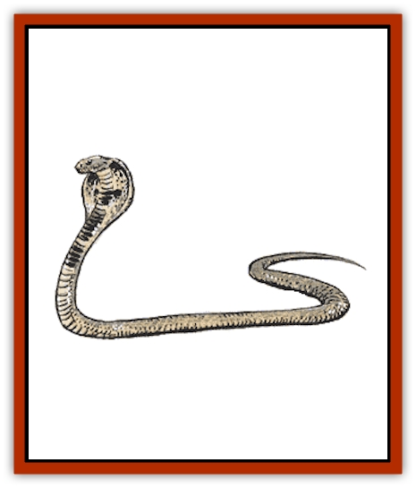

# Snake

Snakes are long, slender reptiles that can be found anywhere in the entire world, even in the coldest arctic regions.

There are basically two types of snakes, in all manner of sizes. The poisonous snakes make up for their relatively smaller size with deadly venoms, while the larger constrictors squeeze their victims to death. Both types sleep for days after eating. All snakes shed their skin several times each year.

Snakes fear fire and will retreat from open flames, suffering a -6 morale modifier when flames are used against them.

**Amphisbaena**

  These monsters have heads at both ends, and both heads are armed with poisonous fangs. The creature travels by grasping one of its necks and rolling like a hoop. It can attack with both heads, each head attacking a separate target. Victims failing to make a saving throw vs. poison when bitten die instantly. Amphisbaena are immune to cold-based attacks.

**Boalisk**

  The boalisk is a tropical constrictor snake with a gaze attack. Any creature meeting its gaze (failing a saving throw vs. petrification) is infected with a magical rotting disease, identical to that inflicted by a [[Mummy|mummy]]. Characters refusing to look at the boalisk automatically avoid its gaze but suffer a -4 penalty to their AC. Surprised victims always meet its gaze and gain no saving throw. The boalisk can use its gaze on a single victim each round in addition to normal biting and constriction attacks.

**Constrictor Snake**

  Constrictors of all sizes hide in the branches of trees, waiting patiently until they can slowly lower themselves or suddenly drop onto their unsuspecting victims. Once they strike, the victim is constricted automatically, suffering damage every round. Constricted humanoid creatures can escape the coils of normal constrictors with a successful open doors roll (at a -1 penalty). Anyone who attempts to free a captive by hacking at the constrictor has a 20% chance of striking the victim instead (roll normal damage and apply it to the victim). Area spells like *fireball* will likewise affect both combatants, but target-specific spells like charm monster and magic missile are more precise.

Common constrictor species include anacondas, boas, and reticulate pythons, all of which can reach lengths of 30 feet. Their skin is valuable, with an unblemished skin selling for as much as 100 gp.

Some constrictor snakes are known as birdcharmers; these innately magical snakes can mesmerize their prey by swaying slowly and steadily while staring down their victims. Creatures of animal intelligence or less must make a saving throw against paralyzation or be effectively paralyzed for as long as the snake continues to sway, and for 2d6 rounds thereafter.

**Giant Constrictor Snake**

  Giant constrictor snakes are larger and much stronger than their smaller cousins. It requires the combined efforts of 60 total points of Strength (the coiled victim plus outside help) to extricate someone from a giant constrictor's steel grasp.

The skin of a giant constrictor snake is too thick and stiff to be workable, and is valuable only as armor, not for decoration. An uncured hide can fetch 20 gp.

[[Snow_Serpent|Snow serpents]] are a particularly large and dangerous form of giant constrictor snake, one adapted to life in a sub-arctic climate. These furred white snakes hide their 100-foot bodies in the snow bodies and wait for prey to pass by. When it does, they spring up and coil their loops around the victims. After that, snow serpents automatically bite for 2d10 points of damage each round. Those in its coils are helpless. Snow serpents are very rare and have the following statistics: AC 6, MV 9, HD 10, THAC0 11, SZ G (100' long), ML average (8-10), XP 2,000. Their pelt is worth 2,000 gp. In all other respects they are similar to other giant constrictor snakes.

**Heway**

  These intelligent snakes have slimy, poisonous skins that they use to foul wells and oases. After swimming in a body of water for several hours and releasing its poison, it slinks off to wait for its prey to arrive. A creature drinking water poisoned by a heway must make a successful saving throw vs. poison at +2 or suffer 30 points damage within 3d6 minutes and be paralyzed for 1d6 hours. Creatures that make their saving throws suffer 15 points of damage. Even animals that survive the initial effects are often doomed to die of dehydration.

Many humans and animals attack [[Heway|heways]] on sight, but it can defend itself with its hypnotic stare, which has a powerful effect; any creature failing a saving throw vs. paralyzation will follow the heway to its lair and allow itself to be devoured. The heway sometimes uses this stare simply to immobilize a menacing creature. It then leaves the area while the hypnotized creature remains stationary for 1d6 turns.

Heway are innate cowards and avoid contact with other animals. It is a weak fighter, its bite is not venomous, and its jaws are weak. Its preferred food is small animal carrion. Simply touching heway skin has no effect; the poison must be ingested.

**Poisonous Snake**

All poisonous snakes deliver toxins automatically through their bite. Roll on the table below (or choose) to determine what type of poison is present.

| d20 Roll | Modifier to Save | Onset Time | Result of Failed Saving Throw* |
| --- | --- | --- | --- |
| 1-4 | +3 | 1-4 turns | Incapacitated for 2-8 days |
| 5-6 | +2 | 2-5 rounds | Death |
| 7-11 | +1 | 2-12 rounds | 2-8 points of damage |
| 12-14 | None | 1-6 rounds | 3-12 points of damage |
| 15-17 | -1 | 2-8 rounds | Incapacitated for 1-4 days |
| 18-19 | -2 | 1-4 rounds | Incapacitated for 1-12 days |
| 20 | -3 | 1 round | Death |

* A successful saving throw means no damage.

Typical varieties of poisonous snakes include the asp, cobra, copperhead, coral snake, death adder, krait, mamba, puff adder, rattlesnake, sidewinder, and water moccasin.

Some cobras and sidewinders hunt by night and can track warmblooded prey by body heat as well as by sight. They have the equivalent of 30-foot infravision. Black mambas are the fastest known snakes and can reach MR 30 across open ground.

**Giant Poisonous Snake**

  Giant poisonous snakes cause death in one round if their victims fail a saving throw vs. poison. Some varieties inflict 3-18 points of damage even if the saving throw is made.

The [[Snake_Giant_Cobra|giant cobra]] is an example of a variant, giant poisonous snake. Its venom results in death 2-8 rounds after a successful strike; if the victim makes a saving throw at -2 he suffers only 10 points of damage.

Giant cobras mesmerize prey as birdcharmer snakes do (see above). They can kill and eat an entire goat or a demihuman up to halfling or gnome size. Some varieties of [[Weasel|giant weasel]] can hunt them successfully, and [[Giant_Jungle|jungle giants]] consider giant cobras a delicacy, as do some [[Elf|elven]] tribesmen.

**Giant Sea Snake**

  Found only in tropical waters, the giant sea snake is the only type of snake that is both constricting and poisonous. Its constricting grasp on small ships can crush them in 10 rounds. Sea snakes attack ships only when they are hungry (20% chance). Their poisonous bite is deadly in 1-4 rounds. Sea snakes are fully capable of diving to great depths, and their nostrils (on the top of their snouts) have membranes that automatically seal them underwater.

From time to time giant sea snakes gather in huge floating masses of hundreds or thousands of snakes, often 100 yards wide and 30 miles long. These may be mating rituals or they may be seasonal migrations; the actual reason is unknown.

**Spitting Snake**

  Spitting varieties of snakes bite their victims and can shoot poisonous spittle at a single target within 30 feet. Their poison is identical to normal poisonous snakes (see above). Typical species include the African spitting cobra, which can spit up to 15 feet. Its spittle can blind victims that fail a saving throw vs. poison. The blindness wears off after 2-12 hours.

**Jaculi (Tree Snakes)**

  Many of the above land snakes can be encountered as tree snakes, also known as jaculi. These subspecies are simply arboreal varieties of other types of snakes that have adapted to life in a forest canopy. They have chameleon-like camouflage abilities and can leap onto their prey from 50 feet above ground; opponents suffer a -4 penalty to surprise rolls.

Some tree snakes have broad, flat heads with razor spines or barbs that make their initial impact particularly potent (double normal bite damage). After their initial flying attack, they must depend on biting or constriction attacks or climb back into the trees to leap again.

Jaculi snakes include the poisonous boomslang and the emerald tree boa. Many jaculi species prey on other snakes.

**Elder Serpents**

  Ancient snakes are said to gain wisdom with age, giving them Semi- to Low intelligence (2-7). They gain an additional Hit Die and the ability to speak (with a lisp). Elder serpent venom is more concentrated than that of its younger cousins (death in 1-4 rounds maximum, saving throws at -4). They suffer no modifier to morale when faced with open flames. Elder serpents have a measure of cunning and value glittering objects; they have treasure, type W.

Elder serpents can paralyze prey as birdcatchers do (see constrictors above). In the case of elder boalisks, their gaze has two simultaneous effects and victims are entitled to two saving throws. All elder serpents can hypnotize people as well as animals with their paralyzing stare.

The largest elder serpent is called the Grand Snakemaster, and is said to be immortal. When it sheds its skin, the discarded skin is rumored to possess healing powers. Those who eat it are said to gain wisdom, but since the Grand Snakemaster has never been seen, the truth of these rumors is questionable.

---
## Discovery & Documentation

**Source Publication:** MC1 Volume I (w/binder #1) (1991)
**Campaign Setting:** Advanced Dungeons & Dragons 2nd Edition
**Author(s):** Jay Batista, Scott Bennie, Grant Boucher, William W. Connors, Steve Gilbert, Heike Kubasch, James Lowder, David Edward Martin, Bruce Nesmith, Jean Rabe, Rick Swan, John J. Terra, Gary L. Thomas

### Other Creatures Found in This Source Book
   * [[Bat|Bat]]
   * [[Bear|Bear]]
   * [[Behir|Behir]]
   * [[Boar|Boar]]
   * [[Bookworm|Bookworm]]
   * [[Brownie|Brownie]]
   * [[Bugbear|Bugbear]]
   * [[Carrion_Crawler|Carrion Crawler]]
   * [[Cat_Great|Cat, Great]]
   * [[Catoblepas|Catoblepas]]
   * [[Dragon_General_Information|Dragon, General Information]]
   * [[Dragonfish|Dragonfish]]
   * [[Elemental_Air_Kin_Aerial_Servant|Elemental, Air Kin, Aerial Servant]]
   * [[Elemental_Earth_Kin_Sandling|Elemental, Earth Kin, Sandling]]
   * [[Elephant|Elephant]]
   * [[Gnoll|Gnoll]]
   * [[Hobgoblin|Hobgoblin]]
   * [[Homunculus|Homunculus]]
   * [[Hornet_Giant|Hornet, Giant]]
   * [[Horse|Horse]]
   * [[Hyena|Hyena]]
   * [[Jackal|Jackal]]
   * [[Jackalwere|Jackalwere]]
   * [[Korred|Korred]]
   * [[Lich|Lich]]
   * [[Lizard|Lizard]]
   * [[Lizard_Man|Lizard Man]]
   * [[Lycanthrope_General_Information|Lycanthrope, General Information]]
   * [[Lycanthrope_Seawolf|Lycanthrope, Seawolf]]
   * [[Lycanthrope_Werebear|Lycanthrope, Werebear]]
   * [[Lycanthrope_Weretiger|Lycanthrope, Weretiger]]
   * [[Lycanthrope_Werewolf|Lycanthrope, Werewolf]]
   * [[Manticore|Manticore]]
   * [[Medusa|Medusa]]
   * [[Mind_Flayer|Mind Flayer]]
   * [[Minotaur|Minotaur]]
   * [[Mudman|Mudman]]
   * [[Mummy|Mummy]]
   * [[Nixie|Nixie]]
   * [[Nymph|Nymph]]
   * [[Ogre|Ogre]]
   * [[Ooze_Slime_Jelly_I|Ooze/Slime/Jelly I]]
   * [[Ooze_Slime_Jelly_II|Ooze/Slime/Jelly II]]
   * [[Orc|Orc]]
   * [[Owl|Owl]]
   * [[Owlbear_I|Owlbear I]]
   * [[Pegasus|Pegasus]]
   * [[Piercer|Piercer]]
   * [[Pudding_Deadly|Pudding, Deadly]]
   * [[Rakshasa|Rakshasa]]
   * [[Rat|Rat]]
   * [[Ray|Ray]]
   * [[Remorhaz|Remorhaz]]
   * [[Satyr|Satyr]]
   * [[Scorpion|Scorpion]]
   * [[Selkie|Selkie]]
   * [[Shadow|Shadow]]
   * [[Skeleton|Skeleton]]
   * [[Skunk|Skunk]]
   * [[Spectre|Spectre]]
   * [[Spider|Spider]]
   * [[Sprite|Sprite]]
   * [[Toad_Giant|Toad, Giant]]
   * [[Treant|Treant]]
   * [[Troll|Troll]]
   * [[Umber_Hulk|Umber Hulk]]
   * [[Unicorn|Unicorn]]
   * [[Vampire|Vampire]]
   * [[Wight|Wight]]
   * [[Will_O'Wisp|Will O'Wisp]]
   * [[Wolf|Wolf]]
   * [[Wolfwere|Wolfwere]]
   * [[Wraith|Wraith]]
   * [[Wyvern|Wyvern]]
   * [[Yeti|Yeti]]
   * [[Yuan-ti|Yuan-ti]]
   * [[Zombie|Zombie]]
