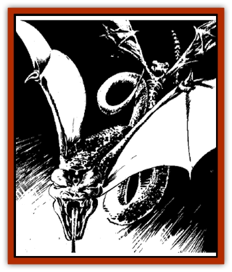

# Snake - Flying

| Statistic | **Deathfang** | **Flying Fang** |
| --- | --- | --- |
| **Activity Cycle:** | Any | Any |
| **Alignment:** | Neutral (evil) | Neutral |
| **Armor Class:** | 5 | 5 |
| **Climate/Terrain:** | Any | Any |
| **Damage/Attack:** | 1-3 (bite) | 1-3 (bite) |
| **Diet:** | Nil | Flesh, insects, carrion |
| **Frequency:** | Very rare | Uncommon |
| **Hit Dice:** | 1+4 | 1+4 |
| **Intelligence:** | Low (5-7) | Low (5-7) |
| **Magic Resistance:** | Nil | Nil |
| **Morale:** | Special (treat as 20) | Steady (12) |
| **Movement:** | 6, Fl 18 (B) | 9, Fl 21 (B) |
| **No. Appearing:** | 1-6 | 1-12 |
| **No. of Attacks:** | 1 + special | 1 + special |
| **Organization:** | Solitary; any as guardian | Flocks or solitary |
| **Size:** | S (up to 4' long) | S (up to 4' long) |
| **Special Attacks:** | See below | Acid spray |
| **Special Defenses:** | See below | Nil |
| **THAC0:** | 19 | 19 |
| **Treasure:** | Nil/Any (as guardian) | I,Q,S,T,X |
| **XP Value:** | 175 | 120 |

Flying [[Snake|snakes]], also known as "flying fangs", were once numerous in warmer areas of the Realms, but they are so dangerous that all intelligent races hunt them mercilessly. In the hot lands, tales abound of [[Lizard_Man|lizard men]] and [[Yuan-ti|yuan-ti]] who train flying snakes to hunt for them, or learn to work with the snakes as partners.

These reptiles have a pair of flaring, [[Bat|bat]]like, leathery wings behind their heads. They can fly with acrobatic agility, hovering, flying upside down, and using their tails and body coils to hamper victims in mid-air.

Flying snakes may be of any color or appearance. Most have flat, pointed, viper-like heads, red or yellow eyes, and emerald-green or bronze scales.

**Combat:** Flying snakes bite and slash with their needle-sharp fangs, or spit acid at opponents up to ten feet away. An acid spit does 1d4 damage to tissue, hide or cloth, but does not affect metal or stone.

Flying fangs always strike at the faces of their foes, seeking to blind beings so they can be slain and devoured at the fangs' leisure. The snakes will attack any living creature they feel they can slay and eat.

Against S-sized or smaller creatures, a flying snake can grasp and encoil its victim. This does no damage, but lowers the victim's movement rate by 8 (to a minimum of 1) and penalizes the victim's armor class by 6 points (to a minimum of 10). To wrap its coils around an opponent, a flying snake must make a successful attack roll. Allow one attempt every 2 rounds of combat as an extra attack roll. If both snake and target creature are airborne, the attack roll is made at -1.

**Habitat/Society:** Although some flying snakes are solitary, most hunt in bands, attacking fearlessly in a swooping, darting cloud around victims.

These winged horrors are found in ruins, subterranean areas, and rocky crags throughout the Realms. They can tolerate a wide range of climates, but seem to be more numerous in Calimshan and the Shining South than elsewhere.

**Ecology:** A single flying snake eats five times its weight in a day, if it can get that much. Hunting flights often slay a dozen man-sized victims or more if they judge that other predators will leave the bodies undisturbed, for later meals.

**Deathfang**

  Deathfangs are undead flying snakes. They are sometimes created when [[Vampire_General_Information|vampires]] or other greater undead slay a flying snake (20% chance), and when certain evil priests or wizards with specialized knowledge use spells to convert a flying snake to undeath; in the Realms, such spells are used almost exclusively in Calimshan and lands to the south.

Deathfangs attack and function as living flying snakes do, except their bony wings cannot move as much air as intact, living membranes, thus slowing their rate of flight. Their acid-spit is lost upon joining the ranks of the undead. As undead, deathfangs gain a chilling bite power, usable once every six rounds. Upon successfully biting for 1-3 damage, a deathfang can elect to drain energy from a foe. It does this by retaining its fang-grip, allowing the foe an automatically successful attack on it the following round. Through its fangs, the deathfang drains 1d4+2 hit points per round from its victim (no saving throw).

In addition, deathfangs have magical immunities common to many undead. They are immune to cold-based attacks, *charm*, *sleep*, *hold*, and death spells, and can be mentally controlled or influenced only by their creator, if any.

---
## Discovery & Documentation

**Source Publication:** Ruins of Undermountain I (1994)
**Campaign Setting:** Forgotten Realms
**Author(s):** Ed Greenwood

### Other Creatures Found in This Source Book
   * [[Automaton_Scaladar|Automaton, Scaladar]]
   * [[Beholder-kin_Death_Kiss|Beholder-kin, Death Kiss]]
   * [[Beholder_Elder_Orb|Beholder, Elder Orb]]
   * [[Darktentacles|Darktentacles]]
   * [[Ibrandlin|Ibrandlin]]
   * [[Sharn|Sharn]]
   * [[Slithermorph|Slithermorph]]
   * [[Steel_Shadow|Steel Shadow]]
   * [[Watchghost|Watchghost]]
