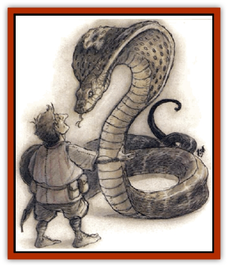

# Snake - Giant Cobra

| Statistic | **Snake, Giant Cobra** |
| --- | --- |
| **Activity Cycle:** | Day |
| **Alignment:** | Neutral |
| **Armor Class:** | 8 |
| **Climate/Terrain:** | Any tropical |
| **Damage/Attack:** | 1d8 plus poison |
| **Diet:** | Carnivore |
| **Frequency:** | Common |
| **Hit Dice:** | 3 |
| **Intelligence:** | Animal (1) |
| **Magic Resistance:** | Nil |
| **Morale:** | Champion (15-16) |
| **Movement:** | 12 |
| **No. Appearing:** | 1d6 |
| **No. of Attacks:** | 1 |
| **Organization:** | Solitary |
| **Size:** | H (12-24' long) |
| **Special Attacks:** | Poison, charm |
| **Special Defenses:** | Nil |
| **THAC0:** | 17 |
| **Treasure:** | Nil (W) |
| **XP Value:** | 270 / Elder: 975 |

Giant cobras are dimly intelligent [[Snake|snakes]] with hoods marked by two eyelike patterns on the back. They may live as long as a century and are said to gain wisdom in their old age, giving them semi to low intelligence (2-7).

**Combat:** The giant cobra attacks by rising into a swaying pillar, spreading its hood, and striking with blinding speed. Its 4-inch fangs deliver a poison that kills in 2d4 rounds, but a successful save at -2 results in only 10 points of damage. Cobras can also sway in a mesmerizing way that charms creatures of animal intelligence or less, effectively paralyzing them for 2d6 rounds.

Giant cobras fear fire and will retreat from it, suffering a -6 penalty to morale checks when threatened with open flames.

**Habitat/Society:** Usually solitary, giant cobras mate once per year in the early spring, often in a location where entire plagues of serpents return year after year. After mating the female cobra lays a clutch of 2d10 eggs in a shallow pit and guards them until they hatch, at which time the young are abandoned.

The population of giant snakes can increase rapidly, so nests of giant cobras are destroyed by humans when discovered. Giant cobra eggs bring 10-500 gp on the market, as they are sought by snake charmers, assassins, or chefs.

Giant cobras live in burrows stolen from other animals; these lairs sometimes contain incidental treasure from their victims, but rarely anything of value. Elder cobras value glittering objects and therefore have treasure type W.

The snakes are active in cycles; they warm themselves in the sun and then hunt, then warm themselves again. In cooler climates or during the monsoon season they may spend more than half their time in their burrows or crevices. They never hunt or fight at night, always fleeing combat in the dark.

Giant cobras are occasionally kept by snake-handling cults and various groups of assassins. They are amenable to training, though they always remain dangerous if not carefully handled.

**Ecology:** Cobras are powerful enough to kill and eat an entire goat or a demihuman of up to halfling size. They tend to hunt in binges, eating a large meal and then curling up in their lairs for several days or weeks. They have few natural enemies; some varieties of [[Weasel|giant weasel]] hunt them successfully. Giant cobras like the rich flesh of domesticated animals.

Giant cobra venom can be stored in daggers made to hold the liquid in special channels, but it degrades rapidly. The virulent agent decays at a rate of +1 to the saving throw per turn. After 20 minutes the save is made with no penalty; after a full hour, the saving throw is made at +4; after two hours, the save is made at +10. The poison is inert after three hours.

**Elder Giant Cobra**

  Elder serpents are wise enough to know the value of stealth and the power of intimidation. They can speak Common (with a lisp) and the trade language of giants, and they are likely to try to browbeat humans and demihumans rather than simply attack them. The elder serpents can hypnotize and paralyze not only animals, but people as well. A victim is allowed a saving throw vs. paralysis to avoid being hypnotized for as long as the cobra concentrates and for 2d6 rounds thereafter.

The elder cobra's venom is more concentrated than that of its younger brethren (onset of death 1d4 rounds, save at -4). Victims of its bite who successfully save suffer 10 points of damage, but they are paralyzed for 1d6 rounds.

Elder serpents gain an additional Hit Die and suffer no modifier to morale when faced with open flames.

The largest of the elder serpents is called the Grand Snakemaster, and is said to be immortal. When it sheds, the discarded skin is rumored to possess healing powers. Those who eat of it are said to gain wisdom, but since the Grand Snakemaster has never been seen, the truth is questionable.

---
## Discovery & Documentation

**Source Publication:** Monstrous Compendium, 1994 Annual, Volume 1 (1995)
**Campaign Setting:** Advanced Dungeons & Dragons 2nd Edition
**Author(s):** David Wise

### Other Creatures Found in This Source Book
   * [[Abyss_Ant|Abyss Ant]]
   * [[Achaierai|Achaierai]]
   * [[Afanc|Afanc]]
   * [[Al-Jahar|Al-Jahar]]
   * [[Baelnorn|Baelnorn]]
   * [[Baneguard|Baneguard]]
   * [[Banelar|Banelar]]
   * [[Bird_Talking|Bird, Talking]]
   * [[Blazing_Bones|Blazing Bones]]
   * [[Campestri|Campestri]]
   * [[Caniquine|Caniquine]]
   * [[Cat_Winged|Cat, Winged]]
   * [[Crypt_Servant|Crypt Servant]]
   * [[Death's_Head_Tree|Death's Head Tree]]
   * [[Dog_Saluqi|Dog, Saluqi]]
   * [[Dragon_Electrum|Dragon, Electrum]]
   * [[Dragon_Fang|Dragon, Fang]]
   * [[Dragon_Linnorm_Corpse_Tearer|Dragon, Linnorm, Corpse Tearer]]
   * [[Dragon_Linnorm_Dread|Dragon, Linnorm, Dread]]
   * [[Dragon_Linnorm_Flame|Dragon, Linnorm, Flame]]
   * [[Dragon_Linnorm_Forest|Dragon, Linnorm, Forest]]
   * [[Dragon_Linnorm_Frost|Dragon, Linnorm, Frost]]
   * [[Dragon_Linnorm_Gray|Dragon, Linnorm, Gray]]
   * [[Dragon_Linnorm_Land|Dragon, Linnorm, Land]]
   * [[Dragon_Linnorm_Midgard|Dragon, Linnorm, Midgard]]
   * [[Dragon_Linnorm_Rain|Dragon, Linnorm, Rain]]
   * [[Dragon_Linnorm_Sea|Dragon, Linnorm, Sea]]
   * [[Dragon_Neutral_Jacinth|Dragon, Neutral, Jacinth]]
   * [[Dragon_Neutral_Jade|Dragon, Neutral, Jade]]
   * [[Dragon_Neutral_Pearl|Dragon, Neutral, Pearl]]
   * [[Dread|Dread]]
   * [[Dragon-kin|Dragon-kin]]
   * [[Elemental_Earth_Kin_Chrysmal|Elemental, Earth Kin, Chrysmal]]
   * [[Elemental_Earth_Kin_Earth_Weird|Elemental, Earth Kin, Earth Weird]]
   * [[Elemental_Fire_Kin_Azer|Elemental, Fire Kin, Azer]]
   * [[Elemental_Sandman|Elemental, Sandman]]
   * [[Elemental_Wind_Walker|Elemental, Wind Walker]]
   * [[Elemental_Vermin|Elemental Vermin]]
   * [[Feystag|Feystag]]
   * [[Flame_Skull|Flame Skull]]
   * [[Foulwing|Foulwing]]
   * [[Gambado|Gambado]]
   * [[Garbug|Garbug]]
   * [[Genie_Tasked_Administrator|Genie, Tasked, Administrator]]
   * [[Genie_Tasked_Deceiver|Genie, Tasked, Deceiver]]
   * [[Genie_Tasked_Harim_Servant|Genie, Tasked, Harim Servant]]
   * [[Genie_Tasked_Messenger|Genie, Tasked, Messenger]]
   * [[Genie_Tasked_Miner|Genie, Tasked, Miner]]
   * [[Genie_Tasked_Oathbinder|Genie, Tasked, Oathbinder]]
   * [[Gibbering_Mouther|Gibbering Mouther]]
   * [[Gnasher|Gnasher]]
   * [[Gnasher_Winged|Gnasher, Winged]]
   * [[Golem_Brain|Golem, Brain]]
   * [[Golem_Hammer|Golem, Hammer]]
   * [[Golem_Metagolem|Golem, Metagolem]]
   * [[Golem_Spiderstone|Golem, Spiderstone]]
   * [[Gorynych|Gorynych]]
   * [[Greelox|Greelox]]
   * [[Helmed_Horror|Helmed Horror]]
   * [[Jarbo|Jarbo]]
   * [[Laraken|Laraken]]
   * [[Lich_Psionic|Lich, Psionic]]
   * [[Living_Steel|Living Steel]]
   * [[Lock_Lurker|Lock Lurker]]
   * [[Loxo|Loxo]]
   * [[Lycanthrope_Loup_de_Noir|Lycanthrope, Loup de Noir]]
   * [[Lycanthrope_Werebadger|Lycanthrope, Werebadger]]
   * [[Lycanthrope_Werejaguar|Lycanthrope, Werejaguar]]
   * [[Lythlyx|Lythlyx]]
   * [[Magebane|Magebane]]
   * [[Marrashi|Marrashi]]
   * [[Metalmaster|Metalmaster]]
   * [[Mimic_House_Hunter|Mimic, House Hunter]]
   * [[Naga_Bone|Naga, Bone]]
   * [[Nautilus_Giant|Nautilus, Giant]]
   * [[Nightshade_Toril|Nightshade (Toril)]]
   * [[Nishruu|Nishruu]]
   * [[Noran|Noran]]
   * [[Opinicus|Opinicus]]
   * [[Ormyrr|Ormyrr]]
   * [[Parasite|Parasite]]
   * [[Pasari-Niml|Pasari-Niml]]
   * [[Plant_Vampire_Moss|Plant, Vampire Moss]]
   * [[Pteraman|Pteraman]]
   * [[Rautym|Rautym]]
   * [[Shadeling|Shadeling]]
   * [[Skum|Skum]]
   * [[Snake_Stone|Snake, Stone]]
   * [[Spectral_Wizard|Spectral Wizard]]
   * [[Spell_Weaver|Spell Weaver]]
   * [[Spider_Brain|Spider, Brain]]
   * [[Suwyze|Suwyze]]
   * [[Tatalla|Tatalla]]
   * [[Tick_Heart|Tick, Heart]]
   * [[Tree_Dark|Tree, Dark]]
   * [[Tree_Singing|Tree, Singing]]
   * [[Tressym|Tressym]]
   * [[Troll_Snow|Troll, Snow]]
   * [[Tuyewera|Tuyewera]]
   * [[Ulitharid|Ulitharid]]
   * [[Undead_Dwarf|Undead Dwarf]]
   * [[Undead_Lake_Monster|Undead Lake Monster]]
   * [[Whipsting|Whipsting]]
   * [[Windghost|Windghost]]
   * [[Wolf_Dread|Wolf, Dread]]
   * [[Wolf_Stone|Wolf, Stone]]
   * [[Wolf_Vampiric|Wolf, Vampiric]]
   * [[Wraith_Shimmering|Wraith, Shimmering]]
   * [[Xantravar|Xantravar]]
   * [[Xaver|Xaver]]
