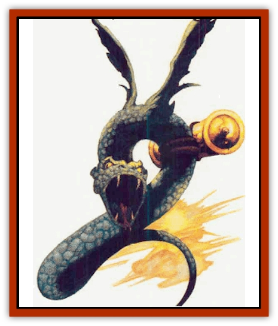

# Snake - Messenger

| Statistic | **Snake, Messenger** |
| --- | --- |
| **Activity Cycle:** | Any |
| **Alignment:** | Neutral |
| **Armor Class:** | 4 |
| **Climate/Terrain:** | Any |
| **Damage/Attack:** | 1d6 |
| **Diet:** | Omnivore |
| **Frequency:** | Verv rare |
| **Hit Dice:** | 3 |
| **Intelligence:** | Highly (13-14) |
| **Magic Resistance:** | 30% |
| **Morale:** | Steady (11-12) |
| **Movement:** | 6, FI 24 (8) |
| **No. Appearing:** | 1 |
| **No. of Attacks:** | 1 |
| **Organization:** | Solitary |
| **Size:** | S (2' long) |
| **Special Attacks:** | Poison |
| **Special Defenses:** | Chameleon |
| **THAC0:** | 17 |
| **Treasure:** | Nil |
| **XP Value:** | 975 |

For reasons never explained, Zhentish wizards dislike working with most [[Bird|birds]]. There are times, however, when messages need to be carried, and magic can he undependable and erratic, or is needed for other purposes. For these situations, a strange little reptile was bred the messenger [[Snake|snake]].

Messenger snakes are 2 feet long. Their coloring is a metallic, jade green. They have light green feathery wings resembling those of a parrot. They mimic human speech, speaking in a soft, hissing voice. Messenger snakes also have infravision (60-foot range) and an uncanny sense of direction.

**Combat:** Messenger snakes were not made for combat. However, in order to protect themselves, they have a bite that causes 1d6 points of damage and injects the target with a weak venom (onset 2d12 rounds, paralysis for 1d4 hours) unless the victim makes a successful saving throw vs. poison.

The snake's coloration shifts and changes as necessary, making it 50% undetectable by casual sight. Add to this the fact that the snake's flight is 75% silent, and it makes for a very effective messenger. The snake can even blend in with the color of an overcast sky, so that persons looking up from the ground would have a hard time telling that one of the snakes was flying above their heads.

In order to help it on its appointed rounds, the messenger snake can detect lie at will, and it always asks for identification (a name or code word that it has been taught with the message) before delivering its message. The snakes also have a special find the path ability that has a 100-mile radius and can be used only to find the person they are told to seek. The snakes can fly 200 miles a day. They must rest for an hour after 100 miles of flight before continuing on.

**Habitat/Society:** The messenger snake can carry up to two pounds of weight in its coils. Most of the time, the burden is a scroll with a written message. The item can be seen normally; the snake's blending ability does not affect it. However, the snake is also able to repeat a verbal message of up to 100 words, giving it only to the one person it was intended for.

Messenger snakes are never encountered in the wild. They are all raised by wizards who keep close track of them. The snakes mate once a year, laying a clutch of 2d4 eggs.

The original secret of breeding messenger snakes from a root stock of other snake species has been lost. There is talk that Zhentish mages are searching diligently for it, and will pay handsomely for useful information or its possible location.

Whenever a messenger snake is encountered, there is a 50% chance that it is carrying a small bundle. Roll 1d10 and consult the chart below:

| 1d10 Roll | Bundle Contents |
| --- | --- |
| 1-2 | Scroll containing a personal letter |
| 3 | Scroll with 1d4 wizard spells of level 14 |
| 4-5 | Odd trinket or personal article |
| 6 | Pouch with spell components |
| 7 | Potion bottle (roll randomly) |
| 8 | Small pouch with 20 pp |
| 9 | Pouch with 1d4 gems worth d100x10 gp |
| 10 | Small magical item (ring, figurine, etc.) |

**Ecology:** The messenger snake is found wherever Zhentish mages are found Zhentil Keep, the Citadel of the Raven, and Darkhold. They have also gained a measure of popularity in Mulmaster, Hillsfar, Tantras, Ravens Bluff, and the nations of Tnay and Calimshan. Many nations and regions dislike messenger snakes. In Waterdeep, the Dalelands, and Connyr, messenger snakes are shot down. In the Great Gray Land of Thar, the snakes are considered a delicacy.

Messenger snakes eat plants, insects, and small rodents, and live for about four decades, Rumor has it that the reason the Zhents are so frantic to find information on the origin of messenger snakes is that the snakes are becoming more intelligent, developing their own language and refusing to sewe. No one has ever been able to get a messenger snake to speak a word on its own, though, to confirm this.

Messenger snake eggs can be sold for up to 1,000 gp each; hatchlings fetch 2,500 gp.

---
## Discovery & Documentation

**Source Publication:** Monstrous Compendium, 1996 Annual, Volume 3 (1995)
**Campaign Setting:** Advanced Dungeons & Dragons 2nd Edition
**Author(s):** Jon Pickens

### Other Creatures Found in This Source Book
   * [[Alaghi|Alaghi]]
   * [[Alhoon|Alhoon]]
   * [[Aranea_Savage_Coast|Aranea (Savage Coast)]]
   * [[Arcane_Head|Arcane Head]]
   * [[Banedead|Banedead]]
   * [[Banelich|Banelich]]
   * [[Bat_Bonebat|Bat, Bonebat]]
   * [[Beetle|Beetle]]
   * [[Belgoi|Belgoi]]
   * [[Bladeling|Bladeling]]
   * [[Braxat|Braxat]]
   * [[Bunyip|Bunyip]]
   * [[Burbur|Burbur]]
   * [[Bvanen|Bvanen]]
   * [[Cat_Great_Snow_Tiger|Cat, Great, Snow Tiger]]
   * [[Chosen_One|Chosen One]]
   * [[Chronovoid|Chronovoid]]
   * [[Cildabrin|Cildabrin]]
   * [[Coffer_Corpse|Coffer Corpse]]
   * [[Disenchanter|Disenchanter]]
   * [[Dog_Temporal|Dog, Temporal]]
   * [[Dragon_Cerilia|Dragon (Cerilia)]]
   * [[Dragon_Ghost|Dragon, Ghost]]
   * [[Dragon_Lesser_Undead|Dragon, Lesser Undead]]
   * [[Dragon_Neutral_Amber|Dragon, Neutral, Amber]]
   * [[Dread_Warrior|Dread Warrior]]
   * [[Dreamweaver|Dreamweaver]]
   * [[Dream_Spawn_Greater_Ennui|Dream Spawn, Greater, Ennui]]
   * [[Dream_Spawn_Lesser_Morph|Dream Spawn, Lesser, Morph]]
   * [[Dwarf_Arctic|Dwarf, Arctic]]
   * [[Dwarf_Urdunnir|Dwarf, Urdunnir]]
   * [[Eel_Giant_Moray|Eel, Giant Moray]]
   * [[Elemental_Fire_Kin_Tome_Guardian|Elemental, Fire Kin, Tome Guardian]]
   * [[Elf_Rockseer|Elf, Rockseer]]
   * [[Ethyk|Ethyk]]
   * [[Faerie_Faerie_Fiddler|Faerie, Faerie Fiddler]]
   * [[Faerie_Petty_Bramble|Faerie, Petty, Bramble]]
   * [[Faerie_Petty_Gorse|Faerie, Petty, Gorse]]
   * [[Faerie_Petty|Faerie, Petty]]
   * [[Firenewt|Firenewt]]
   * [[Formian|Formian]]
   * [[Gargoyle_II|Gargoyle II]]
   * [[Giant_Cerilia|Giant (Cerilia)]]
   * [[Goblin_Cerilia|Goblin (Cerilia)]]
   * [[Golem_Magic|Golem, Magic]]
   * [[Golem_Shaboath|Golem, Shaboath]]
   * [[Hag_Bheur|Hag, Bheur]]
   * [[Hamadryad|Hamadryad]]
   * [[Hound_of_Ill-Omen|Hound of Ill-Omen]]
   * [[Human_Cerilia|Human (Cerilia)]]
   * [[Hybsil|Hybsil]]
   * [[Ibrandlin|Ibrandlin]]
   * [[Imp_Chaos|Imp, Chaos]]
   * [[Ixitxachitl_Ixzan|Ixitxachitl, Ixzan]]
   * [[Jabberwock|Jabberwock]]
   * [[Kyton|Kyton]]
   * [[Kyuss_Son_of|Kyuss, Son of]]
   * [[Lillend|Lillend]]
   * [[Life-Shaped_Creation_Guardian|Life-Shaped Creation, Guardian]]
   * [[Life-Shaped_Creation_Transport|Life-Shaped Creation, Transport]]
   * [[Lycanthrope_Werecrocodile|Lycanthrope, Werecrocodile]]
   * [[Lycanthrope_Werespider|Lycanthrope, Werespider]]
   * [[Magedoom|Magedoom]]
   * [[Manotaur|Manotaur]]
   * [[Mastiff_Shadow|Mastiff, Shadow]]
   * [[Meazel|Meazel]]
   * [[Mist_Scarlet_Dancer|Mist, Scarlet Dancer]]
   * [[Needleman|Needleman]]
   * [[Orc_Neo-Orog|Orc, Neo-Orog]]
   * [[Orc_Ondonti|Orc, Ondonti]]
   * [[Owlbear_II|Owlbear II]]
   * [[Pegataur|Pegataur]]
   * [[Phaerimm|Phaerimm]]
   * [[Reggelid|Reggelid]]
   * [[Render|Render]]
   * [[Saurial|Saurial]]
   * [[Scalamagdrion|Scalamagdrion]]
   * [[Sharn|Sharn]]
   * [[Spirit_Forest_Uthraki|Spirit, Forest, Uthraki]]
   * [[Spirit_Forest_Wood_Man|Spirit, Forest, Wood Man]]
   * [[Spirit_Ice_Orglash|Spirit, Ice, Orglash]]
   * [[Spirit_Rock_Thomil|Spirit, Rock, Thomil]]
   * [[Strider_Giant|Strider, Giant]]
   * [[Tembo|Tembo]]
   * [[Temporal_Glider|Temporal Glider]]
   * [[Temporal_Stalker|Temporal Stalker]]
   * [[Tether_Beast|Tether Beast]]
   * [[Thessalmonster|Thessalmonster]]
   * [[Time_Dimensional|Time Dimensional]]
   * [[Tomb_Tapper|Tomb Tapper]]
   * [[Undead_Dragon_Slayer|Undead Dragon Slayer]]
   * [[Unicorn_Black_Toril|Unicorn, Black (Toril)]]
   * [[Vaath|Vaath]]
   * [[Vortex_Spider|Vortex Spider]]
   * [[Weredragon|Weredragon]]
   * [[Zhentarim_Spirit|Zhentarim Spirit]]
