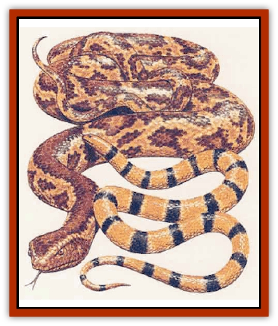

# Snake - Serpent

| Statistic | **Herald** | **Teak** |
| --- | --- | --- |
| **Activity Cycle:** | Any | Any |
| **Alignment:** | Neutral good | Neutral |
| **Armor Class:** | 5 | 3 |
| **Climate/Terrain:** | Tropical forest | Tropical forest |
| **Damage/Attack:** | 1d4/1d4 | 1d6/2d6 |
| **Diet:** | Carnivore | Carnivore |
| **Frequency:** | Rare | Rare |
| **Hit Dice:** | 4+4 | 8+8 |
| **Intelligence:** | Very (11-12) | Animal (1) |
| **Magic Resistance:** | Nil | Nil |
| **Morale:** | Average (8) | Average (10) |
| **Movement:** | 24, Cl 18 | 9, Cl 6 |
| **No. Appearing:** | 1 | 1-2 |
| **No. of Attacks:** | 2 | 2 |
| **Organization:** | Solitary | Solitary |
| **Size:** | M (7' long) | H (30' long) |
| **Special Attacks:** | Poison | Constriction, surprise |
| **Special Defenses:** | See below | Camouflage |
| **THAC0:** | 15 | 11 |
| **Treasure:** | Nil | Nil (B,Q&times;10,S,T) |
| **XP Value:** | 1,400 | 3,000 |

Two rare varieties of serpents, the herald serpent and the teak serpent, can be found in teeming tropical jungles, often in the company of other intelligent reptilian creatures.

## Herald Serpent

The heraid is a lightning-swift reptile wth sapphire or emerald colored eyes, and a body marked wirh black and gold bands. Hcralds are the enchanted messengers of [[Serpent_Lord|serpent lords]]. Like their masters, heralds are adept linguists and conversationalists, able to speak at least six languages fluently, including common.

**Combat:** Herald serpents are more likely to talk their way out of a confrontation than attack, using their silver tongues to flatter an opponent while planning an escape route. A herald serpent can cast the following spells, once/day, at the 4th level of ability: *friends*, *hypnotism*, *comprehend languages*, *hypnotic pattern*, and *invisibility*.

If negotiation fails and escape is impossible, the herald can physically attack with its lightning-swift bite, striking twice per round for 1d4 points of damage. The bite automitically delivers a potent toxin, with an onset time of only 1-3 rounds (saving throw vs. poison negates). Victims of the poison suffer complete amnesia, forgetting their own identities, abilities, even memorized spells for 2-8 hours.

**Habitat/Society:** Herald serpents are the enchanted messengers of serpent lords, who imbue their servants with magical gifts so they can deliver important notices or act as envoys on their lord's behalf. Before their enchantment, heralds are a colorful variety of poisonous jungle [[Snake|snake]]. Heralds serve their lord willingly and are usually returned to their normal state after completing the mission for which they were enchanted. A *dispel magic*, successful against 16th-level magic, will transform a herald back into a giant poisonous snake with lethal poison.

**Ecology:** As an enchanted creature, herald serpents have no niche in the ecology of the world, though like any snake, they must eat live prey (birds and small animals, mostly) to survive.

## Teak Serpent

Teak serpents are a variety of huge constrictor snakes inhabiting teak and ironwood forests. Adults often reach lengths exceeding 30 feet.

**Combat:** These reptiles resemble branches of the hardwood trees they inhabit, giving opponents a -2 penalty on surprise and the serpent a superior Armor Class (AC 3).

Teak serpents wait patiently in the upper canopy of trees for an unsuspecting victim to pass underneath, attacking from above with a combination bite and constriction attack. The bite inflicts 1d6 points of damage; if a constriction attack is successful, the serpent squeezes each round thereafter for 2d6 points of damage. The coils of a teak serpent are stronger than ironwood, requiring the combined efforts of 80 points of Strength to release a trapped victim. With their prodigious length, one of these serpents can constrict up to three man-sized creatures simultaneously.

**Habitat/Society:** Because of their ferocity and immense size, teak serpents are feared in the jungles they inhabit. Teak serpents usually subsist on a diet of large animals (preferring baby [[Elephant|elephants]], when they are available), but they will attack a small group of man-sized creatures without hesitation. They often sleep for up to a week after feeding.

**Ecology:** The scales of a teak serpent, if used while casting *barkskin*, provide a +2 bonus to Armor Class for the duration of the spell. Teak serpents are sometimes captured by powerful spellcasters and bound into magical staves.

---
## Discovery & Documentation

**Source Publication:** Monstrous Compendium, 1995 Annual, Volume 2 (1995)
**Campaign Setting:** Advanced Dungeons & Dragons 2nd Edition
**Author(s):** Jon Pickens

### Other Creatures Found in This Source Book
   * [[Aboleth_Savant|Aboleth, Savant]]
   * [[Addazahr|Addazahr]]
   * [[Amiq_Rasol|Amiq Rasol]]
   * [[Arch-Shadow|Arch-Shadow]]
   * [[Automaton_Scaladar|Automaton, Scaladar]]
   * [[Automaton_Trobriand's|Automaton, Trobriand's]]
   * [[Bat_Sporebat|Bat, Sporebat]]
   * [[Beetle_Dragon|Beetle, Dragon]]
   * [[Bi-nou|Bi-nou]]
   * [[Boggle|Boggle]]
   * [[Brownie_Dobie|Brownie, Dobie]]
   * [[Brownie_Quickling|Brownie, Quickling]]
   * [[Cat_Crypt|Cat, Crypt]]
   * [[Cat_Great_Cath_Shee|Cat, Great, Cath Shee]]
   * [[Centaur-kin_Dorvesh|Centaur-kin, Dorvesh]]
   * [[Centaur-kin_Gnoat|Centaur-kin, Gnoat]]
   * [[Centaur-kin_Ha'pony|Centaur-kin, Ha'pony]]
   * [[Centaur-kin_Zebranaur|Centaur-kin, Zebranaur]]
   * [[Chronolily|Chronolily]]
   * [[Curst|Curst]]
   * [[Darktentacles|Darktentacles]]
   * [[Dinosaur_Aquatic|Dinosaur, Aquatic]]
   * [[Dinosaur_II|Dinosaur II]]
   * [[Dinosaur_III|Dinosaur III]]
   * [[Doppelganger_Greater|Doppelganger, Greater]]
   * [[Dragon_Brine|Dragon, Brine]]
   * [[Dragon_Half-|Dragon, Half-]]
   * [[Dragon-kin_Sea_Wyrm|Dragon-kin, Sea Wyrm]]
   * [[Dwarf_Wild|Dwarf, Wild]]
   * [[Ekimmu|Ekimmu]]
   * [[Elemental_Nature|Elemental, Nature]]
   * [[Elf_Winged|Elf, Winged]]
   * [[Fish_Great_Glacier|Fish (Great Glacier)]]
   * [[Fish_Subterranean|Fish, Subterranean]]
   * [[Fish_Toril|Fish (Toril)]]
   * [[Flareater|Flareater]]
   * [[Flumph|Flumph]]
   * [[Froghemoth|Froghemoth]]
   * [[Ghost_Casurua|Ghost, Casurua]]
   * [[Ghost_Ker|Ghost, Ker]]
   * [[Ghul|Ghul]]
   * [[Ghul-Kin|Ghul-Kin]]
   * [[Giant_Half-giant|Giant, Half-giant]]
   * [[Golem_Burning_Man|Golem, Burning Man]]
   * [[Golem_Phantom_Flyer|Golem, Phantom Flyer]]
   * [[Gulguthhydra|Gulguthhydra]]
   * [[Hakeashar|Hakeashar]]
   * [[Horse_Moon-|Horse, Moon-]]
   * [[Human_Dragonslayer|Human, Dragonslayer]]
   * [[Human_Vistana|Human, Vistana]]
   * [[Jellyfish_Giant|Jellyfish, Giant]]
   * [[Kalin|Kalin]]
   * [[Kholiathra|Kholiathra]]
   * [[Laerti|Laerti]]
   * [[Leucrotta_Greater|Leucrotta, Greater]]
   * [[Lich_Suel|Lich, Suel]]
   * [[Lurker_Shadow|Lurker, Shadow]]
   * [[Lycanthrope_Werepanther|Lycanthrope, Werepanther]]
   * [[Lycanthrope_Wereshark|Lycanthrope, Wereshark]]
   * [[Mammal_Herd_II|Mammal, Herd II]]
   * [[Marl|Marl]]
   * [[Meenlock|Meenlock]]
   * [[Mimic_Greater|Mimic, Greater]]
   * [[Mold_II|Mold II]]
   * [[Mummy_Creature|Mummy, Creature]]
   * [[Nyth|Nyth]]
   * [[Ooze_Slime_Jelly_Ghaunadan|Ooze/Slime/Jelly, Ghaunadan]]
   * [[Palimpsest|Palimpsest]]
   * [[Peltast|Peltast]]
   * [[Plant_Dangerous_II|Plant, Dangerous II]]
   * [[Pleistocene_Animal|Pleistocene Animal]]
   * [[Pudding_Subterranean|Pudding, Subterranean]]
   * [[Raggamoffyn|Raggamoffyn]]
   * [[Snake_Serpent_Vine|Snake, Serpent Vine]]
   * [[Sphinx_Draco-|Sphinx, Draco-]]
   * [[Sprite_Seelie_Faerie|Sprite, Seelie Faerie]]
   * [[Sprite_Unseelie_Faerie|Sprite, Unseelie Faerie]]
   * [[Squealer|Squealer]]
   * [[Turtle_Giant|Turtle, Giant]]
   * [[Umpleby|Umpleby]]
   * [[Vizier's_Turban|Vizier's Turban]]
   * [[Wall_Walker|Wall Walker]]
   * [[Webbird|Webbird]]
   * [[Yak-Man|Yak-Man]]
   * [[Zorbo|Zorbo]]
