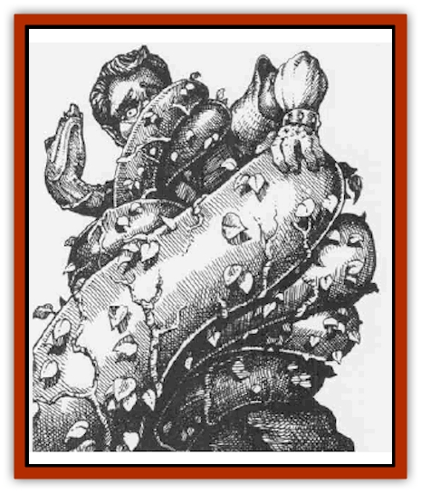

# Snake - Serpent Vine

| Statistic | **Snake, Serpent Vine** |
| --- | --- |
| **Activity Cycle:** | Any |
| **Alignment:** | Neutral (evil) |
| **Armor Class:** | 4 |
| **Climate/Terrain:** | Subterranean forest |
| **Damage/Attack:** | 1d12 |
| **Diet:** | Carnivorous |
| **Frequency:** | Uncommon |
| **Hit Dice:** | 10 |
| **Intelligence:** | Average (E-10) |
| **Magic Resistance:** | Nil |
| **Morale:** | Elite (13-14) |
| **Movement:** | 15 |
| **No. Appearing:** | 1 |
| **No. of Attacks:** | 1 |
| **Organization:** | Solitary |
| **Size:** | H (40' long) |
| **Special Attacks:** | Constriction, spells |
| **Special Defenses:** | Camouflage |
| **THAC0:** | 11 |
| **Treasure:** | Nil |
| **XP Value:** | 2,000 |

Serpent vines are a magical cross between a giant constrictor [[Snake|snake]] and a plant. They live in the vast subterranean forests. These matures looks like vines, and only can be distinguished as living animals 25% of the time by those who have seen them before and are specifically looking for the snakes. Those unfamiliar with theses snakes have only a 5% chance to detect anything other than an actual vine.

The long, thin body of a serpent vine is covered with heartshaped green leaves and smaller vines that curve around the entire length of the snake. The leaves actually aid in the creature's movement, acting like small feet that help propel the snake quickly through the underbrush. All serpent vines are green and are able to adjust the shading of their bodies to match that of the trees they hang from or foliage they lie among. Serpent vines are very rarely encountered on bare ground, and only then when the snakes are passing over it. The serpents cling to the green foliage of the underground forests for protection. The snakes are most often discovered hanging amid normal vines on tall trees, where they have the best vantage point to use their spells on unsuspecting prey.

**Combat:** Serpent vines will go out of their way to attack humans and demihumans because the snakes consider these creatures delicacies. A serpent vine's favorite combat tactic is to hang from a branch that overlooks a forest trail and to use its spells to lure in its prey. Three times a day, a serpent vine can cast *spectral force*. A vine often uses this spell to add luscious-looking, ripe fruit to its body-especially around its mouth.

Once a day, a serpent vine can use the following innate spell abilities: *charm person*, *hold person*, *suggestion*, and *mass suggestion* (up to 5 creatures). It uses suggestions and charms to hint that the affected individuals should relax, come closer, and touch the vine. If a serpent vine has dominated its victim or victims by its spells, it eases its body from the tree, wraps itself about a target, then bites and constricts in the same round. A constriction attack causes 4d4 points of damage. These attacks are automatically successful in the first round if the victim fell for the snake's magic. However, the effects of the spells are negated after the initial attack.

The snakes are cunning and will first attack creatures which are under *suggestion* spells. When finished with those targets, it moves on to the *held* and *charmed* victims.

If a partv of individuals encounter a snake, and the snake's spells do not effect any of its intended targets, the snake uses its camouflage ability and quick movement to disappear into the undergrowth. Serpent vines are not foolish enough to attack when the odds are against them. Further, the snakes will not attack groups comprised solely of [[Elf_Drow|dark elves]], which have proven resistant to its charms. However, the snakes have been known to attack up to three individuals unaffected by their magic, constricting first and then biting immobilized foes.

**Habitat/Society:** Serpent vines are solitary creatures which do not even associate with others of their kind. They live high in underground trees, laying their eggs in hollowed sections of thick branches or trunks. Each snake will lay 1d6 eggs every four months, and will warm the eggs with its body until they hatch (usually three to four weeks). The snakes are less active during this time, attacking prey only to eat and not for enjoyment. The baby serpent vines are roughly one foot long upon hatching, and are quickly sent down the tree to survive on their own or to fall prey to other subterranean carnivores.

**Ecology:** Serpent vines are important to the ecosystems of subterranean forests, as they often kill more than they can eat. The kills left behind serve as food for lesser carnivores and help nourish the natural and sentient plant life. As a natural part of an insular food chain, adult serpent vines prey upon all warm-blooded creatum within the forest, but favor humans and demihumans, particularly [[Gnome|gnomes]] and [[Halfling|halflings]], which they consider sweet flesh. In return, the serpent vines are often hunted by rangers and druids, who view them as a serious threat.

---
## Discovery & Documentation

**Source Publication:** Monstrous Compendium, 1995 Annual, Volume 2 (1995)
**Campaign Setting:** Advanced Dungeons & Dragons 2nd Edition
**Author(s):** Jon Pickens

### Other Creatures Found in This Source Book
   * [[Aboleth_Savant|Aboleth, Savant]]
   * [[Addazahr|Addazahr]]
   * [[Amiq_Rasol|Amiq Rasol]]
   * [[Arch-Shadow|Arch-Shadow]]
   * [[Automaton_Scaladar|Automaton, Scaladar]]
   * [[Automaton_Trobriand's|Automaton, Trobriand's]]
   * [[Bat_Sporebat|Bat, Sporebat]]
   * [[Beetle_Dragon|Beetle, Dragon]]
   * [[Bi-nou|Bi-nou]]
   * [[Boggle|Boggle]]
   * [[Brownie_Dobie|Brownie, Dobie]]
   * [[Brownie_Quickling|Brownie, Quickling]]
   * [[Cat_Crypt|Cat, Crypt]]
   * [[Cat_Great_Cath_Shee|Cat, Great, Cath Shee]]
   * [[Centaur-kin_Dorvesh|Centaur-kin, Dorvesh]]
   * [[Centaur-kin_Gnoat|Centaur-kin, Gnoat]]
   * [[Centaur-kin_Ha'pony|Centaur-kin, Ha'pony]]
   * [[Centaur-kin_Zebranaur|Centaur-kin, Zebranaur]]
   * [[Chronolily|Chronolily]]
   * [[Curst|Curst]]
   * [[Darktentacles|Darktentacles]]
   * [[Dinosaur_Aquatic|Dinosaur, Aquatic]]
   * [[Dinosaur_II|Dinosaur II]]
   * [[Dinosaur_III|Dinosaur III]]
   * [[Doppelganger_Greater|Doppelganger, Greater]]
   * [[Dragon_Brine|Dragon, Brine]]
   * [[Dragon_Half-|Dragon, Half-]]
   * [[Dragon-kin_Sea_Wyrm|Dragon-kin, Sea Wyrm]]
   * [[Dwarf_Wild|Dwarf, Wild]]
   * [[Ekimmu|Ekimmu]]
   * [[Elemental_Nature|Elemental, Nature]]
   * [[Elf_Winged|Elf, Winged]]
   * [[Fish_Great_Glacier|Fish (Great Glacier)]]
   * [[Fish_Subterranean|Fish, Subterranean]]
   * [[Fish_Toril|Fish (Toril)]]
   * [[Flareater|Flareater]]
   * [[Flumph|Flumph]]
   * [[Froghemoth|Froghemoth]]
   * [[Ghost_Casurua|Ghost, Casurua]]
   * [[Ghost_Ker|Ghost, Ker]]
   * [[Ghul|Ghul]]
   * [[Ghul-Kin|Ghul-Kin]]
   * [[Giant_Half-giant|Giant, Half-giant]]
   * [[Golem_Burning_Man|Golem, Burning Man]]
   * [[Golem_Phantom_Flyer|Golem, Phantom Flyer]]
   * [[Gulguthhydra|Gulguthhydra]]
   * [[Hakeashar|Hakeashar]]
   * [[Horse_Moon-|Horse, Moon-]]
   * [[Human_Dragonslayer|Human, Dragonslayer]]
   * [[Human_Vistana|Human, Vistana]]
   * [[Jellyfish_Giant|Jellyfish, Giant]]
   * [[Kalin|Kalin]]
   * [[Kholiathra|Kholiathra]]
   * [[Laerti|Laerti]]
   * [[Leucrotta_Greater|Leucrotta, Greater]]
   * [[Lich_Suel|Lich, Suel]]
   * [[Lurker_Shadow|Lurker, Shadow]]
   * [[Lycanthrope_Werepanther|Lycanthrope, Werepanther]]
   * [[Lycanthrope_Wereshark|Lycanthrope, Wereshark]]
   * [[Mammal_Herd_II|Mammal, Herd II]]
   * [[Marl|Marl]]
   * [[Meenlock|Meenlock]]
   * [[Mimic_Greater|Mimic, Greater]]
   * [[Mold_II|Mold II]]
   * [[Mummy_Creature|Mummy, Creature]]
   * [[Nyth|Nyth]]
   * [[Ooze_Slime_Jelly_Ghaunadan|Ooze/Slime/Jelly, Ghaunadan]]
   * [[Palimpsest|Palimpsest]]
   * [[Peltast|Peltast]]
   * [[Plant_Dangerous_II|Plant, Dangerous II]]
   * [[Pleistocene_Animal|Pleistocene Animal]]
   * [[Pudding_Subterranean|Pudding, Subterranean]]
   * [[Raggamoffyn|Raggamoffyn]]
   * [[Snake_Serpent|Snake, Serpent]]
   * [[Sphinx_Draco-|Sphinx, Draco-]]
   * [[Sprite_Seelie_Faerie|Sprite, Seelie Faerie]]
   * [[Sprite_Unseelie_Faerie|Sprite, Unseelie Faerie]]
   * [[Squealer|Squealer]]
   * [[Turtle_Giant|Turtle, Giant]]
   * [[Umpleby|Umpleby]]
   * [[Vizier's_Turban|Vizier's Turban]]
   * [[Wall_Walker|Wall Walker]]
   * [[Webbird|Webbird]]
   * [[Yak-Man|Yak-Man]]
   * [[Zorbo|Zorbo]]
