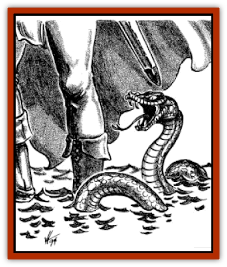

# Snake - Sewerm

| Statistic | **Snake, Sewerm** |
| --- | --- |
| **Activity Cycle:** | Any |
| **Alignment:** | Neutral |
| **Armor Class:** | 5 |
| **Climate/Terrain:** | Temperate/Subterranean or swamp |
| **Damage/Attack:** | 1-4 |
| **Diet:** | Carnivore |
| **Frequency:** | Rare |
| **Hit Dice:** | 2-4 |
| **Intelligence:** | Animal (1) |
| **Magic Resistance:** | Nil |
| **Morale:** | Unsteady (6) |
| **Movement:** | 12, Sw 9 |
| **No. Appearing:** | 1-6 |
| **No. of Attacks:** | 1 |
| **Organization:** | Solitary |
| **Size:** | 2 HD: S (2-3') / 3 HD: M (4-5') / 4 HD: M (6') |
| **Special Attacks:** | Drain blood |
| **Special Defenses:** | Anaesthetic slime |
| **THAC0:** | 2 HD: 19 / 3-4 HD: 17 |
| **Treasure:** | Nil |
| **XP Value:** | 2 HD: 120 / 3 HD: 175 / 4 HD: 270 |

The sewerm is a relatively large water [[Snake|snake]] found in the sewers of Waterdeep (thus its name) and the fouled, fetid waters of the swamps of the northern Sword Coast (the Mere of Dead Men, the Stump Bog, etc.) Its tan-and-brown scales over a mottled green underbelly grant it great camouflage abilities in the dark sewers, and they can swim at remarkable speeds.

**Combat:** Sewerms use their coloration as camouflage in the swamps and sewers, gaining a surprise bonus of +2 against any opponents. The sewerm secretes an anaesthetic oil through its skin that locally deadens a character's sense of touch; the snake often wraps around a character's boot and leg as it attacks, allowing it to be carried along while it feeds. If the sewerm gained surprise, the character will not notice the sewerm until a successful Wisdom check is rolled (check once per round). The sewerm's anaesthetic is also secreted through its fangs, making its bite totally painless; once bitten, the victim is drained of 1-4 hit points per round as the sewerm drains the character of blood. Characters will often simply get weaker and weaker, dropping dead from blood loss, before they even feel the snake attached to them. It only takes a Strength check to dislodge a sewerm from a character, and (luckily) the wound closes almost immediately; the snake's anaesthetic also acts as a disinfectant, preventing anyone from contracting any illness from the brackish water through the wound.

Sewerms only attack warm-blooded creatures and they strike at areas of exposed flesh (or through cloth, not leather) close to the waterline of where they encounter their prey; their common prey has been plumbers in the sewers of Waterdeep, and they strike just at the top of the boot. They can, with one round of preparation, coil themselves up and spring out of the water, striking out to their full length; this attack is becoming more common as people moving through the sewers are wearing hip boots, forcing the snakes to use this more blatant (but startling - surprise bonus of +4) attack.

**Habitat/Society:** Sewerms are water snakes that have adapted to living in sewers and swamps and feeding off warm blood, similar to a [[Leech|leech]]. They often hunt alone but, on rare occasions, travel in small groups of up to six snakes; other than immediately after birth (where there are 5-20 ½-HD sewerms and one 4-HD mother), sewerms do not collect in large gatherings.

**Ecology:** Sewerms, while being a dangerous nuisance to those of the Cellarers' and Plumbers' Guild in Waterdeep's sewers, are highly prized in many ways by those of the Guild of Apothecaries and Physicians and others about the city; the Pain-deadening effects of the sewerm's venom are helpful to their work and, with proper preparations, can be stored for up to six months before the venom breaks down and is useless. Sewerms shed their skins once a year; the guild will purchase whole skins at 2 silver pieces each. Whole snakes are also purchased by the guild and other interested parties, should any plumbers (or adventurers) find any down in the sewers; guild prices are 5 silver pieces per Hit Die of the sewerm (1 gold piece per Hit Die if still alive). Kromnlor Sernar the sage is much quieter about her interest, but she buys sewerms at 1 gold piece per Hit Die, regardless of condition.

---
## Discovery & Documentation

**Source Publication:** City of Splendors (1994)
**Campaign Setting:** Forgotten Realms
**Author(s):** Ed Greenwood, Elain Cunningham

### Other Creatures Found in This Source Book
   * [[Curst|Curst]]
   * [[Doppelganger_Greater|Doppelganger, Greater]]
   * [[Duhlarkin|Duhlarkin]]
   * [[Gulguthhydra|Gulguthhydra]]
   * [[Hakeashar|Hakeashar]]
   * [[Leucrotta_Greater|Leucrotta, Greater]]
   * [[Lycanthrope_Wereshark|Lycanthrope, Wereshark]]
   * [[Nyth|Nyth]]
   * [[Ooze_Slime_Jelly_Ghaunadan|Ooze/Slime/Jelly, Ghaunadan]]
   * [[Palimpsest|Palimpsest]]
   * [[Peltast|Peltast]]
   * [[Raggamoffyn|Raggamoffyn]]
   * [[Shadowrath|Shadowrath]]
   * [[Watchspider|Watchspider]]
