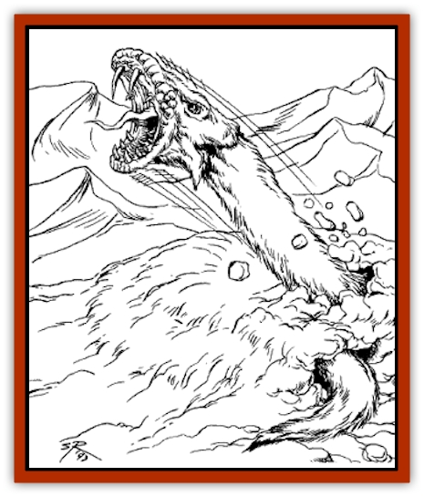

# Snow Serpent

| Statistic | **Snow Serpent** |
| --- | --- |
| **Activity Cycle:** | Day |
| **Alignment:** | Neutral |
| **Armor Class:** | 6 |
| **Climate/Terrain:** | Arctic/tundra/mountains (Stardock) |
| **Damage/Attack:** | 1-10 |
| **Diet:** | Carnivore |
| **Frequency:** | Rare |
| **Hit Dice:** | 10 |
| **Intelligence:** | Animal (1) |
| **Magic Resistance:** | Nil |
| **Morale:** | Steady (11-12) |
| **Movement:** | 9 |
| **No. Appearing:** | 1 |
| **No. of Attacks:** | 1 |
| **Organization:** | Solitary |
| **Size:** | G (30' long) |
| **Special Attacks:** | Poison breath |
| **Special Defenses:** | Camouflage |
| **THAC0:** | 11 |
| **Treasure:** | Nil |
| **XP Value:** | 2,000 |

The snow serpent is actually a legless mammal which lives in the cold northern latitudes of Nehwon. Solitary and carnivorous, snow serpents are a danger to travelers, but are also hunted by brave adventurers since the creatures' skins are quite valuable.

**Combat:** The snow serpent's white coloration allows it to hide in ice and snowfields. A concealed snow serpent can only be detected 15% of the time if a character is actively searching for hidden objects.

Attacking with automatic surprise, an undetected snow serpent inflicts 1d10 points of damage with its savage bite. Its breath weapon inflicts 1d8 points of damage on all targets in a cone-shaped pattern in front of its mouth. The cone is 10' long, 1' at the serpent's mouth, and 8' at the base. The breath weapon is corrosive. Those struck by it must save vs. breath weapons or take an additional 1d6 points of damage (no extra damage if the save is successful).

**Habitat/Society:** Snow serpents live alone in out-of-theway places throughout the Cold Waste. During the day, they lie in wait for prey, while at night they curl up in snow caves or crevices.

Mating takes place in the late spring when much of the Cold Waste thaws. During this time, snow serpents migrate to higher elevations where they can remain camouflaged. Litters of 2d4 young serpents are born in caves or burrows. These young serpents are harmless until they mature in early fall.

**Ecology:** Snow serpent skins are worth 100-600 gp each depending on condition. This price only applies to fully grown snow serpents as they do not develop their luxuriant fur until they are fully grown.

---
## Discovery & Documentation

**Source Publication:** Lankhmar: City of Adventure (2nd Ed.) (1993)
**Campaign Setting:** Lankhmar
**Author(s):** Bruce Nesmith, Douglas Niles, and Ken Rolston

### Other Creatures Found in This Source Book
   * [[Astral_Wolf|Astral Wolf]]
   * [[Behemoth|Behemoth]]
   * [[Bird_of_Tyaa|Bird of Tyaa]]
   * [[Cat_War|Cat, War]]
   * [[Cloaker_Sea|Cloaker, Sea]]
   * [[Cold_Woman|Cold Woman]]
   * [[Devourer_Lankhmar|Devourer (Lankhmar)]]
   * [[Ghoul_Kleshite|Ghoul, Kleshite]]
   * [[Ghoul_Lankhmar|Ghoul (Lankhmar)]]
   * [[Gladiator_Lizard|Gladiator Lizard]]
   * [[Horag|Horag]]
   * [[Howler|Howler]]
   * [[Ice_Gnome|Ice Gnome]]
   * [[Invisible_of_Stardock|Invisible of Stardock]]
   * [[Lizard|Lizard]]
   * [[Ophidian|Ophidian]]
   * [[Ray_Invisible_Flying|Ray, Invisible Flying]]
   * [[Scorpion|Scorpion]]
   * [[Simorgyan|Simorgyan]]
   * [[Thunder_Children|Thunder Children]]
   * [[Wraith-Spider|Wraith-Spider]]
   * [[Zombie_Sea|Zombie, Sea]]
