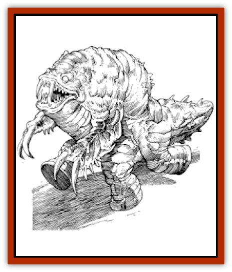

# So-ut

| Statistic | **So-ut** |
| --- | --- |
| **Activity Cycle:** | Night |
| **Alignment:** | Chaotic evil |
| **Armor Class:** | -4 |
| **Climate/Terrain:** | Tablelands |
| **Damage/Attack:** | 2-12/2-12 + special or 3-18 |
| **Diet:** | Carnivore |
| **Frequency:** | Very rare |
| **Hit Dice:** | 14+2 |
| **Intelligence:** | Semi- (2-4) |
| **Magic Resistance:** | 25% |
| **Morale:** | Fearless (19-20) |
| **Movement:** | 18 |
| **No. Appearing:** | 1 |
| **No. of Attacks:** | 2 or 1 |
| **Organization:** | Solitary |
| **Size:** | L to H (10-15' long) |
| **Special Attacks:** | Fear, acidic poison, armor bite |
| **Special Defenses:** | ½ damage from nonmetal weapons, immune to psionics |
| **THAC0:** | 7 |
| **Treasure:** | Nil |
| **XP Value:** | 10,000 |

The so-ut, or rampagers, are fierce creatures that live only for the sake of destruction. They know no fear and hate the things of men, like weapons and buildings.

A rampager is a huge, six-legged creature with gray scales covering its whole body. These scales are unusually thick and almost impossible to cut through. The four rear legs are large round pads, while the two front legs have claws as long as daggers. The face is out of a nightmare, with long, dirty fangs and glowing red eyes. Its nose is similar to a vestigial horn, and they have small rounded ears. Its hearing is very poor, but its sense of smell is acute.

No one has ever been able to communicate with a so-ut.

**Combat:** A so-ut only attacks at night. The charge of a so-ut causes fear in all intelligent creatures of five HD or less. A saving throw is allowed to avoid this effect, and anyone of nine HD or higher is immune to the fear. A being of six HD or more receives a +2 bonus to the save. Those who succumb to this fear flee in terror for 2d8 rounds or until the so-ut is out of sight, whichever takes longer. [[Thri-kreen|Thri-kreen]] are immune to this fear effect.

So-ut are meat-eaters, but rarely attack demi-humans for food. They are driven mad by the smell of manufactured items, particularly metal. The sight of a building also seems to enrage them. A so-ut always attacks the largest manmade object present. It attempts to destroy metal in preference to anything else. In other words, if a group of adventurers are defending a building, anyone in metal armor would be attacked first, someone with a metal weapon would be next, and then the so-ut would attempt to raze the building. It makes no difference to a rampager if he leaves attackers behind him while he destroys a shack; the so-ut will get to them in due time. Only if the so-ut is severely damaged (hit points reduced by 50% or more) will he turn to deal with his attackers.

In melee, so-ut are terrible foes. They are able to attack with both foreclaws, each claw inflicting 2d6 points of damage. The claws also secrete an acidic poison. Anyone who is hit by a claw must save versus poison or take 20 extra points of damage. A successful saving throw means only 5 extra points of damage are suffered. It is against manmade objects that the acid is especially effective. Armor or weapons must save versus acid or fall apart, corroded and useless in one round. Metal items save at a -2 penalty. Rampagers always attack armor and weapons first. This gives it a -4 attack roll penalty with its claws, until the armor or weapon is destroyed.

The so-ut can also attack with their fangs, delivering a bite that causes 3d6 points of damage. The bite does not produce acid, although if the so-ut attack roll is 4 or more greater than needed, he may have bitten through a character's armor. A saving throw versus crushing blow is required or the armor's usefulness is lowered by one point (AC reduced by 1) permanently.

In melee the so-ut is very swift, receiving no modifier to initiative despite its large size.

**Habitat/Society:** Rampagers are lone, fortunately very rare, creatures. They live only to destroy the works of men.

Rampagers generally sleep during the heat of the day, and a bold adventurer can even walk across one without waking it. During the day a so-ut does have the initiative modifier for its great size.

**Ecology:** So-ut live off of their victims. After the so-ut has destroyed all manmade articles in sight, it usually settles down to feed off of the bodies left in its wake.

A rampager's scales make excellent armor. A complete undamaged so-ut hide is worth as much as 100 silver pieces, but must be cured by a leatherworker and then fashioned by an armorer. Such armor can be made into a set of scale mail that provides as good a protection as metal chain mail (AC 5). Unfortunately, it also weighs as much as metal chain mail and is just as uncomfortable in the heat of the day.

---
## Discovery & Documentation

**Source Publication:** MC12 Dark Sun Appendix I - Terrors of the Desert (1991)
**Campaign Setting:** Dark Sun
**Author(s):** Tom Prusa, Louis J. Prosperi, Walter M. Baas

### Other Creatures Found in This Source Book
   * [[Animal_Herd_Athas|Animal, Herd (Athas)]]
   * [[Animal_Household_Athas|Animal, Household (Athas)]]
   * [[Antloid_Desert|Antloid, Desert]]
   * [[Banshee_Dwarf|Banshee, Dwarf]]
   * [[Beetle_Agony|Beetle, Agony]]
   * [[Bog_Wader|Bog Wader]]
   * [[Brambleweed|Brambleweed]]
   * [[B'rohg|B'rohg]]
   * [[Burnflower|Burnflower]]
   * [[Cat_Psionic|Cat, Psionic]]
   * [[Cha'thrang|Cha'thrang]]
   * [[Cistern_Fiend|Cistern Fiend]]
   * [[Clam_Giant|Clam, Giant]]
   * [[Cloud_Ray|Cloud Ray]]
   * [[Drake_Athas_Air|Drake (Athas), Air]]
   * [[Drake_Athas_Earth|Drake (Athas), Earth]]
   * [[Drake_Athas_Fire|Drake (Athas), Fire]]
   * [[Drake_Athas_Water|Drake (Athas), Water]]
   * [[Dune_Runner|Dune Runner]]
   * [[Dune_Trapper|Dune Trapper]]
   * [[Elemental_Athas_Greater_Air|Elemental (Athas), Greater, Air]]
   * [[Elemental_Athas_Greater_Earth|Elemental (Athas), Greater, Earth]]
   * [[Elemental_Athas_Greater_Fire|Elemental (Athas), Greater, Fire]]
   * [[Elemental_Athas_Greater_Water|Elemental (Athas), Greater, Water]]
   * [[Elemental_Athas_Lesser_Air_Earth|Elemental (Athas), Lesser, Air/Earth]]
   * [[Elemental_Athas_Lesser_Fire_Water|Elemental (Athas), Lesser, Fire/Water]]
   * [[Elemental_Athas_General_Information|Elemental (Athas), General Information]]
   * [[Erdland|Erdland]]
   * [[Esperweed|Esperweed]]
   * [[Flailer|Flailer]]
   * [[Floater|Floater]]
   * [[Giant_Athas|Giant (Athas)]]
   * [[Golem_Athas_I|Golem (Athas) I]]
   * [[Golem_Athas_II|Golem (Athas) II]]
   * [[Golem_Athas_III|Golem (Athas) III]]
   * [[Golem_Athas_General_Information|Golem (Athas), General Information]]
   * [[Halfling_Renegade|Halfling, Renegade]]
   * [[Hej-kin|Hej-kin]]
   * [[Id_Fiend|Id Fiend]]
   * [[Insect_Swarm_Athas|Insect Swarm (Athas)]]
   * [[Kank_Wild|Kank, Wild]]
   * [[Kirre|Kirre]]
   * [[Megapede|Megapede]]
   * [[Mul_Wild|Mul, Wild]]
   * [[Nightmare_Beast|Nightmare Beast]]
   * [[Plant_Carnivorous_Athas|Plant, Carnivorous (Athas)]]
   * [[Pterran|Pterran]]
   * [[Pterrax|Pterrax]]
   * [[Pulp_Bee|Pulp Bee]]
   * [[Pyreen|Pyreen]]
   * [[Rasclinn|Rasclinn]]
   * [[Razorwing|Razorwing]]
   * [[Roc_Athas|Roc (Athas)]]
   * [[Sand_Bride|Sand Bride]]
   * [[Sand_Cactus|Sand Cactus]]
   * [[Sand_Vortex|Sand Vortex]]
   * [[Scrab|Scrab]]
   * [[Silt_Horror|Silt Horror]]
   * [[Silt_Runner|Silt Runner]]
   * [[Sink_Worm|Sink Worm]]
   * [[Sloth_Athas|Sloth (Athas)]]
   * [[Spider_Cactus|Spider Cactus]]
   * [[Spider_Crystal|Spider, Crystal]]
   * [[Spirit_of_the_Land|Spirit of the Land]]
   * [[T'Chowb|T'Chowb]]
   * [[Thrax|Thrax]]
   * [[Tohr-kreen_I|Tohr-kreen I]]
   * [[Villichi|Villichi]]
   * [[Zhackal|Zhackal]]
   * [[Zombie_Plant|Zombie Plant]]
