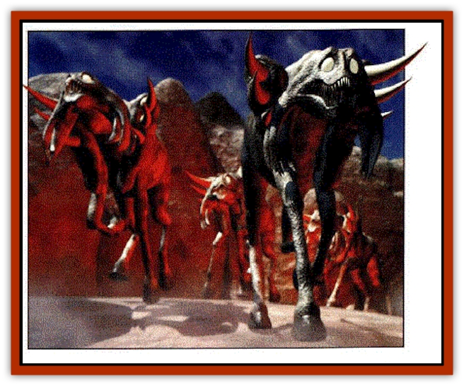
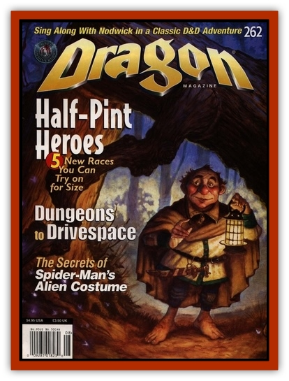

# Sohmien

| Statistic | **Sohmien** |
| --- | --- |
| **Activity Cycle:** | Nocturnal |
| **Alignment:** | Chaotic evil |
| **Armor Class:** | 8 |
| **Climate/Terrain:** | Plains/Hinterlands |
| **Damage/Attack:** | 1-6/1-6/1-6/l--8/l--8 |
| **Diet:** | Special |
| **Frequency:** | Varies (see below) |
| **Hit Dice:** | 2+1 |
| **Intelligence:** | Animal(l) |
| **Magic Resistance:** | Nil |
| **Morale:** | Fearless (19-20) |
| **Movement:** | 15 |
| **No. Appearing:** | Varies |
| **No. of Attacks:** | 1 bite/2 hooves/I gore/1 spine |
| **Organization:** | Herd |
| **Size:** | M |
| **Special Attacks:** | Spines, fear stampede |
| **Special Defenses:** | Nil |
| **THAC0:** | 18 |
| **Treasure:** | Nil |
| **XP Value:** | 270 |

Sohmien resemble huge horses with leathery, ashen hides and dead white eyes. They leave trails of mist in their wakes; the mist resembles that which shrouds the Hinterlands. The touch of their hooves kills vegetation and taints the land for years.

Their shoulder blades extend beyond their heads and necks, and three bone spikes (extensions of their spinal column) sprout from each shoulder.

These creatures are said to have been born from the fall of the last of the nightmare lords. According to legend, this nightmare lord was lured to the Gloom Meet by his subjects, then attacked by fiends who had tired of bartering for permission to use his nightmares. The nightmare lord was driven into the Hinterlands, his body riddled by cold iron spears and arrows. It is believed that where his blood struck the earth, sohmien sprang forth.

Sohmien hate nightmares and attack them over all other targets. It is said the ride of the sohmien will not end until they kill every nightmare in existence.

**Combat:** Sohmien prefer to attack with the spines that project from their shoulder blades. Three spines sprout from each shoulder; the top two primary spines can be fired at an opponent for 1-8 points of damage each. Their spines make a horrible whistling noise when fired and shriek when they taste blood. The spines are treated as +l enchanted weapons, inflict double damage against nightmares, and regrow in 2d4days.

After firing both primary spines, sohmien gore with their secondary spines. The sohmien prefer to aim for non-vital areas, allowing the creature to experience as much pain as possible before closing in for the kill.

The sohmien's secondary spines extend a foot past their heads, impaling a target for 1--8 points of damage. On a natural 20, the spines have gored the opponent so deeply that the Sohrnien can also bite the target for 1-6 points of damage. They have been known to bite and trample a target with their hooves for 1-6 points of damage each, but this is rare.

The stampede of the sohmien inspires fear in any creature with fewer than 2 HD, forcing a Morale check. Nic'Epona, bariaur, and horses receive a +4 bonus to their Morale checks. The sohrnien can only stampede at dusk and only at the request of someone who has invoked them (see below).

**Habitat/Society:** According to myth, sohmien are creatures of vengeance. They can be summoned by any vengeful mage or priest of sufficient power through a ritual called the *sohmien pact* (a spell believed lost long ago). 

When summoned, sohmien must be ordered to ride, destroying all in the path leading to the creature that has wronged the summoner. The ride ends only when the sohmien are slain or when they have reduced the offending creature to near-death (1 hit point). At that point, the sohmien wait, pawing the ground. If their victim desires revenge for the attack, he can send the sohmien stampeding back to the summoner. What happens when the sohmien return is unknown, but chronicles state the summoner vanishes forever. Myths claim the summoner's voice joins the frightful wails that follow the sohmien as they ride from the Hinterlands.

No one has ever successfully used a sohmien as a mount.

**Ecology:** Sohmien do not eat, sleep, or mate; their rides are governed by some cycle that eludes scholars, for herds of them emerge from the Hinterlands randomly, then return. It is likely they appear only when a creature craves vengeance.

The spines of the sohmien are useful for harming, binding, or (in some circumstances) summoning nightmares. They can also be used to make *arrows of slaying nightmares* and for strengthening enchantments in weapons of vengeance. (Usually the spine is ground to powder and applied to the blade.)

---
## Discovery & Documentation

**Source Publication:** Dragon262 (1999)
**Campaign Setting:** Dragon Magazine
**Author(s):** Chris Avellone

### Other Creatures Found in This Source Book
   * [[Grillig|Grillig]]
   * [[Gronk|Gronk]]
   * [[Trelon|Trelon]]
