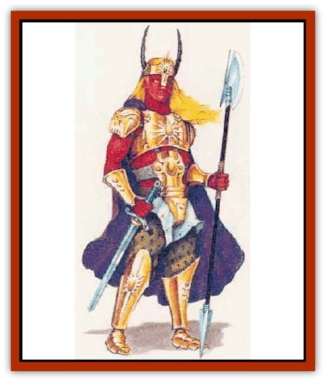

# Sollux

| Statistic | **Sollux** |
| --- | --- |
| **Activity Cycle:** | Any |
| **Alignment:** | Lawful neutral |
| **Armor Class:** | 0 (8) |
| **Climate/Terrain:** | Desert, mountain, subterranean |
| **Damage/Attack:** | By weapon +3 |
| **Diet:** | Omnivore |
| **Frequency:** | Very rare |
| **Hit Dice:** | 10-14 |
| **Intelligence:** | Highly (13-14) |
| **Magic Resistance:** | Nil |
| **Morale:** | Champion (16) |
| **Movement:** | 12 |
| **No. Appearing:** | 1 |
| **No. of Attacks:** | 2 (5/2) |
| **Organization:** | Solitary |
| **Size:** | M (7' tall) |
| **Special Attacks:** | Weapon specialization, exceptional Strength |
| **Special Defenses:** | Immune to fire and illusions, saving throw bonus vs. magic |
| **THAC0:** | 10 HD: 11 / 11 HD: 10 / 12 HD: 9 / 13 HD: 8 / 14 HD: 7 /  |
| **Treasure:** | Z |
| **XP Value:** | 10 HD: 3,000 / 11 HD: 4,000 / 12 HD: 5,000 / 13 HD: 6,000 / 14 HD: 7,000 |

Sollux are tall, statuesque demihumans with crimson skin and bright yellow hair. The irises of their eyes are brilliant white or intense blue; the "whites" of their eyes are glowing yellow, tinged with red.

Adults of both sexes are about 7 feet tall, or slightly taller, and weigh from 180 to 240 pounds.

**Combat:** Adult sollux have Strength scores ranging from 18/01 to 18/50; they receive a +1 attack bonus and +3 damage bonus in combat. Sollux are very dexterous and typically have Dexterity scores of 16 or higher.

Most sollux that adventurers meet are members of the Brotherhood of the Sun, a knightly order which seeks to confront and defeat [[Genie|efreet]] on the Prime Material Plane. Its members are called Brothers of the Sun, or sun brothers, whether male or female. Brothers of the Sun wear red-gold plate mail and carry large metal shields that glow with a continual light effect. A Brother of the Sun has a morale rating of 20 when fighting efreet. Brothers of the Sun always carry a variety of weapons, including a long sword, a spear, a dagger, a lasso, and a missile weapon - usually a short composite bow. A sun brother's magical items, if he or she has any, are usually enchanted weapons or armor. Most sun brothers are 10th- to 14th-level fighters, but the leader of the order is said to be a mighty warrior of 16th level who wields a *long sword of efreezi slaying +3*. Every sun brother is a specialist in his or her favorite melee weapon, usually a long sword.

All sollux are immune to normal fire and to all types of illusions, and they can detect invisibility at will. Sollux receive a +1 bonus to any saving throw vs. a magical attack and subtract -1 point from any damage they suffer from such an attack, whether the saving throw succeeds or not.

Sollux tend to be even-tempered and somewhat friendly.

They prefer to negotiate when dealing with non-efreet and will make an orderly retreat if faced with poor odds.

When dealing with efreet, sollux always seek to slay them or drive them from the Prime Material Plane. Since they cannot fly, sollux usually try to create a situation where an efreeti will have to attack them. Sollux usually do this by revealing an efreeti's deception (usually by virtue of the sollux's immunity to illusions) or by seizing the efreeti's treasure. The sollux take their battles with the efreet very seriously and plan all their attacks upon them very carefully.

**Habitat/Society:** Sages believe that sollux form communities and raise their children in magma-filled chambers deep underground. Only those sollux who have proved themselves to be mighty warriors (usually by defeating an efreeti) are allowed to enter the Brotherhood of the Sun. Individual sun brothers make their homes in scorched deserts, the craters of active volcanoes, or anywhere else there is great heat. However, they spend much of their time traveling the world, seeking out efreet and visiting other sollux. In times of great need, individual sun brothers band together to defeat the efreet, but usually they rely on their own prowess or recruit whatever likely allies they discover on their travels.

Sollux are extremely closed-mouthed about the origins of their feud with the efreet.

**Ecology:** Sollux, although distantly related to efreet, are actually denizens of the Prime Material Plane. They eat much same foods as humans and denuhumans, but they prefer anything they eat to be cooked and served boiling hot.

---
## Discovery & Documentation

**Source Publication:** Mystara Appendix (1994)
**Campaign Setting:** Mystara
**Author(s):** John Nephew, Teeuwynn Woodruff, John Terra, Skip Williams

### Other Creatures Found in This Source Book
   * [[Actaeon|Actaeon]]
   * [[Agarat|Agarat]]
   * [[Ash_Crawler|Ash Crawler]]
   * [[Baldandar|Baldandar]]
   * [[Bargda|Bargda]]
   * [[Bhut|Bhut]]
   * [[Bird_Mystara|Bird (Mystara)]]
   * [[Blackball|Blackball]]
   * [[Choker|Choker]]
   * [[Coltpixie|Coltpixie]]
   * [[Crone_of_Chaos|Crone of Chaos]]
   * [[Darkhood|Darkhood]]
   * [[Darkwing|Darkwing]]
   * [[Decapus|Decapus]]
   * [[Deep_Glaurant|Deep Glaurant]]
   * [[Diabolus|Diabolus]]
   * [[Dimensional_Warper|Dimensional Warper]]
   * [[Dragon_Mystara_Crystalline|Dragon (Mystara), Crystalline]]
   * [[Dragon_Mystara_Jade|Dragon (Mystara), Jade]]
   * [[Dragon_Mystara_Onyx|Dragon (Mystara), Onyx]]
   * [[Dragon_Mystara_Ruby|Dragon (Mystara), Ruby]]
   * [[Drake_Mystara|Drake (Mystara)]]
   * [[Dragonfly|Dragonfly]]
   * [[Dusanu|Dusanu]]
   * [[Elemental_of_Chaos_Air_Earth|Elemental of Chaos, Air/Earth]]
   * [[Elemental_of_Chaos_Fire_Water|Elemental of Chaos, Fire/Water]]
   * [[Elemental_of_Law_Air_Earth|Elemental of Law, Air/Earth]]
   * [[Elemental_of_Law_Fire_Water|Elemental of Law, Fire/Water]]
   * [[Familiar_Mystara|Familiar (Mystara)]]
   * [[Frost_Salamander|Frost Salamander]]
   * [[Fundamental_Air_Earth|Fundamental, Air/Earth]]
   * [[Fundamental_Fire_Water|Fundamental, Fire/Water]]
   * [[Gargantua_Mystara|Gargantua (Mystara)]]
   * [[Geonid|Geonid]]
   * [[Ghostly_Horde|Ghostly Horde]]
   * [[Giant_Athach|Giant, Athach]]
   * [[Giant_Hephaeston|Giant, Hephaeston]]
   * [[Golem_Drolem|Golem, Drolem]]
   * [[Golem_Mystara_I|Golem (Mystara) I]]
   * [[Golem_Mystara_II|Golem (Mystara) II]]
   * [[Golem_Mystara_III|Golem (Mystara) III]]
   * [[Gray_Philosopher|Gray Philosopher]]
   * [[Guardian_Warrior|Guardian Warrior]]
   * [[Gyerian|Gyerian]]
   * [[Herex|Herex]]
   * [[Hivebrood|Hivebrood]]
   * [[Horde|Horde]]
   * [[Hsiao|Hsiao]]
   * [[Huptzeen|Huptzeen]]
   * [[Hutaakan|Hutaakan]]
   * [[Imp_Mystara|Imp (Mystara)]]
   * [[Jellyfish_Giant_Mystara|Jellyfish, Giant (Mystara)]]
   * [[Kna|Kna]]
   * [[Kopru|Kopru]]
   * [[Lizard_Mystara|Lizard (Mystara)]]
   * [[Lizard-kin_Mystara|Lizard-kin (Mystara)]]
   * [[Lupin|Lupin]]
   * [[Lycanthrope_Werejaguar_Mystara|Lycanthrope, Werejaguar (Mystara)]]
   * [[Lycanthrope_Wereswine|Lycanthrope, Wereswine]]
   * [[Magen|Magen]]
   * [[Manikin|Manikin]]
   * [[Mek|Mek]]
   * [[Mujina|Mujina]]
   * [[Nagpa|Nagpa]]
   * [[Neh-thalggu|Neh-thalggu]]
   * [[Nightshade_Mystara|Nightshade (Mystara)]]
   * [[Nuckalavee|Nuckalavee]]
   * [[Pegataur|Pegataur]]
   * [[Phanaton|Phanaton]]
   * [[Plant_Dangerous_Mystara|Plant, Dangerous (Mystara)]]
   * [[Plasm|Plasm]]
   * [[Rakasta|Rakasta]]
   * [[Rock_Man|Rock Man]]
   * [[Sabreclaw|Sabreclaw]]
   * [[Sacrol|Sacrol]]
   * [[Scamille|Scamille]]
   * [[Shapeshifter|Shapeshifter]]
   * [[Shargugh|Shargugh]]
   * [[Shark-kin|Shark-kin]]
   * [[Spectral_Death|Spectral Death]]
   * [[Spectral_Hound|Spectral Hound]]
   * [[Spider-kin|Spider-kin]]
   * [[Spirit_Mystara|Spirit (Mystara)]]
   * [[Statue_Living|Statue, Living]]
   * [[Surtaki|Surtaki]]
   * [[Tabi|Tabi]]
   * [[Thoul|Thoul]]
   * [[Thunderhead|Thunderhead]]
   * [[Tiger_Ebon|Tiger, Ebon]]
   * [[Topi|Topi]]
   * [[Tortle|Tortle]]
   * [[Vampire_Velya|Vampire, Velya]]
   * [[White_Fang|White Fang]]
   * [[Worm_Mystara|Worm (Mystara)]]
   * [[Wyrd|Wyrd]]
   * [[Yowler|Yowler]]
   * [[Zombie_Lightning|Zombie, Lightning]]
