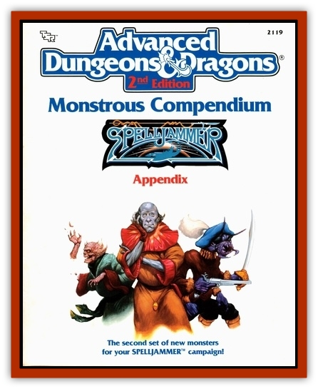

# Space Swine

| Statistic | **Space Swine** |
| --- | --- |
| **Activity Cycle:** | Any |
| **Alignment:** | Neutral good |
| **Armor Class:** | 5 |
| **Climate/Terrain:** | Any |
| **Damage/Attack:** | 2d4 |
| **Diet:** | Omnivore |
| **Frequency:** | Uncommon |
| **Hit Dice:** | 4+4 |
| **Intelligence:** | Semi- (3) |
| **Magic Resistance:** | Nil |
| **Morale:** | Steady (11) |
| **Movement:** | 9, Fl 12 |
| **No. Appearing:** | 1-4 |
| **No. of Attacks:** | 1 |
| **Organization:** | Herd |
| **Size:** | S (3' at shoulder) |
| **Special Attacks:** | See below |
| **Special Defenses:** | Nil |
| **THAC0:** | 16 |
| **Treasure:** | Nil |
| **XP Value:** | 420 |

The space swine are a species of [[Boar|boar]], custom-bred by the mercantile [[Dohwar|dohwar]] for a variety of uses. They serve primarily as trackers, since they have uncanny senses.

Standing three feet at the shoulder and six feet long, the space swine also sport a pair of huge grey wings, resembling a pigeon's. The wings span about eight feet. A single blunt horn juts out six inches from the space swine's thick skull. The normal space swine coloration is a dirty or mottled brown. Space swine of remarkable lineage or belonging to influential dohwar may be pure white or black. Space swine grunt like pigs and sometimes coo like pigeons. Judging by the dohwar's irritation, some speculate that the pigs are not supposed to coo.

Besides tracking, space swine also serve as beasts of burden, food, and (rarely) mounts. Though the dohwar are proud of their porcine creations, the other intelligent races consider the pigs an insane idea and nickname them "star pork".

**Combat:** Despite their odd appearance, space swine are fierce fighters, as ill-tempered as wild boars. The space swine's nasty bite does 2d4 damage.

As a war mount, the space swine is trained to attack with its horn. If a space swine and his dohwar rider have at least 120' between themselves and their foe, the space swine can make a high-speed dive. During the dive, the space swine emits a piercing war-squeal that rises in pitch as it nears the target. Make an attack roll for the space swine to hit its target. If the space swine hits, its 500-pound weight does 2d10 crushing damage, and its horn impales for an additional 1d10 damage. After a hit, the space swine save vs. breath weapon or drop unconscious for 1d4 rounds with a light concussion. The riding dohwar, of course, is thrown.

A space swine war mount can follow up to a dozen commands. These commands can be sign language or simple phrases. Though the space swine cannot speak, it recognizes its given name and its rider. If a space swine loses its rider in battle but has a chance to rescue the rider, the pig flies away fast (though it feels really bad about this and misses its rider terribly).

**Habitat/Society:** Space swine are raised in herds. A litter of space swine consists of 3d4 sucklings. Only the strong become war mounts. All space swine are rather good-natured, and do not pick fights, though adult space swine band together to defend sucklings from predators.

Space swine are clean animals, preening their wings to keep them in good shape and airworthy. On hot planets, space swine enjoy rolling around in mud to cool off.

Muscular animals, space swine can bear 400 pounds of weight with no encumbrance penalty. Despite their bulk, they are sure-footed. A space swine retains enough air for itself for 24 hours, or 18 hours with a rider.

Space swine are uncanny trackers. If allowed to sniff a piece of a person's clothing, or a sample of some sort of material, the space swine can track the person or material in question with a Tracking proficiency level of 18. The material can be anything from gold to silver to water to truffles. Once on the scent, the space swine tracks relentlessly to the source; nothing stops it but fatigue, injury, or trickery.

In wildspace, a space swine can find a scent up to 48,000 miles away. This distance drops by 2,000 mites for every hour of the scent's age. Thus, if a dohwar wished to track down a particular vessel that passed within 10,000 miles of the dohwar 12 hours ago, the space swine could pick up the scent. To determine success, use the space swine's Tracking proficiency level of 18.

Space swine also taste delicious, roasted with applesauce on the side.

**Ecology:** Space swine can eat anything, and they manage to fulfill some small role in gobbling up space garbage tossed by passing ships. Other than this, the space swine have no real use except to the dohwar.

The dohwar try to market space swine as an all-in-one animal for the knowledgeable explorer, but apparently those explorers have enough knowledge not to believe this. The only ones who purchase space swine in great numbers are the [[Gnome_Tinker|tinker gnomes]], who think that space swine are "a brilliant idea".

In desperation, the dohwar also try to sell space swine to spacegoing [[Halfling|halflings]], billing them as "dependable mounts, strong beasts of burden, and they make a tasty mid-afternoon snack". Thus far, the strategy has failed.

---
## Discovery & Documentation

**Source Publication:** MC9 Spelljammer Appendix II (1991)
**Campaign Setting:** Planescape
**Author(s):** Scott Davis, Newton Ewell, John Terra

### Other Creatures Found in This Source Book
   * [[Alchemy_Plant|Alchemy Plant]]
   * [[Allura|Allura]]
   * [[Aperusa|Aperusa]]
   * [[Autognome|Autognome]]
   * [[Bionoid|Bionoid]]
   * [[Bloodsac|Bloodsac]]
   * [[Buzzjewel|Buzzjewel]]
   * [[Constellate|Constellate]]
   * [[Contemplator|Contemplator]]
   * [[Dohwar|Dohwar]]
   * [[Dragon_Moon|Dragon, Moon]]
   * [[Dragon_Stellar|Dragon, Stellar]]
   * [[Dragon_Sun|Dragon, Sun]]
   * [[Dreamslayer|Dreamslayer]]
   * [[Dweomerborn|Dweomerborn]]
   * [[Fal|Fal]]
   * [[Feesu|Feesu]]
   * [[Fire_Bat|Fire Bat]]
   * [[Firebird|Firebird]]
   * [[Firelich|Firelich]]
   * [[Flowfiend|Flowfiend]]
   * [[Gadabout|Gadabout]]
   * [[Gammaroid|Gammaroid]]
   * [[Gonn|Gonn]]
   * [[Gossamer|Gossamer]]
   * [[Grav|Grav]]
   * [[Great_Dreamer|Great Dreamer]]
   * [[Greatswan|Greatswan]]
   * [[Grell_Colonial|Grell, Colonial]]
   * [[Gullion|Gullion]]
   * [[Insectare|Insectare]]
   * [[Lhee|Lhee]]
   * [[Mercurial_Slime|Mercurial Slime]]
   * [[Meteorspawn|Meteorspawn]]
   * [[Monitor|Monitor]]
   * [[Owl_Space|Owl, Space]]
   * [[Pristatic|Pristatic]]
   * [[Scro|Scro]]
   * [[Selkie_Star|Selkie, Star]]
   * [[Silatic|Silatic]]
   * [[Skullbird|Skullbird]]
   * [[Sleek|Sleek]]
   * [[Sluk|Sluk]]
   * [[Sphinx_Astro-|Sphinx, Astro-]]
   * [[Spirit_Warrior|Spirit Warrior]]
   * [[Starfly_Plant|Starfly Plant]]
   * [[Stargazer|Stargazer]]
   * [[Undead_Stellar|Undead, Stellar]]
   * [[Witchlight_Marauder|Witchlight Marauder]]
   * [[Xixchil|Xixchil]]
   * [[Yitsan|Yitsan]]
   * [[Zurchin|Zurchin]]
