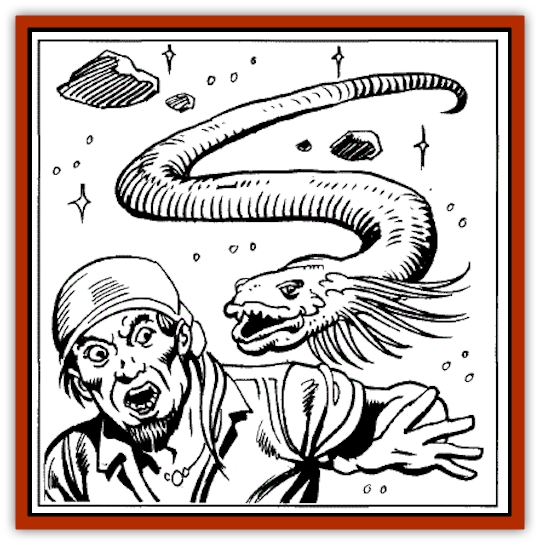

# Spaceworm

| Statistic | **Spaceworm** |
| --- | --- |
| **Activity Cycle:** | Any |
| **Alignment:** | Chaotic neutral |
| **Armor Class:** | 7 |
| **Climate/Terrain:** | Any space |
| **Damage/Attack:** | 2-5 (young: 1-2) |
| **Diet:** | Omnivore (anything organic) |
| **Frequency:** | Common |
| **Hit Dice:** | 1-1 |
| **Intelligence:** | Low (5-7) |
| **Magic Resistance:** | Nil |
| **Morale:** | Average ( 10) |
| **Movement:** | 3,Fl17(A) |
| **No. Appearing:** | 4-48 (4d12) |
| **No. of Attacks:** | 1 |
| **Organization:** | Pack |
| **Size:** | S (average 3' long); young are T (average 1' in length) |
| **Special Attacks:** | Continuous damage unless dislodged, attack eyes |
| **Special Defenses:** | Immune to poisons and diseases |
| **THAC0:** | 15 (20) |
| **Treasure:** | J,K,L,N,Q,V (two types each) |
| **XP Value:** | 65 |

These miniscule but feared menaces of space attack spacefaring ships and beings alike, eating furrows in the surfaces of all organic things they encounter. They are particularly fond of eating eyes. Entire crews blinded by spaceworms have been found wandering despairingly in space, with no idea of where they are or are heading.

Spaceworms resemble pallid-white, glistening sea slugs of up to three feet in length. They swarm over ships, chewing up wooden or bone hulls and attacking deck crew. If particularly hungry, they penetrate to eat food in the hold, sleeping crew members, etc.

**Combat:** Spaceworms attack in packs, darting this way and that to overwhelm foes. They are unpredictable: when encountered, roll ld8 (one die per four worms, for large groups):

On a result of 1, the spaceworms split apart in a welter of glistening slime and rent skin, revealing 1-3 tiny worms. These do only half damage, and wander aimlessly for 1 round after birth. Their reactions should then be checked on a d8.

On a 2, the worms cruise past, ignoring all potential meals.

On a roll of 3 or 4, the spaceworms will not attack, but one or more will come to rest on the ship or other solid object, darken, and die. Amid the melting pool of wrinkled skin and spreading slime, treasure is 80% likely to be found (see Ecology, below).

On a result of 5 to 8, the spaceworms attack relentlessly, striking (as 5-hit die monsters, not as their hit points would ordinarily indicate) until slain or sated. A spaceworm is sated when it has caused 12 hit points of damage. It will break off combat and cruise into space, dodging to avoid attacks.

Unlike the [[Rot_Grub|rot grub]] known on many worlds, a spaceworm does not burrow below the skin when attacking. Instead it eats furrows in flesh, wood, and plant matter alike, gouging along the surface with razor-sharp teeth. These furrows continue from round to round (causing automatic damage) unless the worm is wounded, in which case it will tear free and swoop in to attack again.

**Habitat/Society:** Spaceworms come from the seas of certain worlds. New varieties (some rumored to have strange powers) adapt to space continually. Spaceworms eat and cruise, eat and cruise until attaining a certain size, whereupon they split-in mid-air, and at any time-to produce 1-3 young. These grow to full size and strength in 10-40 days.

Spaceworms tend to hunt with others of their species, but may also be encountered alone. They have no stable family units, yet some elven sages believe that spaceworms are slowly advancing in intelligence and social development with successive generations.

**Ecology:** Spaceworms do not need to breathe and are not harmed by differences in atmosphere or by extreme cold (flames, electricity, and excessive heat do normal damage). Alchemists working with spaceworm slime and distilled essence have so far met with limited success in finding any worthwhile uses.

Old spacehands know that if a spaceworm is slit open or squashed, and its thick, viscous, and colorless or slightly mauve slime is applied to an open wound within seven rounds of the wound's creation, the slime will neutralize all known diseases and poisons and stop further bleeding and infection by sealing wounds, but does not heal physical damage (spaceworms are themselves immune to all known diseases and poisons).

Spaceworms may have small pieces of valuable swallowed treasure (such as coins, gems, and magical rings) trapped inside their bodies. Spaceworm bodies are flexible and can expand to accommodate such foreign material-but only a well-stuffed spaceworm can be distinguished by girth from its fellows. A spaceworm which splits to create young releases all treasure held in its body into its surroundings; young spaceworms do not inherit the treasure of their parent into their own bodies.

Some spacefarers have been known to eat spaceworms. This somewhat less than savory topic is discussed under Spaceworms in the "Flotsam of Space" section.

---
## Discovery & Documentation

**Source Publication:** SJR1 Lost Ships (1990)
**Campaign Setting:** Spelljammer
**Author(s):** Ed Greenwood, Paul Jaquays, Anne Brown, Dell Barras, Brom, Jeff Grubb

### Other Creatures Found in This Source Book
   * [[Beholder_Undead_Death_Tyrant|Beholder, Undead (Death Tyrant)]]
   * [[Flow_Barnacle|Flow Barnacle]]
   * [[Lich_Arch|Lich, Arch]]
   * [[Neogi:_Undead_Old_Master|Neogi: Undead Old Master]]
   * [[Shadowsponge_Air_Stealer|Shadowsponge (Air Stealer)]]
   * [[Beholder_Eater_Thagar_Grimgobbler|Beholder Eater, Thagar (Grimgobbler)]]
   * [[Tinkerer_Giant_Bubble|Tinkerer (Giant Bubble)]]
   * [[Sarphardin_Watcher|Sarphardin (Watcher)]]
   * [[Men:_Wonderseeker|Men: Wonderseeker]]
