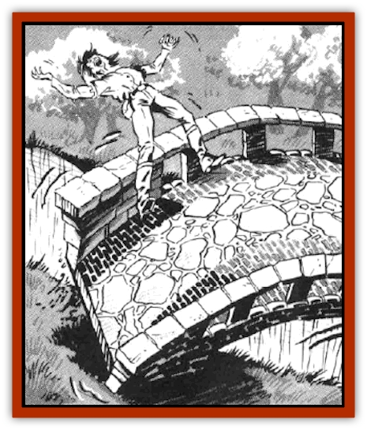

# Spanner

| Statistic | **Spanner** |
| --- | --- |
| **Activity Cycle:** | Any |
| **Alignment:** | Neutral |
| **Armor Class:** | 0 |
| **Climate/Terrain:** | Any |
| **Damage/Attack:** | Nil |
| **Diet:** | None |
| **Frequency:** | Very rare |
| **Hit Dice:** | 10-15 |
| **Intelligence:** | Average (8-10) |
| **Magic Resistance:** | Nil |
| **Morale:** | Fanatic (17-18) |
| **Movement:** | 3 |
| **No. Appearing:** | 1 |
| **No. of Attacks:** | 1 |
| **Organization:** | Solitary |
| **Size:** | G (100-200' long, 10-30' wide) |
| **Special Attacks:** | See below |
| **Special Defenses:** | See below |
| **THAC0:** | 11 (at 10 HD) |
| **Treasure:** | See below |
| **XP Value:** | 5,000 (10 HD) + 1,000 per HD above 10 |

Spanners, also called living bridges, were originally created to help guard a certain wizard's tower, but have since escaped into the wilderness.

As implied by their named these creature appear as large, single-span stone arch bridges, complete with rails, posts and so forth. The type of stone, stains, vine covering, and other details will be appropriate for the local environment (see below). The creatures are extremely difficult to differentiate from true bridges. Only dwarves, or persons with engineering or stonemason talents, may be able to ascertain the identity of a spanner. In this instance, a successful Intelligence or appropriate nonweapon proficiency check at a -6 penalty is required before the true nature of the bridge may be seen.

**Combat:** Spanners prefer not to attack if at all possible. They are benign, even friendly, preferring to gossip and gather information rather than attack. Being curious and intelligent creatures, they will tolerate a fair amount of abuse as long as the creatures around them are talking. However, if irked, or crossed without permission, spanners are malicious and have no mercy. If the victim is near the edge of the creature (within five feet of a rail), the spanner will attempt to pitch him/her off the side; otherwise, the spanner opens a hole through itself and under the victim. In either instance, a Dexterity check at -4 is necessary to avoid being removed from the bridge. The damage from this attack will depend on the distance from the bridge to the land or water below (1d6 damage per 10' of falling, up 20d6 maximum, with additional potential for drowning if the creature is spanning a waterway). These creatures locate potential enemies by detecting their weight on its surface, or by feeling their vibrations in the ground up to 150' away.

The spanner is intelligent enough to recognize that wildlife may seek to cross the bridge, and that a talking bridge may scare the creatures away. The spanner allows itself to be used in this manner without attacking. It will not tolerate unnecessary hunting in its vicinity, if at all possible. Creatures who hunt for sport and try to cross the spanner are automatically attacked.

Spanners are made of stone, and thus have an exceptional AC of 0. Furthermore, they suffer only half damage from pointed or edged weapons, while blunt weapons do full damage.

Spanners are also capable of using a *stoneskin* spell-like ability once per day, which protects them from 8 attacks.

Their Hit Dice are proportional to their length: 10 HD at 100' long, with one additional HD per 20' length, up to a maximum of 200' (15 HD). When killed, they simply cease to move, and become normal, inanimate stone bridges.

The creatures do not value treasure as we know it. Any treasure in their vicinity is from the bridge's victims. Such treasure often has suffered damage as a result of a fall from the bridge, or may have been swept away by recent flooding of a river which flows under the bridge.

**Habitat/Society:** Spanners are curious about anything and everything. It is often possible to negotiate passage across a spanner by simply talking to it and providing gossip, news, trivia, and so forth. However, they tend to be insufferable gossips and liars.

To fit in with the local scenery, spanners will color themselves with stains, add plant growth, assume the color of local stone, or otherwise camouflage themselves.

No one is sure how spanners were introduced to the wild. It is believed that they were originally created by a wizard's experiments with [[Mimic|mimics]], in an effort to create a creature to guard the moats and chasms outside of his tower. The spanners learned much from visitors who traveled through to see the wizard, including how to move themselves around. They form pseudopods which slowly (4 rounds) form into crude feet, which allow ponderously sluggish movement at a rate of 3. They tend to remain in one place for years, but will move if they feel the local people have found them out, or will no longer talk to them.

Spanners are constructed of stone and thus do not need to eat. Spanners do not reproduce, and seem to have no natural limit to their lifespans.

**Ecology:** Spanners generally are a boon to the surrounding natural community, as they demand nothing from it and punish those who abuse it.

---
## Discovery & Documentation

**Source Publication:** MC14 Fiend Folio Appendix (1992)
**Campaign Setting:** Fiends Folio
**Author(s):** Don Bingle, John Terra, Wes Nicholson, Tim Beach, Steve Hardinger, Kris Hardinger, Rob Nicholls, Greg Swedberg, Al Boyce, Vince Garcia, Norm Ritchie

### Other Creatures Found in This Source Book
   * [[Aballin|Aballin]]
   * [[Achaierai|Achaierai]]
   * [[Adherer|Adherer]]
   * [[Algoid|Algoid]]
   * [[Al-Mi'raj|Al-Mi'raj]]
   * [[Apparition|Apparition]]
   * [[Caterwaul|Caterwaul]]
   * [[Coffer_Corpse|Coffer Corpse]]
   * [[Crabman|Crabman]]
   * [[Dark_Creeper|Dark Creeper]]
   * [[Dark_Stalker|Dark Stalker]]
   * [[Darter|Darter]]
   * [[Denzelian|Denzelian]]
   * [[Dune_Stalker|Dune Stalker]]
   * [[Dwarf_Urdunnir|Dwarf, Urdunnir]]
   * [[Falcon_Fire|Falcon, Fire]]
   * [[Faux_Faerie|Faux Faerie]]
   * [[Flawder|Flawder]]
   * [[Fyrefly|Fyrefly]]
   * [[Gambado|Gambado]]
   * [[Garbug|Garbug]]
   * [[Giant_Fhoimorien|Giant, Fhoimorien]]
   * [[Gibberling|Gibberling]]
   * [[Gorbel|Gorbel]]
   * [[Grimlock|Grimlock]]
   * [[Hellcat|Hellcat]]
   * [[Ice_Lizard|Ice Lizard]]
   * [[Iron_Cobra|Iron Cobra]]
   * [[Khargra|Khargra]]
   * [[Mantari|Mantari]]
   * [[Penanggalan|Penanggalan]]
   * [[Pernicon|Pernicon]]
   * [[Phantom_Stalker|Phantom Stalker]]
   * [[Retriever|Retriever]]
   * [[Ruve|Ruve]]
   * [[Scathe|Scathe]]
   * [[Sheet_Ghoul_Sheet_Phantom|Sheet Ghoul/Sheet Phantom]]
   * [[Shocker|Shocker]]
   * [[Stwinger|Stwinger]]
   * [[Sussurus|Sussurus]]
   * [[Symbiotic_Jelly|Symbiotic Jelly]]
   * [[Terithran|Terithran]]
   * [[Thunder_Children|Thunder Children]]
   * [[Troll_Ice|Troll, Ice]]
   * [[Tween|Tween]]
   * [[Umpleby|Umpleby]]
   * [[Volt|Volt]]
   * [[Xill|Xill]]
   * [[Xvart|Xvart]]
   * [[Zygraat|Zygraat]]
