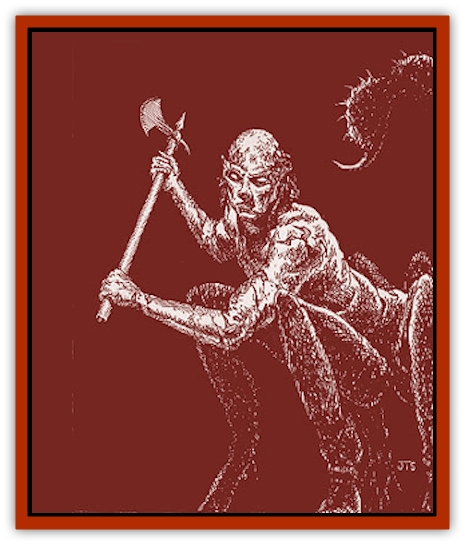

# Spawn of Nimmur

| Statistic | **Spawn of Nimmur** | **Ziggurat Horror** |
| --- | --- | --- |
| **Activity Cycle:** | Night | Night |
| **Alignment:** | Neutral evil | Neutral evil |
| **Armor Class:** | 4 | 6 |
| **Climate/Terrain:** | Tropical or subtropical deserts or caves | Tropical or subtropical deserts or caves |
| **Damage/Attack:** | 1d4+1/1d4+1/1d4 or by weapon | 1d4+1/1d4+1/1d4 or by weapon |
| **Diet:** | Life | Life |
| **Frequency:** | Very rare | Very rare |
| **Hit Dice:** | 11 | 3 |
| **Intelligence:** | Low to Genius (5-18) | Non- (0) |
| **Magic Resistance:** | Nil | Nil |
| **Morale:** | Fearless (19-20) | Special |
| **Movement:** | 12 | 9 |
| **No. Appearing:** | 1 | 1d4+1 |
| **No. of Attacks:** | 3 (claw/claw/tail) | 3 (claw/claw/tail) |
| **Organization:** | Solitary | Squad |
| **Size:** | L (6' tall, 4' long plus 10' tail) | L (6' tall, 4' long plus 10' tail) |
| **Special Attacks:** | Poison | Poison |
| **Special Defenses:** | Hit only by <i>red steel</i> or +1 or better / magical weapons, spell immunities | Spell immunities |
| **THAC0:** | 9 | 17 |
| **Treasure:** | J,K,M,Q | Nil |
| **XP Value:** | 8,000 (+2,000 if a spellcaster) | 420 |

When a powerful (11 or more Hit Die) [[Manscorpion_Nimmurian|Nimmurian manscorpion]] dies from exposure to sunlight, it has a 1% chance per Hit Die of becoming undead, rising as an avenging spawn of Nimmur when the sun sets. Spawn of Nimmur retain any combat or spell casting abilities they had in life but can no longer gain levels.

Spawn of Nimmur appear as tattered and burned manscorpions. Their flesh is blackened and crisp, crackling as they move with bits continually flaking off. Their red eyes glow with an eerie inner fire.

**Combat:** All spawn of Nimmur have the ability to inject a deadly poison with their sting. The victim must make a successful saving throw vs. poison with a -3 penalty or die instantly. Even if the saving throw succeeds, the victim permanently loses one point of Strength, Constitution, and Dexterity.

A spawn that had spellcasting abilities in life retains those abilities in its new undead form. Spawn of Nimmur are turned as liches.

The Spawn of Nimmur are immune to *sleep*, *charm*, *hold*, cold, death magic, poisons, and mind-affecting spells. *Red steel* or +1 or better magical weapons are required to hit a spawn of Nimmur.

A spawn of Nimmur exposed to sunlight takes damage as a manscorpion, but this damage cannot permanently destroy it. The creature will reform once the night falls. Spawn of Nimmur regenerate 1 hit point per turn spent in darkness and can pull themselves together from dust if need be. Idu's curse has already had its worst possible effect of the spawn of Nimmur, so they are relatively immune to further danger from sunlight.

If the ashes of a sun-burned manscorpion are sprinkled with holy water from a temple dedicated to the Immortal Idu (Ixion), blessed, and scattered to the four winds, the manscorpion cannot rise as a spawn of Nimmur. A spawn of Nimmur can also be permanently destroyed with this procedure.

**Habitat/Society:** Spawn of Nimmur are highly regarded in the twisted and warped Nimmurian manscorpion society. The manscorpions revere anyone with the strength of will to withstand Idu's fire and become undead. The spawn of Nimmur are also regarded as having the favor of Nin-Hurabi (Nyx), a manscorpion Immortal patron. The spawn are often driven and obsessed with exacting horrible revenge on whoever caused them to be "burned and reborn" under the sun.

**Ecology:** Only very powerful manscorpions can "survive" the burning process to become true Spawn of Nimmur. They also often serve as fearsome predators in the night.

**Ziggurat Horrors**

  Ziggurat horrors are identical in appearance to the more powerful spawn. Ziggurat horrors are intentionally made by Nimmurian priests, under carefully controlled conditions. Ziggurat horrors are used to defend the darker crypts of Nimmurian temples, often under the control of a spawn of Nimmur. Ziggurat horrors are much weaker than the spawn. Ziggurat horrors are turned as zombies, do not regenerate, can be hit by normal weapons, and are essentially mindless. Like most undead, ziggurat horrors are immune to *sleep*, *charm*, *hold*, death magic, poisons, and cold-based spells.

The sting of a ziggurat horror injects a poison which causes 3d8 points of damage. A successful saving throw vs. poison lowers this to half damage.

The distinction between a spawn of Nimmur and a ziggurat horror is not well known, and the Nimmurian priesthood certainly does not spread information about them. To most outsiders, the two would appear identical.

---
## Discovery & Documentation

**Source Publication:** Monstrous Compendium Savage Coast Appendix (Online Exclusive) (1995)
**Campaign Setting:** Mystara
**Author(s):** Loren L Coleman, Ted James, Thomas Zuvich, Cindi M. Rice

### Other Creatures Found in This Source Book
   * [[Aranea_Savage_Coast|Aranea (Savage Coast)]]
   * [[Arashaeem|Arashaeem]]
   * [[Batracine|Batracine]]
   * [[Cat_Marine|Cat, Marine]]
   * [[Cinnavixen|Cinnavixen]]
   * [[Clockwork_Swordsman|Clockwork Swordsman]]
   * [[Critter_Temple|Critter, Temple]]
   * [[Cursed_One|Cursed One]]
   * [[Deathmare|Deathmare]]
   * [[Dragon_Savage_Coast_Crimson|Dragon (Savage Coast), Crimson]]
   * [[Dragon_Savage_Coast_Red_Hawk|Dragon (Savage Coast), Red Hawk]]
   * [[Echyan|Echyan]]
   * [[Ee'aar|Ee'aar]]
   * [[Enduk|Enduk]]
   * [[Fachan_Savage_Coast|Fachan (Savage Coast)]]
   * [[Feliquine|Feliquine]]
   * [[Fiend_Narvaezan|Fiend, Narvaezan]]
   * [[Frelôn|Frelôn]]
   * [[Ghriest|Ghriest]]
   * [[Glutton_Sea|Glutton, Sea]]
   * [[Goatman|Goatman]]
   * [[Golem_Naâruk|Golem, Naâruk]]
   * [[Golem_Savage_Coast|Golem (Savage Coast)]]
   * [[Grudgling|Grudgling]]
   * [[Heraldic_Servant_I|Heraldic Servant I]]
   * [[Heraldic_Servant_II|Heraldic Servant II]]
   * [[Heraldic_Servant_III|Heraldic Servant III]]
   * [[Heraldic_Servant_IV|Heraldic Servant IV]]
   * [[Heraldic_Servant_V|Heraldic Servant V]]
   * [[Heraldic_Servant_General_Information|Heraldic Servant, General Information]]
   * [[Hermit_Sea|Hermit, Sea]]
   * [[Jorri|Jorri]]
   * [[Juhrion|Juhrion]]
   * [[Kla'a-tah|Kla'a-tah]]
   * [[Leech_Legacy|Leech, Legacy]]
   * [[Lich_Inheritor|Lich, Inheritor]]
   * [[Lizard_Kin_Savage_Coast|Lizard Kin (Savage Coast)]]
   * [[Lupasus|Lupasus]]
   * [[Lupin|Lupin]]
   * [[Lyra_Bird_Saragón|Lyra Bird, Saragón]]
   * [[Malfera|Malfera]]
   * [[Manscorpion_Nimmurian|Manscorpion, Nimmurian]]
   * [[Mythuínn_Folk|Mythuínn Folk]]
   * [[Neshezu|Neshezu]]
   * [[Nikt'oo|Nikt'oo]]
   * [[Nosferatu|Nosferatu]]
   * [[Omm-wa|Omm-wa]]
   * [[Omshirim|Omshirim]]
   * [[Parasite_Savage_Coast|Parasite (Savage Coast)]]
   * [[Phanaton|Phanaton]]
   * [[Plant_Savage_Coast|Plant (Savage Coast)]]
   * [[Pudding_Vermilion|Pudding, Vermilion]]
   * [[Rakasta|Rakasta]]
   * [[Ray_Forest|Ray, Forest]]
   * [[Shedu_Greater_Savage_Coast|Shedu, Greater (Savage Coast)]]
   * [[Shimmerfish|Shimmerfish]]
   * [[Skinwing|Skinwing]]
   * [[Spider-spy|Spider-spy]]
   * [[Spirit_Heroic|Spirit, Heroic]]
   * [[Spirit_Walleran|Spirit, Walleran]]
   * [[Succulus|Succulus]]
   * [[Swampmare|Swampmare]]
   * [[Symbiont_Shadow|Symbiont, Shadow]]
   * [[Tortle|Tortle]]
   * [[Troll_Legacy|Troll, Legacy]]
   * [[Trosip|Trosip]]
   * [[Tyminid|Tyminid]]
   * [[Utukku|Utukku]]
   * [[Voat|Voat]]
   * [[Voat_Herathian|Voat, Herathian]]
   * [[Vulturehound|Vulturehound]]
   * [[Wallara|Wallara]]
   * [[Wurmling|Wurmling]]
   * [[Wynzet|Wynzet]]
   * [[Yeshom|Yeshom]]
   * [[Zombie_Red|Zombie, Red]]
