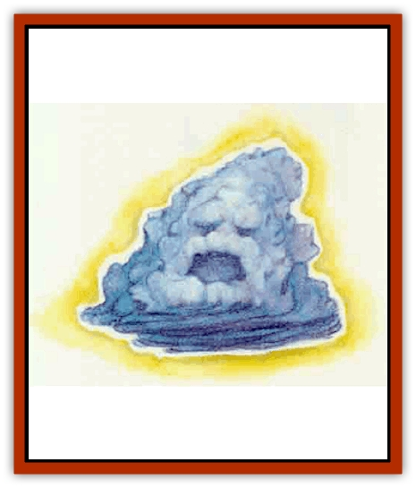

# Spectral Death

| Statistic | **Spectral Death** |
| --- | --- |
| **Activity Cycle:** | Any |
| **Alignment:** | Neutral evil |
| **Armor Class:** | 0 |
| **Climate/Terrain:** | Any |
| **Damage/Attack:** | 1d10 (claw)/1d10 (claw) |
| **Diet:** | Nil |
| **Frequency:** | Very rare |
| **Hit Dice:** | 10 |
| **Intelligence:** | Average (8-10) |
| **Magic Resistance:** | Nil |
| **Morale:** | Fearless (20) |
| **Movement:** | Fl 18 (A) |
| **No. Appearing:** | 1 |
| **No. of Attacks:** | 2 |
| **Organization:** | Solitary |
| **Size:** | M (5' diameter) |
| **Special Attacks:** | Wisdom drain |
| **Special Defenses:** | Hit only by magical weapons, immune to some spell effects |
| **THAC0:** | 11 |
| **Treasure:** | Nil |
| **XP Value:** | 5,000 |

Also called soul eaters, spectral deaths are negative energy beings that look like boiling clouds of blackness. A spectral death's vaporous body is always surrounded by a faint radius that glows a sickly black-green. At rest, a spectral death looks like an irregular lump of darkness. In motion, the creature looks like an ominous storm cloud rolling through the air.

**Combat:** Only magical weapons and spells affect spectral deaths. Spectral deaths are immune to death magic and energy draining.

In combat, a spectral death attacks with two invisible claws. In addition to suffering 1d10 points of damage, the victim must roll a saving throw vs. death magic each time the spectral death scores a hit. If the savlng throw fails, the victim loses one point of Wisdom. Victims of a spectral death killed by cumulative damage or reduced to zero Wisdom are forever slain and cannot *raised*, *reincarnated*, or *resurrected*, nor can *regeneration* restore the victim to life. A *wish* can restore the victim, but a *limited wish* or *alter reality* cannot.

If the spectral death is itself slain or driven away before it can slay its victim, the character regains lost Wisdom at the rate of one point a day. When slain, a spectral death dissolves into a formless cloud of vapor and drifts away.

Spectral deaths can be turned by priests and paladins as if they were special undead. Likewise, they are subject to *protection from evil*, *abjure*, and *dispel evil* spells.

When attacking, a spectral death chooses a single victim and attempts to slay him or her. If the spectral death is summoned and ordered to attack (see "Habitat/Society"), the summoner chooses the victim. Otherwise, the spectral death either chooses the victim who seems the least likely to effectively counterattack or an opponent who has already harmed the spectral death. Its flying abihty and mobility enable the creature to press the attack on its chosen victim, no matter how he or she tries to escape. If the victim's allies successfully interpose themselves, the spectral death lashes out at the most vulnerable opponent.

A spectral death's cloudlike body has no front, back, or flanks, so opponents cannot gain a combat advantage through maneuvering around it. A spectral death can attack in any direction with its invisible claws. It can attack two opponents at once but prefers to concentrate its attacks on a single foe.

**Habitat/Society:** Spectral deaths are natives of the Quasielemental Plane of Vacuum. On their home plane they are solitary creatures that have no interaction with each other or with other denizens of the plane as they drift about, wholly invisible, near the border with the Negative Energy Plane.

Spectral deaths have been known to find their way onto the Prime Material Plane through dimensional rifts caused by the malfunctioning or destruction of powerful magical items or by similar cataclysmic events. They are far more likely, however, to be summoned to service by evil priests. Chaotic or evil deities might send a spectral death to do a priest's bidding instead of appearing themselves when the character casts a *gate* spell. At the DMs option, some sects might know a *summon spectral death* spell. This is identical to the 6th-level *aerial servant* spell, except that the only service a spectral death will perform is tracking down and killing a victim identified by the spell caster. Use of the *summon spectral death* spell is hazardous because if the spectral death cannot track down and slay its victim before the spell's duration expires (that is, one day per level of its summoner), it flies into an uncontrollable rage and seeks out the summoner, trackmg that character relentlessly. When it finds the caster, its rage allows it to attack as a 20 Hit Die monster (THAC0 1), inflicting 3d6 points of damage per attack (although the Wisdom lose per successful attack remains a single point).

**Ecology:** When visiting the Prime Material Plane, spectral deaths neither eat nor sleep. On their home plane, spectral deaths appear to draw sustenance from the energies created at the boundary where the Negative Energy Plane meets the Plane of Vacuun.

On their home plane, spectral deaths reproduce asexually by budding.

---
## Discovery & Documentation

**Source Publication:** Mystara Appendix (1994)
**Campaign Setting:** Mystara
**Author(s):** John Nephew, Teeuwynn Woodruff, John Terra, Skip Williams

### Other Creatures Found in This Source Book
   * [[Actaeon|Actaeon]]
   * [[Agarat|Agarat]]
   * [[Ash_Crawler|Ash Crawler]]
   * [[Baldandar|Baldandar]]
   * [[Bargda|Bargda]]
   * [[Bhut|Bhut]]
   * [[Bird_Mystara|Bird (Mystara)]]
   * [[Blackball|Blackball]]
   * [[Choker|Choker]]
   * [[Coltpixie|Coltpixie]]
   * [[Crone_of_Chaos|Crone of Chaos]]
   * [[Darkhood|Darkhood]]
   * [[Darkwing|Darkwing]]
   * [[Decapus|Decapus]]
   * [[Deep_Glaurant|Deep Glaurant]]
   * [[Diabolus|Diabolus]]
   * [[Dimensional_Warper|Dimensional Warper]]
   * [[Dragon_Mystara_Crystalline|Dragon (Mystara), Crystalline]]
   * [[Dragon_Mystara_Jade|Dragon (Mystara), Jade]]
   * [[Dragon_Mystara_Onyx|Dragon (Mystara), Onyx]]
   * [[Dragon_Mystara_Ruby|Dragon (Mystara), Ruby]]
   * [[Drake_Mystara|Drake (Mystara)]]
   * [[Dragonfly|Dragonfly]]
   * [[Dusanu|Dusanu]]
   * [[Elemental_of_Chaos_Air_Earth|Elemental of Chaos, Air/Earth]]
   * [[Elemental_of_Chaos_Fire_Water|Elemental of Chaos, Fire/Water]]
   * [[Elemental_of_Law_Air_Earth|Elemental of Law, Air/Earth]]
   * [[Elemental_of_Law_Fire_Water|Elemental of Law, Fire/Water]]
   * [[Familiar_Mystara|Familiar (Mystara)]]
   * [[Frost_Salamander|Frost Salamander]]
   * [[Fundamental_Air_Earth|Fundamental, Air/Earth]]
   * [[Fundamental_Fire_Water|Fundamental, Fire/Water]]
   * [[Gargantua_Mystara|Gargantua (Mystara)]]
   * [[Geonid|Geonid]]
   * [[Ghostly_Horde|Ghostly Horde]]
   * [[Giant_Athach|Giant, Athach]]
   * [[Giant_Hephaeston|Giant, Hephaeston]]
   * [[Golem_Drolem|Golem, Drolem]]
   * [[Golem_Mystara_I|Golem (Mystara) I]]
   * [[Golem_Mystara_II|Golem (Mystara) II]]
   * [[Golem_Mystara_III|Golem (Mystara) III]]
   * [[Gray_Philosopher|Gray Philosopher]]
   * [[Guardian_Warrior|Guardian Warrior]]
   * [[Gyerian|Gyerian]]
   * [[Herex|Herex]]
   * [[Hivebrood|Hivebrood]]
   * [[Horde|Horde]]
   * [[Hsiao|Hsiao]]
   * [[Huptzeen|Huptzeen]]
   * [[Hutaakan|Hutaakan]]
   * [[Imp_Mystara|Imp (Mystara)]]
   * [[Jellyfish_Giant_Mystara|Jellyfish, Giant (Mystara)]]
   * [[Kna|Kna]]
   * [[Kopru|Kopru]]
   * [[Lizard_Mystara|Lizard (Mystara)]]
   * [[Lizard-kin_Mystara|Lizard-kin (Mystara)]]
   * [[Lupin|Lupin]]
   * [[Lycanthrope_Werejaguar_Mystara|Lycanthrope, Werejaguar (Mystara)]]
   * [[Lycanthrope_Wereswine|Lycanthrope, Wereswine]]
   * [[Magen|Magen]]
   * [[Manikin|Manikin]]
   * [[Mek|Mek]]
   * [[Mujina|Mujina]]
   * [[Nagpa|Nagpa]]
   * [[Neh-thalggu|Neh-thalggu]]
   * [[Nightshade_Mystara|Nightshade (Mystara)]]
   * [[Nuckalavee|Nuckalavee]]
   * [[Pegataur|Pegataur]]
   * [[Phanaton|Phanaton]]
   * [[Plant_Dangerous_Mystara|Plant, Dangerous (Mystara)]]
   * [[Plasm|Plasm]]
   * [[Rakasta|Rakasta]]
   * [[Rock_Man|Rock Man]]
   * [[Sabreclaw|Sabreclaw]]
   * [[Sacrol|Sacrol]]
   * [[Scamille|Scamille]]
   * [[Shapeshifter|Shapeshifter]]
   * [[Shargugh|Shargugh]]
   * [[Shark-kin|Shark-kin]]
   * [[Sollux|Sollux]]
   * [[Spectral_Hound|Spectral Hound]]
   * [[Spider-kin|Spider-kin]]
   * [[Spirit_Mystara|Spirit (Mystara)]]
   * [[Statue_Living|Statue, Living]]
   * [[Surtaki|Surtaki]]
   * [[Tabi|Tabi]]
   * [[Thoul|Thoul]]
   * [[Thunderhead|Thunderhead]]
   * [[Tiger_Ebon|Tiger, Ebon]]
   * [[Topi|Topi]]
   * [[Tortle|Tortle]]
   * [[Vampire_Velya|Vampire, Velya]]
   * [[White_Fang|White Fang]]
   * [[Worm_Mystara|Worm (Mystara)]]
   * [[Wyrd|Wyrd]]
   * [[Yowler|Yowler]]
   * [[Zombie_Lightning|Zombie, Lightning]]
