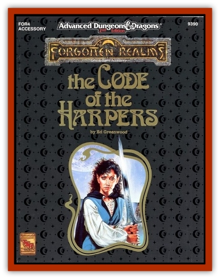

# Spectral Harpist

| Statistic | **Spectral Harpist** |
| --- | --- |
| **Activity Cycle:** | Any  |
| **Alignment:** | Lawful neutral |
| **Armor Class:** | 4 |
| **Climate/Terrain:** | Any land |
| **Damage/Attack:** | 2d4/2d4 or by weapon |
| **Diet:** | Nil |
| **Frequency:** | Very rare |
| **Hit Dice:** | 9+9 |
| **Intelligence:** | As in life |
| **Magic Resistance:** | 44% |
| **Morale:** | Fearless (20) |
| **Movement:** | 12, Fl 14 (A) |
| **No. Appearing:** | 1 (1-8) |
| **No. of Attacks:** | 2 |
| **Organization:** | Solitary (or guardian groups) |
| **Size:** | M (average 6 ft. tall) |
| **Special Attacks:** | Deathsong |
| **Special Defenses:** | Wraithform, immunities |
| **THAC0:** | 11 |
| **Treasure:** | Nil |
| **XP Value:** | 9,000 |

Spectral harpists are intelligent undead who resemble [[Ghost|ghosts]] or [[Wraith|wraiths]]. They appear as translucent, shadowy forms that float or fly about. They are created when a Master Harper dies while engaged in Harper service that is left unfinished (a Harper slain while guarding a retreat has unfinished business - the survival and continued safety of those he was guarding)

**Combat:** Spectral harpists retain the blessings or powers they had in life as Master Harpers (see the relevant chapter of [the] sourcebook). They can be turned as "special" undead. In certain magicstrong areas (most Harper strongholds and refuges), spectral harpists can't be turned at all. They can attack twice a round with a chilling touch that corrodes living flesh for 2d4 points of damage. They can also employ any weapons they could use in life for normal damage (chill damage is not transmitted to struck victims).

Once per day, a spectral harpist can also employ its *deathsong* attack, a hollow dirge that causes fear in all living beings within 90 feet (unless they roll a successful saving throw vs. spell). Affected beings flee for ten rounds and are 50% likely to drop any items they are carrying in their hands at the time. A spectral harpist that has just sung a *deathsong* is surrounded by a 10-foot-radius anti-magic field that acts against all enchantments for six rounds after the end of the song (neither the harpist or any known spells can stop or interrupt this effect). A *deathsong* can last from one to four rounds (harpist's choice): Any physical attack made by a spectral harpist while emitting a *deathsong* does triple normal damage

Against spell attacks, a spectral harpist has the stan- dard undead immunities to *charm*, *sleep*, *hold* and the like, including all poison, petrification, polymorph, cold-based, and death magic attacks. It is also immune to cold- and electricity-based attacks. Against all other spells, a spectral harpist applies its magic resistance; if the spell wins out, the harpist suffers the normal effects. Holy water inflicts no damage to spectral harpists

A harpist can by will cause all items within 60 feet that bear a magical aura to glow with a cold white radiance. This glow can be quelled by a *dispel magic* spell but will otherwise last 2d4 turns

Spectral harpists can become wholly or partially insubstantial. In this state, they can cause no damage, but they also suffer none from purely physical attacks. Magical weapons passing through their wraith-like form inflict damage equal to twice normal damage bonuses - only bonuses, not damage dice (a magical weapon without any bonus causes its maximum possible damage).

In wraithform, harpists can pass through solid stone or earth. They can do this without pause and can attack or defend in the round in which they enter or leave solid ground. Many lurk in stone tomb or dungeon walls, only their heads protruding, to spy on intruders.

**Habitat/Society:** Harpists are usually found as guardians over a Harper stronghold or refuge. Sometimes they attach themselves to a living Harper individual, serving as a personal guardian for a time. Usually solitary, they can occasionally be met in small groups. Harpists may engage in sharp verbal exchanges with fellow spectral harpists, but they never willingly fight each other. They work together loyally and smoothly as guardians.

Retaining intelligence and judgment, spectral harpists can be given detailed and specific commands to follow. They can speak and sing as they did in life. They lose any capacity to cast spells they may have possessed in life, and they can't gain any new memorie

**Ecology:** Spectral harpists consume nothing and have no offspring, but they slay adventurers, monsters, and other life of venturesome power and dominance. Other than to curb the numbers of these creatures, making carrion of them, spectral harpists serve no function in the food chains of their surrounding

---
## Discovery & Documentation

**Source Publication:** FOR4 The Code of the Harpers (1993)
**Campaign Setting:** Forgotten Realms
**Author(s):** Ed Greenwood, Mike Breault, Scott Rosema
