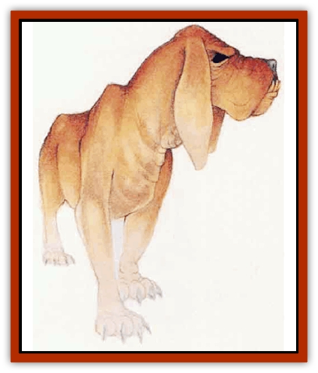

# Spectral Hound

| Statistic | **Spectral Hound** |
| --- | --- |
| **Activity Cycle:** | Any |
| **Alignment:** | Chaotic evil |
| **Armor Class:** | -2 |
| **Climate/Terrain:** | Any |
| **Damage/Attack:** | 2d6 (bite) |
| **Diet:** | Carnivore |
| **Frequency:** | Very rare |
| **Hit Dice:** | 5 |
| **Intelligence:** | Semi- (2-4) |
| **Magic Resistance:** | Nil |
| **Morale:** | Fearless (19) |
| **Movement:** | 15 |
| **No. Appearing:** | 1d6 |
| **No. of Attacks:** | 1 |
| **Organization:** | Solitary or pack |
| **Size:** | M (5' long) |
| **Special Attacks:** | Bite victims become astral |
| **Special Defenses:** | Keen senses, hit only by silver or magical weapons |
| **THAC0:** | 15 |
| **Treasure:** | Nil |
| **XP Value:** | 975 |

Spectral hounds are creatures from the Astral Plane. On the Prime Material Plane, a spectral hound looks like a ghostly [[Dog|dog]], pale and translucent, with eyes that are formless pools of utter blackness.

**Combat:** Spectral hounds are excellent trackers - once put on a trail, they can follow it for days. Spectral hounds track as rangers, with a basic tracking score of 25. They can move at full speed and still track in any situation where their adjusted tracking score is 20 or more. If necessary, they can travel astrally to overcome obstacles that might otherwise keep them from following their prey.

A spectral hound's keen senses give it a 50% chance to detect invisible creatures and a +2 bonus on its surprise rolls.

Most spectral hounds are domesticated hunting beasts that relish combat. When given prey to chase, they pursue vigorously. Once within ahout a quarter mile of their prey, they bay joyfully. While this alerts the quarry to the hounds' presence, it often distracts them from the other beings working with the hounds, who can flank the victims while the hounds attack frontally. Experienced spectral hound handlers can command their beasts to remain quiet.

Despite their enthusiasm for the chase, spectral hounds can be cunning and persistent hunters. If hunting alone or in a small group with no handler, spectral hounds quietly shadow their prey for days, waiting for an opportunity to attack when the quarry's defenses are down. Many victims are unaware that they are being pursued until a pack of hounds charges at them through the pre-dawn gloom.

Spectral hounds attack by biting with their powerful jaws; any creature bitten takes 2d6 damage and must roll a saving throw vs. spell. If the saving throw fails, the victim begins to fade, slowly assuming the same translucent appearance as the spectral hound itself. The entire process takes 24 hours. After 12 hours, a fading character cannot hear or speak to any unfaded characters from the victim's point of view, it is the rest of the world that is becoming translucent, not himself or herself). The character's equipment - weapons, armor, spell components, and the like - is unaffected and drops away. Because of their inability to handle objects, faded creatures cannot eat or drink. Mental and energy-based attacks work normally when used against a faded character, but the character is immune to physical attacks. After 12 more hours, the character fades completely from sight and slips into the Astral Plane. Once on the Astral Plane, the victim can handle objects (but isn't likely to find any lying about, waiting to be picked up) and can seek any normal means to exit the plane and return to the Prime Material.

A pinch of *dust of appearance* can restore a partially faded character, as can a *remove curse*, *dimension door*, or *teleport* spell. The dust or spell must be applied directly to the victim. The *teleport* and *dimension door* spells have no effect on the victim other than to end the fading. These remedies can be applied at any time before the character slips into the Astral Plane.

**Habitat/Society:** Various greater and lesser powers residing on the Outer Planes breed spectral hounds and use them both as guards and to track intruders back to their home planes. There is a 20% chance that some other extraplanar creature (such as a [[Titan|titan]], [[Tanar'ri_General_Information|tanar'ri]], or [[Githyanki|githyanki]]) is accompanying and commanding any randomly encountered spectral hound.

Wild spectral hounds, though rare, can occasionally be found roaming the Astral Plane in search of prey. A group of two wild spectral hounds is always a mated pair. Larger groups will be a mated pair and their offspring or one or two related female hounds and their suitors.

**Ecology:** Domesticated spectral hounds require much the same kind of care as common dogs: feeding, grooming, exercise, and training. Wild spectral hounds are opportunistic hunters and scavengers that will eat just about anything they can sink their formidable teeth into.

---
## Discovery & Documentation

**Source Publication:** Mystara Appendix (1994)
**Campaign Setting:** Mystara
**Author(s):** John Nephew, Teeuwynn Woodruff, John Terra, Skip Williams

### Other Creatures Found in This Source Book
   * [[Actaeon|Actaeon]]
   * [[Agarat|Agarat]]
   * [[Ash_Crawler|Ash Crawler]]
   * [[Baldandar|Baldandar]]
   * [[Bargda|Bargda]]
   * [[Bhut|Bhut]]
   * [[Bird_Mystara|Bird (Mystara)]]
   * [[Blackball|Blackball]]
   * [[Choker|Choker]]
   * [[Coltpixie|Coltpixie]]
   * [[Crone_of_Chaos|Crone of Chaos]]
   * [[Darkhood|Darkhood]]
   * [[Darkwing|Darkwing]]
   * [[Decapus|Decapus]]
   * [[Deep_Glaurant|Deep Glaurant]]
   * [[Diabolus|Diabolus]]
   * [[Dimensional_Warper|Dimensional Warper]]
   * [[Dragon_Mystara_Crystalline|Dragon (Mystara), Crystalline]]
   * [[Dragon_Mystara_Jade|Dragon (Mystara), Jade]]
   * [[Dragon_Mystara_Onyx|Dragon (Mystara), Onyx]]
   * [[Dragon_Mystara_Ruby|Dragon (Mystara), Ruby]]
   * [[Drake_Mystara|Drake (Mystara)]]
   * [[Dragonfly|Dragonfly]]
   * [[Dusanu|Dusanu]]
   * [[Elemental_of_Chaos_Air_Earth|Elemental of Chaos, Air/Earth]]
   * [[Elemental_of_Chaos_Fire_Water|Elemental of Chaos, Fire/Water]]
   * [[Elemental_of_Law_Air_Earth|Elemental of Law, Air/Earth]]
   * [[Elemental_of_Law_Fire_Water|Elemental of Law, Fire/Water]]
   * [[Familiar_Mystara|Familiar (Mystara)]]
   * [[Frost_Salamander|Frost Salamander]]
   * [[Fundamental_Air_Earth|Fundamental, Air/Earth]]
   * [[Fundamental_Fire_Water|Fundamental, Fire/Water]]
   * [[Gargantua_Mystara|Gargantua (Mystara)]]
   * [[Geonid|Geonid]]
   * [[Ghostly_Horde|Ghostly Horde]]
   * [[Giant_Athach|Giant, Athach]]
   * [[Giant_Hephaeston|Giant, Hephaeston]]
   * [[Golem_Drolem|Golem, Drolem]]
   * [[Golem_Mystara_I|Golem (Mystara) I]]
   * [[Golem_Mystara_II|Golem (Mystara) II]]
   * [[Golem_Mystara_III|Golem (Mystara) III]]
   * [[Gray_Philosopher|Gray Philosopher]]
   * [[Guardian_Warrior|Guardian Warrior]]
   * [[Gyerian|Gyerian]]
   * [[Herex|Herex]]
   * [[Hivebrood|Hivebrood]]
   * [[Horde|Horde]]
   * [[Hsiao|Hsiao]]
   * [[Huptzeen|Huptzeen]]
   * [[Hutaakan|Hutaakan]]
   * [[Imp_Mystara|Imp (Mystara)]]
   * [[Jellyfish_Giant_Mystara|Jellyfish, Giant (Mystara)]]
   * [[Kna|Kna]]
   * [[Kopru|Kopru]]
   * [[Lizard_Mystara|Lizard (Mystara)]]
   * [[Lizard-kin_Mystara|Lizard-kin (Mystara)]]
   * [[Lupin|Lupin]]
   * [[Lycanthrope_Werejaguar_Mystara|Lycanthrope, Werejaguar (Mystara)]]
   * [[Lycanthrope_Wereswine|Lycanthrope, Wereswine]]
   * [[Magen|Magen]]
   * [[Manikin|Manikin]]
   * [[Mek|Mek]]
   * [[Mujina|Mujina]]
   * [[Nagpa|Nagpa]]
   * [[Neh-thalggu|Neh-thalggu]]
   * [[Nightshade_Mystara|Nightshade (Mystara)]]
   * [[Nuckalavee|Nuckalavee]]
   * [[Pegataur|Pegataur]]
   * [[Phanaton|Phanaton]]
   * [[Plant_Dangerous_Mystara|Plant, Dangerous (Mystara)]]
   * [[Plasm|Plasm]]
   * [[Rakasta|Rakasta]]
   * [[Rock_Man|Rock Man]]
   * [[Sabreclaw|Sabreclaw]]
   * [[Sacrol|Sacrol]]
   * [[Scamille|Scamille]]
   * [[Shapeshifter|Shapeshifter]]
   * [[Shargugh|Shargugh]]
   * [[Shark-kin|Shark-kin]]
   * [[Sollux|Sollux]]
   * [[Spectral_Death|Spectral Death]]
   * [[Spider-kin|Spider-kin]]
   * [[Spirit_Mystara|Spirit (Mystara)]]
   * [[Statue_Living|Statue, Living]]
   * [[Surtaki|Surtaki]]
   * [[Tabi|Tabi]]
   * [[Thoul|Thoul]]
   * [[Thunderhead|Thunderhead]]
   * [[Tiger_Ebon|Tiger, Ebon]]
   * [[Topi|Topi]]
   * [[Tortle|Tortle]]
   * [[Vampire_Velya|Vampire, Velya]]
   * [[White_Fang|White Fang]]
   * [[Worm_Mystara|Worm (Mystara)]]
   * [[Wyrd|Wyrd]]
   * [[Yowler|Yowler]]
   * [[Zombie_Lightning|Zombie, Lightning]]
