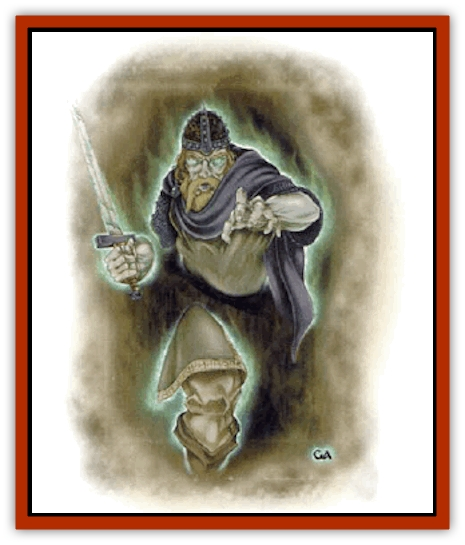

# Spectral Scion

| Statistic | **Spectral Scion** |
| --- | --- |
| **Activity Cycle:** | Night |
| **Alignment:** | Varies |
| **Armor Class:** | 2 |
| **Climate/Terrain:** | Any |
| **Damage/Attack:** | 1d8/1d8 or by weapon |
| **Diet:** | Nil |
| **Frequency:** | Very rare |
| **Hit Dice:** | 9 |
| **Intelligence:** | Average to high (8-14) |
| **Magic Resistance:** | See below |
| **Morale:** | Champion (15) |
| **Movement:** | 15 |
| **No. Appearing:** | 1 |
| **No. of Attacks:** | 2 |
| **Organization:** | Solitary |
| **Size:** | M |
| **Special Attacks:** | Con drain, bloodline drain |
| **Special Defenses:** | Hit only by +1 or better weapon, immune to tighmaevril weapons |
| **THAC0:** | 12 |
| **Treasure:** | Nil |
| **XP Value:** | 5,000 |

This spectral scion is most often found in Cerilia or the Shadowlands of the *Birhtright* setting, although it is not impossible for them to be found elsewhere. A spectral scion is the spirit of a *bloodtheft* victim who was killed with a tighmaevril weapon (which allows the slayer to steal powers associated with the victim's bloodline). Not all those with a special bloodline killed in this way become spectral scions, but those who do daily relive the horror of losing their bloodlines, and are doomed to spend eternity seeking peace.

Spectral scions are semitransparent, much like [[Spectre|spectres]] or [[Ghost|ghosts]]. They retain the same age, features, size, manner of dress, and demeanor they had in life, including alignment, proficiencies, languages, and memories. They move by walking or floating a few inches above the ground, and can appear or vanish at will.

They can speak with the living, but avoid such contact unless driven to it by necessity.

**Combat:** A spectral scion, regardless of alignment, will single-mindedly fight the person who stole its bloodline, draining the individual's bloodline before delivering the killing blow. Spectral scions of non-evil alignments will attack their direct descendents or former comrades only in self-defense (unless those individuals betrayed them in life).

If the spectral scion died holding a weapon, that weapon becomes part of its spectral form; it will use that weapon in combat. Otherwise, it fights with its hands for 1d8 points of damage each.

A spectral scion temporarily drains 1d4 points of Constitution from its victim with each successful hit. A victim whose Constitution drops to 0 falls into a coma for one hour. If the victim is blooded (has a special bloodline), the spectral scion takes advantage of the coma to drain 1d6 points of bloodline strength per turn. The spectral scion can drain a victim to no less than 1 point. After draining 4d6 bloodline points, the scion is sated and departs. While draining, the spectral scion is vulnerable to attack and can be hit by normal weapons for half damage.

The victim of bloodline drain will awaken from the coma with 1 Constitution point; Constitution returns at a rate of 2 points per hour. A victim who has lost 90% or more of his bloodline loses all blood abilities.

If the drained victim can find the spectral scion within seven days and deliver the killing blow to it, he may regain some of his lost bloodline. If the spirit has drained a subsequent victim in that time, however, the first victim's points are lost forever. Ten percent of the victim's points are permanently lost each day after the bloodline drain; thus, a victim who kills the spectral scion four days after draining regains 60% of his bloodline points.

The manner in which the spectral scion lost its life makes it immune to damage from tighmaevril weapons. If such a weapon is used by an opponent, the spirit will attempt to wrest it from the wielder's control and destroy it.

Spectral scions are immune to *sleep*, *charm*, *hold*, and cold-based spells, as well as poison and paralyzation attacks. Holy water splashed on an evil spectral scion inflicts 2d4 points of damage.

A spectral scion can be turned as a vampire.

**Habitat/Society:** Spectral scions are lonely creatures surrounded by an aura of sadness and loss. They sometimes retain the habits they formed in life, drawn to those places or activities that they frequented while alive. Evil spectral scions, consumed by bloodthirst, hunt living scions to drain their bloodlines; neutral and good spectral scions sometimes appear to descendents to deliver warnings or ask to be avenged.

**Ecology:** Because grief over their lost birthright fuels their existence, spectral scions often haunt their former domains. These spirits are not, however, confined to their former domains, but may wander, and are especially likely to do so if an opportunity to redress the wrong done to them.

---
## Discovery & Documentation

**Source Publication:** Monstrous Compendium, 1997 Annual, Volume 4 (1995)
**Campaign Setting:** Advanced Dungeons & Dragons 2nd Edition
**Author(s):** Jon Pickens

### Other Creatures Found in This Source Book
   * [[Anemone_Giant_Sea|Anemone, Giant Sea]]
   * [[Asperii|Asperii]]
   * [[Bainligor|Bainligor]]
   * [[Beast_of_Chaos|Beast of Chaos]]
   * [[Blindheim|Blindheim]]
   * [[Bloodsipper_Far_Realm|Bloodsipper (Far Realm)]]
   * [[Bulette_Gohlbrorn|Bulette, Gohlbrorn]]
   * [[Child_of_the_Sea|Child of the Sea]]
   * [[Clockwork_Horror|Clockwork Horror]]
   * [[Clockwork_Swordsman|Clockwork Swordsman]]
   * [[Coral|Coral]]
   * [[Darklore|Darklore]]
   * [[Dharculus|Dharculus]]
   * [[Dolphin_Athas|Dolphin (Athas)]]
   * [[Dragon_Neutral_Moonstone|Dragon, Neutral, Moonstone]]
   * [[Dragon_Prismatic|Dragon, Prismatic]]
   * [[Dream_Stalker|Dream Stalker]]
   * [[Dragon-kin_Albino_Wyrm|Dragon-kin, Albino Wyrm]]
   * [[Echyan|Echyan]]
   * [[Firestar|Firestar]]
   * [[Firetail|Firetail]]
   * [[Fish_Ascallion|Fish, Ascallion]]
   * [[Fish_Deep_Ocean|Fish, Deep Ocean]]
   * [[Fish_Tropical|Fish, Tropical]]
   * [[Fish_Vurgens|Fish, Vurgens]]
   * [[Fogwarden|Fogwarden]]
   * [[Fraal|Fraal]]
   * [[Giant_Crag|Giant, Crag]]
   * [[Gibberling_Brood|Gibberling, Brood]]
   * [[Glutton_Sea|Glutton, Sea]]
   * [[Golden_Ammonite|Golden Ammonite]]
   * [[Golem_Brass_Minotaur|Golem, Brass Minotaur]]
   * [[Golem_Gemstone|Golem, Gemstone]]
   * [[Golem_Maggot|Golem, Maggot]]
   * [[Groundling|Groundling]]
   * [[Hermit_Sea|Hermit, Sea]]
   * [[Hound_of_Law|Hound of Law]]
   * [[Human_Amazon|Human, Amazon]]
   * [[Human_Pygmy|Human, Pygmy]]
   * [[Inquisitor|Inquisitor]]
   * [[Kercpa|Kercpa]]
   * [[Kreel|Kreel]]
   * [[Lycanthrope_Lythari|Lycanthrope, Lythari]]
   * [[Mercurial|Mercurial]]
   * [[Mold_Chromatic|Mold, Chromatic]]
   * [[Mummy_Bog|Mummy, Bog]]
   * [[Neh-thalggu|Neh-thalggu]]
   * [[Nymph_Grain|Nymph, Grain]]
   * [[Nymph_Unseelie|Nymph, Unseelie]]
   * [[Octopus_Octo-Jelly|Octopus, Octo-Jelly]]
   * [[Puddingfish|Puddingfish]]
   * [[Sea_Demon|Sea Demon]]
   * [[Shade|Shade]]
   * [[Shadowrath|Shadowrath]]
   * [[Shark_Athas|Shark (Athas)]]
   * [[Siren_Ravenloft|Siren (Ravenloft)]]
   * [[Skeleton_Variant|Skeleton, Variant]]
   * [[Skyfish|Skyfish]]
   * [[Spyder_Fiend|Spyder Fiend]]
   * [[Squid_Squark|Squid, Squark]]
   * [[Tanar'ri_Lesser_Uridezu|Tanar'ri, Lesser, Uridezu]]
   * [[Troll_Mutate|Troll Mutate]]
   * [[Vaati|Vaati]]
   * [[Vampire_Cerebral|Vampire, Cerebral]]
   * [[Varkha|Varkha]]
   * [[Wizshade|Wizshade]]
   * [[Worm_Lukhorn|Worm, Lukhorn]]
   * [[Wyste|Wyste]]
   * [[Yugoloth_Lesser_Gacholoth|Yugoloth, Lesser, Gacholoth]]
   * [[Zombie_Mud|Zombie, Mud]]
