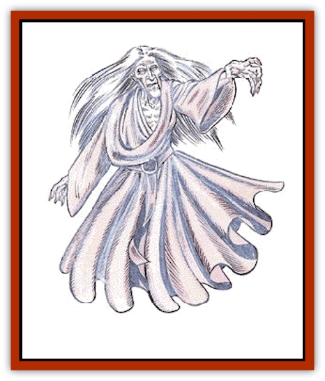

# Spectre

| Statistic | **Spectre** |
| --- | --- |
| **Activity Cycle:** | Darkness and night |
| **Alignment:** | Lawful evil |
| **Armor Class:** | 2 |
| **Climate/Terrain:** | Desolate dungeons and ruins |
| **Damage/Attack:** | 1-8 |
| **Diet:** | Nil |
| **Frequency:** | Rare |
| **Hit Dice:** | 7+3 |
| **Intelligence:** | High (13-14) |
| **Magic Resistance:** | See below |
| **Morale:** | Champion (15) |
| **Movement:** | 15, Fl 30 (B) |
| **No. Appearing:** | 1-6 |
| **No. of Attacks:** | 1 |
| **Organization:** | Solitary |
| **Size:** | M (6' tall) |
| **Special Attacks:** | Energy drain |
| **Special Defenses:** | +1 or better weapon to hit |
| **THAC0:** | 13 |
| **Treasure:** | Q&times;3,X,Y |
| **XP Value:** | 3,000 |

Spectres are powerful undead that haunt the most desolate and deserted of places. They hate all life and light.

Spectres appear as semitransparent beings and are often mistaken for [[Haunt|haunts]] or [[Ghost|ghosts]]. Unlike most undead, spectres retain the semblance and manner of dress of their former life and can be recognized by old friends or through paintings of the persons they used to be.

**Combat:** Spectres exist primarily on the Negative Material Plane and can therefore be attacked by beings on the Prime Material Plane only with magical weapons. Daylight makes spectres powerless by weakening their ties to the Negative Material Plane.

The chilling touch of a spectre drains energy from living creatures. A successful attack inflicts 1-8 points of damage and drains two life energy levels from the victim. Any being totally drained of life energy by a spectre becomes a full-strength spectre under the control of the spectre which drained him. The victim loses all control of his personality and may become more or less powerful than before, depending on his level and class before becoming a spectre.

Spectres are immune to all *sleep*, *charm*, *hold*, and cold-based spells, as well as poisons and paralyzation attacks. Holy water inflicts 2-8 points of damage when it strikes a spectre. The water can be splashed on a spectre successfully. A *raise dead* spell apparently reverses the undead status, destroying the spectre immediately if a saving throw versus spell is failed.

**Habitat/Society:** Most spectres are solitary, but some enclaves exist where a particularly powerful or lucky spectre has managed to drain mortals of life. This lead spectre is known as the master spectre (always with maximum hit points per die), while the others are known collectively as the followers. In this arrangement, the master spectre almost never engages enemies personally, but instead sends his minions in for the kill. Mortals drained of life by follower spectres are subservient to the master spectre, not the followers. Note that if the master spectre is slain, all followers become independent and can travel anywhere they wish in hopes of becoming master spectres themselves. Once a character becomes a spectre, recovery is nearly impossible, requiring a special quest.

Spectres hate light and all life, as both remind them of their undead existence. They are therefore encountered only in places of extreme darkness and desolation, like long-abandoned ruins, dungeons, and subterranean sewers.

Contrary to popular mythology, spectres remain highly intelligent and generally rational after the transformation to undeath. Life makes them lament their unlife, and they bear a strong hatred for all those lucky enough to live and truly die.

Spectres have enough cunning to plan their attacks, and rival vampires in their skill at remaining hidden from the general populace.

**Ecology:** No one knows who the first spectre was or how it came to be; the few facts detailed above are all that is known with any degree of certainty.

---
## Discovery & Documentation

**Source Publication:** MC1 Volume I (w/binder #1) (1991)
**Campaign Setting:** Advanced Dungeons & Dragons 2nd Edition
**Author(s):** Jay Batista, Scott Bennie, Grant Boucher, William W. Connors, Steve Gilbert, Heike Kubasch, James Lowder, David Edward Martin, Bruce Nesmith, Jean Rabe, Rick Swan, John J. Terra, Gary L. Thomas

### Other Creatures Found in This Source Book
   * [[Bat|Bat]]
   * [[Bear|Bear]]
   * [[Behir|Behir]]
   * [[Boar|Boar]]
   * [[Bookworm|Bookworm]]
   * [[Brownie|Brownie]]
   * [[Bugbear|Bugbear]]
   * [[Carrion_Crawler|Carrion Crawler]]
   * [[Cat_Great|Cat, Great]]
   * [[Catoblepas|Catoblepas]]
   * [[Dragon_General_Information|Dragon, General Information]]
   * [[Dragonfish|Dragonfish]]
   * [[Elemental_Air_Kin_Aerial_Servant|Elemental, Air Kin, Aerial Servant]]
   * [[Elemental_Earth_Kin_Sandling|Elemental, Earth Kin, Sandling]]
   * [[Elephant|Elephant]]
   * [[Gnoll|Gnoll]]
   * [[Hobgoblin|Hobgoblin]]
   * [[Homunculus|Homunculus]]
   * [[Hornet_Giant|Hornet, Giant]]
   * [[Horse|Horse]]
   * [[Hyena|Hyena]]
   * [[Jackal|Jackal]]
   * [[Jackalwere|Jackalwere]]
   * [[Korred|Korred]]
   * [[Lich|Lich]]
   * [[Lizard|Lizard]]
   * [[Lizard_Man|Lizard Man]]
   * [[Lycanthrope_General_Information|Lycanthrope, General Information]]
   * [[Lycanthrope_Seawolf|Lycanthrope, Seawolf]]
   * [[Lycanthrope_Werebear|Lycanthrope, Werebear]]
   * [[Lycanthrope_Weretiger|Lycanthrope, Weretiger]]
   * [[Lycanthrope_Werewolf|Lycanthrope, Werewolf]]
   * [[Manticore|Manticore]]
   * [[Medusa|Medusa]]
   * [[Mind_Flayer|Mind Flayer]]
   * [[Minotaur|Minotaur]]
   * [[Mudman|Mudman]]
   * [[Mummy|Mummy]]
   * [[Nixie|Nixie]]
   * [[Nymph|Nymph]]
   * [[Ogre|Ogre]]
   * [[Ooze_Slime_Jelly_I|Ooze/Slime/Jelly I]]
   * [[Ooze_Slime_Jelly_II|Ooze/Slime/Jelly II]]
   * [[Orc|Orc]]
   * [[Owl|Owl]]
   * [[Owlbear_I|Owlbear I]]
   * [[Pegasus|Pegasus]]
   * [[Piercer|Piercer]]
   * [[Pudding_Deadly|Pudding, Deadly]]
   * [[Rakshasa|Rakshasa]]
   * [[Rat|Rat]]
   * [[Ray|Ray]]
   * [[Remorhaz|Remorhaz]]
   * [[Satyr|Satyr]]
   * [[Scorpion|Scorpion]]
   * [[Selkie|Selkie]]
   * [[Shadow|Shadow]]
   * [[Skeleton|Skeleton]]
   * [[Skunk|Skunk]]
   * [[Snake|Snake]]
   * [[Spider|Spider]]
   * [[Sprite|Sprite]]
   * [[Toad_Giant|Toad, Giant]]
   * [[Treant|Treant]]
   * [[Troll|Troll]]
   * [[Umber_Hulk|Umber Hulk]]
   * [[Unicorn|Unicorn]]
   * [[Vampire|Vampire]]
   * [[Wight|Wight]]
   * [[Will_O'Wisp|Will O'Wisp]]
   * [[Wolf|Wolf]]
   * [[Wolfwere|Wolfwere]]
   * [[Wraith|Wraith]]
   * [[Wyvern|Wyvern]]
   * [[Yeti|Yeti]]
   * [[Yuan-ti|Yuan-ti]]
   * [[Zombie|Zombie]]
