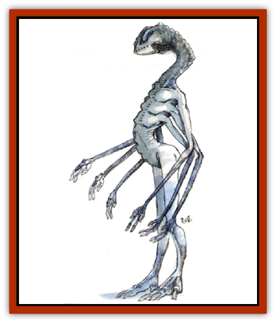

# Spell Weaver

| Statistic | **Spell Weaver** |
| --- | --- |
| **Activity Cycle:** | Any |
| **Alignment:** | Neutral |
| **Armor Class:** | 2 |
| **Climate/Terrain:** | Any land |
| **Damage/Attack:** | As per wizard spell |
| **Diet:** | Herbivore |
| **Frequency:** | Very rare |
| **Hit Dice:** | 10 |
| **Intelligence:** | Genius (17-18) |
| **Magic Resistance:** | 50% |
| **Morale:** | Champion (15-16) |
| **Movement:** | 12 |
| **No. Appearing:** | 1 |
| **No. of Attacks:** | See below |
| **Organization:** | Solitary |
| **Size:** | M (5' tall) |
| **Special Attacks:** | Surprise bonus when invisible |
| **Special Defenses:** | Immune to effects of pain and to psionics and fear-based attacks; planar impenetrability; innate spell powers; invisibility at will |
| **THAC0:** | 11 |
| **Treasure:** | Magical items (see below) |
| **XP Value:** | 10,000 |

Spell weavers are nonhuman spellcasters of great power, originating from an alternate Prime Material Plane. Only vaguely humanoid in appearance, they have a combination of mammalian, reptilian, and insectoid features.

Spell weavers are totally silent, using telepathy (10-mile radius) to communicate among themselves. Humans find that telepathic communication with spell weavers is extremely difficult and even dangerous, resulting in temporary insanity for any individual who attempts *ESP* or telepathic rapport and fails to save vs. spell (Wisdom bonuses apply). Insanity lasts 1d6 days, with effects as per the mage spell *confusion*.

**Combat:** Spell weavers possess a keen interest in magical items and phenomena of all kinds. A group of them will organize to steal a unique magical device in a commando-like raid of hellish ferocity, invisibly bypassing outer guards to appear near the item itself. If necessary, the group will destroy or incapacitate the guards, then seize the item and escape.

Spell weavers automatically *detect magic* and *detect invisibility* in a 100-foot radius. Each can *plane shift* once per day, shifting only from its home plane to an alternate one or back again (the latter usually at the end of a raid). A spell weaver is immune to fear, though they will retreat if common sense dictates. Their peculiar decentralized nervous systems render them resistant to pain and to all psionic attacks.

Each spell weaver possesses a fixed assortment of spells that it casts solely through the use of complex arm and hand gestures, using no verbal or material components; the casting time for such spells is the same as for humans. Some of their spells are previously unknown to humanity, but usually they are wizard spells of up to 6th-level (cast at the 12th level of ability), Further, the segmented brain of a spell weaver supports magical multi-tasking, allowing it to cast multiple spells simultaneously. To cast a spell, a spell weaver uses as many arms as the spell has levels. Thus, a single creature could cast a 4th-level spell using four arms while simultaneously casting a 2nd-level spell with its other two arms. Spell weavers use this ability whenever they face multiple attackers. A spell weaver may also cast two or more identical spells simultaneously (two *fireballs*, for example).

A spell weaver has a number of "spell points" (one point for each spell level) equal to its hit points. It can usc each spell in its arsenal any number of times within the limit of its spell-point total. Thus, a spell weaver with 43 hp can cast a number of spell levels each day adding up to 43 spell points. Spells are selected at the time of casting.

They always carry magical items (1-2 per creature). One item is always of the conventional sort (random roll for type, none cursed), and the additional item (if any) is a unique device that humans call the *chromatic disk*. Any magical item may be employed at the same time a spell weaver casts any spells, devoting one or two arms (as necessary) to the effort.

A *chromatic disk* is a 6-inch-diameter disk of an unknown, indestructible substance. It glows with a bright light that slowly shifts through the visible spectrum, becoming red, orange, yellow, green, blue, indigo, and violet in a matter of seconds. The *disk* is a vessel of magical power that spell weavers can tap, thus increasing their effective spell-point total by 10 points. Each *disk* releases magical energy as it is used, allowing the spell weaver to cast more of its spells. The *disk* is consumed in the process, evaporating as its energy is exhausted. A spell weaver may employ a *disk* in combat, devoting one arm to holding the *disk*.

All recorded human attempts at employing *chromatic disks* have resulted in explosive disaster (10d4 damage explosion in a 30-foot radius; material items must save vs. crushing blow). It is rumored that spell weavers use arcane means of their own to create such *disks* by drawing the magic out of enchanted items (such as swords, wands, or scrolls) that they have captured. This process permanently destroys the magical properties of the objects so used.

**Habitat/Society:** Aloof and inscrutable, spell weavers are generally regarded as intelligent, if bizarre. Although the race usually expresses little interest in humanity, a history of destructive encounters has earned them mankind's fearful respect. Although the two races rarely communicate, owing to resultant insanity among humans, spell weavers sometimes leave written messages for humans, but they are often cryptic and confusing. Infrequent alliances with humans in order to acquire magical devices have been reported, however.

Spell weavers are solitary creatures, though it is possible to meet more than one if they are on a raid. They reproduce through a magical fission process that results in two identical spell weavers of half the size and strength of the original. It would appear they have no control over this process, as they have been known: to divide even during crisis situations (1% chance per meeting of this occurring; the process takes 1d6+4 rounds, during which time the individual makes no attacks).

All spell weaver activities appear to be confined to the Prime Material Plane(s). Each spell weaver can create a region of planar impenetrability around itself (200-foot radius), once per day, for 10 rounds. All scrying attempts and planar travel into, out of, or through this area, whether by spell, artifact, psionics, or intrinsic ability, result in failure. This ability requires no expenditure of energy on the part of the spell weaver, although this effect will not be activated in a round during which the spell weaver has been surprised. The activation of this planar shield takes a full round of concentration, during which the creature cannot cast any spells.

Spell weavers have the unsettling habit of lying dormant and invisible for months in various areas of magical interest (magical temples, castles, portals, dungeons, etc.), and becoming active only if detected. When encountered in this fashion, they are generally murderous and implacable.

Spell weavers make their lairs in a bewildering variety of locations, including underground, outdoors within giant mutated trees, on magical floating platforms disguised as clouds, etc. All spell weaver lairs contain 1d8 unusual pillars (10-foot-tall stone or wood columns covered with magical runes that are indecipherable to humans). Stolen magical items are sometimes (10%) found atop a pillar. While prolonged study of the runes on a column can be mentally damaging (successfully save vs. petrification once per round or be confused for 1d10 rounds), incidental viewing produces only mild headaches. Touching the runes may have unpredictable magical effects (at the DM's whim).

**Ecology:** The ecology of the spell weaver remains a mystery, as those who have researched them have become insane.

The accompanying tables may be used to generate a spell weaver's bank of usable spells. A 1d4 roll is made on the *Spell Weaver's Spells* table for each being, then the particular spells each spell weaver has are generate using the *Spell Selection Tables*. A spell weaver can cast only these spells and no others. Feel free to augment the lists and manipulate the results in order to produce an interesting spell weaver.

 

| 1d4 Roll | Spells |
| --- | --- |
| 1 | 2 offensive, 2 defensive, 1 utility (maximum level 5) |
| 1 | 3 offensive, 3 defensive, 2 utility (maximum level 6) |
| 3 | 4 offensive, 4 defensive, 7 utility (maximum level 6) |
| 4 | 4 offensive, 4 defensive, 4 utility (maximum level 6) |

 

| 1d20 Roll | Spell (level) |
| --- | --- |
| 1-2 | Magic Missile (1) |
| 3 | Web (2) |
| 4 | Ray of enfeeblement (2) |
| 5 | Fireball (3) |
| 6 | Hold person (3) |
| 7 | Lightning bolt (3) |
| 8 | Slow (3) |
| 9 | Confusion (4) |
| 10 | Evard's black tentacles (4) |
| 11 | Fear (4) |
| 12 | Ice storm (4) |
| 13 | Cloudkill (5) |
| 14 | Cone of cold (5) |
| 15 | Conjure elemental (5) |
| 16 | Chain lightning (6) |
| 17 | Death spell (6) |
| 18 | Disintegrate (6) |
| 19 | Stone to flesh (6) |
| 20 | Unique spell (DM's creation: level 1 to 6) |

 

| 1d20 Roll | Spell (level) |
| --- | --- |
| 1 | Armor (1) |
| 2 | Feather fall (1) |
| 3 | Shield (1) |
| 4-6 | Invisibility (2) |
| 7 | Wizard lock (2) |
| 8-12 | Dispel magic (3) |
| 13 | Protection from normal missiles (3) |
| 14 | Fire shield (4) |
| 15 | Polymorph self (4) |
| 16 | Stoneskin (4) |
| 17 | Wall of fire (4) |
| 18 | Anti-magic shell (6) |
| 19 | Globe of invulnerability (6) |
| 20 | Unique spell (DM's creation: level 1 to 6) |

 

| 1d20 Roll | Spells |
| --- | --- |
| 1 | Darkness, 15' radius (2) |
| 2-3 | Levitate (2) |
| 4 | Clairvoyance (3) |
| 5 | Fly (3) |
| 6 | Dimension door (4) |
| 7 | Wizard eye (4) |
| 8-10 | Passwall (5) |
| 11-15 | Teleport (5) |
| 16 | Wall of iron (5) |
| 17-18 | Contingency (6) |
| 19 | Invisible stalker (6) |
| 20 | Unique spell (DM's creation: level 1 to 6) |

---
## Discovery & Documentation

**Source Publication:** Monstrous Compendium, 1994 Annual, Volume 1 (1995)
**Campaign Setting:** Advanced Dungeons & Dragons 2nd Edition
**Author(s):** David Wise

### Other Creatures Found in This Source Book
   * [[Abyss_Ant|Abyss Ant]]
   * [[Achaierai|Achaierai]]
   * [[Afanc|Afanc]]
   * [[Al-Jahar|Al-Jahar]]
   * [[Baelnorn|Baelnorn]]
   * [[Baneguard|Baneguard]]
   * [[Banelar|Banelar]]
   * [[Bird_Talking|Bird, Talking]]
   * [[Blazing_Bones|Blazing Bones]]
   * [[Campestri|Campestri]]
   * [[Caniquine|Caniquine]]
   * [[Cat_Winged|Cat, Winged]]
   * [[Crypt_Servant|Crypt Servant]]
   * [[Death's_Head_Tree|Death's Head Tree]]
   * [[Dog_Saluqi|Dog, Saluqi]]
   * [[Dragon_Electrum|Dragon, Electrum]]
   * [[Dragon_Fang|Dragon, Fang]]
   * [[Dragon_Linnorm_Corpse_Tearer|Dragon, Linnorm, Corpse Tearer]]
   * [[Dragon_Linnorm_Dread|Dragon, Linnorm, Dread]]
   * [[Dragon_Linnorm_Flame|Dragon, Linnorm, Flame]]
   * [[Dragon_Linnorm_Forest|Dragon, Linnorm, Forest]]
   * [[Dragon_Linnorm_Frost|Dragon, Linnorm, Frost]]
   * [[Dragon_Linnorm_Gray|Dragon, Linnorm, Gray]]
   * [[Dragon_Linnorm_Land|Dragon, Linnorm, Land]]
   * [[Dragon_Linnorm_Midgard|Dragon, Linnorm, Midgard]]
   * [[Dragon_Linnorm_Rain|Dragon, Linnorm, Rain]]
   * [[Dragon_Linnorm_Sea|Dragon, Linnorm, Sea]]
   * [[Dragon_Neutral_Jacinth|Dragon, Neutral, Jacinth]]
   * [[Dragon_Neutral_Jade|Dragon, Neutral, Jade]]
   * [[Dragon_Neutral_Pearl|Dragon, Neutral, Pearl]]
   * [[Dread|Dread]]
   * [[Dragon-kin|Dragon-kin]]
   * [[Elemental_Earth_Kin_Chrysmal|Elemental, Earth Kin, Chrysmal]]
   * [[Elemental_Earth_Kin_Earth_Weird|Elemental, Earth Kin, Earth Weird]]
   * [[Elemental_Fire_Kin_Azer|Elemental, Fire Kin, Azer]]
   * [[Elemental_Sandman|Elemental, Sandman]]
   * [[Elemental_Wind_Walker|Elemental, Wind Walker]]
   * [[Elemental_Vermin|Elemental Vermin]]
   * [[Feystag|Feystag]]
   * [[Flame_Skull|Flame Skull]]
   * [[Foulwing|Foulwing]]
   * [[Gambado|Gambado]]
   * [[Garbug|Garbug]]
   * [[Genie_Tasked_Administrator|Genie, Tasked, Administrator]]
   * [[Genie_Tasked_Deceiver|Genie, Tasked, Deceiver]]
   * [[Genie_Tasked_Harim_Servant|Genie, Tasked, Harim Servant]]
   * [[Genie_Tasked_Messenger|Genie, Tasked, Messenger]]
   * [[Genie_Tasked_Miner|Genie, Tasked, Miner]]
   * [[Genie_Tasked_Oathbinder|Genie, Tasked, Oathbinder]]
   * [[Gibbering_Mouther|Gibbering Mouther]]
   * [[Gnasher|Gnasher]]
   * [[Gnasher_Winged|Gnasher, Winged]]
   * [[Golem_Brain|Golem, Brain]]
   * [[Golem_Hammer|Golem, Hammer]]
   * [[Golem_Metagolem|Golem, Metagolem]]
   * [[Golem_Spiderstone|Golem, Spiderstone]]
   * [[Gorynych|Gorynych]]
   * [[Greelox|Greelox]]
   * [[Helmed_Horror|Helmed Horror]]
   * [[Jarbo|Jarbo]]
   * [[Laraken|Laraken]]
   * [[Lich_Psionic|Lich, Psionic]]
   * [[Living_Steel|Living Steel]]
   * [[Lock_Lurker|Lock Lurker]]
   * [[Loxo|Loxo]]
   * [[Lycanthrope_Loup_de_Noir|Lycanthrope, Loup de Noir]]
   * [[Lycanthrope_Werebadger|Lycanthrope, Werebadger]]
   * [[Lycanthrope_Werejaguar|Lycanthrope, Werejaguar]]
   * [[Lythlyx|Lythlyx]]
   * [[Magebane|Magebane]]
   * [[Marrashi|Marrashi]]
   * [[Metalmaster|Metalmaster]]
   * [[Mimic_House_Hunter|Mimic, House Hunter]]
   * [[Naga_Bone|Naga, Bone]]
   * [[Nautilus_Giant|Nautilus, Giant]]
   * [[Nightshade_Toril|Nightshade (Toril)]]
   * [[Nishruu|Nishruu]]
   * [[Noran|Noran]]
   * [[Opinicus|Opinicus]]
   * [[Ormyrr|Ormyrr]]
   * [[Parasite|Parasite]]
   * [[Pasari-Niml|Pasari-Niml]]
   * [[Plant_Vampire_Moss|Plant, Vampire Moss]]
   * [[Pteraman|Pteraman]]
   * [[Rautym|Rautym]]
   * [[Shadeling|Shadeling]]
   * [[Skum|Skum]]
   * [[Snake_Giant_Cobra|Snake, Giant Cobra]]
   * [[Snake_Stone|Snake, Stone]]
   * [[Spectral_Wizard|Spectral Wizard]]
   * [[Spider_Brain|Spider, Brain]]
   * [[Suwyze|Suwyze]]
   * [[Tatalla|Tatalla]]
   * [[Tick_Heart|Tick, Heart]]
   * [[Tree_Dark|Tree, Dark]]
   * [[Tree_Singing|Tree, Singing]]
   * [[Tressym|Tressym]]
   * [[Troll_Snow|Troll, Snow]]
   * [[Tuyewera|Tuyewera]]
   * [[Ulitharid|Ulitharid]]
   * [[Undead_Dwarf|Undead Dwarf]]
   * [[Undead_Lake_Monster|Undead Lake Monster]]
   * [[Whipsting|Whipsting]]
   * [[Windghost|Windghost]]
   * [[Wolf_Dread|Wolf, Dread]]
   * [[Wolf_Stone|Wolf, Stone]]
   * [[Wolf_Vampiric|Wolf, Vampiric]]
   * [[Wraith_Shimmering|Wraith, Shimmering]]
   * [[Xantravar|Xantravar]]
   * [[Xaver|Xaver]]
