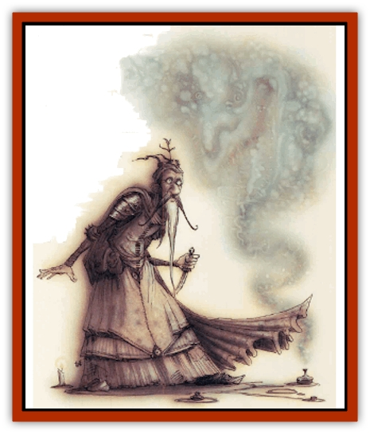

# Spellhaunt

| Statistic | **Spellhaunt** |
| --- | --- |
| **Activity Cycle:** | Any |
| **Alignment:** | Neutral |
| **Armor Class:** | 0 |
| **Climate/Terrain:** | Any |
| **Damage/Attack:** | 1d8 |
| **Diet:** | Special |
| **Frequency:** | Very rare |
| **Hit Dice:** | 5+5 |
| **Intelligence:** | Semi- (2-4) |
| **Magic Resistance:** | None |
| **Morale:** | Fearless (19-20) |
| **Movement:** | Fl 24 (A) |
| **No. Appearing:** | 1 |
| **No. of Attacks:** | 1 |
| **Organization:** | Solitary |
| **Size:** | M (6' tall) |
| **Special Attacks:** | Magic drain |
| **Special Defenses:** | Spell immunity |
| **THAC0:** | 15 |
| **Treasure:** | None |
| **XP Value:** | 2,000 |

Who can say what's out there if a cutter's willing to look for it? The planes are infinite, and there's an infinity of possibilities. If a blood looks long enough in the right places, he'll find anything he could ever imagine. 'Course, odds are he'll find ten things he ain't lookin' for first, but that's the way the Great Wheel turns. Spellhaunts're one of those things that just don't seem too likely or possible, until a body understands that anything's possible.

A spellhaunt's the remnant of a spell that was cast someplace it shouldn't've been tried. It appears as a rough humanoid shape formed of glowing energy. Some bloods say that the spellhaunt's body reflects the kind of magic that created it, so a failed *enervation* is a dark, cold shadow, while a *cloudkill* that went awry becomes a roiling mass of yellowish vapors. No one can say for sure if that's the dark of it, but it is true that no two spellhaunts look alike.

Spellhaunts're gifted with a semblance of life that begins fading the moment they gain their independent existence. The only thing that'll maintain their illusion of life is the consumption of magic in any form. If a basher doesn't have any magic on 'im, he doesn't have to worry about spellhaunts. On the other hand, cutters like wizards, incantifers, or anybody who's got a magic trinket of some kind need to know what a spellhaunt is and what it can do to get what it needs.

**Combat:** Spellhaunts aren't intelligent enough to grasp tactics or strategy of any kind. They can sense magic from an amazing distance - as far away as 100 yards for each spell-level equivalent a blood's got on his person. Magical items, spells with continuing effects, spellbooks, or even spells a wizard or priest's got memorized can attract the attention of a spellhaunt.

When a spellhaunt attacks, it heads straight for the blood with the most powerful magic on his person and strikes out with pseudopods of magical energy. The spellhaunt's attack ignores armor and magical adjustments to Armor Class - only a cutter's Dexterity adjustment modifies his base AC. Each hit inflicts 1d8 points of damage, and drains the same number of charges of magic that the cutter's got on him, in the following order:

<ul><li>Enchantments or spells with continuing effects, such as an *armor*, *stoneskin*, *contingency*, or any spell with a duration that is currently in effect;</li><li>Continuous effects of magical items that don't need to be activated, such as a *ring of protection*, *bracers of defense*, *ioun stones*, *boots of the north*, magical arms and armor, and the like;</li><li>The potential of magical items not currently creating a effect, such as a wand, potion, scroll, or miscellaneous item on the victim's person but not in use;</li><li>Spells the character has memorized but hasn't cast yet.</li></ul>One charge of magic is considered to be one "plus" of magical protection or weaponry, one function of a magical item without charges, one charge of an item with charges, or one spell level in memory. For example, say a wizard with a *ring of protection +3*, a *stoneskin* spell in effect, a *dagger +2*, a *wand of fire*, a *potion of healing*, and a normal battery of spells memorized is struck by a spellhaunt for 7 points of damage. First, the *stoneskin* spell is absorbed; secondly, five charges drain the *ring of protection* and the dagger; and last of all, one charge is drained from the *wand of fire*.

Because they are beings of living magic, spellhaunts are immune to all spells and magical effects except *absorption*, *antimagic shell*, *cancellation*, *dispel magic*, or *negation*. Spellhaunts resist *dispelling* as if they were created by 11th-level wizards, and may attempt a saving throw versus spell to avoid being *absorbed*, *cancelled*, or *negated*. (*Anti-magic* destroys the spellhaunt with no saving throw.) Spellhaunts can also be defeated by physical damage or nonmagical fire, acid, etc. Spellhaunts automatic drain one "plus" from any magical weapon that strikes them, although they take normal damage from the blow.

Spellhaunts immediately cease to attack any target that has no magic left to it, so a desperate basher could decoy the creature by tossing his magic sword to the ground and dumping his potions out of his backpack. Spellhaunts are sated after draining 11 to 20 charges (1d10+10) and drift off, oblivious to their surroundings or the harm they may have caused.

**Habitat/Society:** Spellhaunts can be found in any place where the rules of things are strange. In fact, they can be found anyplace, since sometimes a spell that appears to fizzle in one plane creates a sympathetic reaction in a completely different part of the multiverse. It's hard to be ret-tain, but it appears that the spell's got to fizzle at just the right moment and under just the right conditions to turn into a spellhaunt.

Many wizards've investigated the spellhaunt phenomena, hoping to harness the creature's magic-draining powers for their own uses, but research in the field's difficult and risky. Spellhaunts can't be reasoned with and are immune to most forms of magic, so the can't be coerced or even restrained.

**Ecology:** Without a steady diet of magical energy, spellhaunts quickly dissipate and die. The creature's "life" is a never-ending search for more energy to maintain its existence. It completely ignores natural ecosystems and surroundings; they mean nothing to it. All it wants to do is find the biggest source of magic it can and feed off it.

It's rumored that an Abyssal Lord has discovered a sure-fire method for creating spellhaunts and has some means of controlling the otherwise random creatures. These domesticated spellhaunts are called the Feeders. The chant is the [[Tanar'ri_General_Information|tanar'ri]] lord uses the Feeders to defend his palace from his rivals and perform his personal errands. No reliable blood's ever seen a spellhaunt taking orders from anything, but then again, no one can really say that they know that a spellhaunt *wasn't* under orders when it attacked them.

---
## Discovery & Documentation

**Source Publication:** Planescape II (1996)
**Campaign Setting:** Planescape
**Author(s):** Rich Baker, Karen S. Boomgarden

### Other Creatures Found in This Source Book
   * [[Aasimar|Aasimar]]
   * [[Abrian|Abrian]]
   * [[Arcane|Arcane]]
   * [[Balaena|Balaena]]
   * [[Beholder-kin_Observer|Beholder-kin, Observer]]
   * [[Bloodthorn|Bloodthorn]]
   * [[Bonespear|Bonespear]]
   * [[Darkweaver|Darkweaver]]
   * [[Demarax|Demarax]]
   * [[Dhour|Dhour]]
   * [[Eater_of_Knowledge|Eater of Knowledge]]
   * [[Eladrin_Greater_Firre|Eladrin, Greater, Firre]]
   * [[Eladrin_Greater_Ghaele|Eladrin, Greater, Ghaele]]
   * [[Eladrin_Greater_Tulani|Eladrin, Greater, Tulani]]
   * [[Eladrin_Lesser_Bralani|Eladrin, Lesser, Bralani]]
   * [[Eladrin_Lesser_Coure|Eladrin, Lesser, Coure]]
   * [[Eladrin_Lesser_Noviere|Eladrin, Lesser, Noviere]]
   * [[Eladrin_Lesser_Shiere|Eladrin, Lesser, Shiere]]
   * [[Fhorge|Fhorge]]
   * [[Ghostlight|Ghostlight]]
   * [[Guardinal_Avoral|Guardinal, Avoral]]
   * [[Guardinal_Cervidal|Guardinal, Cervidal]]
   * [[Guardinal_General_Information|Guardinal, General Information]]
   * [[Guardinal_Equinal|Guardinal, Equinal]]
   * [[Guardinal_Leonal|Guardinal, Leonal]]
   * [[Guardinal_Lupinal|Guardinal, Lupinal]]
   * [[Guardinal_Ursinal|Guardinal, Ursinal]]
   * [[Hollyphant|Hollyphant]]
   * [[Incantifer|Incantifer]]
   * [[Ironmaw|Ironmaw]]
   * [[Keeper|Keeper]]
   * [[Khaasta|Khaasta]]
   * [[Leomarh|Leomarh]]
   * [[Monster_of_Legend|Monster of Legend]]
   * [[Mortai|Mortai]]
   * [[Noctral|Noctral]]
   * [[Quill|Quill]]
   * [[Razorvine|Razorvine]]
   * [[Reave|Reave]]
   * [[Retriever|Retriever]]
   * [[Rilmani_Abiorach|Rilmani, Abiorach]]
   * [[Rilmani_General_Information|Rilmani, General Information]]
   * [[Rilmani_Argenach|Rilmani, Argenach]]
   * [[Rilmani_Aurumach|Rilmani, Aurumach]]
   * [[Rilmani_Cuprilach|Rilmani, Cuprilach]]
   * [[Rilmani_Ferrumach|Rilmani, Ferrumach]]
   * [[Rilmani_Plumach|Rilmani, Plumach]]
   * [[Shadowdrake|Shadowdrake]]
   * [[Spider_Hook|Spider, Hook]]
   * [[Sunfly|Sunfly]]
   * [[Sword_Spirit|Sword Spirit]]
   * [[Tanar'ri_Lesser_Bulezau|Tanar'ri, Lesser, Bulezau]]
   * [[Tanar'ri_Lesser_Maurezhi|Tanar'ri, Lesser, Maurezhi]]
   * [[Tanar'ri_Lesser_Yochlol|Tanar'ri, Lesser, Yochlol]]
   * [[Tanar'ri_General_Information|Tanar'ri, General Information]]
   * [[Tanar'ri_True_Alkilith|Tanar'ri, True, Alkilith]]
   * [[Terlen|Terlen]]
   * [[Tso|Tso]]
   * [[T'uen-rin|T'uen-rin]]
   * [[Vaporighu|Vaporighu]]
   * [[Vorr|Vorr]]
   * [[Wastrel|Wastrel]]
   * [[Wraithworm|Wraithworm]]
   * [[Yugoloth_Lesser_Canoloth|Yugoloth, Lesser, Canoloth]]
   * [[Zoveri|Zoveri]]
