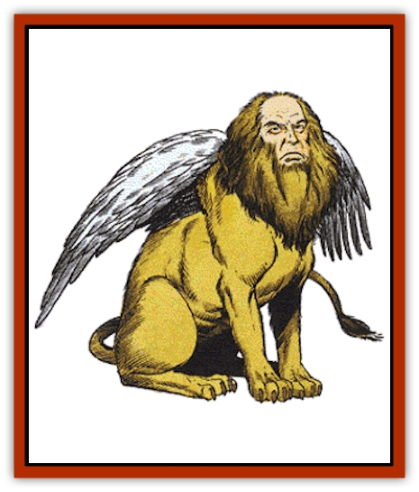

# Sphinx

| Statistic | **Androsphinx** | **Criosphinx** | **Gynosphinx** | **Hieracosphinx** |
| --- | --- | --- | --- | --- |
| **Activity Cycle:** | Day | Day | Day | Day |
| **Alignment:** | Chaotic good | Neutral | Neutral | Chaotic evil |
| **Armor Class:** | -2 | 0 | -1 | 1 |
| **Climate/Terrain:** | Warm lands | Warm woodlands | Warm lands | Warm hills |
| **Damage/Attack:** | 2-12/2-12 | 2-8/2-8/3-18 | 2-8/2-8 | 2-8/2-8/1-10 |
| **Diet:** | Carnivore | Carnivore | Carnivore | Carnivore |
| **Frequency:** | Very rare | Rare | Rare | Rare |
| **Hit Dice:** | 12 | 10 | 8 | 9 |
| **Intelligence:** | Exceptional (15-16) | Average (8-10) | Genius (17-18) | Low (5-7) |
| **Magic Resistance:** | Nil | Nil | Nil | Nil |
| **Morale:** | Fanatic (17) | Champion (16) | Fanatic (17) | Elite (13) |
| **Movement:** | 18, Fl 30 (D) | 12, Fl 24 (D) | 15, Fl 24 (D) | 9, Fl 36 |
| **No. Appearing:** | 1 | 1 | 1-4 | 1-6 |
| **No. of Attacks:** | 2 | 3 | 2 | 3 |
| **Organization:** | Solitary | Solitary | Solitary | Solitary |
| **Size:** | L (8' tall) | L (7½' tall) | L (7' tall) | L (7' tall) |
| **Special Attacks:** | See below | Nil | See below | Nil |
| **Special Defenses:** | Nil | Nil | Nil | Nil |
| **THAC0:** | 9 | 11 | 13 | 11 |
| **Treasure:** | U | F | R,X | E |
| **XP Value:** | 7,000 | 5,000 | 3,000 | 1,400 |

## Androsphinx

Androsphinxes are huge, winged mythological creatures with the bodies of male [[Cat_Great|lions]] and man-like facial features. They can speak the languages of common and all sphinxes.

**Combat:** The male, or andro-, sphinx is the most powerful of the sphinxes. Its huge paws can kill a normal man with just one swipe. If brute force is not successful, an androsphinx can cast spells as if a 6th-level priest. Note that most androsphinxes use these spells for healing and defense rather than damage and attack.

The androsphinx has another special weapon as well - his bellowing roar. It can roar three times per day, but must be very angry to do so. The first time an angry androsphinx roars, all creatures within 360 yards must roll successful saving throws vs. wands or flee in panic for three turns. When an already angry androsphinx is continually molested, even after bellowing once, it can roar even louder, causing all creatures within 200 yards to roll successful saving throws vs. petrification or be paralyzed with fright for 1d4 rounds. In addition, any creatures within 30 yards of this second roar are automatically deafened for 2d6 rounds (unless they are deaf already or have protected hearing organs). Any creature foolish enough to anger an androsphinx further will unleash his third and final roar with devastating effects. All creatures within 240 yards must successfully roll saving throws vs. spell or lose 2d4 points of Strength for 2d4 rounds (use -1 point equals -10% for characters with exceptional Strength). In addition to the weakness effects, any creature within 30 yards of the androsphinx is knocked over unless it is 8 feet tall or larger. Creatures knocked over suffer 2d8 points of damage and must roll a successful saving throw vs. breath weapon to avoid being stunned for 2d6 rounds. The force of this third roar is so powerful that stone within 30 yards cracks under the strain, unless it successfully saves vs. crushing blow.

**Habitat/Society:** Androsphinxes are the most solitary of the sphinxes. They shun gynosphinxes because they are jealous of the higher intelligence of their female counterparts, and find their neutral disposition a bit hard to deal with. However, most androsphinxes eventually succumb to the advances of a gynosphinx at least once in their lives.

**Ecology:** What is strangest about androsphinxes is not their combination lion/human appearance (as there are many such cross-mutations found in the world), but their apparent lack of purpose. They are by far the strongest of the sphinxes, but unlike their counterparts, have no true pattern of behavior universal to all androsphinxes. They despise communicating with humans and hate riddles (mostly because gynosphinxes love them so much). It is therefore suggested by those knowledgeable in mythological beasts and desert lore that androsphinxes are the guardians of the sphinxes, evil (hieraco-), neutral (gyno- and crio-), and good (andro-).

Certainly, androsphinxes are the lifelong adversaries of the hieracosphinxes, but they almost always let the defeated enemy go free instead of finishing the kill (often with a roar or two at the fleeing sphinxes' behinds).

In short, androsphinxes are free-roaming sphinxes sworn to defend other sphinxes against other races, namely men and their ilk. They have been known to bargain with men on occasion, but are the least greedy of the sphinxes, and are the only sphinxes likely to take offense at such offerings if made by characters with low Charismas or evil alignments.

## Criosphinx

Criosphinxes have the bodies of winged lions, but they have the heads of rams. They are always male. They can speak their own dialect of sphinx, as well as that spoken by andro/gynosphinxes and the languages of animals.

**Combat:** Criosphinxes attack with their two paws or with a head butt with their ram's horns. Because they cast no spells and are not the brightest of sphinxes, their bargains with other beings are limited to "safe passage or die." They love treasure and lust after gynosphinxes constantly. Plenty of wealth, or knowledge of the location of a gynosphinx's lair, is always enough for adventurers to avoid confrontation with criosphinxes.

**Habitat/Society:** Criosphinxes prize wealth and usually seek to extort passers-by for safe passage in exchange for a hefty bribe. They are sometimes found in packs of two or more, but only because all of these sphinxes are looking for the same gynosphinx. They often follow other criosphinxes, even if they have no idea whether or not the leader really knows where he's going. When a number of criosphinxes find a gynosphinx, the first order of business is to restrain their prey. Usually pushing boulders in front of the lair with their huge horns is sufficient. Then the criosphinxes butt horns like rams, except these creatures do their fighting in the air. The winner gets the prize.

More often than not, however, criosphinxes begin their combat immediately upon finding their quarry, and inevitably the victor strides forth to find the gynosphinx gone. While the criosphinxes often find themselves richer for their trouble, as the gynosphinx rarely sees the need for material wealth while it is fleeing, it is only a poor reward indeed for their often decades-long quest.

**Ecology:** Criosphinxes are obviously just further mutations of the already mysterious sphinx form. Their ability to speak with animals seems to be an evolutionary necessity, as criosphinxes are particularly fond of warm wooded areas, often bordering on the desert lands preferred by gynosphinxes.

## Gynosphinxes

The gynosphinx is the female counterpart of the androsphinx, having a winged lion's body and human-like facial features. Gynosphinxes are not nearly as powerful as androsphinxes, but they are much more knowledgeable, clever, and wise. Gynosphinxes speak all sphinx languages as well as common.

**Combat:** Gynosphinxes can attack with two paws, but prefer to bargain with their opponents. They help strangers only if they are paid. They accept payment for services rendered or knowledge and advice given, in the form of gems (preferred), jewelry, magic, or knowledge. Knowledge that would be of special interest to a gynosphinx is the location of an androsphinx, but they accept fine prose, poetry, lore, or a good riddle.

If anyone breaks a bargain with a gynosphinx, he is subject to attack and the gynosphinx won't hesitate to devour the victim if it wins the fight. The gynosphinx can cast the following spells once per day: *detect magic*, *read magic*, *read languages*, *detect invisibility*, *locate object*, *dispel magic*, *clairaudience*, *clairvoyance*, *remove curse*, and *legend lore*. It can also use each *symbol* once per week. Note that a gynosphinx is very intelligent and can use these spells in many ways. If a bargaining group of adventurers steps back to discuss their plans among themselves, the gynosphinx will growl a little and cast *clairaudience* to listen in.

**Habitat/Society:** Gynosphinxes are solitary by nature, but not by choice. They spend most of their lives avoiding the advances of criosphinxes (which they detest) and hieracosphinxes (which they fear), and searching high and low for an androsphinx.

Gynosphinxes are intelligent enough to actively seek out ruins and mystical places, like forgotten temples and such, which they immediately occupy. Using their many spells to learn as much as possible about the setting, they then wait for the next group of travelers, pilgrims, or adventurers to come by and hope that they've encountered an androsphinx in their travels or have spells or magical items that might be usable for just such a purpose.

**Ecology:** Gynosphinxes own the dubious distinction of being the only female sphinx. A gynosphinx mated with an androsphinx will produce another androsphinx or gynosphinx (even chances for both). A gynosphinx mated with a criosphinx only produces another male criosphinx, while mating with a hieracosphinx produces similarly displeasing results.

Fortunately, gynosphinxes are much smarter than all of their counterparts and can avoid otherwise compromising situations through trickery and outright deceit. Unfortunately, they are among the slowest of the sphinxes when flying or running, and the lustful criosphinx and vicious hieracosphinx rarely give up the chase once a gynosphinx has been located.

## Hieracosphinxes

Hieracosphinxes are the only evil members of their breed. They have the bodies of lions, but the wings and head of [[Hawk|hawks]]. They are always males. They speak the languages of the other sphinxes, and some (20%) also speak common.

**Combat:** Hieracosphinxes do not cast spells, much like the criosphinxes, but make up for their weaknesses with tenacious evil and viciousness. Their paws and sharp beaks are deadly in combat, and they have been known to swoop down on victims.

**Habitat/Society:** Hieracosphinxes live in hilly regions exclusively, dwelling in caves overlooking the nearby deserts. They delight in evil and sometimes gather in bands of as many as six to do their vile business. Most often when a band of hieracosphinxes is encountered, it is hot in pursuit of an androsphinx, which they hate with all of their beings. Only in numbers can they hope to defeat so powerful an adversary, and these sphinxes never believe in honor or playing fair. While it is true that a victorious androsphinx sometimes lets the defeated flee (in the vain hope that the battle may change the losers' dispositions), a defeated androsphinx is always ripped to pieces when the hieracosphinxes are numerous enough and lucky enough to win the fight.

Hieracosphinxes also spend much of their time searching for a gynosphinx to mate with, but prefer to kill an androsphinx and inhabit his lair until a gynosphinx eventually arrives (usually by following old rumors and legends). It is worthwhile to note that there are more hieracosphinxes than criosphinxes.

**Ecology:** Hieracosphinxes are belligerent mutations of unknown origin. It is believed that they were created by elder gods of evil merely to wreak havoc on the other, more pleasant sphinxes described above.

---
## Discovery & Documentation

**Source Publication:** MC2 Volume II (1993)
**Campaign Setting:** Advanced Dungeons & Dragons 2nd Edition
**Author(s):** Jay Batista, Scott Bennie, Grant Boucher, William W. Connors, Steve Gilbert, Heike Kubasch, James Lowder, David Edward Martin, Bruce Nesmith, Jean Rabe, Rick Swan, John J. Terra, Gary L. Thomas

### Other Creatures Found in This Source Book
   * [[Ant|Ant]]
   * [[Ant_Lion_Giant|Ant Lion, Giant]]
   * [[Ape_Carnivorous|Ape, Carnivorous]]
   * [[Baboon|Baboon]]
   * [[Badger|Badger]]
   * [[Barracuda|Barracuda]]
   * [[Beetle_Giant|Beetle, Giant]]
   * [[Bulette|Bulette]]
   * [[Bullywug|Bullywug]]
   * [[Dwarf_Duergar|Dwarf, Duergar]]
   * [[Dwarf_Gully|Dwarf, Gully]]
   * [[Eagle|Eagle]]
   * [[Eel|Eel]]
   * [[Elemental_Air_Kin|Elemental, Air Kin]]
   * [[Elemental_Water_Kin|Elemental, Water Kin]]
   * [[Elemental_Water_Kin_Water_Weird|Elemental, Water Kin, Water Weird]]
   * [[Firestar|Firestar]]
   * [[Firetail|Firetail]]
   * [[Fish_Giant|Fish, Giant]]
   * [[Frog|Frog]]
   * [[Gorgon|Gorgon]]
   * [[Hawk|Hawk]]
   * [[Heucuva|Heucuva]]
   * [[Hippocampus|Hippocampus]]
   * [[Hippogriff|Hippogriff]]
   * [[Kelpie|Kelpie]]
   * [[Kenku|Kenku]]
   * [[Killmoulis|Killmoulis]]
   * [[Kuo-Toa|Kuo-Toa]]
   * [[Lamia|Lamia]]
   * [[Lammasu|Lammasu]]
   * [[Lamprey|Lamprey]]
   * [[Leech|Leech]]
   * [[Leprechaun|Leprechaun]]
   * [[Leucrotta|Leucrotta]]
   * [[Locathah|Locathah]]
   * [[Lycanthrope_Wereboar|Lycanthrope, Wereboar]]
   * [[Lycanthrope_Werefox|Lycanthrope, Werefox]]
   * [[Mammal_Minimal|Mammal, Minimal]]
   * [[Mammal_Small|Mammal, Small]]
   * [[Mimic|Mimic]]
   * [[Morkoth|Morkoth]]
   * [[Muckdweller|Muckdweller]]
   * [[Myconid|Myconid]]
   * [[Naga|Naga]]
   * [[Obliviax|Obliviax]]
   * [[Octopus_Giant|Octopus, Giant]]
   * [[Otyugh|Otyugh]]
   * [[Piranha|Piranha]]
   * [[Plant_Dangerous_I|Plant, Dangerous I]]
   * [[Plant_Intelligent|Plant, Intelligent]]
   * [[Poltergeist|Poltergeist]]
   * [[Porcupine|Porcupine]]
   * [[Rat_Osquip|Rat, Osquip]]
   * [[Roc|Roc]]
   * [[Roper|Roper]]
   * [[Rot_Grub|Rot Grub]]
   * [[Rust_Monster|Rust Monster]]
   * [[Sahuagin|Sahuagin]]
   * [[Sea_Lion|Sea Lion]]
   * [[Sea_Horse_Giant|Sea Horse, Giant]]
   * [[Shambling_Mound|Shambling Mound]]
   * [[Shark|Shark]]
   * [[Squid_Giant|Squid, Giant]]
   * [[Stirge|Stirge]]
   * [[Swanmay|Swanmay]]
   * [[Tarrasque|Tarrasque]]
   * [[Tasloi|Tasloi]]
   * [[Triton|Triton]]
   * [[Troglodyte|Troglodyte]]
   * [[Urchin|Urchin]]
   * [[Urd|Urd]]
   * [[Weasel|Weasel]]
   * [[Wolverine|Wolverine]]
   * [[Yellow_Musk_Creeper|Yellow Musk Creeper]]
