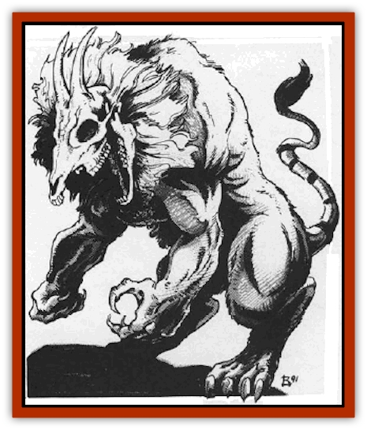

# Sphinx - Astro

| Statistic | **Sphinx, Astro-** |
| --- | --- |
| **Activity Cycle:** | Any |
| **Alignment:** | Chaotic evil |
| **Armor Class:** | 4 |
| **Climate/Terrain:** | Any |
| **Damage/Attack:** | 2d6,/2d6/4d6/1d6/1d6 |
| **Diet:** | Carnivore |
| **Frequency:** | Rare |
| **Hit Dice:** | 9 |
| **Intelligence:** | Highly (13-14) |
| **Magic Resistance:** | 25% |
| **Morale:** | Fanatic (18) |
| **Movement:** | 18, Fl 24 |
| **No. Appearing:** | 1 |
| **No. of Attacks:** | 5 |
| **Organization:** | Solitary |
| **Size:** | L (12' at shoulder) |
| **Special Attacks:** | Chain lightning |
| **Special Defenses:** | Nil |
| **THAC0:** | 12 |
| **Treasure:** | A |
| **XP Value:** | 6,000 |

Astrosphinxes are a malevolent breed of [[Sphinx|sphinx]] whose origins are shrouded in mystery. Standing twice as tall as a man, the astrosphinx is covered with brass-colored scales like those of a [[Dragon_General_Information|dragon]]. A pair of huge black bat wings sprouts from its back. The head resembles a goat skull, with tiny pinpricks of violet light in its eye sockets. The head does in fact have flesh; it is just so pale, and stretched so tightly across the skull, that it seems invisible. Instead of forepaws, the astrosphinx has a pair of large, clawed human hands. The beast exudes a smell of ozone and offal.

These frightful creations, parodies of true sphinxes, speak the language of all sphinxes and the Common tongue.

**Combat:** An astrosphinx uses its two goat horns to attack with a head-butt, each horn doing 1d6 damage. It can bite viciously (4d6 damage). Its human hands have large claws that do 1d6 damage each. In rare instances (5% of the time), the creature wields a two-handed sword, sometimes magical.

Though the creature has a draconian body, it cannot use its tail or hind legs in combat. It does, however, breathe a cone of sleep gas 80' long, 4' wide at the beast's mouth and 20' wide at the base. Targets caught in the cone must save vs. breath weapon or fall asleep for 1d6 turns. Victims in wildspace in their own air bubbles remain asleep until the gas is somehow flushed out of the air supply. The astrosphinx can employ this breath weapon once every five rounds.

Finally, the astrosphinx can shoot a 9d6 chain lightning bolt from its eye sockets. There is a one-round delay before hurling the bolt, and a resting of the eyes for one round afterwards. On the round before the bolt fires, the pinpoints of light in the astrosphinx's eye sockets change color from violet to gold. On the round after the bolt is fired, the eyes change to red. At the end of that round, the eyes change back to their normal violet, which means that the eyes have recharged.

The disadvantage to the sphinx's lightning weapon is that it is blind for the one round of rest. The sphinx suffers a -4 penalty to THAC0 in melee combat during the round of eye rest.

In melee combat, the astrosphinx attacks homicidally mindlessly until nothing living still stands. As a rule, after its riddle is answered incorrectly (see below), the sphinx breathes its sleep gas, shoots the lightning, then hurls itself into melee. The astrosphinx attacks not only the person who got the riddle wrong, but all companions as well.

**Habitat/Society:** Astrosphinxes are fiercely territorial and challenge all intruders to a contest of riddles. Those who answer incorrectly, or do not answer at all, are killed outright. Due to their dementia, the astrosphinxes challenge any living things. even birds, bugs, small animals, and plants.

The madness of the astrosphinxes renders their riddles unanswerable and illogical: "What is the speed of blue?" "How loud is down?" "What do a kobold and the Spelljammer have in common besides triangles?" Unfortunately, an astrosphinx slays anyone who does not answer its riddle correctly; so, an astrosphinx is usually the only creature on a given planet.

Some travellers, legend states, have solved an astrosphinx's mad riddle by giving an equally mad or nonsensical answer. This tactic seldom works (1% chance of success). Legend says that if an astrosphinx's riddle is answered correctly, the beasts erupts into a 20d6 ring of chain lightning, killing itself. Supposedly all that is left is a clue to the whereabouts of the Spelljammer.

The astrosphinx can survive in space without air. It lairs most often on small, barren chunks of rock. The sphinx eats anything, usually those who give wrong answers to its riddles.

**Ecology:** The astrosphinx is a bizarre predator that all conscientious races believe is better off hunted down and killed. Not even the evil intelligent races have anything to do with it. Saving any piece of an astrosphinx as a trophy is considered a bad omen, and the owner of the grisly trophy winds up shunned by his fellows.

---
## Discovery & Documentation

**Source Publication:** MC9 Spelljammer Appendix II (1991)
**Campaign Setting:** Planescape
**Author(s):** Scott Davis, Newton Ewell, John Terra

### Other Creatures Found in This Source Book
   * [[Alchemy_Plant|Alchemy Plant]]
   * [[Allura|Allura]]
   * [[Aperusa|Aperusa]]
   * [[Autognome|Autognome]]
   * [[Bionoid|Bionoid]]
   * [[Bloodsac|Bloodsac]]
   * [[Buzzjewel|Buzzjewel]]
   * [[Constellate|Constellate]]
   * [[Contemplator|Contemplator]]
   * [[Dohwar|Dohwar]]
   * [[Dragon_Moon|Dragon, Moon]]
   * [[Dragon_Stellar|Dragon, Stellar]]
   * [[Dragon_Sun|Dragon, Sun]]
   * [[Dreamslayer|Dreamslayer]]
   * [[Dweomerborn|Dweomerborn]]
   * [[Fal|Fal]]
   * [[Feesu|Feesu]]
   * [[Fire_Bat|Fire Bat]]
   * [[Firebird|Firebird]]
   * [[Firelich|Firelich]]
   * [[Flowfiend|Flowfiend]]
   * [[Gadabout|Gadabout]]
   * [[Gammaroid|Gammaroid]]
   * [[Gonn|Gonn]]
   * [[Gossamer|Gossamer]]
   * [[Grav|Grav]]
   * [[Great_Dreamer|Great Dreamer]]
   * [[Greatswan|Greatswan]]
   * [[Grell_Colonial|Grell, Colonial]]
   * [[Gullion|Gullion]]
   * [[Insectare|Insectare]]
   * [[Lhee|Lhee]]
   * [[Mercurial_Slime|Mercurial Slime]]
   * [[Meteorspawn|Meteorspawn]]
   * [[Monitor|Monitor]]
   * [[Owl_Space|Owl, Space]]
   * [[Pristatic|Pristatic]]
   * [[Scro|Scro]]
   * [[Selkie_Star|Selkie, Star]]
   * [[Silatic|Silatic]]
   * [[Skullbird|Skullbird]]
   * [[Sleek|Sleek]]
   * [[Sluk|Sluk]]
   * [[Space_Swine|Space Swine]]
   * [[Spirit_Warrior|Spirit Warrior]]
   * [[Starfly_Plant|Starfly Plant]]
   * [[Stargazer|Stargazer]]
   * [[Undead_Stellar|Undead, Stellar]]
   * [[Witchlight_Marauder|Witchlight Marauder]]
   * [[Xixchil|Xixchil]]
   * [[Yitsan|Yitsan]]
   * [[Zurchin|Zurchin]]
