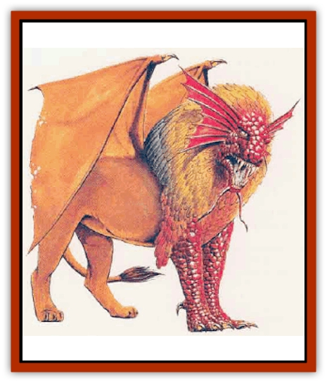

# Sphinx - Draco

| Statistic | **Sphinx, Draco-** |
| --- | --- |
| **Activity Cycle:** | Day |
| **Alignment:** | Chaotic evil |
| **Armor Class:** | -1 |
| **Climate/Terrain:** | Desert, mountain |
| **Damage/Attack:** | 3d4/3d4/5d4 |
| **Diet:** | Carnivore |
| **Frequency:** | Very rare |
| **Hit Dice:** | 11+11 |
| **Intelligence:** | Genius (17-18) |
| **Magic Resistance:** | Nil |
| **Morale:** | Fanatic (17-18) |
| **Movement:** | 9, Fl 24 (D) |
| **No. Appearing:** | 1 |
| **No. of Attacks:** | 3 |
| **Organization:** | Solitary |
| **Size:** | H (9' tall at the shoulder) |
| **Special Attacks:** | Breath weapon, spells |
| **Special Defenses:** | Nil |
| **THAC0:** | 9 |
| **Treasure:** | Nil (F) |
| **XP Value:** | 12,000 |

The highly magical dracosphinx is native to the desert highlands, where it competes with the more numerous [[Sphinx|hieracosphinx]] for territory. This fierce, sly predator scours the wilderness for prey, be it small game or humans. The dracosphinx has a [[Cat_Great|lion's]] body, a [[Dragon_Chromatic_Red|red dragon's]] head and foreparts, and a mane of colorful feathers. Its long forepaws have sharp [[Dragon_General_Information|dragon]] claws.

The dracosphinx speaks common and the language of red dragons, to whom it is distantly related.

**Combat:** Dracosphinxes are excellent wizards, specializing in illusions. They have the spells of a 9th-level illusionist, but cast them as if they were 12th level. They often use their illusions to fool prey into a false sense of security, then strike when it is least expected.

A dracosphinx attacks with its huge claws and teeth, causing 3d4 points of damage with a successful claw strike and 5d4 points of damage with its fangs. The fiery breath weapon can be used once per turn; this spews forth flamhng gas in a 100-foot-long cone that is 20 feet wide at its far end. This inflicts 8d10+8 polnts of fiery damage. A successful saving throw vs. dragon breath reduces the damage by half.

**Habitat/Society:** Dracosphinxes live solitary existences on bleak cliff sides. They spend their days looking for prey and lying in the sun, although they will occasionally travel in search of obscure knowledge. Each dracosphinx carves out a territory of approximately five miles in diameter. They aggressively work to drive major predators from their territory: dragons, men, hieracosphinxes, and the occasioaal [[Wyvern|wyvern]]. Their philosophical ideas include the one that only the strongest and cleverest survive and the weak and cowardly get what they deserve.

Dracosphinxes know that humans who seek them out and talk to them, often try to slay them; they enjoy tricking such humans with riddle contests and conversations that leave the humans unprepared for a sudden attack. They will usually make such an attack at least once during any prolonged encounter, as they value strength nearly as much as cleverness. Obvious weakness, lack of strong leadership in a group, or any hint of fear will almost certainly trigger an attack. Conversely, a show of strength backed up by the ability to deal with the attack when it comes will make the dracosphinx much more helpful as a source of information or lore. The dracosphinx can even be forced to give up a specific object if it is demanded and minutely described by an individual with certain knowledge that it is in the creature's hoard.

Once a dracosphinx has been bested, assuming it survives, it will usually abandon its territory and in order to find a new place to live.

Dracosphinxes pride themselves on their cunning and respect it in others. They will occasionally let weak but clever captives go in exchange for a service, usually the recovery of a magical item or piece of lore. Knowledgeable captives will be kept as long as the dracosphinx can learn something new from them; this takes one day per experience level of the captive, with Intelligence checks required daily thereafter to hold its interest. When the dracosphinw loses intest, the captive will likely be killed and eaten. Like dragons, dracosphinxes are greedy and amass hoards of coins, jewels, and other valuables.

**Ecology:** Dracosphinxes mate once in a lifetime, with the female flying away to raise a clutch of three to five large brown eggs. These eggs are laid in separate areas and buried, since hatchlings are likely to eat each other. The hatchlings are about a foot long at birth and are capable of hunting small game. They grow to nearly full size within a year. They have life spans of about 600 years. Dracosphinxes cannot be tamed except through magical means.

---
## Discovery & Documentation

**Source Publication:** Monstrous Compendium, 1995 Annual, Volume 2 (1995)
**Campaign Setting:** Advanced Dungeons & Dragons 2nd Edition
**Author(s):** Jon Pickens

### Other Creatures Found in This Source Book
   * [[Aboleth_Savant|Aboleth, Savant]]
   * [[Addazahr|Addazahr]]
   * [[Amiq_Rasol|Amiq Rasol]]
   * [[Arch-Shadow|Arch-Shadow]]
   * [[Automaton_Scaladar|Automaton, Scaladar]]
   * [[Automaton_Trobriand's|Automaton, Trobriand's]]
   * [[Bat_Sporebat|Bat, Sporebat]]
   * [[Beetle_Dragon|Beetle, Dragon]]
   * [[Bi-nou|Bi-nou]]
   * [[Boggle|Boggle]]
   * [[Brownie_Dobie|Brownie, Dobie]]
   * [[Brownie_Quickling|Brownie, Quickling]]
   * [[Cat_Crypt|Cat, Crypt]]
   * [[Cat_Great_Cath_Shee|Cat, Great, Cath Shee]]
   * [[Centaur-kin_Dorvesh|Centaur-kin, Dorvesh]]
   * [[Centaur-kin_Gnoat|Centaur-kin, Gnoat]]
   * [[Centaur-kin_Ha'pony|Centaur-kin, Ha'pony]]
   * [[Centaur-kin_Zebranaur|Centaur-kin, Zebranaur]]
   * [[Chronolily|Chronolily]]
   * [[Curst|Curst]]
   * [[Darktentacles|Darktentacles]]
   * [[Dinosaur_Aquatic|Dinosaur, Aquatic]]
   * [[Dinosaur_II|Dinosaur II]]
   * [[Dinosaur_III|Dinosaur III]]
   * [[Doppelganger_Greater|Doppelganger, Greater]]
   * [[Dragon_Brine|Dragon, Brine]]
   * [[Dragon_Half-|Dragon, Half-]]
   * [[Dragon-kin_Sea_Wyrm|Dragon-kin, Sea Wyrm]]
   * [[Dwarf_Wild|Dwarf, Wild]]
   * [[Ekimmu|Ekimmu]]
   * [[Elemental_Nature|Elemental, Nature]]
   * [[Elf_Winged|Elf, Winged]]
   * [[Fish_Great_Glacier|Fish (Great Glacier)]]
   * [[Fish_Subterranean|Fish, Subterranean]]
   * [[Fish_Toril|Fish (Toril)]]
   * [[Flareater|Flareater]]
   * [[Flumph|Flumph]]
   * [[Froghemoth|Froghemoth]]
   * [[Ghost_Casurua|Ghost, Casurua]]
   * [[Ghost_Ker|Ghost, Ker]]
   * [[Ghul|Ghul]]
   * [[Ghul-Kin|Ghul-Kin]]
   * [[Giant_Half-giant|Giant, Half-giant]]
   * [[Golem_Burning_Man|Golem, Burning Man]]
   * [[Golem_Phantom_Flyer|Golem, Phantom Flyer]]
   * [[Gulguthhydra|Gulguthhydra]]
   * [[Hakeashar|Hakeashar]]
   * [[Horse_Moon-|Horse, Moon-]]
   * [[Human_Dragonslayer|Human, Dragonslayer]]
   * [[Human_Vistana|Human, Vistana]]
   * [[Jellyfish_Giant|Jellyfish, Giant]]
   * [[Kalin|Kalin]]
   * [[Kholiathra|Kholiathra]]
   * [[Laerti|Laerti]]
   * [[Leucrotta_Greater|Leucrotta, Greater]]
   * [[Lich_Suel|Lich, Suel]]
   * [[Lurker_Shadow|Lurker, Shadow]]
   * [[Lycanthrope_Werepanther|Lycanthrope, Werepanther]]
   * [[Lycanthrope_Wereshark|Lycanthrope, Wereshark]]
   * [[Mammal_Herd_II|Mammal, Herd II]]
   * [[Marl|Marl]]
   * [[Meenlock|Meenlock]]
   * [[Mimic_Greater|Mimic, Greater]]
   * [[Mold_II|Mold II]]
   * [[Mummy_Creature|Mummy, Creature]]
   * [[Nyth|Nyth]]
   * [[Ooze_Slime_Jelly_Ghaunadan|Ooze/Slime/Jelly, Ghaunadan]]
   * [[Palimpsest|Palimpsest]]
   * [[Peltast|Peltast]]
   * [[Plant_Dangerous_II|Plant, Dangerous II]]
   * [[Pleistocene_Animal|Pleistocene Animal]]
   * [[Pudding_Subterranean|Pudding, Subterranean]]
   * [[Raggamoffyn|Raggamoffyn]]
   * [[Snake_Serpent|Snake, Serpent]]
   * [[Snake_Serpent_Vine|Snake, Serpent Vine]]
   * [[Sprite_Seelie_Faerie|Sprite, Seelie Faerie]]
   * [[Sprite_Unseelie_Faerie|Sprite, Unseelie Faerie]]
   * [[Squealer|Squealer]]
   * [[Turtle_Giant|Turtle, Giant]]
   * [[Umpleby|Umpleby]]
   * [[Vizier's_Turban|Vizier's Turban]]
   * [[Wall_Walker|Wall Walker]]
   * [[Webbird|Webbird]]
   * [[Yak-Man|Yak-Man]]
   * [[Zorbo|Zorbo]]
