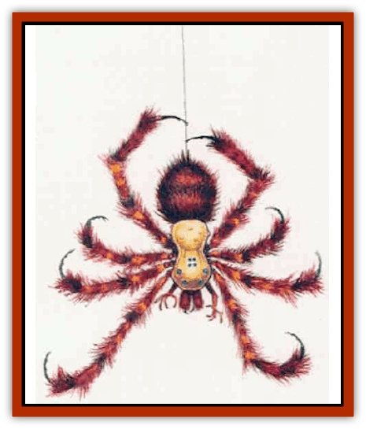

# Spider-kin

| Statistic | **Aranea** | **Planar Spider** | **Ploppéd** | **Rhagodessa** |
| --- | --- | --- | --- | --- |
| **Activity Cycle:** | Any | Any | Amy | Night |
| **Alignment:** | Chaotlc neutral | Any | Neutral | Neutral |
| **Armor Class:** | 7 | 6 | 9 | 5 |
| **Climate/Terrain:** | Non-artic forest | Any | Mountains | Forest, mountains, subterranean |
| **Damage/Attack:** | 1d6 (bite) | 2d6 (bite) | 1 (bite) | 2d4 (bite) |
| **Diet:** | Carnivore | Omnivore | Carnivore | Carnivore |
| **Frequency:** | Rare | Very rare | Very rare | Rare |
| **Hit Dice:** | 17 | 5-12 | ½ | 4+2 |
| **Intelligence:** | Highly (13-14) | Very (11-12) | Non (0) | Non (0) |
| **Magic Resistance:** | Nil | M (5' diameter) | Nil | Nil |
| **Morale:** | Steady (11) | Steady (11) | Unsteady (6) | Steady (12) |
| **Movement:** | 3 | 18 | 12, Jp 20 | 15 |
| **No. Appearing:** | 1d6 | 3d6 | 2d6 | 1d6 |
| **No. of Attacks:** | 1 | 1 | 1 | 1 |
| **Organization:** | Solitary | Group or nation | Solitary | Solitary |
| **Size:** | L (7' diameter) | Phasing | T (9&rdquo; diameter) | L (7' long) |
| **Special Attacks:** | Poison, spells | Poison, phasing | Poison, leap | Grapple |
| **Special Defenses:** | Spells | Nil | Thief abilities | Nil |
| **THAC0:** | 18, Wb 12 | 15 (5-6 HD) / 13 (7-8 HD) / 11 (9-10 HD) / 9 (11-12 HD) | 20 | 17 |
| **Treasure:** | D | Special | Nil | O,U |
| **XP Value:** | 650 | 5 HD: 2,000 / 6 HD: 3,000 / 7 HD: 4,000 / 8 HD: 5,000 / 9 HD: 6,000 / 10 HD: 7,000 / 11 HD: 8,000 / 12 HD: 9,000 | 65 | 270 |

The spider-kin include several types of creatures found in different parts of Mystara and the planes beyond it that have little in common except for their basic [[Spider|spider]] shape. Like their cousins the spiders, spider-kin have large mandibles equipped with fangs that can deliver a deadly, usually venomous, bite. The diameters listed in the table above include the creatures' outstretched legs.

**Aranea**

  These creatures are about the size of small ponies and are nearly indistinguishable from the various types of giant, web-spinning spiders. An [[Aranea_Savage_Coast|aranea]], however, has a massive, oddly shaped hump on the back of its head that houses the creature's large and well-developed brain. An aranea also has an extra pair of limbs just below the mandibles. These limbs end in flexible digits which the aranea can use to manipulate simple tools. They spin huge webs, each about 40 feet in diameter, with many narrow extensions winding through the trees nearby. The aranea use these extensions to travel through the trees from crown to ground level. Only creatures who are very unwary or stumbling about in the dark are likely to become entangled in them.

In combat, an aranea bites with its poisonous fangs for 1d6 points of damage. The victim must make a successful saving throw vs. poison or suffer additional damage from the aranea's venom. During the round that the saving throw fails, the victim feels no ill effects except a faint stiffening of the limbs. However, each round thereafter the victim suffers 4 points of damage, dying at the end of 1d4+1 rounds (regardless of hit points).

All aranea also cast spells as 3rd-level wizards. Their spell books consist of crude rolls of bark written in chalk or charcoal. These scrolls are very delicate and usually fall apart if carried away from the creature's web. In fact, only careful examination reveals that they are valuable at all, as they tend to be well hidden among clumps of leaves and other litter that sticks to the web. As a race, aranea prefer subtle but potent spells, such as illusions, various *charm* spells, and *haste* and *slow*. As a rule, they avoid fire-based spells that might damage their webs or their forest homes.

Aranea are clever and patient: their favorite combat tactic is to lie in wait for prey in the branches of a tree, then silently lower themselves on strands of webbing and begin a spell attack. When confronted by dangerous foes, they often mask their true appearance with illusions and pretend to be [[Elf|elves]], rangers, druids, or [[Dryad|dryads]].

The aranea are involved in a constant state of war with the [[Phanaton|phanatons]].

**Planar Spider**

  The planar spiders are intelligent, plane-traveling arachnids who have a vast, but odd, civilization. They can travel both astrally and ethereally and thus can easily move among the planes. Some sages speculate that planar spiders might be related to [[Spider|phase spiders]], but there is no definitive proof for this theory.

Most planar spiders have 5 Hit Dice, but leaders of up to 12 Hit Dice have been reported. Their home plane is almost certainly a Deep Ethereal demiplane, but it is entirely unknown and no traces of their cities have ever been discovered. Traveling planar spiders describe the plane as a place with cities lovingly crafted from imperishable white webs. Any planar spider encountered away from its home plane is a veteran traveler who speaks Common and at least one other demihuman language. There are many different nations of planar spiders, just as there are many different nations of humans and demihumans. Planar spiders from the nation of Chak are those most often encountered in and around Mystara.

Planar spiders are as unpredictable as humans but rarely attack adventurers without provocation, preferring instead to attempt to communicate with any creatures they meet in order to determine the strangers intentions. On the other hand, some wandering groups of planar spiders ("Black Chak") are thieves or bandits who seek riches by any means, fair or foul.

In combat, a planar spider flits between planes to confuse foes. This gives them a -3 bonus on initiative rolls; if a planar spider wins an initiative roll by a margin of 4 or more, it may attack and then become ethereal before its opponent has a chance to strike back. Their favorite tactic is to appear behind their opponents, where they gain a +4 modifier for attacking from the rear and negate bonuses from shield and Dexterity. If overmatched, a planar spider flees off plane. If caught on the Astral or Ethereal planes, planar spiders gain only a -1 bonus on initiative rolls and can be attacked every round.

A planar spider's fangs carry type F poison; once bitten, a victim must make a successful saving throw vs. poison at a -4 penalty or die. Planar spiders can bite without using the poison if they so desire.

Any planar spider encountered may have (30% chance, plus 10% for each Hit Die beyond five) 1d3 miscellaneous magical items it can use. Each planar spider also carries 1d4 unusual nomagical items that are not familiar to natives of the Prime Material Plane (the planar spiders, of course, understand these items perfectly well).

There are spellcasting planar spiders, but encounters with them are extremely rare; they can be priests or wizards of up to 9th level. A planar spider's experience-point value increases by 1,000 XP if it casts 1st- or 2nd-level spells; by 2,000 points if it casts 3rd-level or higher spells.

**Ploppéd**

  Ploppéds are a mutated strain of common spiders. Currently, they are found only in the Silver Sierra mountain range on the border between Darokin and Glantri.

Ploppeds have bodies about the size of oranges. Their legs are extremely long and have many knobby joints. Each plopped has a random number of legs (1d8+2 pairs). Ploppéds are black and hairy, regardless of the number of legs.

Sages refer to these creatures as "polyped" (many legged), but their common local name, "ploppéd", derives from the sounds they make when leaping about (plop! plop!). Ploppéds are very sneaky, and they have the following thief abilities: move silently 40%, climb walls 91%, and hide in shadows 28%.

Normally, ploppéds do not prey on creatures larger than normal-sized rats. However, if startled or cornered they attack and then run away.

In combat, ploppéds attack by leaping. A ploppéd can hurl itself up to 20 feet. When fighting creatures significantly larger than themselves, such as humans and demihumans, a ploppéd leaps for exposed areas, such as the face or neck. If the ploppéd scores a hit, it bites and injects a paralytic poison; the victim must make a successful saving throw vs. poison or be immediately paralyzed for 1d6 turns. Tiny creatures receive a -4 penalty to their saving throws and, if the saving throw fails, are paralyzed for 1d6x10 turns.

**Rhagodessa**

  A rhagodessa is a giant, spiderlike camivore about the size of a light horse. It has massive mandibles in its oversized yellowish head. The rest of the creature is dark brown, except for the eyes, which are gleaming black. A rhagodessa has five pairs of legs. The front pair end in powerful suckers which the creature uses to grasp prey. In combat, a rhagodessa strikes first with these front legs. A successful hit inflicts no damage, but the suckers hold on with a Strength of 20. During the next melee round the rhagodessa pulls the victim to its mandibles and automatically bites, causing 2d4 points of damage.

If harassed while biting prey, a rhagodessa lifts its victim into the air and scurries away. The rhagodessa can lift up to 700 pounds in this manner.

Rhagodessas can climb most sheer surfaces if they are not smooth and slippery. They have more difficulty climbing when carrying a victim but can manage even this feat if the surface is rough or cracked. Rhagodessa generally devour their prey at the first opportunity.

---
## Discovery & Documentation

**Source Publication:** Mystara Appendix (1994)
**Campaign Setting:** Mystara
**Author(s):** John Nephew, Teeuwynn Woodruff, John Terra, Skip Williams

### Other Creatures Found in This Source Book
   * [[Actaeon|Actaeon]]
   * [[Agarat|Agarat]]
   * [[Ash_Crawler|Ash Crawler]]
   * [[Baldandar|Baldandar]]
   * [[Bargda|Bargda]]
   * [[Bhut|Bhut]]
   * [[Bird_Mystara|Bird (Mystara)]]
   * [[Blackball|Blackball]]
   * [[Choker|Choker]]
   * [[Coltpixie|Coltpixie]]
   * [[Crone_of_Chaos|Crone of Chaos]]
   * [[Darkhood|Darkhood]]
   * [[Darkwing|Darkwing]]
   * [[Decapus|Decapus]]
   * [[Deep_Glaurant|Deep Glaurant]]
   * [[Diabolus|Diabolus]]
   * [[Dimensional_Warper|Dimensional Warper]]
   * [[Dragon_Mystara_Crystalline|Dragon (Mystara), Crystalline]]
   * [[Dragon_Mystara_Jade|Dragon (Mystara), Jade]]
   * [[Dragon_Mystara_Onyx|Dragon (Mystara), Onyx]]
   * [[Dragon_Mystara_Ruby|Dragon (Mystara), Ruby]]
   * [[Drake_Mystara|Drake (Mystara)]]
   * [[Dragonfly|Dragonfly]]
   * [[Dusanu|Dusanu]]
   * [[Elemental_of_Chaos_Air_Earth|Elemental of Chaos, Air/Earth]]
   * [[Elemental_of_Chaos_Fire_Water|Elemental of Chaos, Fire/Water]]
   * [[Elemental_of_Law_Air_Earth|Elemental of Law, Air/Earth]]
   * [[Elemental_of_Law_Fire_Water|Elemental of Law, Fire/Water]]
   * [[Familiar_Mystara|Familiar (Mystara)]]
   * [[Frost_Salamander|Frost Salamander]]
   * [[Fundamental_Air_Earth|Fundamental, Air/Earth]]
   * [[Fundamental_Fire_Water|Fundamental, Fire/Water]]
   * [[Gargantua_Mystara|Gargantua (Mystara)]]
   * [[Geonid|Geonid]]
   * [[Ghostly_Horde|Ghostly Horde]]
   * [[Giant_Athach|Giant, Athach]]
   * [[Giant_Hephaeston|Giant, Hephaeston]]
   * [[Golem_Drolem|Golem, Drolem]]
   * [[Golem_Mystara_I|Golem (Mystara) I]]
   * [[Golem_Mystara_II|Golem (Mystara) II]]
   * [[Golem_Mystara_III|Golem (Mystara) III]]
   * [[Gray_Philosopher|Gray Philosopher]]
   * [[Guardian_Warrior|Guardian Warrior]]
   * [[Gyerian|Gyerian]]
   * [[Herex|Herex]]
   * [[Hivebrood|Hivebrood]]
   * [[Horde|Horde]]
   * [[Hsiao|Hsiao]]
   * [[Huptzeen|Huptzeen]]
   * [[Hutaakan|Hutaakan]]
   * [[Imp_Mystara|Imp (Mystara)]]
   * [[Jellyfish_Giant_Mystara|Jellyfish, Giant (Mystara)]]
   * [[Kna|Kna]]
   * [[Kopru|Kopru]]
   * [[Lizard_Mystara|Lizard (Mystara)]]
   * [[Lizard-kin_Mystara|Lizard-kin (Mystara)]]
   * [[Lupin|Lupin]]
   * [[Lycanthrope_Werejaguar_Mystara|Lycanthrope, Werejaguar (Mystara)]]
   * [[Lycanthrope_Wereswine|Lycanthrope, Wereswine]]
   * [[Magen|Magen]]
   * [[Manikin|Manikin]]
   * [[Mek|Mek]]
   * [[Mujina|Mujina]]
   * [[Nagpa|Nagpa]]
   * [[Neh-thalggu|Neh-thalggu]]
   * [[Nightshade_Mystara|Nightshade (Mystara)]]
   * [[Nuckalavee|Nuckalavee]]
   * [[Pegataur|Pegataur]]
   * [[Phanaton|Phanaton]]
   * [[Plant_Dangerous_Mystara|Plant, Dangerous (Mystara)]]
   * [[Plasm|Plasm]]
   * [[Rakasta|Rakasta]]
   * [[Rock_Man|Rock Man]]
   * [[Sabreclaw|Sabreclaw]]
   * [[Sacrol|Sacrol]]
   * [[Scamille|Scamille]]
   * [[Shapeshifter|Shapeshifter]]
   * [[Shargugh|Shargugh]]
   * [[Shark-kin|Shark-kin]]
   * [[Sollux|Sollux]]
   * [[Spectral_Death|Spectral Death]]
   * [[Spectral_Hound|Spectral Hound]]
   * [[Spirit_Mystara|Spirit (Mystara)]]
   * [[Statue_Living|Statue, Living]]
   * [[Surtaki|Surtaki]]
   * [[Tabi|Tabi]]
   * [[Thoul|Thoul]]
   * [[Thunderhead|Thunderhead]]
   * [[Tiger_Ebon|Tiger, Ebon]]
   * [[Topi|Topi]]
   * [[Tortle|Tortle]]
   * [[Vampire_Velya|Vampire, Velya]]
   * [[White_Fang|White Fang]]
   * [[Worm_Mystara|Worm (Mystara)]]
   * [[Wyrd|Wyrd]]
   * [[Yowler|Yowler]]
   * [[Zombie_Lightning|Zombie, Lightning]]
