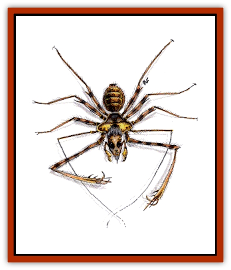

# Spider

| Statistic | **Gargantuan** | **Giant** | **Hairy** | **Huge** | **Large** | **Phase** | **Sword** |
| --- | --- | --- | --- | --- | --- | --- | --- |
| **Activity Cycle:** | Any | Any | Any | Any | Any | Any | Any |
| **Alignment:** | Chaotic evil | Chaotic evil | Neutral evil | Neutral | Neutral | Neutral | Chaotic evil |
| **Armor Class:** | 4 | 4 | 8 | 6 | 8 | 7 | 3 |
| **Climate/Terrain:** | Any nonarctic / land | Any nonarctic / land | Any nonarctic / land | Any nonarctic / land | Any nonarctic / land | Any | Any (prefers jungles) |
| **Damage/Attack:** | 2-12 | 1-8 | 1 | 1-6 | 1 | 1-6 | 2-8 (bite)/2-12 perleg |
| **Diet:** | Carnivore | Carnivore | Omnivore | Carnivore | Carnivore | Carnivore | Carnivore |
| **Frequency:** | Very rare | Uncommon | Common | Common | Common | Rare | Very rare |
| **Hit Dice:** | 7+7 or 8+8 | 3+3 or 4+4 | 1-1 | 2+2 | 1+1 | 5+5 | 5+5 |
| **Intelligence:** | Low (5-7) | Low (5-7) | Low (5-7) | Animal (1) | Non- (0) | Low (5-7) | Average (8-10) |
| **Magic Resistance:** | Nil | Nil | Nil | Nil | Nil | Nil | Nil |
| **Morale:** | Elite (14) | Elite (13) | Average (10) | Average (8) | Unsteady (7) | Champion (15) | Elite (13) |
| **Movement:** | 9, Wb 12 | 3, Wb 12 | 12, Wb 9 | 18 | 6, Wb 15 | 6, Wb 15 | 6, Wb 8, Cl 8 |
| **No. Appearing:** | 1-6 | 1-8 | 1-20 | 1-12 | 2-20 | 1-4 | 1 |
| **No. of Attacks:** | 1 | 1 | 1 | 1 | 1 | 1 | 2 |
| **Organization:** | Nest | Nest | Swarm | Pack | Swarm | Solitary | Solitary |
| **Size:** | G (10' long, 20' diameter) | L (8'-12' diameter) | T (6&rdquo; or less diameter) | M (6' diameter) | S (2' diameter) | H (14' diameter) | H (12' diameter) |
| **Special Attacks:** | See below | See below | Poison | See below | See below | See below | See below |
| **Special Defenses:** | See below | Nil | Nil | Nil | Nil | Phasing | Nil |
| **THAC0:** | 7+7 HD: 13 / 8+8 HD: 11 | 3+3 HD: 17 / 4+4 HD: 15 | 20 | 19 | 19 | 15 | 15 |
| **Treasure:** | C | C | Nil | J-N,Q | J-N | E | Nil |
| **XP Value:** | 7+7 HD: 1,400 / 8+8 HD: 3,000 | 3+3 HD: 420 / Flying: 650 / 4+4 HD: 650 / Steeder: 975 / Trap door: 975 | 65 | 270 | 175 | 1,400 | 2,000 |

Spiders are aggressive predators, dwelling both above and below ground. Most listed here are poisonous and bite prey first, because unconscious victims are easier to carry to a lair.

Spiders have eight legs and eight eyes. They usually fit into two categories: web-spinners, which have bulbous abdomens and thin, sleek legs; and hunting spiders, which have smaller bodies, larger heads and fangs, and hairy bodies and legs.

**Hairy Spider**

  These are the vicious, black, hunting spiders that are found in jungles, tombs, caverns, and throughout the Underdark. Though spin no webs, they can move readily in the webs of other spiders, and they are immune to all known spider venoms.

Hairy spiders hunt in groups, swarming over victims to bite. Up to 40 hairy spiders can swarm a human-sized victim, and bite with a +5 bonus to attack rolls once they are attached. Hairy spiders are remarkably resistant to crushing damage; rolling or crashing into walls is ineffective at removing or destroying hairy spiders. They must be individually struck or torn away.

Hairy spiders are sometimes used as familiars, especially by [[Elf_Drow|drow]] wizards. They can carry small items and walk on walls and ceilings; they have 60-foot infravision and are not afraid of fire. Some (40%) of these spiders can *detect invisibility*; they have a 4 in 6 chance, once per round. These familiars are sometimes given treasure by their masters.

Victims receive a +2 bonus to saving throws vs. the hairy spiders' weak poison. If the saving throw fails, the victim's AC and attack rolls are penalized by 1, and Dexterity is penalized by -3 with respect to Dexterity checks. These effects begin one round after the bite and last for 1d4+1 rounds.

**Large Spider**

  Large spiders are web-spinners that build strong, sticky webs, and often lurk nearby waiting for victims to get stuck while examining the beautiful constructions of their own spinning. A being with Strength 19 or more is unaffected by the webs. For each point of Strength less than 19, it takes one round to break free of the webs (for example, a PC with Strength 15 can break free in four rounds). As many spiders as possible will attack the defenseless victim during its struggle to free itself. Entangled characters can be attacked with a +4 bonus to hit, and lose all Armor Class adjustments due to Dexterity.

The large spider's poison is Type A, the onset time is 15 minutes. Victims take 15 points of damage, or no damage if a saving throw vs. poison (with a +2 to the roll) is successful.

**Huge Spider**

  Huge spiders are hunting spiders that prefer to hide in camouflaged tunnels and holes and wait to leap as much as 30 feet through the air at unsuspecting victims. Their opponents suffer a -6 to surprise rolls when attacked in this manner.

Huge spiders also posses Type A poison, with the same effects as that of a large spider. Victims receive a +1 to saving throws vs. the poison of the huge spider.

The [[Watchspider|watch spider]] is a specially bred, huge spider used as a guard animal in cellars, warehouses, and some drow homes. It has Low Intelligence (5-7) and can be trained to obey a master, not attack beings designated by the master, and to disable spellcasters. Their venom has an onset time of 1-2 rounds and causes paralysis for 2d4 turns, unless the victim makes a successful saving throw vs. poison (with a +1 on the roll). If starved for long periods, they often eat paralyzed prey.

**Giant Spider**

  Most giant spiders are simply much bigger versions of the web-spinning large spiders. Their poison is Type F, which causes immediate death if the victim fails the saving throw.

The <b class="bk">giant water spider** is a small version (8-foot diameter, 3+3 HD) of the giant spider. It lives in a burrow in a body of fresh water, and fills its burrow with bubbles of air. These spiders drag prey underwater to their lairs, where they can safely wrap it in cocoons for later repasts. It is faster than a normal giant spider (movement rate 15), but cannot travel through webs. It is only semi-intelligent (2-4) and has treasure as a huge spider; its bite causes only 1d4 damage plus poison.

The <b class="bk">flying spider**, sometimes just called a hunting spider, is a giant, winged, hunting spider. They are sometimes trained as guard animals, especially by the drow. They are 10 feet in diameter and have 3+3 Hit Dice. Its normal movement rate is 9, and its great gossamer wings allow it to fly at the same rate (MC: D). These spiders can also leap up to 70 feet, and fall any distance without harm upon landing, as long as they use their wings. Hunting spiders have Type A poison, just as a large spider, with the same damage and saving throw adjustment.

The <b class="bk">giant trapdoor spider** is a hunting spider which builds tunnels and surprises prey like a huge spider; it is brown or golden, with red strips around its legs. On a successful attack roll, the spider can grab a victim and attempt to drag it into its lair. A victim can get free by making a successful Strength check, with a -2 penalty, or be freed by companions, if their Strength totals 20 or more. The victim can make no attacks.

A giant trapdoor spider has 4+4 Hit Dice and causes 2d4 damage per bite. Its poison causes an additional 1d6 points of damage if the victim fails a saving throw vs. poison. Though it does not build webs, it can travel through webs of other spiders, and it can shoot web strands up to 3 feet. The web strands require normal attack rolls to hit; they cause no damage, but entangle a victim for 1d4 rounds.

The <b class="bk">steeder** is a giant hunting spider with tarantula markings, 4+4 Hit Dice, and a movement rate of 12. It does not spin webs and cannot move in them, but its feet exude a sticky substance which allows it to cling to precarious surfaces, even if only one foot is touching the surface. The steeder also uses the secretions (50% of the time) to cling to prey; this requires an attack roll from the steeder, against AC 10 for the victim, adjusted only for magic and Dexterity. A victim can escape by making a successful Strength or Dexterity roll with a -10 penalty. While held, the victim suffers a -2 penalty to attack and damage rolls and is automatically bitten once per round.

[[Dwarf_Duergar|Duergar dwarves]] use steeders as mounts, fitting the spiders with complex saddles and control straps. A steeder can leap 240 feet, even with a rider. Leaps are considered charging attacks. A steeder moves on walls and ceilings at half its normal rate; duergar saddles are built for this kind of motion.

**Phase Spider**

  Phase spiders are web-spinners with a raised thorax and a human-like head; they are often confused with [[Neogi|neogi]] or [[Elf_Drow|driders]]. They have a unique ability to phase in and out of the Prime material plane. They phase in, attack, and phase out, all in a single round. This gives them a -3 modifier on initiative rolls; if a phase spider wins initiative by more than 4, it attacks and phases out before its opponent has a chance to strike back. Then too, a phase spider usually phases into existence behind its chosen victim, so they get a +4 modifier for attacking from behind. Phase spiders flee to the Ethereal plane when outmatched; there, they gain only a -1 modifier to initiative and can be attacked every round, regardless of the initiative result. Phase spiders have Type F poison, and victims receive a -2 penalty on saving throws against it.

**Sword Spider**

  This giant hunting spider is native to jungles, but has been introduced into the Underdark by drow traders. It has a sleek, hairy, black body with brown stripes. Its legs have bony plates with sharp, raised ridges that cut like sword blades.

Against formidable prey, a sword spider leaps horizontally as far as 30 feet, and lands legs forward, impaling its prey. Only one attack roll is made for the creature. If the attack is successful, the victim is struck by a number of legs based on its size: size S, three legs; size M, four legs; size L, five legs; size H, six legs; size G, all eight legs. If the spider's leap is greater than 20 feet, each leg receives a +1 bonus to damage. Any upward attack against the leaping spider receives a -4 to the attack roll, due to the impaling blades which protect the spider.

**Gargantuan Spider**

  The gargantuan spider, also called a whisper spider, is a hunting spider with red eyes, a black body, and two gray stripes along its abdomen. They usually live in huge webs in a forest or a cave, keeping treasure from prey in a small hole, or in the bole of a tree. The whisper spider has 8+8 Hit Dice. It can flatten itself to become 80% undetectable; it is so silent that opponents suffer a -5 penalty to surprise rolls.

Using its webbing, it can make a false spider, a flapping banner, a filmy veil, or any shape it has ever seen; it uses these to mislead prey. The spider can make a web net to trap prey, or it can shoot web strands up to 2 feet to bind a foe. Either attack treats the spider's opponent as AC 10 and prevents the spider from making a melee attack that round. A victim caught by webbing is treated as if caught in a web spell. When bitten, a victim must make a successful saving throw vs. poison, with a penalty of -2, or fall into a coma for 2d4 turns.

<b class="bk">Giant marine spiders** are gargantuan spiders with 7+7 Hit Dice, which live in burrows near bodies of saltwater. Like their freshwater cousins, they carry prey to their lairs; though they collect no treasure, their lairs may contain incidental items from victims. They have type F poison, and do not share the whisper spider's special abilities.

---
## Discovery & Documentation

**Source Publication:** MC1 Volume I (w/binder #1) (1991)
**Campaign Setting:** Advanced Dungeons & Dragons 2nd Edition
**Author(s):** Jay Batista, Scott Bennie, Grant Boucher, William W. Connors, Steve Gilbert, Heike Kubasch, James Lowder, David Edward Martin, Bruce Nesmith, Jean Rabe, Rick Swan, John J. Terra, Gary L. Thomas

### Other Creatures Found in This Source Book
   * [[Bat|Bat]]
   * [[Bear|Bear]]
   * [[Behir|Behir]]
   * [[Boar|Boar]]
   * [[Bookworm|Bookworm]]
   * [[Brownie|Brownie]]
   * [[Bugbear|Bugbear]]
   * [[Carrion_Crawler|Carrion Crawler]]
   * [[Cat_Great|Cat, Great]]
   * [[Catoblepas|Catoblepas]]
   * [[Dragon_General_Information|Dragon, General Information]]
   * [[Dragonfish|Dragonfish]]
   * [[Elemental_Air_Kin_Aerial_Servant|Elemental, Air Kin, Aerial Servant]]
   * [[Elemental_Earth_Kin_Sandling|Elemental, Earth Kin, Sandling]]
   * [[Elephant|Elephant]]
   * [[Gnoll|Gnoll]]
   * [[Hobgoblin|Hobgoblin]]
   * [[Homunculus|Homunculus]]
   * [[Hornet_Giant|Hornet, Giant]]
   * [[Horse|Horse]]
   * [[Hyena|Hyena]]
   * [[Jackal|Jackal]]
   * [[Jackalwere|Jackalwere]]
   * [[Korred|Korred]]
   * [[Lich|Lich]]
   * [[Lizard|Lizard]]
   * [[Lizard_Man|Lizard Man]]
   * [[Lycanthrope_General_Information|Lycanthrope, General Information]]
   * [[Lycanthrope_Seawolf|Lycanthrope, Seawolf]]
   * [[Lycanthrope_Werebear|Lycanthrope, Werebear]]
   * [[Lycanthrope_Weretiger|Lycanthrope, Weretiger]]
   * [[Lycanthrope_Werewolf|Lycanthrope, Werewolf]]
   * [[Manticore|Manticore]]
   * [[Medusa|Medusa]]
   * [[Mind_Flayer|Mind Flayer]]
   * [[Minotaur|Minotaur]]
   * [[Mudman|Mudman]]
   * [[Mummy|Mummy]]
   * [[Nixie|Nixie]]
   * [[Nymph|Nymph]]
   * [[Ogre|Ogre]]
   * [[Ooze_Slime_Jelly_I|Ooze/Slime/Jelly I]]
   * [[Ooze_Slime_Jelly_II|Ooze/Slime/Jelly II]]
   * [[Orc|Orc]]
   * [[Owl|Owl]]
   * [[Owlbear_I|Owlbear I]]
   * [[Pegasus|Pegasus]]
   * [[Piercer|Piercer]]
   * [[Pudding_Deadly|Pudding, Deadly]]
   * [[Rakshasa|Rakshasa]]
   * [[Rat|Rat]]
   * [[Ray|Ray]]
   * [[Remorhaz|Remorhaz]]
   * [[Satyr|Satyr]]
   * [[Scorpion|Scorpion]]
   * [[Selkie|Selkie]]
   * [[Shadow|Shadow]]
   * [[Skeleton|Skeleton]]
   * [[Skunk|Skunk]]
   * [[Snake|Snake]]
   * [[Spectre|Spectre]]
   * [[Sprite|Sprite]]
   * [[Toad_Giant|Toad, Giant]]
   * [[Treant|Treant]]
   * [[Troll|Troll]]
   * [[Umber_Hulk|Umber Hulk]]
   * [[Unicorn|Unicorn]]
   * [[Vampire|Vampire]]
   * [[Wight|Wight]]
   * [[Will_O'Wisp|Will O'Wisp]]
   * [[Wolf|Wolf]]
   * [[Wolfwere|Wolfwere]]
   * [[Wraith|Wraith]]
   * [[Wyvern|Wyvern]]
   * [[Yeti|Yeti]]
   * [[Yuan-ti|Yuan-ti]]
   * [[Zombie|Zombie]]
