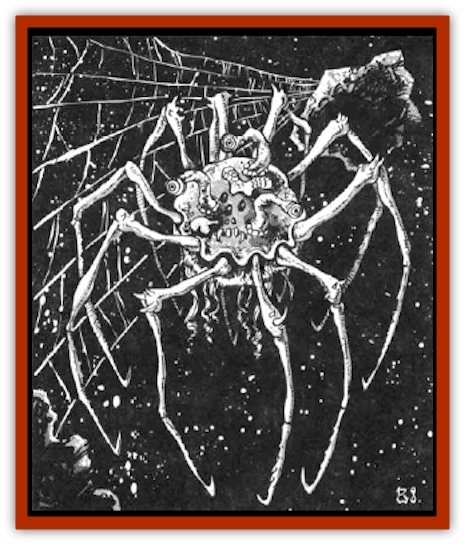

# Spider - Asteroid

| Statistic | **Spider, Asteroid** |
| --- | --- |
| **Activity Cycle:** | Any |
| **Alignment:** | Neutral |
| **Armor Class:** | 2/7 |
| **Climate/Terrain:** | Asteroids |
| **Damage/Attack:** | 1-3 each or 1-6 |
| **Diet:** | Carnivore |
| **Frequency:** | Rare |
| **Hit Dice:** | 5+2 |
| **Intelligence:** | Animal (1) |
| **Magic Resistance:** | Nil |
| **Morale:** | Average (9) |
| **Movement:** | 9, Wb 18 |
| **No. Appearing:** | 1-8 |
| **No. of Attacks:** | 6 or 1 |
| **Organization:** | Colony |
| **Size:** | M (5' wide) |
| **Special Attacks:** | Paralyze |
| **Special Defenses:** | Nil |
| **THAC0:** | 15 |
| **Treasure:** | Nil |
| **XP Value:** | 650 |

These ten-legged beasts build webs between asteroid rocks to trap their prey.

The asteroid spider is not truly a [[Spider|spider]], but it has enough similarities to one that sailors have dubbed as such. It has ten legs, spaced evenly around its globe-shaped body. Each is jointed like that of a spider and ends in a small hook. On the top of the globe are its sensory organs. The eye are on stalks and there are several organs of unknown use. The beasts are all black, making them virtually invisible against most wildspace backgrounds.

The top of the globe is covered with a hard shell, like that of an insect, but the underside is soft. The mouth is in the center of the underbelly, as is the web-spinning organ. The mouth has a single hollow tooth like a syringe and suction cup lips. All in all an asteroid spider is a hideous creature.

**Combat:** Against the black background of wildspace, the asteroid spider is 90% unlikely to be seen. It attacks only the creatures or objects that disturb its web. The attack is made with up to six of its legs (the other four are used to hold onto the web or other surface). Each leg inflicts 1d3 points of damage. If three or more attacks in a single round are successful, the spider clings to the victim. Each round after that, the remaining legs can attack and the mouth can try to bite for 1d6 points of damage. A successful bite requires a saving throw vs. poison. Failure means the victim is paralyzed for 2d6 turns. Paralyzed victims are bundled up in webbing in a single round. The spider then carts the body off to the lair to have a more leisurely meal.

Until the mouth is trying to bite, only the top of the body (AC 2) is exposed. The vulnerable underbelly (AC 7) is held close to the web. When the mouth attacks, the belly of the spider is an easy target.

**Habitat/Society:** Asteroid spiders are only found in asteroid belts or in regions of space junk. They often set up a lair on the surface of a larger asteroid that has enough air to support the colony. They spin webs miles long between their lair and the nearby asteroids and space junk. These webs are strong enough to trap any ship under 15 tons that is not traveling at spelljamming speeds. The webs are black, just like the spiders, and 90% unlikely to be seen against a black wildspace sky.

The females lay hundreds of eggs on the outside of the lair. Once the eggs hatch, it is a wild race between the hatchlings and the adults. The adults race to catch and eat the new spiders, while the hatchlings race to jump from the asteroid into space. Many of the hatchlings are eaten, while many others float away and die in wildspace. A few land on other asteroids or space junk. The hatchlings join up with other baby asteroid spiders to form a colony. When they reach adulthood, they do not accept any new spiders into the colony, attacking any hatchlings or adults that enter their territory.

**Ecology:** Asteroid spiders sometimes wait years between meals. They can go into a form of suspended animation, only waking up when their webbing is disturbed. In this state they use little or no air. After a meal, they expand their web a bit and then return to this catatonic state.

The asteroid spiders value the air of their victims. They spin a large cocoon of webbing within the air space of a captured ship. When completed, it is sealed and carried to the lair, where it is deflated. The colony carries the cocoon back and forth to the ship, filling and emptying it until the ship only has a thin bubble of air left.

The poison of the asteroid spider does not keep well, and hence is of little value. The webbing can be cut and coated to eliminate the adhesive qualities. The resulting ropes are very strong, but also susceptible to flames; they do not ignite and burn on their own, but melt away under a flame almost instantly.

---
## Discovery & Documentation

**Source Publication:** MC7 Spelljammer Appendix I (1990)
**Campaign Setting:** Advanced Dungeons & Dragons 2nd Edition
**Author(s):** various

### Other Creatures Found in This Source Book
   * [[Aartuk|Aartuk]]
   * [[Albari|Albari]]
   * [[Ancient_Mariner|Ancient Mariner]]
   * [[Argos|Argos]]
   * [[Beholder_Abomination_Astereater|Beholder (Abomination), Astereater]]
   * [[Blazozoid|Blazozoid]]
   * [[Chattur|Chattur]]
   * [[Chevall|Chevall]]
   * [[Clockwork_Horror|Clockwork Horror]]
   * [[Colossus|Colossus]]
   * [[Delphinid|Delphinid]]
   * [[Dizantar|Dizantar]]
   * [[Dog|Dog]]
   * [[Dog_Bog_Hound|Dog, Bog Hound]]
   * [[Esthetic|Esthetic]]
   * [[Focoid|Focoid]]
   * [[Fractine|Fractine]]
   * [[Giant_Spacesea|Giant, Spacesea]]
   * [[Golem_Furnace|Golem, Furnace]]
   * [[Golem_Radiant|Golem, Radiant]]
   * [[Gravislayer|Gravislayer]]
   * [[Grommam|Grommam]]
   * [[Hadozee|Hadozee]]
   * [[Hamster_Giant_Space|Hamster, Giant Space]]
   * [[Jammer_Leech|Jammer Leech]]
   * [[Lakshu|Lakshu]]
   * [[Lumineaux|Lumineaux]]
   * [[Lutum|Lutum]]
   * [[Mimic_Space|Mimic, Space]]
   * [[Misi|Misi]]
   * [[Moon_Rogue|Moon, Rogue]]
   * [[Mortiss|Mortiss]]
   * [[Murderoid|Murderoid]]
   * [[Nay-Churr|Nay-Churr]]
   * [[Phlog-Crawler|Phlog-Crawler]]
   * [[Plasman|Plasman]]
   * [[Plasmoid_DeGleash|Plasmoid, DeGleash]]
   * [[Plasmoid_DelNoric|Plasmoid, DelNoric]]
   * [[Plasmoid_General_Information|Plasmoid, General Information]]
   * [[Plasmoid_Ontalak|Plasmoid, Ontalak]]
   * [[Puffer|Puffer]]
   * [[Q'nidar|Q'nidar]]
   * [[Rastipede|Rastipede]]
   * [[Reigar|Reigar]]
   * [[Rock_Hopper|Rock Hopper]]
   * [[Slinker|Slinker]]
   * [[Spiritjam|Spiritjam]]
   * [[Survivor|Survivor]]
   * [[Syllix|Syllix]]
   * [[Symbiont_Power|Symbiont, Power]]
   * [[Vine_Infinity|Vine, Infinity]]
   * [[Wiggle|Wiggle]]
   * [[Wizshade|Wizshade]]
   * [[Wryback|Wryback]]
   * [[Zard|Zard]]
   * [[Zodar|Zodar]]
